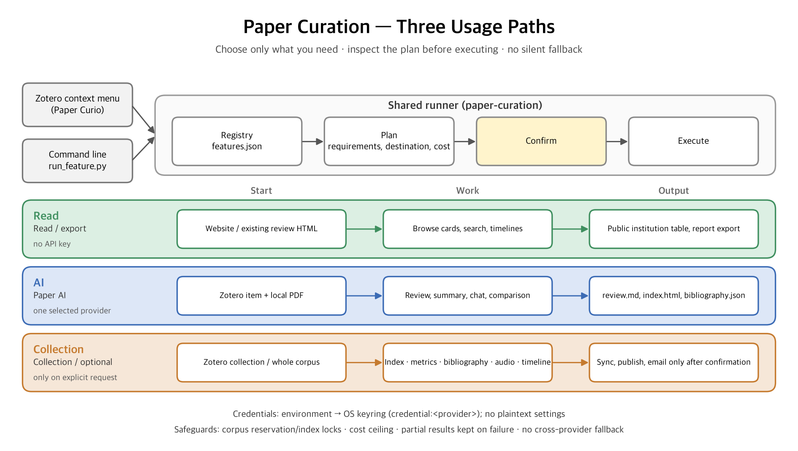
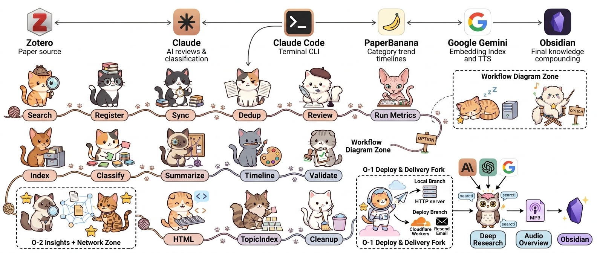

> 🇰🇷 **한국어**: [README.md](README.md) — the Korean README is the primary document.

# Paper Curation

**Install without keys, then explicitly choose a single-PDF review or the full curation workflow.**

Turn hundreds of papers into structured Korean reviews, auto-classify them with AI, and ask natural-language questions grounded in the actual papers. A **personal research knowledge system** that runs locally; deployment is optional. Orchestrated by Claude Code.

**Three paths — choose only what you need, inspect the plan, then execute:**



| Path | What | Needs | Where |
|------|------|-------|-------|
| **Read** | Browse generated reviews, search and timelines; export the public institution table and reports | no key | website · Zotero context menu **Open paper-curation Review HTML** · module panel |
| **AI** | PDF review, grounded summary/chat/comparison, AI Chat | one selected provider (Anthropic default / OpenAI / Google; summary and chat also run on local Ollama) | Zotero context menu **Review generation** · **Paper Curation modules** · CLI |
| **Collection** | Search indexes, metrics, bibliography DB, audio, timelines, Zotero sync, publication, email, full collection processing | per-capability requirements and explicit confirmation | module panel **Collection / Optional features** tabs · `run_feature.py` · `run_full.py` |

Every task follows **plan (requirements, destination, cost) → confirm → execute**. A
single review never drags classification, indexing, timelines or deployment along.
Failures are never re-sent to another provider, and API keys live in the **OS keyring**,
not in settings files.

📘 **[User Guide](docs/user-guide.en.md)** — where each setting lives and how each task
runs, step by step (install and connect → store keys → review → modules → reading
status messages). The Zotero plugin (Curio) and the CLI share one feature registry; the
generated ID/requirement table in the
[Setup Guide](docs/setup-guide.md#공유-기능-레지스트리) is the reference.

<details>
<summary>🐱 The full curation pipeline (Collection path) in one picture</summary>



</details>

> 📚 **[Attribution — who worked where](docs/attribution.en.md)** — how authors
> get tied to institutions, and why the page reader runs last, written up
> separately.

---

## What It Does

**Capabilities by path** — each is requested independently; IDs come from `pipeline/features.json`:

| Path | Capability (ID) | Description |
|------|-----------------|-------------|
| Read | browsing · `institution-export` · `extract` | Read generated reviews/search/timelines without a key, export the public institution table, extract text and figures from a local PDF |
| AI | **Structured review** `review` | Text/figure extraction from the PDF → the selected provider writes a 6-section Korean review (Essence·Motivation·Achievement·How·Originality·Evaluation) → HTML + bibliography sidecar |
| AI | `summary` · `chat` · `comparison` | **Claims with verbatim quotations** grounded only in the selected PDF texts; answers whose quotations cannot be found are rejected. Summary and chat also run on local Ollama |
| AI | **AI Chat / Citedby** | Multi-turn PDF conversation and citation genealogy — existing Zotero plugin features |
| Collection | `keyword-search` · `semantic-search` | BM25 index/query without a key · Gemini-embedding hybrid index/query (Google key) |
| Collection | `metrics` · `bibliography-update` | Citation/reference accumulation · bibliography DB and institution attribution (offline by default) |
| Collection | `audio` · `timeline-text` · `timeline-image` | Podcast-style MP3 from an existing review (Gemini TTS), category narratives, PaperBanana timeline images — each separately |
| Collection | `zotero-sync` · `publish` · `email` | Remote deletion sync (dry-run default), Cloudflare publication, forwarding an existing MP3 — **all require explicit confirmation** |

**Full curation (advanced)** — `run_full.py --mode curate` runs these in order. A single review does not trigger them:

| Feature | Description |
|---------|-------------|
| **Auto-Classification** | Bottom-up topic modeling (SPECTER2 + HDBSCAN + UMAP) creates categories and assigns papers — zero LLM calls |
| **Related Papers** | `topic_modeling.py` RRF-fuses SPECTER2 cosine and title/author BM25 rankings; a deterministic builder uses the rank and recorded metadata to produce relation types and evidence-based Korean reasons. The full-curation `extract_insights.py` caller still imports a removed legacy judge, so that connection path is currently blocked |
| **Deep Research** | Natural-language Q&A with hybrid search (BM25 + dense); the reader's own BYOK provider answers with clickable `[N]` citations |
| **Timeline Visualization** | Per-category research trend narratives + auto-generated diagrams (PaperBanana) + main research timeline |
| **Knowledge Compounding** | Obsidian integration: your notes feed back into future queries |
| **Paper Discovery** | Parallel search across arXiv, Semantic Scholar, OpenAlex + auto-registration to Zotero (optional) |

**Full-curation options** — enabled by flag/mode only:

| Option | How to enable | Description |
|--------|---------------|-------------|
| **Content Deploy (O-1)** | `--mode deploy` or capability `publish` | Cloudflare Workers (static assets + `/api/embed`) + gh-pages redirect stubs. Audio email is the separate `email` capability |
| **Research Insights + Network (O-2)** | `--insights` | Cross-category insight analysis + regenerates the interactive UMAP 2D/3D network |
| **Workflow diagrams** | `generate_usage_diagram.py` · `generate_workflow.py` | Usage-path figure (matplotlib, no key) · the cat pipeline diagram (PaperBanana, `--style cat/fairy/academic`) |

**Full curate workflow requirements**: a Zotero collection with PDFs and the
credentials `ZOTERO_API_KEY`, `ANTHROPIC_API_KEY`, `GOOGLE_API_KEY` (environment or
OS-keyring `credential:<provider>` references). OpenAI is an explicit provider choice
where the selected feature supports it.

---

## Install

### One line (Claude Code)

In [Claude Code](https://claude.ai/code), just say:

> *"Install paper-curation here: https://github.com/jehyunlee/paper-curation"*

Clone, dependencies, and keyless local setup are handled. Setup never starts
the full pipeline automatically.

### Quickstart — keyless local setup

No API key or Zotero collection is required for setup:

```bash
# 1) Clone
git clone https://github.com/jehyunlee/paper-curation.git
cd paper-curation

# 2) Create one conda env (py312 = the single standard env)
conda create -n py312 -c conda-forge python=3.12 pip -y
conda activate py312

# 3) Install dependencies (includes umap-learn · hdbscan · sentence-transformers)
pip install -r requirements.txt
#    An explicit full-workflow run can later do topic modeling/classification
#    in-process because the clustering libraries live in this same env.

# 4) Create a keyless local config and generate/install the SKILL.
#    This does not clone PaperBanana, probe clustering, or run a pipeline.
python pipeline/setup.py

# List features, then plan a request without writing output.
python pipeline/run_feature.py --list
python pipeline/run_feature.py --request feature-request.json
```

Fresh setup is fully noninteractive. It creates `docs/papers/` and, when
needed, this minimal config:

```json
{
  "zotero": {
    "collections": {}
  }
}
```

Existing non-secret config fields are preserved; legacy `zotero.api_key` is
removed whenever setup saves the file. Setup never prompts for, copies from
the environment, or newly stores credentials. `--no-install` skips SKILL
installation; SKILL generation/installation failures still exit nonzero.

No key is stored in configuration. An environment variable overrides an OS-keyring
reference (`credential:<provider>`) in the `paper-curation` service. Plaintext,
null, and failed keyring backends are rejected; there is no plaintext config/file
fallback. Never put a key in argv, request JSON, or logs. See the Setup Guide for
safe credential input.

For AI work, Anthropic Sonnet 5 is the default review provider with no automatic
fallback; OpenAI and Google are explicit provider choices. Ollama
`qwen3.8:27b-mlx` is for summary and chat only, not reviews. A request may include
`provider`, `credential_ref`, and `budget`; unknown rates or a cap breach block
execution.

`bibliography-update` is an independent local institution/bibliography-DB stage.
It ingests changed items by default; `--changed-only --skip-zotero --offline
--no-email` keeps it offline and avoids Zotero sync, online enrichment, and email.
Online enrichment is optional.
Only `zotero-sync` checks remote account connectivity; collection-specific
permissions and other providers' API authorization remain unverified.

<details>
<summary><b>Manual installation (setup.py path)</b></summary>

```bash
git clone https://github.com/jehyunlee/paper-curation.git
cd paper-curation
pip install -r requirements.txt   # full dependency set (anthropic, openai, umap-learn, hdbscan, sentence-transformers, …)
python pipeline/setup.py
```

`setup.py` creates the minimal local config and generates/installs the SKILL.
It performs no network checks or full-pipeline run unless an explicit
`--check-feature` requests the corresponding capability check.

</details>

### Start from Zotero (Paper Curio)

1. From the [latest Paper Curio release](https://github.com/jehyunlee/paper-curio/releases/latest), install the **XPI that matches your Zotero major version** via Zotero **Tools → Plugins** — `paper-curio-zotero10.xpi` for Zotero 10, `paper-curio-zotero9.xpi` for Zotero 9 (also 7 / 8). Every release ships both files with identical features.
2. In Zotero **Settings → Paper Curio → Output Location**, enter this checkout's path (leave the Python path empty for `py312`).
3. In **Settings → Paper Curio → API Keys**, pick one review provider and **Save to OS keyring**.
4. Right-click a paper item → **paper-curation Review generation** → inspect the plan → execute. Summary, chat, comparison and collection tasks run the same way from **Paper Curation modules**.

Per-screen settings and status messages are explained in the **[User Guide](docs/user-guide.en.md)**.

### Start from the command line

Anthropic Sonnet 5 is the default review provider with no automatic fallback.
OpenAI and Google are explicit review-provider choices under the reviewed
schema. Ollama `qwen3.8:27b-mlx` supports summary and chat only, not review.
Curio's module panel sends the same registry request as the CLI; use
credential references, never a secret in the request or config.

```bash
# Read-only plan: validate the request, runtime, and key readiness as JSON.
python pipeline/local_review.py --request review-request.json

# Execute only after inspecting that plan.
python pipeline/local_review.py --request review-request.json --execute
```

`--request` takes a JSON file path. The generated feature IDs, request envelope,
credential handling, and budget rules are in the
[Setup Guide](docs/setup-guide.md#공유-기능-레지스트리).
Shared-corpus writers use reserve/register/cancel transactions under a common
lock and refresh the Curio list. Classification, indexes, timelines,
publication, and email remain independent operations; publication/email require
an explicit request and separate cloud authorization, recipient, and export-right
review.

### Full curate workflow prerequisites (separate)

Prepare these only when explicitly running the comprehensive curate workflow:

| Item | Details |
|------|---------|
| **Zotero** | [API Key](https://www.zotero.org/settings/keys) as `ZOTERO_API_KEY` or OS-keyring `credential:zotero` + a collection with paper PDFs |
| **API keys** | `ANTHROPIC_API_KEY` (reviews/insights) and `GOOGLE_API_KEY` (search embeddings `gemini-embedding-001` / figure validation / TTS), from the environment or the OS keyring. `RESEND_API_KEY` is only for the explicit `email` capability; `OPENAI_API_KEY` remains optional for reader BYOK / insights paths |
| **conda env** | `py312` (Python 3.12) — created by the commands below |
| **Java Runtime** | For `opendataloader-pdf`'s PDF extraction. macOS: `brew install --cask temurin`. Without it the pipeline falls back to PyMuPDF (lower table/structure quality) |

**Create the conda env** — identical to Quickstart steps 2–3:

```bash
conda create -n py312 -c conda-forge python=3.12 pip -y
conda activate py312
pip install -r requirements.txt
```

Because `requirements.txt` includes umap-learn / hdbscan / sentence-transformers, the orchestrator runs topic modeling/classification **in-process, with no subprocess** — a single `py312` env is all you need.

Run the full workflow separately after supplying its environment credentials
and full topic/Zotero configuration:

```bash
export ZOTERO_API_KEY=...
export ANTHROPIC_API_KEY=...
export GOOGLE_API_KEY=...
PYTHONUTF8=1 python pipeline/run_full.py \
  --topic my_topic --mode curate --source zotero
PYTHONUTF8=1 python pipeline/serve_local.py
```

### Verify your install

Before launching the long pipeline, confirm the dependencies actually landed:

```bash
python -c "import umap, hdbscan, sentence_transformers, fitz, sklearn, anthropic; print('py312 OK')"
```

`OK` means you're ready. To preview the execution plan first, use `--dry-run`:

```bash
PYTHONUTF8=1 python pipeline/run_full.py --topic my_topic --mode curate --source zotero --dry-run
```

### Troubleshooting

| Symptom / error | Cause | Fix |
|---|---|---|
| `op_CALL_KW: pop from empty list` (numba traceback) | Classification ran outside the `py312` env | `conda activate py312` and re-run |
| `ModuleNotFoundError: umap` / `hdbscan` / `sentence_transformers` | Missing dependency | Activate the env and run `pip install -r requirements.txt` (it includes umap-learn / hdbscan / sentence-transformers) |
| Figures look low-quality / tables broken | Java missing → PyMuPDF fallback | `brew install --cask temurin` (macOS), then re-run |
| SPECTER2 / arXiv download hangs (Korean network) | huggingface LFS / arXiv blocked | Use the S3 mirror command in "Korean-network workarounds" below |
| `[COLLECTION_ERROR]` | Wrong Zotero collection name | Pick the correct name from the listed available collections, then re-run |
| Search index builds with empty embeddings | `GOOGLE_API_KEY` not set | `export GOOGLE_API_KEY=...`, then re-run — search embeddings use Google `gemini-embedding-001` |

---

## Pipeline

The cat diagram at the top is the bird's-eye view. `run_full.py` runs the Core stages below in order — each table is one stage's input → processing → output.

### 1. Data Collection

| | Description |
|---|---|
| **Input** | <ul><li>PDFs from Zotero collection</li><li>Optional: parallel search (arXiv / Semantic Scholar / OpenAlex) + auto-registration to Zotero</li></ul> |
| **Processing** | <ul><li>PyMuPDF extracts text</li><li>Figure rendering (3× zoom, up to 5 per paper)</li><li>Gemini validates figure quality</li></ul> |
| **Output** | <ul><li><code>papers/{slug}/text.md</code></li><li><code>papers/{slug}/figures/*.webp</code></li></ul> |

### 2. Structured Review

| | Description |
|---|---|
| **Input** | Extracted text + figures |
| **Processing** | <ul><li>Claude Sonnet 5 writes 6-section Korean reviews (Essence · Motivation · Achievement · How · Originality · Evaluation)</li><li>Technical jargon kept verbatim</li><li>Concurrent workers (default 16)</li></ul> |
| **Output** | <ul><li><code>papers/{slug}/review.md</code></li><li><code>papers/{slug}/index.html</code></li></ul> |
| **Usage** | Browse reviews in browser with inline figures and auto-linked related papers |

### 3. Topic Modeling + Classification

| | Description |
|---|---|
| **Input** | Essence + title from all reviews |
| **Processing** | Bottom-up, minimal LLM calls:<ul><li>SPECTER2 embeddings (proximity adapter + CLS pooling) → HDBSCAN fine-grained clustering</li><li>c-TF-IDF keywords (BERTopic-style class-based distinctiveness) → Claude Sonnet names each cluster</li><li>Ward linkage groups clusters into categories</li><li>1–3 categories per paper (Node-based Hybrid C: KNN-vote primary + qualified-vote multi)</li></ul> |
| **Output** | <ul><li><code>_new_classification.json</code></li><li><code>_papers_index.json</code></li></ul> |

### 4. Insights + Timelines

| | Description |
|---|---|
| **Input** | Per-category paper lists + reviews |
| **Processing (Core)** | <ul><li>Claude Sonnet extracts category summaries and sub-themes</li><li>**Related Papers**: both <code>topic_modeling.py</code> and <code>extract_insights.py</code> rank SPECTER2 cosine and title/author BM25 separately, fuse them with RRF (k=60), and use <code>lib.related.build_connections</code> to select links and derive metadata-based relations and Korean reasons. This connection step makes no cloud or local LLM calls. Relations are heuristics, not verified citation or causal relationships.</li><li>Claude Opus writes research-trend narratives per category</li><li>PaperBanana generates several diagram candidates per category, and a Claude vision review selects the best — judged on consistent per-category color, clear emergence/disappearance and convergence/divergence of categories, and the absence of spurious text such as color names or indices</li></ul> |
| **Processing (Option O-2, `--insights`)** | <ul><li>Cross-category Research Insights (Anthropic → OpenAI → Gemini 3-backend fallback)</li><li>Regenerates the network visualization (<code>network.html</code>)</li></ul> |
| **Output** | <ul><li><code>_category_summaries.json</code></li><li><code>_paper_connections.json</code></li><li><code>_timeline_narrative.json</code></li><li><code>category_timeline_*.png</code></li><li>(O-2) <code>_insights.json</code> + <code>network.html</code></li></ul> |

### 5. Deep Research Index

Keyword retrieval can now be built without Google:

```bash
python pipeline/build_search_index.py --topic my_topic --mode bm25
python pipeline/query_search_index.py --topic my_topic --query "scientific discovery" --mode bm25 --json
```

BM25 builds reuse local reviews and the paper list without NumPy, embedding APIs,
or vector caches. They replace the selected topic's `_search_index.json` but leave
prior binary vectors/caches untouched. The default build mode remains `hybrid`.
Both modes' `--dry-run` is read-only and never publishes fake vectors. Browser
answers over a BM25 index skip `/api/embed` and use only the selected answer LLM;
no lexical matches means no unsupported answer. Dense/hybrid queries against a
BM25 index fail explicitly rather than silently switching modes. Personal notes
and source-text enrichment are restricted to local-only topics.

Python callers use `pipeline.api.build_search_index(..., mode="bm25")` for
building and `pipeline.api.query_search_index(..., mode="bm25")` for reading.
The ambiguous compatibility alias `pipeline.api.search_index` has been removed.

The following table describes the default **hybrid** path:

| | Description |
|---|---|
| **Input** | Reviews; personal notes (<code>notes/</code>) only for local-only topics |
| **Processing** | <ul><li>Section-aware chunking</li><li>Google <code>gemini-embedding-001</code> embeddings (768d, <code>task_type=RETRIEVAL_DOCUMENT</code>, L2-normalized then int8-quantized)</li><li>BM25 sparse terms indexed alongside (for hybrid retrieval)</li><li>Personal notes are indexed and reflected in future queries</li></ul> |
| **Output** | <code>_search_index.json</code> + <code>_search_index_emb.bin</code> |
| **Usage** | Natural-language query on topic page → the query embedding is computed for the reader by the worker <code>/api/embed</code> route (deployed) or <code>pipeline/serve_local.py</code> (local) with <code>gemini-embedding-001</code> (<code>task_type=RETRIEVAL_QUERY</code>) → **hybrid retrieval** (BM25 + dense, fused with RRF) → an LLM re-ranks the top candidates → user-key prefix auto-detected, and **Anthropic / OpenAI / Google** streams a grounded answer. Retrieval needs no reader key; a key (BYOK) is only for answer generation. Output is natural prose + clickable `[N]` citation chips + auto-inlined figures |
| **CLI / agent query** | Read-only retrieval without rebuilding: `python pipeline/query_search_index.py --query "automated scientific discovery" --mode bm25` (defaults to `_cross`, no key), or use `--mode hybrid --json` for Gemini query embeddings + BM25 RRF. Python callers use `pipeline.api.query_search_index()`. |

### 6. Index + Network

| | Description |
|---|---|
| **Input** | All classifications + reviews + timelines + UMAP coordinates |
| **Processing** | <ul><li>(Core) Assembles category cards, search, timeline narratives, Deep Research UI, and the Audio Overview modal into a single HTML</li><li>(Option O-2, `--insights`) Regenerates the D3.js + Three.js interactive network from UMAP 2D/3D coordinates</li></ul> |
| **Output** | <ul><li><code>{topic}/index.html</code></li><li>(O-2) <code>{topic}/network.html</code></li></ul> |
| **Usage** | `PYTHONUTF8=1 python pipeline/serve_local.py` — browse locally. On both per-paper pages and Deep Research answers, the 🎧 **Audio Overview** button generates a Korean podcast (Gemini TTS, MP3 encoded in-browser → instant download). On the deployed site the finished MP3 is also delivered by email automatically |

### Deployment (Option O-1)

Local use is the default. For sharing, a **3-tier split-host** architecture deploys automatically:

| Tier | Role | Contents |
|------|------|----------|
| **Cloudflare Workers (Static Assets + Function)** | Serves user-facing content + the `/api/embed` and `/api/audio-email` routes | Full `docs/` uploaded (local-only topics excluded via `docs/.assetsignore`) + `worker/index.js` |
| **GitHub `gh-pages` branch** | Entry-URL → Cloudflare redirect | Per-topic redirect stubs (<1KB), `jehyunlee.github.io/paper-curation/{topic}/` → the operator-configured Cloudflare URL |
| **GitHub `master` branch** | Code / config / README only | Large `docs/papers/`, `docs/{topic}/` content is `.gitignore`'d |

```bash
# Deploy (requires env: CF_API_TOKEN + CLOUDFLARE_ACCOUNT_ID)
PYTHONUTF8=1 python pipeline/run_full.py --topic my_topic --mode deploy
```

Automatic: PNG → WebP conversion (~60% smaller) · API keys and local-only emails stripped from deployed HTML (local working tree restored after push) · `npx wrangler deploy` → Cloudflare (hash-based incremental upload, Worker deployed in the same step) · gh-pages redirect-stub idempotent sync · Cloudflare 200-OK verification (polls up to 5 min) · only code/config pushed to master (content is gitignored).

**Custom domain (recommended)** — add a `[[routes]]` block to `wrangler.toml` (`pattern`, `custom_domain = true`, `zone_name`); `wrangler deploy` provisions DNS, SSL, and routing. Update `prepare_deploy.py`'s `CF_BASE_URL` so the gh-pages stubs point at it. The default `*.workers.dev` URL works too, but a custom domain matters for email consistency.

**Worker secrets** — `worker/index.js` exposes `/api/embed` (a `gemini-embedding-001` query-embedding proxy so readers search without a key) and `/api/audio-email` (ships finished MP3s via [Resend](https://resend.com)). Register them with `wrangler secret put`:

```bash
npx wrangler secret put GOOGLE_API_KEY    # /api/embed proxy (gemini-embedding-001, required)
npx wrangler secret put RESEND_API_KEY    # re_xxx from Resend (required for email)
npx wrangler secret put AUDIO_FROM        # e.g. "Paper Curation <noreply@your-domain.tld>" (domain must be verified)
npx wrangler secret put AUDIO_REPLY_TO    # operator inbox for replies, e.g. "you@gmail.com" (optional)
```

- Without `GOOGLE_API_KEY`, `/api/embed` fails and Deep Research retrieval won't work. Locally, `pipeline/serve_local.py` plays the same role.
- When `RESEND_API_KEY` is unset, `/api/audio-email` returns 503 and the client falls back to download-only.
- `AUDIO_FROM` requires the domain to be SPF/DKIM/DMARC-verified in Resend before sending to arbitrary recipients.
- To bake operator addresses for localhost builds, add `"local_emails": [...]` to `config.json` or set `PAPER_CURATION_LOCAL_EMAILS`. These are stripped at deploy time.

---

## Citedby — citation genealogy from one paper

Starting from a DOI or a locally reviewed paper, Citedby collects citing papers from
OpenAlex, Scopus, Semantic Scholar, and arXiv, then produces a self-contained HTML
report explaining how the research landscape changed over time.

```bash
PYTHONUTF8=1 python pipeline/run_citedby.py \
  --doi 10.xxxx/xxxxx \
  --pdf-first --build-index --serve --open
```

- **Citation-flow timeline** — a 2–3 paragraph overview of emergence, disappearance,
  branching, and convergence, highlighting turning-point papers and prominent groups,
  followed by one explanatory paragraph per research stream
- **PaperBanana visualization** — timeline image and narrative are generated by default;
  use `--no-timeline` to skip them
- **PDF-first evidence tiers** — reviewed corpus > locally held Zotero PDF > abstract > title
- **Deep(er) Research** — BM25+dense hybrid retrieval, answer planning, related-paper
  discovery, optional web search, streamed output, and `[ref:N]` citations
- **Corpus-first identity resolution** — DOI, arXiv ID, and normalized-title matching
  collapse web hits onto an existing corpus reference instead of citing duplicates
- **Context-aware links** — local HTML opens corpus review pages; PDF uses DOI, arXiv,
  or source URLs; Obsidian links `papers/{slug}/review.md` or a citedby evidence note
- **Independent exports** — the Citedby report and each Deep(er) Research answer have
  their own PDF, Markdown, Obsidian, and Audio Overview controls
- **Local-server launch** — `--serve --open` opens `http://localhost:8000/...` rather
  than `file://`, enabling embedding, streaming, and Audio APIs immediately

## Usage Modes — Single Orchestrator `run_full.py`

Three axes (`--mode` / `--source` / `--images`). `--source web` auto-chains search → register → sync.

```bash
# Weekly — search → register to Zotero → sync → review new papers
PYTHONUTF8=1 python pipeline/run_full.py --topic my_topic --mode curate --source web --days 7

# Local update — skip search, sync only, then review new papers
PYTHONUTF8=1 python pipeline/run_full.py --topic my_topic --mode curate --source zotero

# Re-review specific slugs (audit/recovery)
PYTHONUTF8=1 python pipeline/run_full.py --topic my_topic --mode rebuild --slugs 088,1093 --strict-pdf

# Reclassify only (HDBSCAN approximate_predict + centroid fallback, no LLM calls)
PYTHONUTF8=1 python pipeline/run_full.py --topic my_topic --mode reclassify

# Also generate cross-category Research Insights (opt-in — Core runs paper-connections only)
PYTHONUTF8=1 python pipeline/run_full.py --topic my_topic --mode curate --source zotero --insights

# Regenerate timelines (narratives + images)
PYTHONUTF8=1 python pipeline/run_full.py --topic my_topic --mode retime --images all

# Deploy only (requires CF_API_TOKEN + CLOUDFLARE_ACCOUNT_ID)
PYTHONUTF8=1 python pipeline/run_full.py --topic my_topic --mode deploy

# Dry run — show execution plan
PYTHONUTF8=1 python pipeline/run_full.py --topic my_topic --mode curate --source web --dry-run

# Local server
PYTHONUTF8=1 python pipeline/serve_local.py   # localhost:8000 + /api/embed + /api/citedby-answer
```

`--mode` meanings:
- **curate** — review new papers only, preserve existing (most common)
- **rebuild** — regenerate all review.md. Requires `--yes` or `--slugs`
- **reclassify** — keep reviews, reassign categories (node-based)
- **retime** — regenerate narratives + timeline images
- **deploy** — run `prepare_deploy.py` only (split-host: Cloudflare + gh-pages stubs + master code push)

Safety flags: `--strict-pdf` (block fuzzy PDF match), `--slugs A,B,C`, `--dry-run`, `--skip-dedup`, `--dedup-execute`, `--insights`, `--yes`.

### Concurrency Tuning by Anthropic Tier

`--concurrency N` in the review step controls a paper-level `ThreadPoolExecutor`. Work is I/O bound (Anthropic + Gemini APIs), so the ceiling is **Anthropic's rate limits (RPM / ITPM)**, not the machine. Assume ~30–50K input tokens, ~5–10K output, ~60 s per paper:

| Tier | Sonnet RPM (approx) | ITPM (approx) | Recommended `--concurrency` | Notes |
|------|---------------------|---------------|-----------------------------|-------|
| Free / 1 | 50 | 30K | **2–4** | ITPM caps you first. Be conservative. |
| 2 | 1,000 | 80K | **6–8** | Safe |
| 3 | 2,000 | 200K | **10–12** | 429s are rare |
| **4** | **4,000** | **400K+** | **16–20 (default 16)** | New default. Pushing higher risks ITPM ceiling. |

Default `--concurrency 16` targets **Tier 4**. Tier 1–3 users should pass a lower value explicitly — 429s are retried via the checkpoint, but resume overhead accumulates.

### Korean-network workarounds — SPECTER2 / arXiv

From Korean ISPs two endpoints occasionally fail (other regions usually fine):

**1. `huggingface.co` LFS blocked** — `topic_modeling.py` cannot fetch the SPECTER2 model. Download once from the AWS S3 mirror into `<project_root>/.cache/base/` and it auto-detects it (skipping the HF Hub call):

```bash
mkdir -p .cache && cd .cache
curl -L -o specter2_0.tar.gz "https://ai2-s2-research-public.s3.amazonaws.com/specter2_0/specter2_0.tar.gz"
tar -xzf specter2_0.tar.gz   # extracts base/ and adapters/
cd ..
```

**2. arXiv API chronic 429/timeout** — once `export.arxiv.org` throttles your IP, even a proper User-Agent doesn't always help. Pass `--skip-arxiv` to search via OpenAlex + Semantic Scholar only (saves ~8 min per window):

```bash
PYTHONUTF8=1 python pipeline/search_papers.py --topic scisci --since 2026-04-01 --until 2026-04-10 --skip-arxiv
```

OpenAlex returns 1k+ items per keyword and dominates the result pool, so missing arXiv rarely degrades coverage.

**3. Related Papers** — connection ranking and relation generation run locally after SPECTER2 embeddings. There is no Anthropic connection judge to retry; check model availability, embedding inputs, and local output paths instead. Cross-category Research Insights remains a separate, explicitly requested LLM stage.

---

<details>
<summary><h2 id="advanced-internals-en">Advanced / internals (expand)</h2></summary>

> Maintainer/advanced reference. You don't need it for first-time use.

## Reliability

Safety nets added through recent refactors:

| Guard | Description |
|-------|-------------|
| `run_full.py` orchestrator | 3-axis (`--mode/--source/--images`) single entrypoint. Auto-chains search·register·sync·review·post-processing·deploy. Prints a dry-run plan. |
| `find_pdf()` ID-first | Zotero attachment → DOI → arXiv → strict fuzzy. Eliminates past fuzzy-mismatch incidents. |
| `--strict-pdf` | Blocks fuzzy matching entirely. Recommended for fresh reviews and recovery. |
| `classify_papers.py` (Phase 3) | SPECTER2 embedding → UMAP transform 5D → `hdbscan.approximate_predict` → outlier (-1) forced to nearest 768D centroid → `all_categories` = top-N parents. Zero LLM calls, runs in the `py312` env. |
| `find_pdf()` cross-platform basename | Handles Zotero linked attachments stored as Windows absolute paths (`C:\Users\…\foo.pdf`). |
| `make_slug()` 40-char collision fix | Compare length is `min(40, min(len(a), len(b)))` with a 10-char floor, preventing different papers from colliding on a short prefix. |
| `_zotero_text_sanity()` Korean/ASCII dual pass | Handles Zotero items with Korean titles but English PDFs (Hangul-aware keyword extraction + ASCII-only fallback). |
| `extract_insights` 3-backend fallback | Cross-category insights: Anthropic → OpenAI → Gemini. Override via `EXTRACT_INSIGHTS_CC_BACKENDS`; each backend forced into the same tool-use schema. |
| `run_step()` CRITICAL_STEPS hard-fail | `build_papers_index` / `topic_modeling*` / `classify_papers` raise on failure, aborting the run (no stale classifications downstream). Degradable steps (narrative, images, search index) soft-fail. |
| `audit_matching.py` / `fix_matching.py` | Duplicate text.md detection + 4-axis cross-check; audit-driven artifact deletion + re-review command (dry-run by default). |
| `dedup_zotero.py` | Zotero-collection dedup (title-60 + DOI + arXiv + shared-PDF). Auto-integrated as preflight. |
| `validate_papers.py --strict` | Category ↔ timeline image consistency, duplicate text.md detection. Deploy gate. |
| `prepare_deploy.py` | Split-host deploy: `wrangler deploy` → Cloudflare, idempotent gh-pages stub sync, 200-OK polling, master push (code/config only). API keys stripped in-memory and restored locally. |

**Mismatch audit and recovery workflow**:
```bash
PYTHONUTF8=1 python pipeline/audit_matching.py --topic my_topic          # 1. detect
PYTHONUTF8=1 python pipeline/fix_matching.py --topic my_topic            # 2. dry-run
PYTHONUTF8=1 python pipeline/fix_matching.py --topic my_topic --execute  # 3. delete
# 4. Run the run_update_force --slugs ... --strict-pdf command printed by fix_matching
PYTHONUTF8=1 python pipeline/audit_matching.py --topic my_topic          # 5. verify
```

## Internal architecture

For calling parts of the pipeline from other code or tuning performance.

**Programmatic API — `pipeline/api/`** — the core logic of the CLI scripts is exposed as a function facade in `pipeline/api/__init__.py` (search, register, curate, classify, insights, timeline, network, deploy, …). CLI and API share the same `_run_X(**kwargs)` body, so they behave identically.

**LLM call caching — `api/_llm.cached_call`** — SHA-256 of `(prompt, model, schema_version)` keys a JSON cache (`docs/{topic}/.llm_cache/` and per-paper `docs/papers/{slug}/.llm_cache/`). Re-runs on unchanged input issue zero LLM calls; bypass with `force=True`. The Deep Research index adds a content-addressed embedding cache, so an unchanged chunk is never re-embedded.

**Category-level ThreadPool parallelism** — LLM I/O stages parallelize by category (~4× wall-clock). Worker counts via env vars: `CAT_SUMMARY_PARALLEL` (8, Haiku), `TIMELINE_NARRATIVE_PARALLEL` (8, Opus), `TIMELINE_IMAGE_PARALLEL` (4, Gemini image), `EXTRACT_INSIGHTS_PARALLEL` (4, Sonnet). Lower these under Tier 1–3.

**Tool-use schema enforcement** — LLM responses go through Anthropic tool-use schemas (`emit_review` Sonnet 5, `emit_insights` Sonnet) so JSON parse jitter is zero and post-hoc fixers were deleted. Sonnet 5 does sometimes invoke `emit_review` and put the whole XML-tagged review into one field instead of filling the schema; `_review_response_is_complete` keeps such a reply out of the cache and `_salvage_review_data` reparses it (`salvage_reviews.py` repairs files written before that guard existed).

**Figure pre-validator — `api/extract.pre_validate_figure`** — cheap heuristics (file < 4 KB, dimension < 100 px, grayscale variance < 30) skip ~30% of Gemini figure-validation calls, returning Gemini's response shape so callers don't branch.

**Schema v1 frontmatter** — every `docs/papers/{slug}/review.md` carries v1 YAML frontmatter (generated by `inject_frontmatter.py` from `_papers_index.json`): `title, authors, date, doi, primary_topic, primary_category, all_categories, sub_categories, scores, essence, tags, schema_version`. All readers take the frontmatter fast path, falling back to legacy body-regex.

## Comparison with Karpathy's LLM Wiki

[Karpathy's LLM Wiki](https://gist.github.com/karpathy/442a6bf555914893e9891c11519de94f) proposes "LLM organizes, human curates — persistent knowledge base." Paper Curation shares this philosophy while adding an automated pipeline specialized for academic papers.

| | Karpathy LLM Wiki | Paper Curation |
|---|---|---|
| **Core concept** | LLM organizes, human curates | Same + automated pipeline |
| **Input** | Free-form text, web pages | Zotero PDFs (paper-focused) |
| **Structuring** | Manual markdown | 6-section auto-generation |
| **Classification** | Manual tags/folders | Bottom-up auto (HDBSCAN + UMAP) |
| **Search** | Keyword/full-text | Embedding RAG + natural-language Q&A |
| **Figures** | Not supported | Auto-extracted + inline |
| **Visualization** | None | Timeline diagrams + UMAP 2D/3D network |
| **Knowledge compounding** | Wiki-link based | Obsidian wiki-links + notes re-indexed into answers |
| **Installation** | Manual setup | One-line Claude Code install |

```
Deep Research query -> Obsidian note -> re-index -> your notes cited in next query
```

</details>

---

## Requirements

| Category | Items |
|----------|-------|
| **Default setup** | Python 3.12 (macOS conda env `py312`); no API key, Zotero collection, or PaperBanana |
| **Single-PDF review execution** | One review provider credential (Anthropic `claude-sonnet-5` default; OpenAI or Google by explicit choice) in the environment or the OS keyring; macOS/Linux for local reviews |
| **Explicit full curate workflow** | Zotero collection + PDFs and its Zotero/Anthropic/Google credentials |
| **Option-specific APIs** | Resend is needed only for explicit email/deploy work; OpenAI and Google are explicit choices for supported registry features |
| **Python** | `pip install -r requirements.txt` — anthropic, openai, google-genai, pymupdf, Pillow, requests, pyzotero, opendataloader-pdf, numpy, scikit-learn, joblib, umap-learn, hdbscan, sentence-transformers |
| **Optional** | Obsidian (notes/Graph View), PaperBanana (timeline images), Zotero Desktop (one-click PDF) |

---

## Documentation

| Document | Contents |
|----------|----------|
| **[Beginner and Power-user Manuals](docs/manual/index.en.md)** | Paper Curation + Paper Curio, English tutorials, operations recipes, and PaperBanana diagrams |
| **[User Guide](docs/user-guide.en.md)** | Three paths · where settings live (Zotero Settings → Paper Curio) · step-by-step review and module execution · reading status messages · FAQ |
| **[Setup Guide](docs/setup-guide.md)** | Prerequisites · Claude Code/manual install · config.json · generated feature registry table · troubleshooting (Korean) |
| **[Operations Manual](docs/operations.md)** | Full-workflow modes and safety flags · concurrency · Korean-network workarounds · deploy (O-1) · recovery |
| **[Architecture & Internals](docs/architecture.md)** | Stage-by-stage internals · reliability design · requirements |
| **[Attribution](docs/attribution.en.md)** | Author-to-institution attribution, evidence grades, validation |

---

## Talks

This project was presented at **AAiCON 2026** (National Science Museum, Daejeon, Korea · 2026.06.25–26).

| Format | Slides |
|--------|--------|
| **Oral presentation** | [260625_이제현_AAiCon.pdf](docs/public/260625_이제현_AAiCon.pdf) |
| **Poster** | [260625_이제현_AAiCon_poster.pdf](docs/public/260625_이제현_AAiCon_poster.pdf) |

---

*Built with Claude Code.* 🐱
