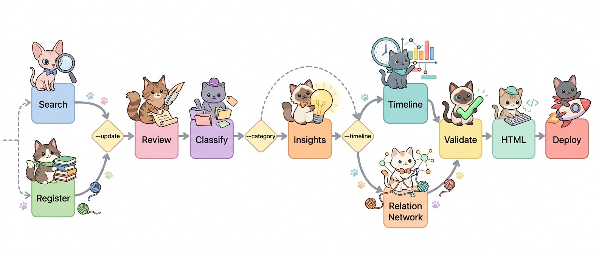

# Paper Curation

학술 논문 자동 큐레이션 파이프라인: 검색, 리뷰, 분류, 시각화, 배포.

Zotero에서 논문을 가져와 Claude/Gemini API로 리뷰하고, Bottom-up 토픽 모델링(HDBSCAN + UMAP)으로 분류한 뒤, 검색 가능한 HTML 인덱스를 정적 호스팅(GitHub Pages, Cloudflare Workers 등)으로 배포합니다.

<a href="#english">English</a>



### 라이브 데모

- **AI for Science**: [jehyunlee.github.io/paper-curation/ai4s](https://jehyunlee.github.io/paper-curation/ai4s/)
- **Science of Science**: [jehyunlee.github.io/paper-curation/scisci](https://jehyunlee.github.io/paper-curation/scisci/)

### Deep Research

각 토픽 페이지 상단 검색창에서 **🧠 Deep** 모드로 전환하면 자연어 질의에 대해 `review.md` 내용을 근거로 Claude가 **카테고리 요약 스타일의 답변**을 생성합니다. 본문에는 `[ref:N]` 형태의 인용(논문 페이지 링크)과 관련 Figure가 자동 삽입되며, 관련 Figure 그리드도 답변 아래에 함께 표시됩니다.

- **클라이언트-사이드 RAG**: `_search_index.json` (section-aware chunk + OpenAI embedding, int8 L2) → cosine similarity + 논문 다양성 캡
- **시간 필터**: `"2023년 이후"`, `"최근 1년"`, `"since 2024"` 등 한/영 자연어 인식
- **답변 분량**: Short / Medium (2x) / Long (5x) 선택
- **모델**: Claude Haiku 4.5 (빠름·저렴) / Sonnet 4.5 (품질 최고)
- **Extended Thinking**: 답변 전 내부 계획 수립 — 진행 상태로만 표시 ("답변 계획 중...")
- **내보내기**: 📋 Copy / ⬇ Download `.md` / 🔗 Open in new tab
- **BYO key**: 방문자가 본인 Anthropic + OpenAI 키 입력 (localStorage 저장, 이 사이트 서버로 전송 없음)
- **로컬 개발 편의**: `build_topic_index.py`가 빌드 시 `config.json`/환경변수의 키로 `docs/_local_keys.json` (git-ignored)을 자동 생성. 로컬 서버(`python -m http.server`)나 `file://` 로 페이지를 열면 JS가 이 파일을 fetch해 API 키 모달을 **자동 스킵**. Cloudflare 배포에는 파일이 없어 일반 방문자 경험은 그대로

### 작동 방식

1. **검색** — 다중 소스 병렬 검색 (arXiv, Semantic Scholar, OpenAlex) + 중복 제거 + 관련성 필터링
2. **등록** — Zotero에 PDF와 함께 자동 등록
3. **리뷰** — PDF에서 텍스트/Figure 추출, 구조화된 한국어 리뷰 생성 (Claude Haiku). Jargon(기술 용어·모델명·데이터셋·알고리즘·프레임워크)은 원문 그대로 유지 — 번역하거나 괄호로 병기하지 않음 (예: `diffusion model을 사용한다`)
4. **토픽 모델링** — SPECTER2 임베딩 → HDBSCAN 클러스터링 → TF-IDF 키워드 추출 → Sonnet 작명 → Ward linkage 카테고리 그룹핑
5. **인사이트** — 카테고리 요약, 카테고리 간 논문 연결 관계 추출 (cross-category connections)
6. **시각화** — 연구 타임라인 (Opus 내러티브 + PaperBanana 이미지) + UMAP 2D/3D 네트워크 (D3.js + Three.js)
7. **검증** — 깨진 그림 참조, 링크, 포맷 문제 자동 수정
8. **배포** — 네트워크 시각화 포함 검색 가능 HTML 인덱스 빌드, PNG→WebP 변환, 정적 호스팅(GitHub Pages, Cloudflare Workers 등)에 `master` push로 자동 배포

### 핵심 기술

| 구성 요소 | 기술 |
|-----------|------|
| 클러스터링 | sklearn HDBSCAN (min_cluster_size 자동 조정, target 40~100 sub-topics) |
| 차원 축소 | UMAP (2D + 3D 좌표 동시 생성) |
| 키워드 추출 | sklearn TF-IDF (c-TF-IDF 대체) |
| 카테고리 그룹핑 | Centroid cosine distance + Ward linkage (공간 기반, LLM 작명만) |
| Outlier 처리 | 가장 가까운 centroid 카테고리에 자동 배정 (Other 0편) |
| 네트워크 시각화 | D3.js (2D/Force, viewport 독립 레이아웃 + Reset View) + Three.js (3D UMAP, OrbitControls) |
| 논문 연결 | 카테고리 내 + 카테고리 간 cross-category connections |

## 파이프라인 단계

| 단계 | 스크립트 | 설명 | 출력 |
|------|---------|------|------|
| 0a | `search_papers.py` | arXiv/S2/OpenAlex 병렬 검색 + 중복 제거 + 관련성 필터 | `_search_results.json` |
| 0b | `register_zotero.py` | Zotero 등록 + PDF 다운로드 | Zotero items + PDFs |
| 1 | `run_update_force.py` | 전체 배치: Zotero 가져오기 → PDF 파싱 → Figure 추출 → 리뷰 | `papers/{slug}/review.md` |
| 2 | `build_papers_index.py` | 모든 review.md에서 마스터 인덱스 재구축 | `_papers_index.json` |
| 3 | `topic_modeling.py` | Bottom-up 토픽 모델링: HDBSCAN → TF-IDF → Sonnet 작명 → Ward 카테고리 | `_new_classification.json`, `_umap_coords.json` |
| 4 | `build_category_summaries.py` | 카테고리 설명 + 세부 주제 생성 | `_category_summaries.json` |
| 4.5 | `extract_insights.py` | 크로스 카테고리 인사이트 + 논문 연결 관계 | `_paper_connections.json` |
| 5 | `generate_timelines.py` | 타임라인 내러티브 + PaperBanana 이미지 | `category_timeline_*.png` |
| 5.5 | `generate_network.py` | UMAP 2D/3D + D3/Three.js 네트워크 시각화 | `network.html` |
| 6 | `validate_papers.py` | 빌드 후 검증 + 자동 수정 | 수정된 review.md/figures |
| 7 | `review_to_html.py` | review.md → index.html 변환 (정규 템플릿) | `papers/{slug}/index.html` |
| 8 | `build_topic_index.py` | 토픽 인덱스 (카드, 검색, 타임라인, Deep Research UI) | `{topic}/index.html` |
| 8.5 | `build_search_index.py` | Deep Research RAG 인덱스 (section-aware chunking + OpenAI text-embedding-3-small, int8 L2 quantisation) | `{topic}/_search_index.json` |
| 9 | `prepare_deploy.py` | PNG→WebP, .gitignore 업데이트, master push | 정적 호스팅 자동 배포 |

### 실행 모드

```bash
# 전체 파이프라인 (검색 + 등록 + 리뷰 + 배포)
PYTHONUTF8=1 python pipeline/run_update_force.py --topic my_topic

# 업데이트 (신규 논문만, 기존 카테고리/리뷰 유지, 변경 카테고리 narrative만)
PYTHONUTF8=1 python pipeline/run_update_force.py --topic my_topic --resume

# 업데이트 + 변경 카테고리 타임라인 이미지 재생성
PYTHONUTF8=1 python pipeline/run_update_force.py --topic my_topic --resume --timeline

# 전체 카테고리 재분류 (topic_modeling 재실행 + 변경 카테고리 타임라인 자동)
PYTHONUTF8=1 python pipeline/run_update_force.py --topic my_topic --category

# 전체 narrative + 타임라인 이미지만 재생성 (리뷰/분류 없음)
PYTHONUTF8=1 python pipeline/run_update_force.py --topic my_topic --timeline

# 배포 전 미사용 파일 정리 (dry-run)
PYTHONUTF8=1 python pipeline/cleanup.py
PYTHONUTF8=1 python pipeline/cleanup.py --execute
```

### 프로젝트 구조

```
paper-curation/
├── pipeline/                ← 파이프라인 스크립트
│   ├── lib/                 ← 공유 모듈
│   │   ├── categories.py    ← 동적 카테고리 로딩 (하드코딩 없음)
│   │   ├── paperbanana.py   ← PaperBanana 래퍼
│   │   └── dateutil.py      ← 날짜 유틸리티
│   ├── topic_modeling.py    ← HDBSCAN + UMAP + Ward linkage
│   ├── generate_network.py  ← D3.js/Three.js 네트워크 시각화
│   ├── generate_workflow.py ← 파이프라인 워크플로우 다이어그램
│   └── ...                  ← 기타 파이프라인 스크립트
├── docs/
│   ├── papers/              ← 중앙 저장소 (리뷰, Figure, HTML)
│   ├── ai4s/                ← 토픽 뷰 (index.html, 타임라인, 네트워크)
│   └── scisci/              ← 토픽 뷰
├── .venv312/                ← Python 3.12 가상환경 (ML 스크립트용)
├── config.example.json      ← 설정 템플릿
└── CLAUDE.md                ← Claude Code 설정
```

### 설치

**Claude Code 사용 (권장):**

> *"여기에 paper-curation을 설치해줘: https://github.com/jehyunlee/paper-curation"*

Claude Code가 클론, 의존성 설치, Zotero 설정, 스킬 등록을 자동으로 수행합니다.

<details>
<summary><b>수동 설치</b></summary>

```bash
git clone https://github.com/jehyunlee/paper-curation.git
cd paper-curation
pip install anthropic google-genai openai numpy pymupdf Pillow requests opendataloader-pdf

# ML 스크립트용 Python 3.12 가상환경 (Windows WDAC 대응)
python -m uv venv .venv312 --python 3.12
python -m uv pip install --python .venv312/Scripts/python.exe \
  umap-learn numpy anthropic google-genai openai requests Pillow scikit-learn matplotlib

python pipeline/setup.py
```

`setup.py`가 인터랙티브 설정 마법사를 실행합니다 (config.json 생성, Zotero 연결 테스트, API 키 확인, 스킬 설치, 첫 파이프라인 자동 실행). `OPENAI_API_KEY`는 Deep Research 검색 인덱스 빌드에 필수이며, 환경변수에 없으면 setup이 직접 입력받아 `config.json`에 저장합니다.

</details>

### 사전 준비

- [Zotero API Key](https://www.zotero.org/settings/keys) 발급
- `ANTHROPIC_API_KEY` 및 `GOOGLE_API_KEY` 환경변수 설정
- Zotero 컬렉션 이름 및 PDF 저장 경로 확인

### 요구사항

- **Python 3.12+**: anthropic, google-genai, openai, numpy, PyMuPDF, Pillow, requests, scikit-learn, umap-learn
- **APIs**: Anthropic (Claude Sonnet/Haiku — 리뷰·분류·인사이트), Google (Gemini — Figure 검증), **OpenAI (text-embedding-3-small — Deep Research 인덱스)**, Zotero Web API
- **PaperBanana**: [dwzhu-pku/PaperBanana](https://github.com/dwzhu-pku/PaperBanana) (타임라인 이미지용, 선택)

---

<details>
<summary><h2 id="english">English</h2></summary>

Automated academic paper curation pipeline: search, review, classify, visualize, and publish.

Papers are fetched from Zotero, reviewed via Claude/Gemini APIs, classified using bottom-up topic modeling (HDBSCAN + UMAP), and published as a searchable HTML index on a static host (GitHub Pages, Cloudflare Workers, etc.).

### Live Demo

- **AI for Science**: [jehyunlee.github.io/paper-curation/ai4s](https://jehyunlee.github.io/paper-curation/ai4s/)
- **Science of Science**: [jehyunlee.github.io/paper-curation/scisci](https://jehyunlee.github.io/paper-curation/scisci/)

### Deep Research

On each topic page, flip the search box to **🧠 Deep** mode to ask free-form research questions. Claude answers in the curator's category-overview style, grounded only in the `review.md` excerpts of the retrieved papers. Citations (`[ref:N]`) are wired to the paper pages and relevant figures are embedded inline and in a "Related Figures" grid below the answer.

- **Client-side RAG**: `_search_index.json` (section-aware chunks + OpenAI embeddings, int8 L2 quantised) → cosine similarity with per-paper diversity cap.
- **Time filters** parsed from the query: `"since 2023"`, `"최근 1년"`, `"2022-2024"`, etc.
- **Length presets**: Short / Medium (2x) / Long (5x).
- **Models**: Claude Haiku 4.5 (fast/cheap) or Sonnet 4.5 (best quality).
- **Extended Thinking** drives the internal plan; the UI only surfaces a "planning…" status.
- **Export**: 📋 Copy / ⬇ Download `.md` / 🔗 Open in new tab (self-contained HTML).
- **BYO keys**: visitors enter their own Anthropic + OpenAI keys, stored only in their browser's localStorage — never sent to this site's server.
- **Local dev shortcut**: `build_topic_index.py` writes a git-ignored `docs/_local_keys.json` from `config.json`/env vars at build time. Opening the built pages over `localhost` or `file://` auto-injects the keys into localStorage and skips the modal entirely. The file is never deployed, so public Cloudflare visitors still go through the BYO flow.

### How It Works

1. **Search** — Multi-source parallel search (arXiv, Semantic Scholar, OpenAlex) + deduplication + relevance filtering
2. **Register** — Auto-register to Zotero with PDF download
3. **Review** — Extract text & figures from PDF, generate a structured Korean review (Claude Haiku). Technical jargon — model names, datasets, algorithms, frameworks — is kept verbatim in English rather than translated or parenthesised (e.g. `diffusion model을 사용한다`)
4. **Topic Modeling** — SPECTER2 embeddings → HDBSCAN clustering → TF-IDF keywords → Sonnet naming → Ward linkage category grouping
5. **Insights** — Category summaries, cross-category paper connections
6. **Visualize** — Research timelines (Opus narrative + PaperBanana images) + UMAP 2D/3D network (D3.js + Three.js)
7. **Validate** — Auto-fix broken figure refs, links, and formatting issues
8. **Publish** — Build searchable HTML index with network visualization, PNG→WebP conversion, auto-deploy to a static host (GitHub Pages, Cloudflare Workers, etc.) triggered by `master` push

### Key Technologies

| Component | Technology |
|-----------|-----------|
| Clustering | sklearn HDBSCAN (adaptive min_cluster_size, target 40–100 sub-topics) |
| Dimensionality Reduction | UMAP (2D + 3D coordinates) |
| Keyword Extraction | sklearn TF-IDF (replaces c-TF-IDF) |
| Category Grouping | Centroid cosine distance + Ward linkage (spatial, LLM names only) |
| Outlier Handling | Nearest centroid assignment (zero "Other" papers) |
| Network Visualization | D3.js (2D/Force, viewport-independent layout + Reset View) + Three.js (3D UMAP, OrbitControls) |
| Paper Connections | Intra-category + cross-category connections |

### Installation

```bash
git clone https://github.com/jehyunlee/paper-curation.git
cd paper-curation
pip install anthropic google-genai openai numpy pymupdf Pillow requests opendataloader-pdf

# Python 3.12 venv for ML scripts (Windows WDAC workaround)
python -m uv venv .venv312 --python 3.12
python -m uv pip install --python .venv312/Scripts/python.exe \
  umap-learn numpy anthropic google-genai openai requests Pillow scikit-learn matplotlib

python pipeline/setup.py
```

`setup.py` walks you through config generation, Zotero connectivity, API-key checks, skill installation, and kicks off the first pipeline run automatically. `OPENAI_API_KEY` is required for the Deep Research search-index build; if it is not already in your environment, `setup.py` will prompt for it and save it to `config.json` (git-ignored).

### Requirements

- **Python 3.12+**: anthropic, google-genai, openai, numpy, PyMuPDF, Pillow, requests, scikit-learn, umap-learn
- **APIs**: Anthropic (Claude Sonnet/Haiku — reviews, classification, insights), Google (Gemini — figure validation), **OpenAI (text-embedding-3-small — Deep Research search index)**, Zotero Web API
- **PaperBanana**: [dwzhu-pku/PaperBanana](https://github.com/dwzhu-pku/PaperBanana) (optional, for timeline images)

</details>

---

*Built with Claude Code, powered by Oh-My-ClaudeCode*
