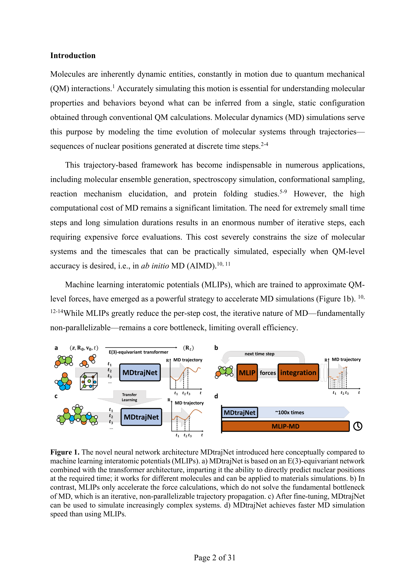

# Artificial Intelligence for Direct Prediction of Molecular Dynamics Across Chemical Space

> **저자**: Fuchun Ge, Yuxinxin Chen, Pavlo O. Dral | **날짜**: 2025-05-22 | **DOI**: [https://arxiv.org/abs/2505.16301](https://arxiv.org/abs/2505.16301)
> **리뷰 모드**: PDF

---

## Essence
We present a novel neural network architecture, MDtrajNet, and a pre-trained foundational model, MDtrajNet-1, that directly generates MD trajectories across chemical space, bypassing force calculations and integration.

## Originality (Abstract 기반)
- We present a novel neural network architecture, MDtrajNet, and a pre-trained foundational model, MDtrajNet-1, that directly generates MD trajectories across chemical space, bypassing force calculations and integration. [`authorship`, `novelty`, `action`]
- MDtrajNet combines equivariant neural networks with a transformer-based architecture to achieve strong accuracy and transferability in predicting long-time trajectories. [`result`]
- This approach accelerates simulations by up to two orders of magnitude and yields better accuracy than MD propagated with established machine-learning interatomic potentials trained on the same data. [`action`, `approach`]
- Remarkably, the errors of the trajectories generated by MDtrajNet-1 for various seen and even unseen small-sized molecular systems are close to those of the conventional ab initio MD. [`action`]
- The current limitations of MDtrajNet-1 are attributed to the relatively small size of the chemical space in its training data; however, even for bigger, unseen systems, MDtrajNet-1 provides a good starting point for fine-tuning and obtaining system-specific models. [`finding`]
- The architecture's flexible design supports diverse application scenarios, including different statistical ensembles, boundary conditions, and interaction types. [`action`]
- By overcoming the intrinsic speed barrier of conventional MD, MDtrajNet opens new frontiers in efficient and scalable atomistic simulations. [`novelty`]

## 평가
| 항목 | 점수 (1-5) |
|------|-----------|
| Novelty | 4 |
| Technical Soundness | 3 |
| Overall | 4 |

**총평**: AI for Science 분야에서 주목할 만한 기여를 보이는 연구.
