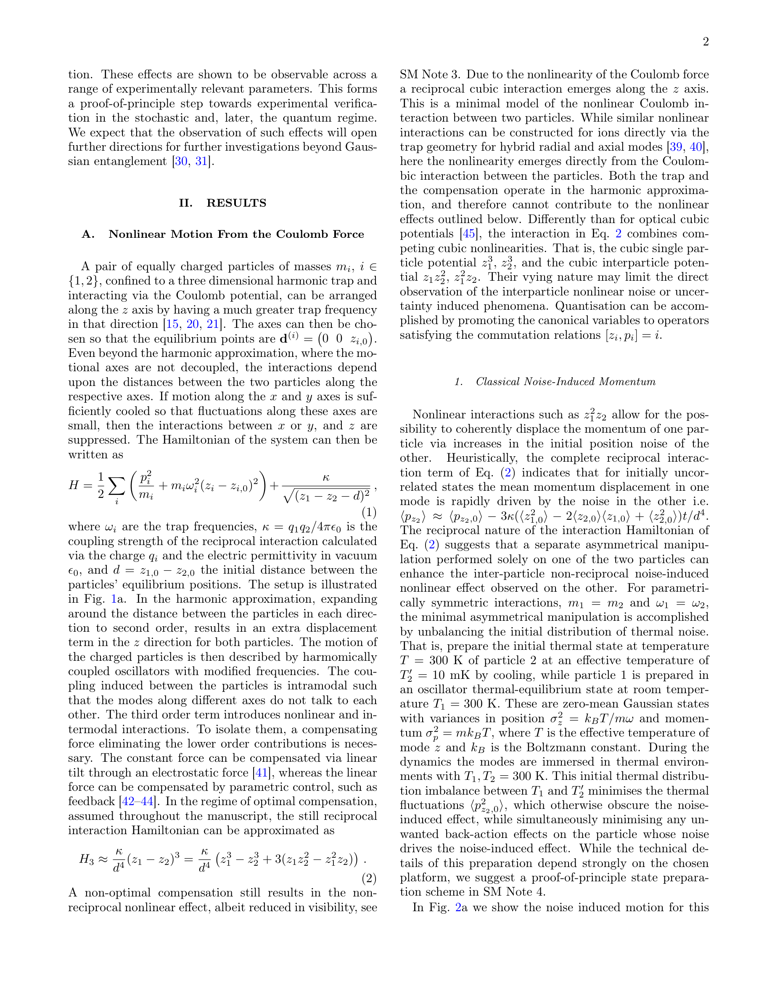

# Nonlinear stochastic and quantum motion from Coulomb forces

> **저자**: Luca Ornigotti, Darren W. Moore, Radim Filip | **날짜**: 2025-11-23 | **DOI**: [https://arxiv.org/abs/2511.18345](https://arxiv.org/abs/2511.18345)
> **리뷰 모드**: PDF

---

## Essence
We show that after eliminating the harmonic part of the Coulomb force by an auxiliary linear force, the remaining reciprocal nonlinear part results in a directly observable non-reciprocal nonlinear effect: increase of the signal-to-noise ratio (SNR) of the coherent displacement of one particle, d...

## Originality (Abstract 기반)
- We show that after eliminating the harmonic part of the Coulomb force by an auxiliary linear force, the remaining reciprocal nonlinear part results in a directly observable non-reciprocal nonlinear effect: increase of the signal-to-noise ratio (SNR) of the coherent displacement of one particle, driven by the position noise, or uncertainty in quantum regime, in another particle. [`authorship`, `finding`]
- This essential evidence of nonlinear forces is present across large ranges of trap frequency and mass scales, as well as visible in both stochastic and quantum regimes. [`action`]

## 평가
| 항목 | 점수 (1-5) |
|------|-----------|
| Novelty | 3 |
| Technical Soundness | 3 |
| Overall | 3 |

**총평**: 의미 있는 기여를 하지만, 추가 검증이 필요한 부분이 있음.
