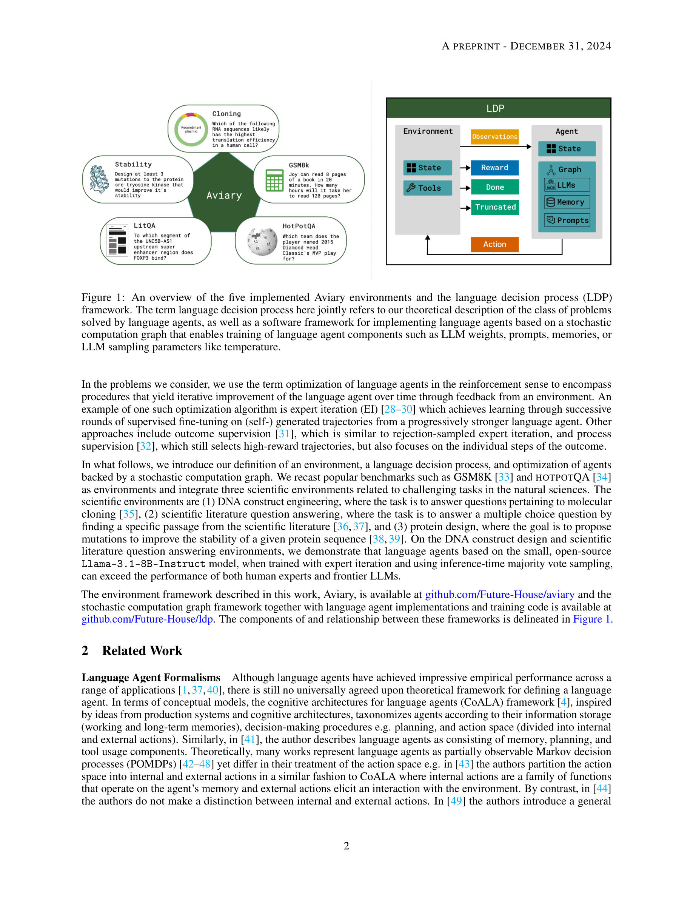

# Aviary: training language agents on challenging scientific tasks

> **저자**: Siddharth Narayanan, James D. Braza, ... Andrew D. White (11명) | **날짜**: 2024-12-30 | **DOI**: [https://arxiv.org/abs/2412.21154](https://arxiv.org/abs/2412.21154)
> **리뷰 모드**: PDF

---

## Essence
Here, we introduce Aviary, an extensible gymnasium for language agents.

## Originality (Abstract 기반)
- Solving complex real-world tasks requires cycles of actions and observations. [`context`]
- This is particularly true in science, where tasks require many cycles of analysis, tool use, and experimentation. [`approach`, `conclusion`]
- Language agents are promising for automating intellectual tasks in science because they can interact with tools via natural language or code. [`approach`]
- Yet their flexibility creates conceptual and practical challenges for software implementations, since agents may comprise non-standard components such as internal reasoning, planning, tool usage, as well as the inherent stochasticity of temperature-sampled language models. [`action`, `approach`]
- Here, we introduce Aviary, an extensible gymnasium for language agents. [`authorship`, `action`]
- We formalize agents as policies solving language-grounded partially observable Markov decision processes, which we term language decision processes. [`authorship`, `finding`]
- We then implement five environments, including three challenging scientific environments: (1) manipulating DNA constructs for molecular cloning, (2) answering research questions by accessing scientific literature, and (3) engineering protein stability. [`authorship`, `action`, `approach`]
- These environments were selected for their focus on multi-step reasoning and their relevance to contemporary biology research. [`continuation`]
- Finally, with online training and scaling inference-time compute, we show that language agents backed by open-source, non-frontier LLMs can match and exceed both frontier LLM agents and human experts on multiple tasks at up to 100x lower inference cost. [`authorship`, `finding`, `result`]

## 평가
| 항목 | 점수 (1-5) |
|------|-----------|
| Novelty | 3 |
| Technical Soundness | 3 |
| Overall | 3 |

**총평**: 의미 있는 기여를 하지만, 추가 검증이 필요한 부분이 있음.
