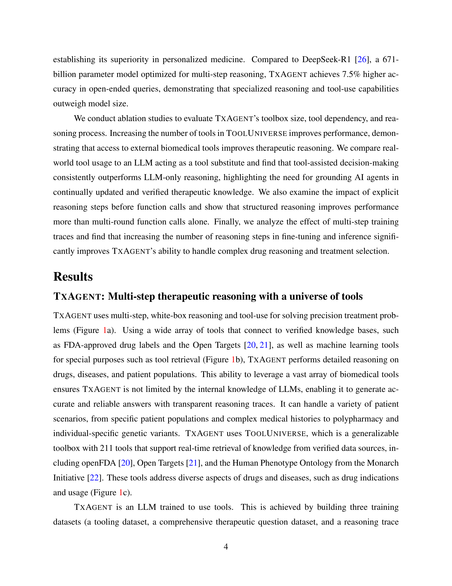

# TxAgent: An AI Agent for Therapeutic Reasoning Across a Universe of Tools

> **저자**: Shanghua Gao, Richard Zhu, ... Marinka Zitnik (8명) | **날짜**: 2025-03-14 | **DOI**: [https://arxiv.org/abs/2503.10970](https://arxiv.org/abs/2503.10970)
> **리뷰 모드**: PDF

---

## Essence
We introduce TxAgent, an AI agent that leverages multi-step reasoning and real-time biomedical knowledge retrieval across a toolbox of 211 tools to analyze drug interactions, contraindications, and patient-specific treatment strategies.

## Originality (Abstract 기반)
- We introduce TxAgent, an AI agent that leverages multi-step reasoning and real-time biomedical knowledge retrieval across a toolbox of 211 tools to analyze drug interactions, contraindications, and patient-specific treatment strategies. [`authorship`, `action`, `approach`]
- TxAgent evaluates how drugs interact at molecular, pharmacokinetic, and clinical levels, identifies contraindications based on patient comorbidities and concurrent medications, and tailors treatment strategies to individual patient characteristics. [`finding`, `learned`]
- It retrieves and synthesizes evidence from multiple biomedical sources, assesses interactions between drugs and patient conditions, and refines treatment recommendations through iterative reasoning. [`action`, `finding`]
- It selects tools based on task objectives and executes structured function calls to solve therapeutic tasks that require clinical reasoning and cross-source validation. [`finding`]
- The ToolUniverse consolidates 211 tools from trusted sources, including all US FDA-approved drugs since 1939 and validated clinical insights from Open Targets. [`finding`]
- TxAgent outperforms leading LLMs, tool-use models, and reasoning agents across five new benchmarks: DrugPC, BrandPC, GenericPC, TreatmentPC, and DescriptionPC, covering 3,168 drug reasoning tasks and 456 personalized treatment scenarios. [`novelty`, `result`, `approach`]
- It achieves 92.1% accuracy in open-ended drug reasoning tasks, surpassing GPT-4o and outperforming DeepSeek-R1 (671B) in structured multi-step reasoning. [`result`]
- TxAgent generalizes across drug name variants and descriptions. [`continuation`]
- By integrating multi-step inference, real-time knowledge grounding, and tool-assisted decision-making, TxAgent ensures that treatment recommendations align with established clinical guidelines and real-world evidence, reducing the risk of adverse events and improving therapeutic decision-making. [`action`, `learned`]

## 평가
| 항목 | 점수 (1-5) |
|------|-----------|
| Novelty | 3 |
| Technical Soundness | 4 |
| Overall | 4 |

**총평**: AI for Science 분야에서 주목할 만한 기여를 보이는 연구.
