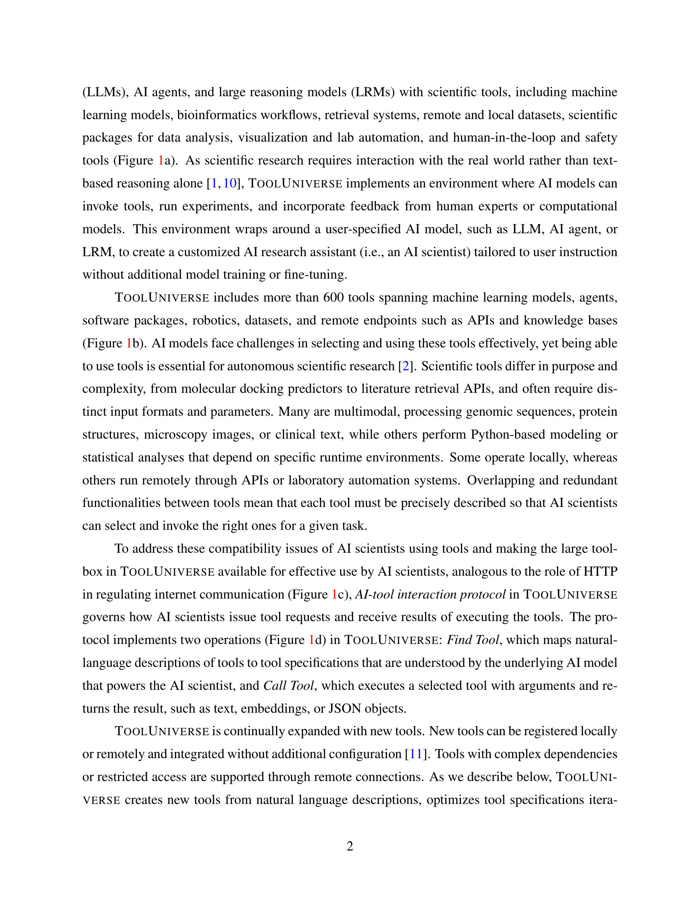

# Democratizing AI scientists using ToolUniverse

> **저자**: Shanghua Gao, Richard Zhu, ... Marinka Zitnik (11명) | **날짜**: 2025-09-27 | **DOI**: [https://arxiv.org/abs/2509.23426](https://arxiv.org/abs/2509.23426)
> **리뷰 모드**: PDF

---

## Essence
We present ToolUniverse, an ecosystem for building AI scientists from any language or reasoning model across open- and closed-weight models.

## Originality (Abstract 기반)
- We present ToolUniverse, an ecosystem for building AI scientists from any language or reasoning model across open- and closed-weight models. [`authorship`, `action`]
- ToolUniverse standardizes how AI scientists identify and call tools by providing more than 600 machine learning models, datasets, APIs, and scientific packages for data analysis, knowledge retrieval, and experimental design. [`action`, `finding`]
- It automatically refines tool interfaces for correct use by AI scientists, generates new tools from natural language descriptions, iteratively optimizes tool specifications, and composes tools into agentic workflows. [`novelty`, `action`, `approach`, `learned`]
- In a case study of hypercholesterolemia, ToolUniverse was used to create an AI scientist to identify a potent analog of a drug with favorable predicted properties. [`action`, `finding`, `approach`, `learned`]
- The open-source ToolUniverse is available at https://aiscientist.tools. [`continuation`]

## 평가
| 항목 | 점수 (1-5) |
|------|-----------|
| Novelty | 3 |
| Technical Soundness | 3 |
| Overall | 3 |

**총평**: 의미 있는 기여를 하지만, 추가 검증이 필요한 부분이 있음.
