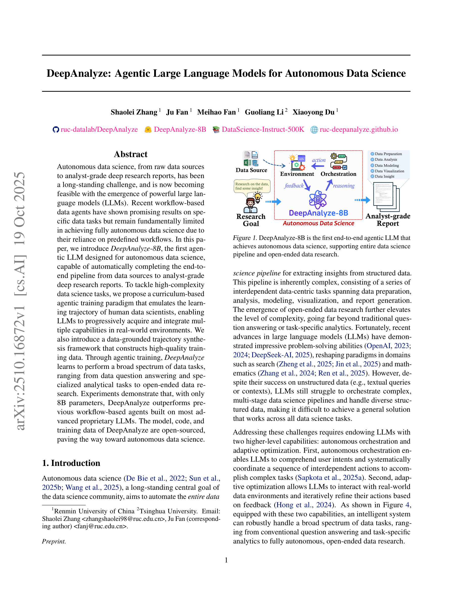

# DeepAnalyze: Agentic Large Language Models for Autonomous Data Science

> **저자**: Shaolei Zhang, Ju Fan, ... Xiaoyong Du (5명) | **날짜**: 2025-10-19 | **DOI**: [https://arxiv.org/abs/2510.16872](https://arxiv.org/abs/2510.16872)
> **리뷰 모드**: PDF

---

## Essence
In this paper, we introduce DeepAnalyze-8B, the first agentic LLM designed for autonomous data science, capable of automatically completing the end-toend pipeline from data sources to analyst-grade deep research reports.

## Originality (Abstract 기반)
- In this paper, we introduce DeepAnalyze-8B, the first agentic LLM designed for autonomous data science, capable of automatically completing the end-toend pipeline from data sources to analyst-grade deep research reports. [`authorship`, `novelty`, `action`]
- To tackle high-complexity data science tasks, we propose a curriculum-based agentic training paradigm that emulates the learning trajectory of human data scientists, enabling LLMs to progressively acquire and integrate multiple capabilities in real-world environments. [`authorship`, `action`]
- We also introduce a data-grounded trajectory synthesis framework that constructs high-quality training data. [`authorship`, `action`, `approach`]
- Through agentic training, DeepAnalyze learns to perform a broad spectrum of data tasks, ranging from data question answering and specialized analytical tasks to open-ended data research. [`continuation`]
- Experiments demonstrate that, with only 8B parameters, DeepAnalyze outperforms previous workflow-based agents built on most advanced proprietary LLMs. [`action`, `finding`, `result`, `learned`]
- The model, code, and training data of DeepAnalyze are open-sourced, paving the way toward autonomous data science. [`continuation`]

## 평가
| 항목 | 점수 (1-5) |
|------|-----------|
| Novelty | 5 |
| Technical Soundness | 4 |
| Overall | 4 |

**총평**: AI for Science 분야에서 주목할 만한 기여를 보이는 연구.
