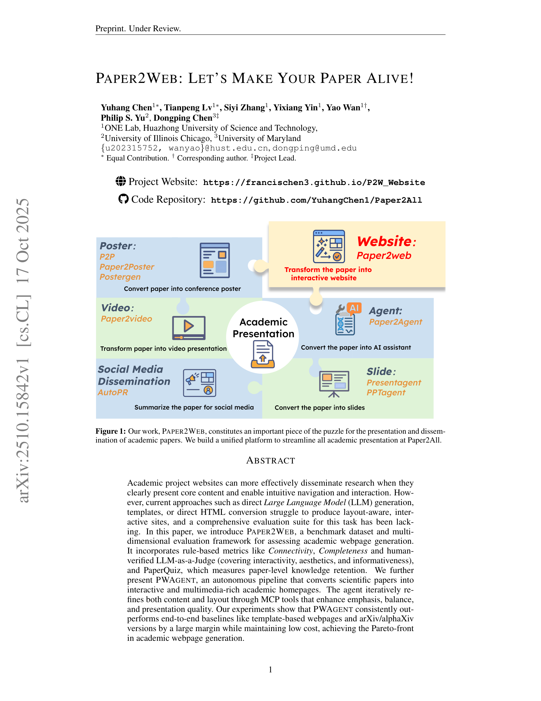

# Paper2Web: Let's Make Your Paper Alive!

> **저자**: Yuhang Chen, Tianpeng Lv, ... Dongping Chen (7명) | **날짜**: 2025-10-17 | **DOI**: [https://arxiv.org/abs/2510.15842](https://arxiv.org/abs/2510.15842)
> **리뷰 모드**: PDF

---

## Essence
In this paper, we introduce Paper2Web, a benchmark dataset and multi-dimensional evaluation framework for assessing academic webpage generation.

## Originality (Abstract 기반)
- In this paper, we introduce Paper2Web, a benchmark dataset and multi-dimensional evaluation framework for assessing academic webpage generation. [`authorship`, `action`, `finding`, `approach`]
- It incorporates rule-based metrics like Connectivity, Completeness and human-verified LLM-as-a-Judge (covering interactivity, aesthetics, and informativeness), and PaperQuiz, which measures paper-level knowledge retention. [`finding`, `approach`]
- We further present PWAgent, an autonomous pipeline that converts scientific papers into interactive and multimedia-rich academic homepages. [`authorship`, `action`]
- The agent iteratively refines both content and layout through MCP tools that enhance emphasis, balance, and presentation quality. [`action`]
- Our experiments show that PWAgent consistently outperforms end-to-end baselines like template-based webpages and arXiv/alphaXiv versions by a large margin while maintaining low cost, achieving the Pareto-front in academic webpage generation. [`action`, `finding`, `result`]

## 평가
| 항목 | 점수 (1-5) |
|------|-----------|
| Novelty | 3 |
| Technical Soundness | 4 |
| Overall | 4 |

**총평**: AI for Science 분야에서 주목할 만한 기여를 보이는 연구.
