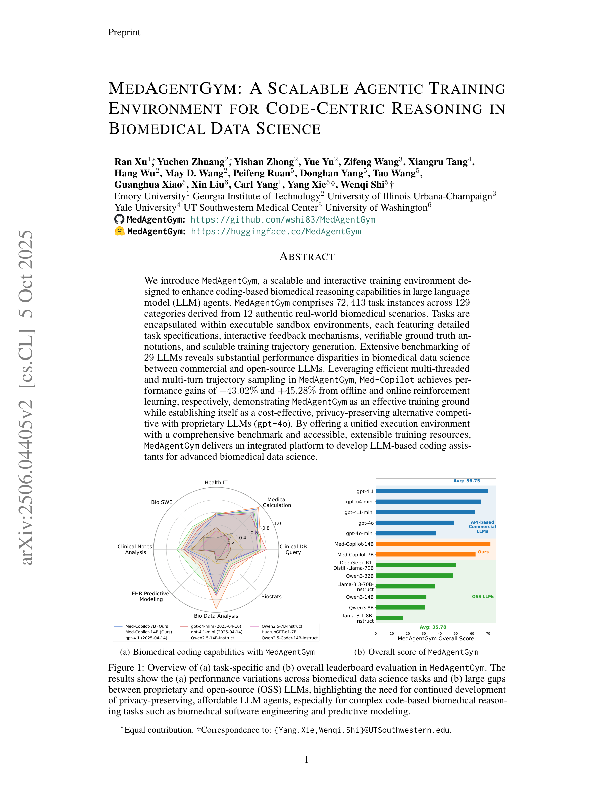

# MedAgentGym: A Scalable Agentic Training Environment for Code-Centric Reasoning in Biomedical Data Science

> **저자**: Ran Xu, Yuchen Zhuang, ... Wenqi Shi (16명) | **날짜**: 2025-06-04 | **DOI**: [https://arxiv.org/abs/2506.04405](https://arxiv.org/abs/2506.04405)
> **리뷰 모드**: PDF

---

## Essence
We introduce MedAgentGym, a scalable and interactive training environment designed to enhance coding-based biomedical reasoning capabilities in large language model (LLM) agents.

## Originality (Abstract 기반)
- We introduce MedAgentGym, a scalable and interactive training environment designed to enhance coding-based biomedical reasoning capabilities in large language model (LLM) agents. [`authorship`, `action`]
- MedAgentGym comprises 72,413 task instances across 129 categories derived from 12 authentic real-world biomedical scenarios. [`learned`]
- Tasks are encapsulated within executable sandbox environments, each featuring detailed task specifications, interactive feedback mechanisms, verifiable ground truth annotations, and scalable training trajectory generation. [`action`, `finding`]
- Extensive benchmarking of 29 LLMs reveals substantial performance disparities in biomedical data science between commercial and open-source LLMs. [`finding`]
- Leveraging efficient multi-threaded and multi-turn trajectory sampling in MedAgentGym, Med-Copilot achieves performance gains of +43.02% and +45.28% from offline and online reinforcement learning, respectively, demonstrating MedAgentGym as an effective training ground while establishing itself as a cost-effective, privacy-preserving alternative competitive with proprietary LLMs (gpt-4o). [`action`, `finding`, `result`]
- By offering a unified execution environment with a comprehensive benchmark and accessible, extensible training resources, MedAgentGym delivers an integrated platform to develop LLM-based coding assistants for advanced biomedical data science. [`action`]

## 평가
| 항목 | 점수 (1-5) |
|------|-----------|
| Novelty | 3 |
| Technical Soundness | 4 |
| Overall | 4 |

**총평**: AI for Science 분야에서 주목할 만한 기여를 보이는 연구.
