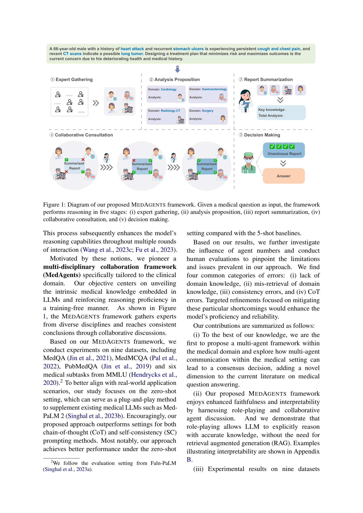

# MedAgents: Large Language Models as Collaborators for Zero-shot Medical Reasoning

> **저자**: Xiangru Tang, Anni Zou, ... Mark Gerstein (8명) | **날짜**: 2023-11-16 | **DOI**: [https://arxiv.org/abs/2311.10537](https://arxiv.org/abs/2311.10537)
> **리뷰 모드**: PDF

---

## Essence
To address these issues, we propose MedAgents, a novel multi-disciplinary collaboration framework for the medical domain.

## Originality (Abstract 기반)
- To address these issues, we propose MedAgents, a novel multi-disciplinary collaboration framework for the medical domain. [`authorship`, `novelty`, `action`, `approach`]
- MedAgents leverages LLM-based agents in a role-playing setting that participate in a collaborative multi-round discussion, thereby enhancing LLM proficiency and reasoning capabilities. [`approach`]
- This training-free framework encompasses five critical steps: gathering domain experts, proposing individual analyses, summarising these analyses into a report, iterating over discussions until a consensus is reached, and ultimately making a decision. [`approach`]
- Our work focuses on the zero-shot setting, which is applicable in real-world scenarios. [`approach`]
- Experimental results on nine datasets (MedQA, MedMCQA, PubMedQA, and six subtasks from MMLU) establish that our proposed MedAgents framework excels at mining and harnessing the medical expertise within LLMs, as well as extending its reasoning abilities. [`authorship`, `action`, `approach`, `learned`]
- Our code can be found at https://github.com/gersteinlab/MedAgents. [`finding`]

## 평가
| 항목 | 점수 (1-5) |
|------|-----------|
| Novelty | 4 |
| Technical Soundness | 3 |
| Overall | 4 |

**총평**: AI for Science 분야에서 주목할 만한 기여를 보이는 연구.
