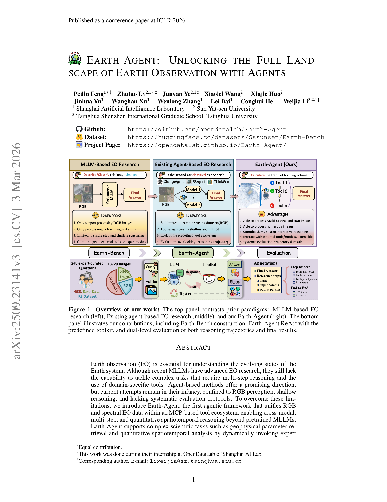

# Earth-Agent: Unlocking the Full Landscape of Earth Observation with Agents

> **저자**: Peilin Feng, Zhutao Lv, ... Weijia Li (11명) | **날짜**: 2025-09-27 | **DOI**: [https://arxiv.org/abs/2509.23141](https://arxiv.org/abs/2509.23141)
> **리뷰 모드**: PDF

---

## Essence
To overcome these limitations, we introduce Earth-Agent, the first agentic framework that unifies RGB and spectral EO data within an MCP-based tool ecosystem, enabling cross-modal, multi-step, and quantitative spatiotemporal reasoning beyond pretrained MLLMs.

## Originality (Abstract 기반)
- To overcome these limitations, we introduce Earth-Agent, the first agentic framework that unifies RGB and spectral EO data within an MCP-based tool ecosystem, enabling cross-modal, multi-step, and quantitative spatiotemporal reasoning beyond pretrained MLLMs. [`authorship`, `novelty`, `action`, `approach`]
- Earth-Agent supports complex scientific tasks such as geophysical parameter retrieval and quantitative spatiotemporal analysis by dynamically invoking expert tools and models across modalities. [`continuation`]
- To support comprehensive evaluation, we further propose Earth-Bench, a benchmark of 248 expert-curated tasks with 13,729 images, spanning spectrum, products and RGB modalities, and equipped with a dual-level evaluation protocol that assesses both reasoning trajectories and final outcomes. [`authorship`, `action`, `finding`]
- We conduct comprehensive experiments varying different LLM backbones, comparisons with general agent frameworks, and comparisons with MLLMs on remote sensing benchmarks, demonstrating both the effectiveness and potential of Earth-Agent. [`authorship`, `finding`]
- Earth-Agent establishes a new paradigm for EO analysis, moving the field toward scientifically grounded, next-generation applications of LLMs in Earth observation. [`novelty`, `action`, `finding`, `learned`]
- More information about Earth-Agent can be found at https://github.com/opendatalab/Earth-Agent [`finding`]

## 평가
| 항목 | 점수 (1-5) |
|------|-----------|
| Novelty | 5 |
| Technical Soundness | 4 |
| Overall | 4 |

**총평**: AI for Science 분야에서 주목할 만한 기여를 보이는 연구.
