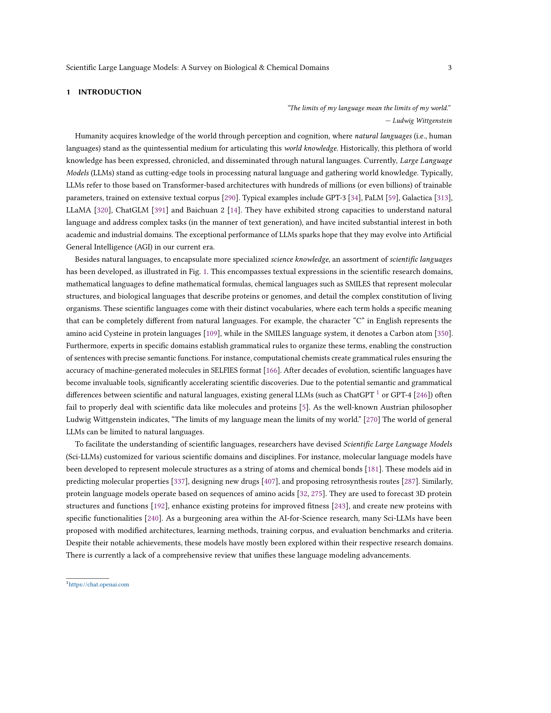

# Scientific Large Language Models: A Survey on Biological & Chemical Domains
> **저자**: Qiang Zhang et al. | **날짜**: 2024.01 | **arXiv**: [2401.14656](https://arxiv.org/abs/2401.14656)

---

## Essence

In this paper, we endeavor to methodically delineate the concept of "scientific language", whilst providing a thorough review of the latest advancements in scientific LLMs. By offering a comprehensive overview of technical developments in this field, this survey aspires to be an invaluable resource for researchers navigating the intricate landscape of scientific LLMs.

## Motivation

- **Known**: Large Language Models (LLMs) have emerged as a transformative power in enhancing natural language comprehension, representing a significant stride toward artificial general intelligence.
- **Gap**: However, a systematic and up-to-date survey introducing them is currently lacking.
- **Approach**: In this paper, we endeavor to methodically delineate the concept of "scientific language", whilst providing a thorough review of the latest advancements in scientific LLMs.

## Achievement

1. Large Language Models (LLMs) have emerged as a transformative power in enhancing natural language comprehension, representing a significant stride toward artificial general intelligence.
2. As a burgeoning area in the community of AI for Science, scientific LLMs warrant comprehensive exploration.
3. Finally, we critically examine the prevailing challenges and point out promising research directions along with the advances of LLMs.
4. By offering a comprehensive overview of technical developments in this field, this survey aspires to be an invaluable resource for researchers navigating the intricate landscape of scientific LLMs.

## How

Large Language Models (LLMs) have emerged as a transformative power in enhancing natural language comprehension, representing a significant stride toward artificial general intelligence. The application of LLMs extends beyond conventional linguistic boundaries, encompassing specialized linguistic systems developed within various scientific disciplines. However, a systematic and up-to-date survey introducing them is currently lacking.

## Originality

- In this paper, we endeavor to methodically delineate the concept of "scientific language", whilst providing a thorough review of the latest advancements in scientific LLMs.
- Given the expansive realm of scientific disciplines, our analysis adopts a focused lens, concentrating on the biological and chemical domains.
- This includes an in-depth examination of LLMs for textual knowledge, small molecules, macromolecular proteins, genomic sequences, and their combinations, analyzing them in terms of model architectures, capabilities, datasets, and evaluation.
- Finally, we critically examine the prevailing challenges and point out promising research directions along with the advances of LLMs.
- By offering a comprehensive overview of technical developments in this field, this survey aspires to be an invaluable resource for researchers navigating the intricate landscape of scientific LLMs.

## Limitation & Further Study

### 저자들이 언급한 한계
- 서베이 논문의 특성상 개별 방법론의 심층 분석보다는 전체적 조망에 초점
- 빠르게 발전하는 분야 특성상 최신 연구가 누락될 수 있음

### 자체판단 아쉬운 점
- 서베이 범위의 선택적 제한으로 인해 관련 분야의 교차점이 충분히 다루어지지 않을 수 있음
- 정량적 비교 분석의 부족

### 후속 연구
- 더 넓은 범위의 분야를 포함하는 통합적 서베이
- 벤치마크 기반의 체계적 성능 비교

## Evaluation

| 항목 | 점수 |
|------|------|
| Novelty | 3/5 |
| Technical Soundness | 3/5 |
| Significance | 4/5 |
| Clarity | 4/5 |
| Overall | 3/5 |

**총평**: 관련 분야의 포괄적 서베이로서 연구자들에게 유용한 참고 자료를 제공하나, 서베이 논문 특성상 독창적 기여는 제한적이다.

---

### Figures

| Figure | 설명 |
|--------|------|
|  | **Fig. 1**: 논문의 핵심 프레임워크 또는 방법론 개요 |
