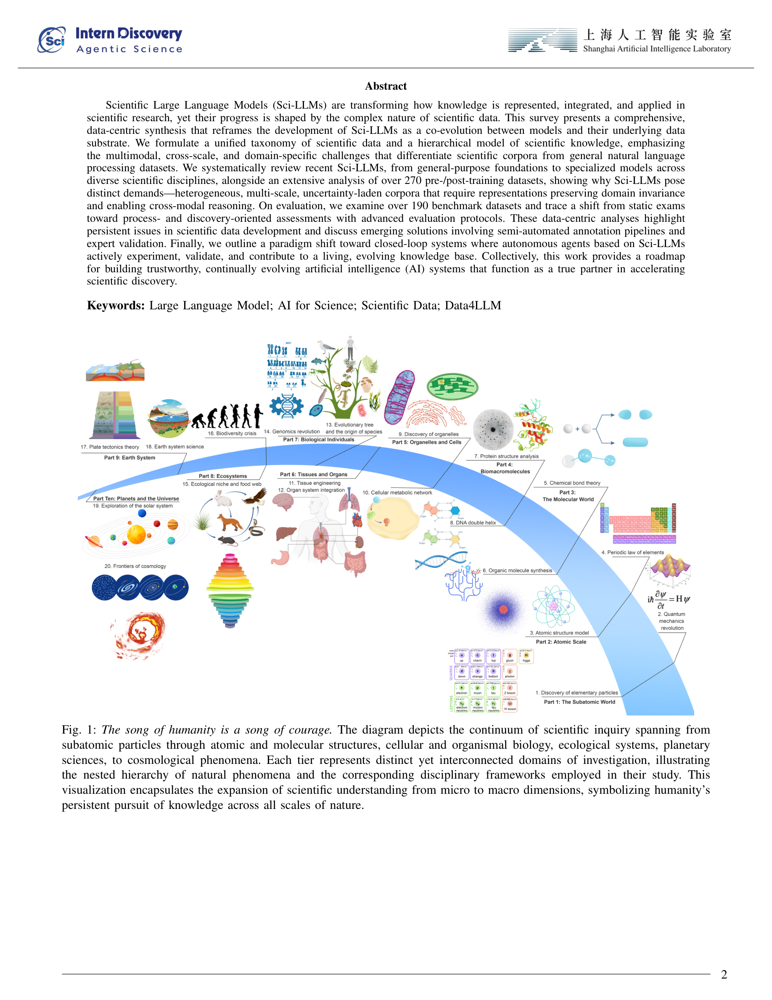

# A Survey of Scientific Large Language Models: From Data Foundations to Agent Frontiers
> **저자**: Ming Hu et al. | **날짜**: 2025.08 | **arXiv**: [2508.21148](https://arxiv.org/abs/2508.21148)

---

## Essence

This survey presents a comprehensive, data-centric synthesis that reframes the development of Sci-LLMs as a co-evolution between models and their underlying data substrate.

## Motivation

- **Known**: These data-centric analyses highlight persistent issues in scientific data development and discuss emerging solutions involving semi-automated annotation pipelines and expert validation.
- **Gap**: Scientific Large Language Models (Sci-LLMs) are transforming how knowledge is represented, integrated, and applied in scientific research, yet their progress is shaped by the complex nature of scientific data.
- **Approach**: This survey presents a comprehensive, data-centric synthesis that reframes the development of Sci-LLMs as a co-evolution between models and their underlying data substrate.

## Achievement

1. Scientific Large Language Models (Sci-LLMs) are transforming how knowledge is represented, integrated, and applied in scientific research, yet their progress is shaped by the complex nature of scientific data.
2. This survey presents a comprehensive, data-centric synthesis that reframes the development of Sci-LLMs as a co-evolution between models and their underlying data substrate.
3. We systematically review recent Sci-LLMs, from general-purpose foundations to specialized models across diverse scientific disciplines, alongside an extensive analysis of over 270 pre-/post-training datasets, showing why Sci-LLMs pose distinct demands -- heterogeneous, multi-scale, uncertainty-laden corpora that require representations preserving domain invariance and enabling cross-modal reasoning.
4. On evaluation, we examine over 190 benchmark datasets and trace a shift from static exams toward process- and discovery-oriented assessments with advanced evaluation protocols.
5. These data-centric analyses highlight persistent issues in scientific data development and discuss emerging solutions involving semi-automated annotation pipelines and expert validation.

## How

Scientific Large Language Models (Sci-LLMs) are transforming how knowledge is represented, integrated, and applied in scientific research, yet their progress is shaped by the complex nature of scientific data. This survey presents a comprehensive, data-centric synthesis that reframes the development of Sci-LLMs as a co-evolution between models and their underlying data substrate. We formulate a unified taxonomy of scientific data and a hierarchical model of scientific knowledge, emphasizing the multimodal, cross-scale, and domain-specific challenges that differentiate scientific corpora from general natural language processing datasets.

## Originality

- Scientific Large Language Models (Sci-LLMs) are transforming how knowledge is represented, integrated, and applied in scientific research, yet their progress is shaped by the complex nature of scientific data.
- This survey presents a comprehensive, data-centric synthesis that reframes the development of Sci-LLMs as a co-evolution between models and their underlying data substrate.
- We formulate a unified taxonomy of scientific data and a hierarchical model of scientific knowledge, emphasizing the multimodal, cross-scale, and domain-specific challenges that differentiate scientific corpora from general natural language processing datasets.
- We systematically review recent Sci-LLMs, from general-purpose foundations to specialized models across diverse scientific disciplines, alongside an extensive analysis of over 270 pre-/post-training datasets, showing why Sci-LLMs pose distinct demands -- heterogeneous, multi-scale, uncertainty-laden corpora that require representations preserving domain invariance and enabling cross-modal reasoning.
- On evaluation, we examine over 190 benchmark datasets and trace a shift from static exams toward process- and discovery-oriented assessments with advanced evaluation protocols.
- These data-centric analyses highlight persistent issues in scientific data development and discuss emerging solutions involving semi-automated annotation pipelines and expert validation.
- Finally, we outline a paradigm shift toward closed-loop systems where autonomous agents based on Sci-LLMs actively experiment, validate, and contribute to a living, evolving knowledge base.
- Collectively, this work provides a roadmap for building trustworthy, continually evolving artificial intelligence (AI) systems that function as a true partner in accelerating scientific discovery.

## Limitation & Further Study

### 저자들이 언급한 한계
- 서베이 논문의 특성상 개별 방법론의 심층 분석보다는 전체적 조망에 초점
- 빠르게 발전하는 분야 특성상 최신 연구가 누락될 수 있음

### 자체판단 아쉬운 점
- 서베이 범위의 선택적 제한으로 인해 관련 분야의 교차점이 충분히 다루어지지 않을 수 있음
- 정량적 비교 분석의 부족

### 후속 연구
- 더 넓은 범위의 분야를 포함하는 통합적 서베이
- 벤치마크 기반의 체계적 성능 비교

## Evaluation

| 항목 | 점수 |
|------|------|
| Novelty | 3/5 |
| Technical Soundness | 3/5 |
| Significance | 4/5 |
| Clarity | 4/5 |
| Overall | 3/5 |

**총평**: 관련 분야의 포괄적 서베이로서 연구자들에게 유용한 참고 자료를 제공하나, 서베이 논문 특성상 독창적 기여는 제한적이다.

---

### Figures

| Figure | 설명 |
|--------|------|
|  | **Fig. 1**: 논문의 핵심 프레임워크 또는 방법론 개요 |
