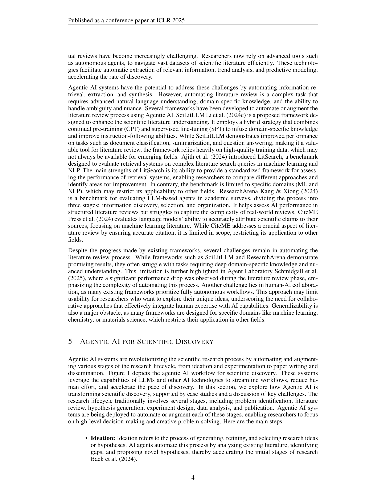

# Agentic AI for Scientific Discovery: A Survey of Progress, Challenges, and Future Directions
> **저자**: Mourad Gridach et al. | **날짜**: 2025.03 | **arXiv**: [2503.08979](https://arxiv.org/abs/2503.08979)

---

## Essence

This survey provides a comprehensive overview of Agentic AI for scientific discovery, categorizing existing systems and tools, and highlighting recent progress across fields such as chemistry, biology, and materials science.

## Motivation

- **Known**: The integration of Agentic AI into scientific discovery marks a new frontier in research automation.
- **Gap**: Finally, we address critical challenges, such as literature review automation, system reliability, and ethical concerns, while outlining future research directions that emphasize human-AI collaboration and enhanced system calibration.
- **Approach**: This survey provides a comprehensive overview of Agentic AI for scientific discovery, categorizing existing systems and tools, and highlighting recent progress across fields such as chemistry, biology, and materials science.

## Achievement

1. These AI systems, capable of reasoning, planning, and autonomous decision-making, are transforming how scientists perform literature review, generate hypotheses, conduct experiments, and analyze results.
2. This survey provides a comprehensive overview of Agentic AI for scientific discovery, categorizing existing systems and tools, and highlighting recent progress across fields such as chemistry, biology, and materials science.
3. We discuss key evaluation metrics, implementation frameworks, and commonly used datasets to offer a detailed understanding of the current state of the field.

## How

These AI systems, capable of reasoning, planning, and autonomous decision-making, are transforming how scientists perform literature review, generate hypotheses, conduct experiments, and analyze results. This survey provides a comprehensive overview of Agentic AI for scientific discovery, categorizing existing systems and tools, and highlighting recent progress across fields such as chemistry, biology, and materials science. We discuss key evaluation metrics, implementation frameworks, and commonly used datasets to offer a detailed understanding of the current state of the field.

## Originality

- These AI systems, capable of reasoning, planning, and autonomous decision-making, are transforming how scientists perform literature review, generate hypotheses, conduct experiments, and analyze results.
- This survey provides a comprehensive overview of Agentic AI for scientific discovery, categorizing existing systems and tools, and highlighting recent progress across fields such as chemistry, biology, and materials science.
- We discuss key evaluation metrics, implementation frameworks, and commonly used datasets to offer a detailed understanding of the current state of the field.
- Finally, we address critical challenges, such as literature review automation, system reliability, and ethical concerns, while outlining future research directions that emphasize human-AI collaboration and enhanced system calibration.

## Limitation & Further Study

### 저자들이 언급한 한계
- 서베이 논문의 특성상 개별 방법론의 심층 분석보다는 전체적 조망에 초점
- 빠르게 발전하는 분야 특성상 최신 연구가 누락될 수 있음

### 자체판단 아쉬운 점
- 서베이 범위의 선택적 제한으로 인해 관련 분야의 교차점이 충분히 다루어지지 않을 수 있음
- 정량적 비교 분석의 부족

### 후속 연구
- 더 넓은 범위의 분야를 포함하는 통합적 서베이
- 벤치마크 기반의 체계적 성능 비교

## Evaluation

| 항목 | 점수 |
|------|------|
| Novelty | 3/5 |
| Technical Soundness | 3/5 |
| Significance | 4/5 |
| Clarity | 4/5 |
| Overall | 3/5 |

**총평**: 관련 분야의 포괄적 서베이로서 연구자들에게 유용한 참고 자료를 제공하나, 서베이 논문 특성상 독창적 기여는 제한적이다.

---

### Figures

| Figure | 설명 |
|--------|------|
|  | **Fig. 1**: 논문의 핵심 프레임워크 또는 방법론 개요 |
