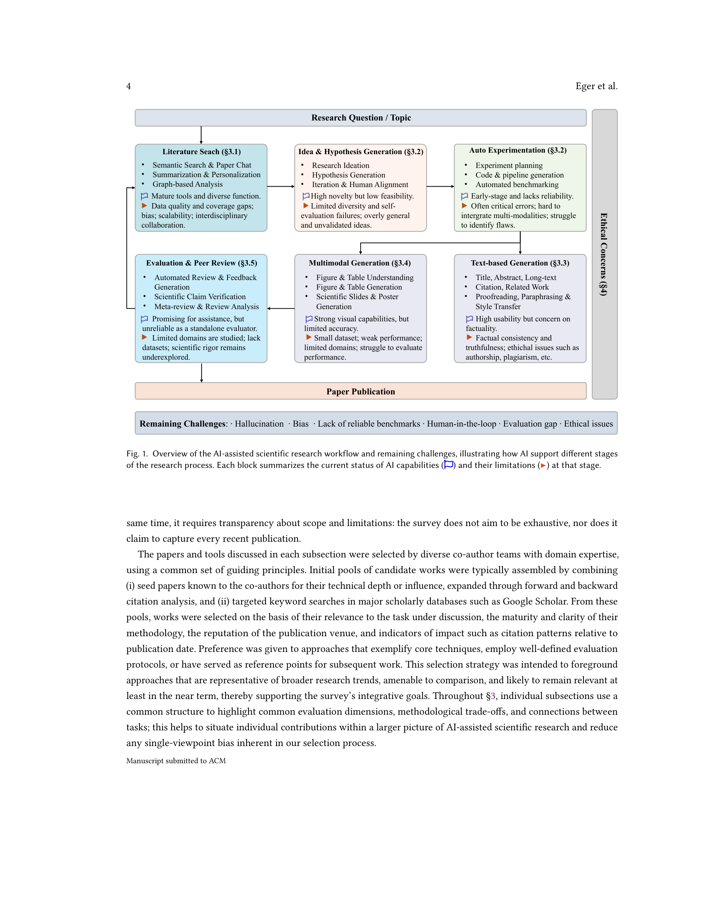

# Transforming Science with Large Language Models: A Survey on AI-assisted Scientific Discovery, Experimentation, Content Generation, and Evaluation
> **저자**: Steffen Eger et al. | **날짜**: 2025.02 | **arXiv**: [2502.05151](https://arxiv.org/abs/2502.05151)

---

## Essence

In this survey, we provide a curated overview of literature representative of the core techniques, evaluation practices, and emerging trends in AI-assisted scientific discovery. We aim for this survey to serve both as an accessible, structured orientation for newcomers to the field, as well as a catalyst for new AI-based initiatives and their integration into future ``AI4Science'' systems.

## Motivation

- **Known**: With the advent of large multimodal language models, science is now at a threshold of an AI-based technological transformation.
- **Gap**: Across the five tasks outlined above, we discuss datasets, methods, results, evaluation strategies, limitations, and ethical concerns, including risks to research integrity through the misuse of generative models.
- **Approach**: In this survey, we provide a curated overview of literature representative of the core techniques, evaluation practices, and emerging trends in AI-assisted scientific discovery.

## Achievement

1. In this survey, we provide a curated overview of literature representative of the core techniques, evaluation practices, and emerging trends in AI-assisted scientific discovery.
2. Across the five tasks outlined above, we discuss datasets, methods, results, evaluation strategies, limitations, and ethical concerns, including risks to research integrity through the misuse of generative models.

## How

With the advent of large multimodal language models, science is now at a threshold of an AI-based technological transformation. An emerging ecosystem of models and tools aims to support researchers throughout the scientific lifecycle, including (1) searching for relevant literature, (2) generating research ideas and conducting experiments, (3) producing text-based content, (4) creating multimodal artifacts such as figures and diagrams, and (5) evaluating scientific work, as in peer review. In this survey, we provide a curated overview of literature representative of the core techniques, evaluation practices, and emerging trends in AI-assisted scientific discovery.

## Originality

- In this survey, we provide a curated overview of literature representative of the core techniques, evaluation practices, and emerging trends in AI-assisted scientific discovery.
- Across the five tasks outlined above, we discuss datasets, methods, results, evaluation strategies, limitations, and ethical concerns, including risks to research integrity through the misuse of generative models.
- We aim for this survey to serve both as an accessible, structured orientation for newcomers to the field, as well as a catalyst for new AI-based initiatives and their integration into future ``AI4Science'' systems.

## Limitation & Further Study

### 저자들이 언급한 한계
- 서베이 논문의 특성상 개별 방법론의 심층 분석보다는 전체적 조망에 초점
- 빠르게 발전하는 분야 특성상 최신 연구가 누락될 수 있음

### 자체판단 아쉬운 점
- 서베이 범위의 선택적 제한으로 인해 관련 분야의 교차점이 충분히 다루어지지 않을 수 있음
- 정량적 비교 분석의 부족

### 후속 연구
- 더 넓은 범위의 분야를 포함하는 통합적 서베이
- 벤치마크 기반의 체계적 성능 비교

## Evaluation

| 항목 | 점수 |
|------|------|
| Novelty | 3/5 |
| Technical Soundness | 3/5 |
| Significance | 4/5 |
| Clarity | 4/5 |
| Overall | 3/5 |

**총평**: 관련 분야의 포괄적 서베이로서 연구자들에게 유용한 참고 자료를 제공하나, 서베이 논문 특성상 독창적 기여는 제한적이다.

---

### Figures

| Figure | 설명 |
|--------|------|
|  | **Fig. 1**: 논문의 핵심 프레임워크 또는 방법론 개요 |
