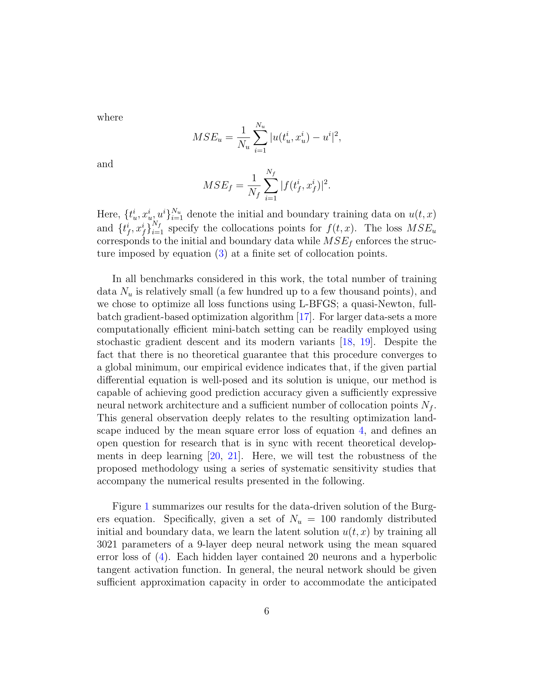

# Physics Informed Deep Learning (Part I): Data-driven Solutions of Nonlinear Partial Differential Equations
> **저자**: Maziar Raissi, Paris Perdikaris, George Em Karniadakis | **날짜**: 2017.11 | **arXiv**: [1711.10561](https://arxiv.org/abs/1711.10561)

---

## Essence

We introduce physics informed neural networks -- neural networks that are trained to solve supervised learning tasks while respecting any given law of physics described by general nonlinear partial differential equations. In this two part treatise, we present our developments in the context of solving two main classes of problems: data-driven solution and data-driven discovery of partial differential equations.

## Motivation

- **Known**: The resulting neural networks form a new class of data-efficient universal function approximators that naturally encode any underlying physical laws as prior information.
- **Gap**: In this two part treatise, we present our developments in the context of solving two main classes of problems: data-driven solution and data-driven discovery of partial differential equations.
- **Approach**: We introduce physics informed neural networks -- neural networks that are trained to solve supervised learning tasks while respecting any given law of physics described by general nonlinear partial differential equations.

## Achievement

1. We introduce physics informed neural networks -- neural networks that are trained to solve supervised learning tasks while respecting any given law of physics described by general nonlinear partial differential equations.
2. In this two part treatise, we present our developments in the context of solving two main classes of problems: data-driven solution and data-driven discovery of partial differential equations.
3. The resulting neural networks form a new class of data-efficient universal function approximators that naturally encode any underlying physical laws as prior information.
4. In this first part, we demonstrate how these networks can be used to infer solutions to partial differential equations, and obtain physics-informed surrogate models that are fully differentiable with respect to all input coordinates and free parameters.

## How

We introduce physics informed neural networks -- neural networks that are trained to solve supervised learning tasks while respecting any given law of physics described by general nonlinear partial differential equations. Depending on the nature and arrangement of the available data, we devise two distinct classes of algorithms, namely continuous time and discrete time models. The resulting neural networks form a new class of data-efficient universal function approximators that naturally encode any underlying physical laws as prior information.

## Originality

- We introduce physics informed neural networks -- neural networks that are trained to solve supervised learning tasks while respecting any given law of physics described by general nonlinear partial differential equations.
- In this two part treatise, we present our developments in the context of solving two main classes of problems: data-driven solution and data-driven discovery of partial differential equations.
- Depending on the nature and arrangement of the available data, we devise two distinct classes of algorithms, namely continuous time and discrete time models.
- The resulting neural networks form a new class of data-efficient universal function approximators that naturally encode any underlying physical laws as prior information.
- In this first part, we demonstrate how these networks can be used to infer solutions to partial differential equations, and obtain physics-informed surrogate models that are fully differentiable with respect to all input coordinates and free parameters.

## Limitation & Further Study

### 저자들이 언급한 한계
- (논문 본문 참조)

### 자체판단 아쉬운 점
- 실험적 검증의 범위와 일반화 가능성에 대한 추가 논의 필요

### 후속 연구
- 다양한 도메인으로의 확장 적용
- 대규모 벤치마크에서의 체계적 비교 평가

## Evaluation

| 항목 | 점수 |
|------|------|
| Novelty | 4/5 |
| Technical Soundness | 4/5 |
| Significance | 4/5 |
| Clarity | 4/5 |
| Overall | 4/5 |

**총평**: 해당 분야에 의미 있는 기여를 하는 논문으로, 기술적 건전성과 실험적 검증이 돋보인다.

---

### Figures

| Figure | 설명 |
|--------|------|
|  | **Fig. 1**: 논문의 핵심 프레임워크 또는 방법론 개요 |
