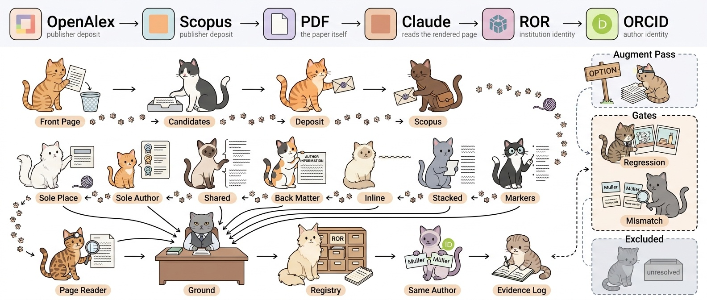

# 서지 확정 — 누가 어디 소속인가



> 🐱 **열 마리 고양이가 순서대로 시도하고, 사서 고양이가 전부 검문합니다.**

"AI4S에서 가장 활발한 기관 20곳과 그곳의 우수 연구자"를 코퍼스로 답하려면 두
가지가 필요하다. **논문이 어떤 기관을 달고 있는가**는 세기 쉽지만, **저자를 그
기관 중 하나에 귀속시키는 것**은 바이라인의 위첨자를 읽어야 한다. 후자가 안 되면
기관별 연구자 순위에 **그 기관에 있던 적 없는 사람**이 올라온다.

## 근거 사다리 — 위에서 실패해야 아래를 시도한다

출처는 "그 소속을 얼마나 직접 말하는가" 순으로 배열돼 있다. 위 칸이 답을 내면
아래 칸은 아예 실행되지 않고, 모든 행에는 **어느 칸이 만들었는지** 태그가 붙는다.

|칸|출처|무엇을 읽나|
|---|---|---|
|1|`openalex`|출판사가 기탁한 저자별 소속 (ROR 기반)|
|2|`scopus`|같은 응답 안의 `authors.author[].affiliation`|
|3|`pdf.byline-marker`|`1` `a` `♣` `α` 위첨자를 소속 블록과 대응|
|4|`pdf.stacked-byline`|이름 아래에 소속이 쌓인 다단 조판|
|5|`pdf.inline-affiliation`|`NAME, Institution, Country` (ACM)|
|6|`pdf.author-information`|문서 뒤 `AUTHOR INFORMATION` 블록 (ACS)|
|7|`pdf.shared-byline`|마커가 없으면 = 전원이 공유한다는 진술|
|8|`pdf.sole-author`|저자가 한 명이면 모든 소속이 그 사람 것|
|9|`pdf.sole-affiliation`|기관이 하나면 모호함이 없음|
|10|`llm.byline`|렌더링한 1페이지를 읽음 — 나머지가 전부 실패했을 때|

10번은 마지막이자 가장 넓다. 위 아홉 칸이 **한 명도** 매핑하지 못했을 때, 그리고
저자의 80% 미만만 매핑했을 때(`--augment`) 실행된다. 후행 마커·그리스 문자·이메일 대체·좁은 각주가
렌더링된 페이지에서는 그냥 보이기 때문이다. 열두 번의 레이아웃 수정으로 85.8%
까지 온 뒤, 이 한 칸이 **54편을 한 번에** 풀었다.

## 사서 고양이 — 모든 것이 통과하는 단 하나의 관문

**어떤 출처도 기관을 직접 쓰지 못한다.** 반환된 소속 문자열은 예외 없이 *그 논문
자신의* 기관 행과 토큰 대조를 통과해야 하고, 고른 행의 정식 명칭이 그 문자열과
무관하면 거부된다.

이것이 LLM을 안전하게 쓰는 이유이기도 하다. 모델은 **추출기일 뿐 권위가 아니다** —
지어낸 기관은 매칭할 상대가 없어 DB에 들어오지 못한다.

## ROR과 명단

기관 링크의 **89.6%가 ROR로 정체성이 확정**된다. 나머지는 세 부류이고
`pipeline/data/institution_registry.json` 이 그것만 담는다.

- **상위 그룹** — ROR이 `Nvidia (United States)` 와 `(United Kingdom)` 을 가진 채
  둘을 잇는 간선을 주지 않는다(Google·Microsoft 와 달리). 국가를 골라 하나로
  강제하지 않고 **상위만 공유**시킨다.
- **정식 표기** — `Shanghai Innovation Institute`(2025 설립), `Galbot` 처럼 ROR이
  아직 없는 곳의 표기를 통일한다.
- **제외** — `Independent Researcher`(41편)는 기관이 아니라 "소속이 없다"는 진술이다.

```bash
python pipeline/audit_institution_names.py            # 미해결을 논문 수 순으로
python pipeline/audit_institution_names.py --propose  # 명단 초안 (사람이 결정)
```

## 미해결은 답이 아니다

마커를 읽을 수 없는 다기관 논문은 전원×전기관으로 연결되고 `pdf.unmarked-multi`
로 표시된다. **리포트는 이 등급을 세지 않는다.** 세면 그 기관에 있던 적 없는
사람이 순위에 오르기 때문이다. 그림에서 회색 고양이가 줄 밖에 격리돼 있는 이유다.

## 두 게이트

|도구|무엇을 막나|
|---|---|
|`check_attribution_regression.py`|파서를 넓히다 다른 데를 좁히는 것. 논문 단위로 스냅샷을 떠 **손실·획득·재분류를 따로** 보고한다. 총계로는 "신규 40 / 손실 40"이 변화 0으로 보인다|
|`check_attribution_accuracy.py`|두 출처가 **공통점 없는 기관**을 말하는 쌍을 뽑아 원문과 대조|

회귀 검사가 실제로 막은 것들: 마커 알파벳을 발견된 문자로만 제한(회귀 330),
소속 블록을 고정 기호로 파싱(125), 근거 없는 200자 상한(116).

### 일치율은 보고하지 않는다

OpenAlex 대비 일치율을 내려 했으나 **지표로 쓸 수 없다.** 겸직과 입도 차이 때문이다.

```
Ming Y. Lu   OpenAlex: Brigham and Women's Hospital, Mass General, MIT
             PDF     : Broad Institute, Harvard Medical School   ← 양쪽 다 맞음
Gang Huang   OpenAlex: Peking University
             PDF     : National Key Laboratory of Data Space …   ← 후자가 전자 산하
```

대신 **공통점이 없는 쌍만** 뽑아 국가 불일치 순으로 정렬하고, 원문 front matter로
어느 쪽이 맞는지 판정한다. 272쌍 전수 판정 결과:

|판정|건수|의미|
|---|---:|---|
|`pdf-supported`|122 (44.9%)|원문이 파서 쪽을 담고 있음 → **외부 기탁 오류**|
|`both-present`|101 (37.1%)|둘 다 원문에 있음 → 겸직, 오류 아님|
|`neither-present`|27 (9.9%)|원문으로 판정 불가|
|`openalex-supported`|22 (8.1%)|**우리 파서 오류** — 실제 검토 대상|

**외부 기탁이 우리 파서보다 5.5배 자주 틀린다.** OpenAlex 는 `1Rutgers University`
가 적힌 논문에 네덜란드의 `Rutgers Sexual and Reproductive Health and Rights` 를
붙였다. 이 목록의 실질적 가치는 파서 버그가 아니라 **외부 오염을 찾는 데** 있다.

## 정확도는 표본 수동 검증으로만 확인된다

|검증|결과|
|---|---|
|LLM 판독 vs 마커 파서 (30편, 70쌍)|88.6% 일치, 불일치 8건 중 2건은 파서가 틀림|
|`shared-byline` 수동 검토 (16편)|4편 오류 발견 → 규칙 수정|
|국가 불일치 272쌍 원문 대조|파서 오류 8.1%|

## 기관 후보가 없으면 사다리는 돌지 않는다

파서 여덟 개도 LLM 판독기도 **그 논문의 기관 목록에 접지**한다. 목록이 비어 있으면
페이지를 아무리 잘 읽어도 붙일 데가 없다. 그런데 그 목록은 오랫동안 사실상
외부 기탁이 만들고 있었다 — `scopus+pdf` 8,947 · `openalex` 3,204 대 `pdf` 297.

원인은 PDF 경로의 한 줄이었다. 후보를 뽑을 때 논문 **전체를 한 줄로** 이어붙인 뒤
마커로 쪼갰고, 그렇게 나온 조각은 전부 바로 아래 240자 상한에 걸려 버려졌다.
Scopus 가 원문 소속 문자열을 따로 넘겨주는 논문만 살아남았다는 뜻이다. 기탁이
없는 논문 415편은 소속을 아무리 또렷하게 적어놨어도 기관이 0개였다.

창(window)을 줄 단위로 훑도록 고치면 이번엔 **본문 산문이 들어온다**. 산문도
짧고 조직명을 담기 때문에 `GPT-4o (OpenAI, 2023) and Claude (Anthropic, 2024)` 가
소속으로 읽힌다. 문자열만 보는 어떤 검사도 이걸 못 거른다 — 잘못된 것은 문자열이
아니라 그게 놓인 자리이기 때문이다. 그래서 논문이 실제로 소속을 적는 **두 가지
자리**만 본다: 초록 앞의 맨줄, 그리고 마커로 시작하는 줄(2단 조판은 소속 블록을
1페이지 각주로 밀어낸다). 초록 표지가 없는 문서를 대비해 앞 25줄로 제한한다.

여기에 두 가지가 더 필요했다.

- **하이픈 줄바꿈 복원** — `University of Mary-` / `land` 는 그냥 잘린 이름이 아니다.
  `University of Mary` 는 노스다코타의 **실재하는 다른 대학**으로 깨끗이 매칭된다.
  끊긴 단어는 매칭 전에 이어붙여야 하고, 아니면 매칭은 성공하면서 틀린다.
- **PDF 는 기관을 만들지 못한다** — 처음 돌렸을 때 PDF 단독 경로가 기관 11개를
  새로 만들었고 그중 6개가 틀렸다. 감사문에서 읽은 재단(`Carnegie Corporation of
  New York`), 줄바꿈에 잘린 이름(`Jiaotong University` ← Xi'an Jiaotong), 부서
  (`Research and Development Center`). 셋 다 ROR 이 승인할 만큼 **실재하는 이름**
  이었다 — 틀린 건 문자열이 아니라 그 조각이었다. 그 11개가 나른 링크는 738건 중
  30건뿐이라, PDF 는 코퍼스가 **이미 아는** 기관에만 연결하고 새로 만들지는 않게
  했다. 기관을 새로 들이는 일은 기탁과 레지스트리가 계속 맡는다.

부수적으로 `drop_sub_unit_institutions()` 가 **정의만 되고 한 번도 호출되지 않고**
있었다는 것도 드러났다. 일회성 복구 도구로 쓰인 뒤 빌드에 연결되지 않아, 그날
이후 만들어진 부서 행은 그대로 쌓였다. 이제 다른 정리 단계와 함께 돈다. 판정
기준도 넓혔다 — 이름이 `Department`로 **시작**할 때만이 아니라, `Research and
Development Center`·`National Centre` 처럼 **모든 기관이 공유하는 단어로만**
이루어져 고유명사가 남아 있지 않은 이름도 기관이 아니다.

결과는 근거 확정 논문 3,628(86.5%) → **3,706(88.3%)**, 신뢰 링크 26,212 →
**26,905**, 기관이 0개인 논문 417 → **331**. 회귀 검사에서 2편이 해결을 잃었는데,
둘 다 유일한 기관이 `National Centre` 였고 **그 문자열은 논문 어디에도 없다** —
기탁이 넣은 오염이었다. 해결을 잃은 게 아니라 거짓 귀속을 잃었다.

## 현재 수치

|지표|값|
|---|---:|
|기관이 붙은 논문|3,843 / 4,196 (91.6%)|
|ROR로 확정된 기관 링크|11,922 / 13,289 (89.7%)|
|저자↔기관 근거 확정 논문|3,706 (88.3%)|
|신뢰 링크|26,905건|
|기관이 확정된 저자|15,647명|
|저자 전원이 확정된 논문|2,284 (54.4%)|

## 실행

```bash
# 전량 재계산 — 저장된 행은 여러 파서 세대가 뒤섞여 있을 수 있다
python pipeline/build_bibliography_db.py --recompute-author-institutions

# 나머지를 렌더링한 1페이지로 읽기
python pipeline/extract_byline_llm.py --validate --limit 30   # 먼저 채점
python pipeline/extract_byline_llm.py --unresolved --execute  # 아무도 못 푼 논문
python pipeline/extract_byline_llm.py --augment --execute     # 일부 저자만 잡힌 논문

# 순서를 바꿀지 재보고 싶을 때 (운영 DB 에 쓰지 않는다)
python pipeline/experiment_ladder_order.py --topic ai4s --sample 300

# 남은 것의 원인 분류
python pipeline/audit_author_attribution.py
python pipeline/audit_author_attribution.py --stage D --limit 5

# 그림 다시 그리기 (수치는 DB 에서 읽는다)
python pipeline/generate_attribution_diagram.py --style cat
```

## 결과물

```bash
python pipeline/report_field_leaders.py --topic ai4s --top 20
```

`reports/build/ai4s_field_leaders.md` — 기관 20곳과 각 기관의 대표 연구자.
근거가 확정된 링크만 세고, 커버리지를 함께 출력한다. 일부만 수집된 지표로 순위를
매기면 **수집된 논문이 먼저 올라올 뿐**이기 때문이다.
