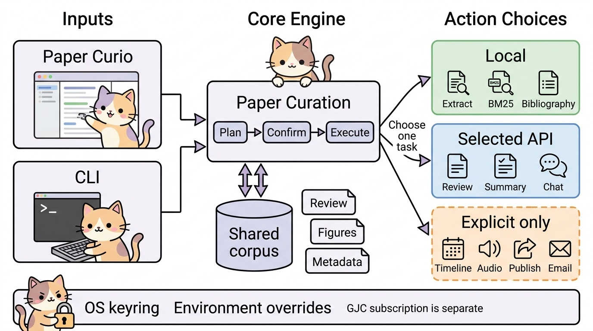

# Paper Curation · Paper Curio 고급 운영 매뉴얼

이 문서는 두 제품을 함께 운영하는 사용자를 위한 안전한 작업 절차와 복구 기준이다.
처음 쓰는 경우에는 [초보자 안내](beginner.md), [English advanced manual](advanced.en.md),
문서 길잡이는 [매뉴얼 색인](index.md)을 먼저 본다.

- **Paper Curation**: 로컬 `paper-curation` 저장소의 Python 파이프라인과 `docs/` 코퍼스.
- **Paper Curio**: Zotero 9 플러그인. Light 모드는 PDF 대화, Enhanced 모드는 Curation 공통 실행기를 호출한다.
- 실제 실행 계약은 `pipeline/features.json`, `pipeline/run_feature.py`, 각 모듈 소스가 문서보다 우선한다.
- 전체 운영의 세부 단계는 [운영 매뉴얼](../operations.md), 설치는 [설치 안내](../setup-guide.md), 구조는 [아키텍처](../architecture.md)를 참고한다.



위 그림의 텍스트 등가물: 사용자는 Curio 메뉴 또는 `run_feature.py`에 요청 JSON을 준다. 두 경로는
`features.json`으로 기능·권한·런타임을 검사하고, 코퍼스 잠금 아래 선택한 모듈만 실행한다. 리뷰와
텍스트 작업은 선택한 AI 제공자에만 전송될 수 있고, 검색·서지·오디오·타임라인·동기화·배포·메일은
각각 독립적으로 요청된다. 결과와 캐시는 로컬 `docs/`, `docs/papers/`, `.cache/`에 남는다.

## 1. 운영 원칙과 경계

### 1.1 요청 하나가 실행하는 범위

공통 기능 실행기는 **한 기능만** 계획하고 실행한다. 리뷰 성공이 분류, 연결, 전역 색인, 타임라인,
오디오, 이메일 또는 배포를 암묵적으로 시작하지 않는다.

| 경로 | 목적 | 자동으로 하지 않는 일 |
| --- | --- | --- |
| Curio Light | 첨부 PDF AI Chat·Comparative Chat | Curation 설치, 리뷰 파일 생성, 컬렉션 변경 |
| Curio Enhanced 최소 리뷰 | 단일 PDF의 `text.md`, `figures/`, `review.md`, `index.html`, `bibliography.json` | originality, connections, 분류, 전역 DB/색인 |
| Curio Enhanced `(adv.) run Paper Curation modules` | 선택한 Paper Curation 모듈 실행 | 다른 모듈의 암묵적 연쇄, 제공자 교체 |
| `run_feature.py` | 선택 기능의 계획 또는 실행 | 다른 기능 연쇄, 제공자 교체 |
| `run_full.py` | 과거부터 있던 전체 오케스트레이터 | 공통 기능의 plan/execute 계약 대체 |

특히 `run_full.py`는 legacy 전체 작업용이다. `--source web`이면 검색·등록·동기화를 자동 선택하고,
`--source zotero`이면 동기화를 자동 선택한다. 이는 `run_feature.py`의 공유 기능 규칙이 아니며,
개별 기능 실행에서 “리뷰 뒤 전체 처리”를 기대하면 안 된다.

### 1.2 계획과 실행

`run_feature.py --request REQUEST.json`은 읽기 전용 계획이다. API 호출과 파일 변경을 하지 않는다.
계획의 `transmission`, `cost`, `outputs`, `authorization`, `steps`를 검토한 뒤에만 같은 요청에
`--execute`를 붙인다.

```bash
python pipeline/run_feature.py --request /absolute/path/request.json
python pipeline/run_feature.py --request /absolute/path/request.json --execute
```

`REQUEST.json`은 사용자가 만든 절대 경로 파일이다. 비밀값을 넣지 말고 `credential_ref`에는
`credential:anthropic`처럼 참조만 넣는다. 요청 스키마 밖 필드는 거부된다.

### 1.3 상태를 성공으로 오해하지 않기

| 상태 | 의미와 조치 |
| --- | --- |
| `ready` | 계획 가능. 아직 실행하지 않았다. |
| `completed` | 선택 기능이 완료됐다. 반환된 `outputs`를 확인한다. |
| `exists` | 기존 결과를 재사용했다. 덮어쓰기 정책을 확인한다. |
| `needs-key` | 선택 제공자 자격증명이 없다. 환경변수 또는 OS 키 저장소를 설정한다. |
| `needs-runtime` | Python 3.12, 라이브러리, `ffmpeg` 등 필요한 런타임이 없다. |
| `insufficient-data` | PDF·색인·분류·입력 원문 같은 선행 자료가 없다. |
| `budget-unavailable` | 검증된 가격 정보로 상한을 계산할 수 없다. 가격을 추측하지 않는다. |
| `blocked` | 확인 필드 또는 안전 조건이 부족하다. 요청을 수정해 다시 계획한다. |
| `busy` | 다른 Curio/CLI 작업이 코퍼스 예약 또는 잠금을 보유한다. 중복 실행하지 말고 완료 후 재시도한다. |
| `failed` | 요청·런타임·선택 제공자 실패다. 오류와 partial 정보를 보존하고 원인을 고친다. |

리뷰 오류에 `partial`이 있으면 일부 단계 산출물이 있을 수 있다. 이를 완성본으로 배포하거나 수동으로
등록하지 말고, 해당 출력 디렉터리와 오류를 확인한 뒤 같은 입력으로 복구한다. 정상 리뷰는 스테이징 후
필수 산출물을 검증하여 원자적으로 공개한다.

## 2. 런타임, 경로, 비밀값

### 2.1 Curation 런타임

공통 기능은 Python **3.12 정확히**를 요구한다. 셸에서 확인한다.

```bash
python --version
python pipeline/run_feature.py --list
```

첫 명령 출력이 `Python 3.12.x`인지 확인한다. 다른 버전의 `python`이 기본이라면 해당 3.12
인터프리터의 절대 경로로 실행한다. 프로젝트 설치와 의존성 설치는 [설치 안내](../setup-guide.md)를 따른다.

### 2.2 Curio가 Curation을 찾는 순서

Zotero → Settings → Paper Curio → **출력 위치**에서 Curation 루트와 필요 시 Python 경로를 설정한다.
Curio의 루트 탐색 순서는 다음과 같다.

1. Paper Curio 환경설정의 루트 경로
2. `PAPER_CURATION_DIR` 또는 `PAPER_CURATION_ROOT`
3. 알려진 `paper-curation` 후보의 자동 탐색
4. Fallback 출력 경로의 기존 자료 열람

유효한 루트는 `<root>/docs/papers/`를 가진 폴더다. Fallback은 읽기 전용이며 새 리뷰를 만들 수 없다.
최소 리뷰는 지정된 Python이 없을 때 관리형 환경을 만들지 않는다. 관리형 venv/relocatable Python 준비는
Curio의 **이 컬렉션 전체 처리** 경로에서만 지원된다.

### 2.3 API 키 우선순위와 분리

자격증명은 **환경변수 우선, OS 키 저장소 다음**이다. Curation은 평문 config·요청 JSON·로그를
자격증명 저장소로 쓰지 않는다. 키링 참조는 `credential:<provider>` 형식이다.

| 용도 | 환경변수 예 | 키링 참조 |
| --- | --- | --- |
| Anthropic | `ANTHROPIC_API_KEY` | `credential:anthropic` |
| OpenAI | `OPENAI_API_KEY` | `credential:openai` |
| Google/Gemini | `GOOGLE_API_KEY` 또는 `GEMINI_API_KEY` | `credential:google` |
| Zotero 원격 동기화 | `ZOTERO_API_KEY` | `credential:zotero` |
| Resend 메일 | `RESEND_API_KEY` | `credential:resend` |

macOS GUI의 Zotero는 로그인 셸 환경변수를 보지 못할 수 있다. Curio의 API 키 화면에서 선택 제공자의
키를 OS 키 저장소에 저장하는 편이 안정적이다. 환경변수는 CI·자동화의 일시적 주입에 적합하다.

**GJC OAuth와 pipeline API 키는 별개다.** GJC 로그인/OAuth 토큰을 Anthropic·OpenAI·Google·Zotero·Resend
키 대신 넣을 수 없고, pipeline 요청이나 Curio 설정에 GJC OAuth 값을 복사하지 않는다.

터미널에서는 값을 화면에 노출하지 않는 입력 파이프로 키를 저장한다.

```bash
python -c 'import getpass,sys; sys.stdout.write(getpass.getpass())' | \
  python pipeline/credentials.py --operation write --provider anthropic
python pipeline/credentials.py --operation status --provider anthropic
```

`--operation read`는 플러그인 내부 IPC용이므로 터미널에서 실행하지 않는다.

공통 리뷰·요약·질의·비교는 선택한 제공자가 실패해도 다른 회사로 자동 전송하지 않는다. 이 보장을 기존 전체 파이프라인의 모든 LLM 보조 단계에 확대해서 해석하지 않는다. 일부 추출 구성에서는
`opendataloader-pdf`가 준비되지 않았을 때 PyMuPDF 텍스트 경로로 전환될 수 있다. 따라서 “어떤
폴백도 없다”는 일반화는 정확하지 않다.

## 3. 안전한 요청 JSON 레시피

아래 파일은 비밀값을 포함하지 않는 템플릿이다. `__...__`를 실제 절대 경로·문헌 메타데이터·원문으로
치환하고, 키는 환경 또는 OS 키 저장소에 둔다.

### 3.1 단일 PDF 리뷰

`review`은 공통 래퍼의 `params.request` 안에 local-review 요청을 넣는다. PDF와 출력 경로는 절대
경로여야 하고 `output_dir`는 논문 슬러그 디렉터리여야 한다.

```json
{
  "schema_version": 1,
  "feature": "review",
  "provider": "anthropic",
  "credential_ref": "credential:anthropic",
  "budget": {
    "max_cost_usd": 1.00,
    "max_output_tokens": 2000
  },
  "params": {
    "request": {
      "schema_version": 1,
      "feature": "review",
      "pdf_path": "__ABSOLUTE_PDF_PATH__",
      "output_dir": "__ABSOLUTE_CURATION_ROOT__/docs/papers/__SLUG__",
      "overwrite": false,
      "item": {
        "key": "__ZOTERO_KEY__",
        "title": "__TITLE__",
        "creators": [{"firstName": "__GIVEN__", "lastName": "__FAMILY__", "creatorType": "author"}],
        "date": "__DATE_OR_EMPTY_STRING__",
        "DOI": "__DOI_OR_EMPTY_STRING__",
        "abstractNote": "__ABSTRACT_OR_EMPTY_STRING__",
        "url": "__URL_OR_EMPTY_STRING__",
        "publicationTitle": "__VENUE_OR_EMPTY_STRING__"
      }
    }
  }
}
```

이 예시는 안전을 위해 단가를 비워 두었다. 그대로 실행하면 비용 추정이 불가능하여 차단된다.
현재 제공자·모델의 공식 가격을 확인하고 `budget`에 `input_per_million_usd`와
`output_per_million_usd`를 **숫자**로 추가한 뒤 다시 계획한다. 0이나 임의 가격으로 차단을 우회하지 않는다.
가격이 불명확하면 실행을 보류한다. 리뷰의 출력 토큰 상한은
1–4000이다.

```bash
python pipeline/run_feature.py --request /absolute/path/review.request.json
python pipeline/run_feature.py --request /absolute/path/review.request.json --execute
```

기본 `overwrite: false`는 기존 리뷰를 보존한다. 재생성의 필요성과 기존 결과 백업을 확인한 경우에만
`true`로 바꾼다. Curio에서 만든 최소 리뷰도 동일한 범위와 출력 계약을 사용한다.

| 리뷰 제공자 | 기본 모델 | 선택 |
|---|---|---|
| `anthropic` | `claude-sonnet-5` | 기본값 |
| `openai` | `gpt-5` | 명시적 선택 |
| `google` | `gemini-3.1-pro-preview` | 명시적 선택 |

제공자를 바꾸면 최상위 `credential_ref`도 동일 제공자로 바꾼다. 직접 `local_review.py`를 실행할 때는
`params.request` 안의 객체에 `provider`, `credential_ref`, `budget`을 넣은 평평한 요청을 사용한다.
두 CLI의 입력 구조를 혼용하지 않는다.

### 3.2 근거 기반 요약과 채팅

`summary`는 질문 생략 시 요약을, `chat`은 `question`을 반드시 요구한다. 두 기능은 Anthropic,
OpenAI, Google 또는 로컬 loopback Ollama를 지원한다. `comparison`은 최소 두 source가 필요하고 Ollama를
지원하지 않는다. 입력 원문은 요청 파일에 포함되므로 민감한 원문을 공유 저장소에 커밋하지 않는다.

```json
{
  "schema_version": 1,
  "feature": "chat",
  "provider": "ollama",
  "params": {
    "sources": [
      {"id": "paper-a", "title": "__TITLE__", "text": "__LOCAL_EXCERPT__"}
    ],
    "question": "이 원문에서 주장과 한계를 근거 문구와 함께 설명해 주세요.",
    "max_input_chars": 30000,
    "max_output_tokens": 1000
  }
}
```

로컬 Ollama는 loopback에서 처리되며 cloud API 키가 필요 없다. cloud 제공자를 선택하면 최상위에
`credential_ref`와 필요 시 `budget`을 추가한다. `max_input_chars`는 1–1,000,000, `max_output_tokens`는
1–32,000 범위다. 모델이 원문 근거 인용을 만들지 못하면 텍스트 작업은 답변을 성공으로 가장하지 않는다.

위 JSON을 `chat.request.json`으로 저장하고 아래처럼 실행한다. `summary`는 `feature`를 `summary`로
바꾸고 질문을 요약 요청으로 수정하면 된다. 로컬 모델 `qwen3.8:27b-mlx`와 Ollama 서버가 준비되어 있어야 한다.

```bash
python pipeline/run_feature.py --request chat.request.json
python pipeline/run_feature.py --request chat.request.json --execute
```

### 3.3 기능 요청의 공통 형태

기능 목록과 지원 provider·필수 런타임은 다음으로 확인한다.

```bash
python pipeline/run_feature.py --list
```

공통 최상위 필드는 `schema_version`, `feature`, `params`와 선택적 `provider`, `credential_ref`, `budget`뿐이다.
`topic`과 `slug`는 Curation 루트 내부의 단일 경로 구성요소여야 한다. 임의 경로·상위 디렉터리 문자열은
허용되지 않는다.

## 4. 검색과 서지: 기능을 섞지 않기

### 4.1 BM25 키워드 색인과 의미 검색

`keyword-search`는 로컬 BM25다. build와 query 모두 비용·자격증명이 없다. `semantic-search`는 hybrid
색인을 만들고 Google embedding API를 사용하므로 Google 키와 비용 검토가 필요하다.

```json
{"schema_version":1,"feature":"keyword-search","params":{"topic":"__TOPIC__","operation":"build","include_text":"auto"}}
```

```json
{"schema_version":1,"feature":"keyword-search","params":{"topic":"__TOPIC__","operation":"query","query":"__KEYWORDS__","top_k":10,"include_text":"auto"}}
```

각 JSON을 별도 파일로 저장한 뒤 먼저 plan, 이어서 build 또는 query를 실행한다. query에는 이미 만들어진
색인이 필요하다. 의미 검색 query는 BM25 전용 색인으로는 실행되지 않으므로 명시적으로 hybrid rebuild를
수행한다. 공개 topic에는 `include_text: "yes"`로 원문을 색인할 수 없다.

### 4.2 서지 DB·기관 반영

`bibliography-update`는 선택 topic의 논문에서 `.cache/bibliography.sqlite3`를 갱신한다. 기본
`offline: true`는 로컬 sidecar와 PDF 증거만 사용하여 네트워크 전송·비용을 피한다.

```json
{"schema_version":1,"feature":"bibliography-update","params":{"topic":"__TOPIC__","offline":true}}
```

온라인 모드는 설정된 서지 소스를 사용할 수 있으며 가격 추정이 검증되지 않아 예산 상한을 붙일 수 없다.
이 기능은 Zotero Web paging을 하지 않는다. Curio 최소 리뷰의 `bibliography.json`은 sidecar-only이며,
완료 메시지의 “서지 DB 반영 대기”는 리뷰 실패가 아니라 별도 업데이트가 아직 실행되지 않았다는 뜻이다.

`metrics`는 citations/references 산출물을 갱신하는 별도 기능이다. 원격 Zotero 동기화는 또 다른
`zotero-sync` 기능이며, 기본 dry-run을 유지하고 실제 원격 삭제를 적용하려면 `dry_run:false`와
`confirm:true`가 모두 필요하다.

## 5. 연결, 전체 컬렉션, 복구

### 5.1 현재 connections 구현

connections의 현재 코드는 `pipeline/lib/related.py`, `pipeline/topic_modeling.py`,
`pipeline/extract_insights.py`를 기준으로 본다.
후보 순위는 SPECTER2 cosine 유사도와 title/author BM25를 결합하고, `related.py`는 그 순위와 기록된
메타데이터만으로 최대 링크 수, `foundation`/`extension`/`alternative`, 한국어 근거 문장을 결정한다.
즉 이 단계는 provider SDK를 부르거나 LLM judge로 관계를 발명하지 않는다. Curio 최소 리뷰는
connections를 만들지 않는다.

Step 6과 전체 workflow의 후속 connections pass는 같은 결정론적 builder를 사용한다. 후자는
카테고리 대상 범위, 토픽 전체 후보 풀, 기존 결과와의 병합 저장을 유지한다.
`EXTRACT_INSIGHTS_TOPN_CAND`는 후보 폭만 조정한다. 이 relation/reason은 탐색 보조용
메타데이터 휴리스틱이며, 확립된 인과 또는 인용 관계를 뜻하지 않는다.

### 5.2 Curio 컬렉션 전체 처리

Zotero 컬렉션을 우클릭해 **이 컬렉션 전체 처리**를 선택한다. 새 컬렉션은 alias를 입력해 `config.json`에
등록한 뒤 Zotero sync → review → classify → narrative/timeline → topic index를 실행한다. Cloudflare 배포는
이 흐름에 포함되지 않는다. 이 경로는 전체 코퍼스를 변경하므로 단일 논문 리뷰와 분리해 실행한다.

Citedby는 Enhanced의 별도 메뉴다. 선택 논문의 DOI에서 OpenAlex·Scopus·Semantic Scholar·arXiv를 조회하고,
독창성 추출과 선택적 LLM 필터/5W1H를 거쳐 자기완결 HTML 보고서를 만든다. PDF 출력과 Zotero 일괄 등록은
지원된다. Zotero 일괄 등록에서는 DOI/arXiv/title 중복을 확인한다. 등록 후 전체 큐레이션이 필요하면 별도 실행으로 이어간다.

### 5.3 legacy 전체 작업: 명시적 dry-run

전체 오케스트레이터는 요청 JSON을 사용하지 않으며 공통 feature 실행기와 다르다. 먼저 계획만 출력한다.

```bash
PYTHONUTF8=1 python pipeline/run_full.py --topic __TOPIC__ --mode curate --source zotero --dry-run
```

계획이 맞고 현재 코퍼스 백업·잠금 상태를 확인한 뒤에만 `--dry-run`을 제거한다. 웹 검색까지 포함하는
경로는 `--source web`이며 검색·등록·sync가 자동 선택된다. 특정 결과 복구는 전체 재생성보다 좁은 범위를
우선한다.

```bash
PYTHONUTF8=1 python pipeline/run_full.py --topic __TOPIC__ --mode rebuild --slugs __SLUGS__ --strict-pdf --dry-run
```

`__SLUGS__`는 쉼표로 구분한 기존 슬러그다. `rebuild`는 파괴적 확인을 요구할 수 있으므로 `--yes`를
습관적으로 붙이지 않는다. `recover` 모드는 `--yes` 없이는 dry-run이다. 실패 시 출력 디렉터리를 지우거나
잠금 파일을 임의 삭제하지 말고, 실패한 단계·partial 결과·입력 PDF·예약 상태를 보존하여 좁은 dry-run부터
재현한다.

## 6. 선택 기능은 서로 독립적이다

### 6.1 오디오, 타임라인, 이메일

- `audio`: 기존 review 또는 검증된 `audio_script.txt`, Google, `ffmpeg`가 필요하다. MP3와 스크립트를 만든다.
- `timeline-text`: 분류된 topic과 Anthropic narrative runtime이 필요하다.
- `timeline-image`: 저장된 narrative와 설정 완료 PaperBanana backend가 필요하다. PaperBanana는 기본 설치되지
  않으며 `config.json`의 `paperbanana_dir`/`scisci_lib` 및 backend model 설정을 점검한다.
- `email`: 기존의 20 MiB 이하 MP3만 Resend로 보낸다. sender 도메인·수신자 권한은 실제 전송 응답에서만 확인된다.

타임라인 그림은 텍스트 타임라인과 별개의 기능이다. image backend 상태가 `needs-configuration`,
`unverified-backend`, `needs-credential`이면 설정을 검증하기 전 실행하지 않는다. 이메일은 오디오를
생성하지 않으며 배포도 하지 않는다.

### 6.2 로컬 호스팅과 공개 배포

생성된 `index.html`을 로컬에서 여는 일은 public deployment가 아니다. Curio의 **Review HTML 열기**도
기존 파일을 열 뿐 생성·배포하지 않는다. `publish`는 Cloudflare/GitHub 자격증명과 Node.js, Git, topic HTML,
`confirm:true`를 요구하며 artifact와 repository 업데이트를 발생시킬 수 있다.

```bash
python pipeline/serve_local.py --port 8000
```

`http://localhost:8000/`에서 생성된 웹 산출물을 열람한다. 서버의 유료 API 프록시 기능과 단순 HTML
열람을 구분하고, 로컬 서버를 외부에 공개하는 터널을 무심코 연결하지 않는다.

공개 전에는 PDF 저작권, 원문 인용, 개인정보, 기관 데이터 재배포 권리, sender 도메인 권한을 별도로
확인한다. 토큰·API 키·OAuth 값·내부 원문이 포함된 request JSON, `.cache`, config를 공개 저장소나 배포
산출물에 넣지 않는다. 배포 명령은 환경과 권한을 검토한 뒤 plan/feature UI에서 명시적으로 실행하며,
문서에 복사-실행 가능한 publish 명령을 두지 않는다.

## 7. Curio UI와 데이터 레이아웃

### 7.1 UI 동작

선택 항목 우클릭 → **Paper Curation 기능 모듈**에서 카드의 입력을 채운다.
요약·질의·비교는 **선택한 PDF 본문 사용**으로 근거를 준비하고, **실행 계획 확인** →
**선택 작업 실행** → 확인 대화상자 순서로 실행한다. 입력 수정 시 계획은 무효가 되므로 다시 확인한다.
**결과 JSON 내보내기** 또는 **공유용 HTML 보고서 내보내기**로 결과를 보관한다.

Light 모드는 Zotero와 선택 LLM 키만으로 PDF AI Chat 및 선택 항목 Comparative Chat을 제공한다. PDF 텍스트는
로컬 캐시되어 재개방이 빠르다. Enhanced 모드는 존재하는 `docs/papers/<slug>/text.md`와 `figures/`를 우선
읽어 빠르게 준비하고, 답변 속 그림·Obsidian 내보내기·공통 Review/요약/질의/비교·Citedby·컬렉션 전체
처리를 추가한다.

Curio 설정의 **기존 review 덮어쓰기**는 기본 OFF다. 기존 review는 건너뛴다. Curio가 직접 만든 review는
재생성될 수 있으므로 결과 파일을 수정했다면 별도 보관한다. UI의 진행 창과 `busy` 메시지는 공동 코퍼스의
예약·등록·취소 및 공유 잠금을 존중하기 위한 것이다.

### 7.2 어디에 무엇이 남는가

| 위치 | 내용 | 운영 주의 |
| --- | --- | --- |
| `docs/papers/<slug>/` | 단일 논문 text, figures, review, HTML, bibliography sidecar | 최소 리뷰의 정식 출력 |
| `docs/<topic>/` | topic HTML, search index, narrative/timeline 산출물 | 전체/선택 collection 기능 출력 |
| `docs/papers/_papers_index.json` | 코퍼스 논문 색인 | 수동 동시 편집 금지 |
| `.cache/bibliography.sqlite3` | 서지 DB | 재생성 가능한 로컬 데이터, 비밀 저장소 아님 |
| OS keyring | provider secret | 값 대신 `credential:*` 참조만 설정에 둠 |

캐시는 재사용을 위한 것이지 최신성 보증이 아니다. 파일이 존재하면 기능은 `exists`를 반환하거나 기존 결과를
읽을 수 있다. 입력 PDF·메타데이터·provider 선택·출력 정책이 달라졌다면 먼저 plan을 보고 해당 범위만
명시적으로 재생성한다. 같은 코퍼스에 Curio와 CLI를 동시에 쓰지 않는다.

## 8. 비용, 진단, 반복 호출 방지

### 8.1 비용 상한의 의미

상한은 제공자의 청구 영수증이 아니다. 리뷰·텍스트 작업은 입력/출력 토큰 상한과 사용자가 제공한 최신
100만 토큰당 단가로 사전 상한을 계산한다. 단가 누락, 불명확한 provider 가격, 또는 상한 초과는 실행 전
차단해야 한다. 정확한 비용은 제공자 청구 페이지를 확인한다.

검색의 BM25와 offline 서지 갱신은 로컬이다. semantic embedding, cloud review/summary/chat/comparison,
Google audio, Anthropic timeline은 유료일 수 있다. metrics, online bibliography, PaperBanana, Zotero,
Cloudflare, Resend은 여기서 검증 가능한 가격 추정이 없을 수 있다. `budget-unavailable`을 우회하려고
임의 단가를 넣지 않는다.

### 8.2 반복 비용을 피하는 순서

1. `--list`와 request plan으로 기능·전송·런타임·출력을 확인한다.
2. 이미 있는 `text.md`, review, index, sidecar, cache를 확인한다.
3. 첫 실행은 단일 논문·작은 `top_k`·낮은 출력 토큰으로 범위를 좁힌다.
4. `exists`, `busy`, `partial`, `needs-*` 상태를 해결하기 전 같은 유료 요청을 반복하지 않는다.
5. 전체 rebuild는 월간/대량 변경처럼 실제 전체 재계산이 필요한 때만 쓴다.
6. 오류 응답의 provider/model/transmission/estimate와 로컬 로그를 보관하되 비밀값은 기록하지 않는다.

### 8.3 빠른 진단표

| 증상 | 확인 순서 |
| --- | --- |
| Curio가 리뷰를 못 만듦 | 출력 위치의 root, `docs/papers/`, Python 3.12, 선택 provider 키, PDF 첨부를 확인 |
| Curio는 대화되나 Enhanced 메뉴 실패 | Light 모드가 정상일 수 있다. Curation root·requirements·Python bridge를 확인 |
| shell은 되지만 Zotero는 `needs-key` | GUI 환경변수 미상속 가능성. OS keyring의 같은 provider를 확인 |
| semantic query 실패 | Google 키, hybrid build 완료 여부, BM25 전용 색인 여부를 확인 |
| timeline image 실패 | narrative 저장 여부와 PaperBanana preflight/backend credential을 확인 |
| 서지 반영 대기 | review 출력은 확인하고 `bibliography-update`를 별도 plan/execute |
| `busy` | 다른 Curio/CLI 작업 종료를 기다리고 동일 request를 병렬 재시도하지 않음 |
| 전체 실행 실패 | `--dry-run`, 좁은 `--slugs`, `--strict-pdf`로 입력 매칭부터 재현 |

## 9. 확인 가능한 출처와 현재 구현

이 문서는 다음 현재 소스를 근거로 한다.

- `pipeline/features.json`: 공통 feature ID, params, runtime, provider, transmission, 비용 클래스
- `pipeline/run_feature.py`: plan/execute, 예산 검증, 잠금, build/query, 배포·동기화 안전 조건
- `pipeline/local_review.py`: 최소 리뷰 요청·산출물·원자적 공개·partial 상태
- `pipeline/lib/credentials.py`: 환경변수 → native OS keyring 순서, 파일 fallback 부재
- `pipeline/lib/related.py`, `pipeline/topic_modeling.py`, `pipeline/extract_insights.py`: SPECTER2 cosine + 제목·저자 BM25 RRF 후보와 결정론적 connections builder
- `pipeline/run_full.py`: legacy 전체 오케스트레이터의 source routing, dry-run, recovery/rebuild 옵션
- `pipeline/run_full.py`: legacy 전체 오케스트레이터의 source routing, dry-run, recovery/rebuild 옵션
- [사용자 안내](../user-guide.md), [운영 매뉴얼](../operations.md), [설치 안내](../setup-guide.md)
- Paper Curio의 `README.md`: Light/Enhanced, UI, Citedby, collection-wide 처리, root 탐색

리뷰는 `local_review.py`의 Anthropic `claude-sonnet-5` 기본값을 쓰되, 요청의 `provider`/`model`을
검증하여 OpenAI 또는 Google을 **명시적으로** 선택할 수 있다. `features.json`도 세 provider만
review 지원 대상으로 등록한다. 제공자 자동 fallback은 없다.

`topic_modeling.py`의 Step 6은 SPECTER2 cosine과 제목·저자 BM25 순위를 RRF(`k=60`)로 융합하고,
`lib/related.py`의 결정론적 builder가 저장된 메타데이터만으로 relation·한국어 reason을 만든다.
이 경로에는 LLM judge나 네트워크 fallback이 없다. 전체 workflow의 후속
`extract_insights.py`도 같은 후보 계산과 builder를 사용하며, 카테고리 범위와 병합 저장을 유지한다.
relation/reason은 탐색용 메타데이터 휴리스틱이지 확립된 인과 또는 인용 관계가 아니다.
