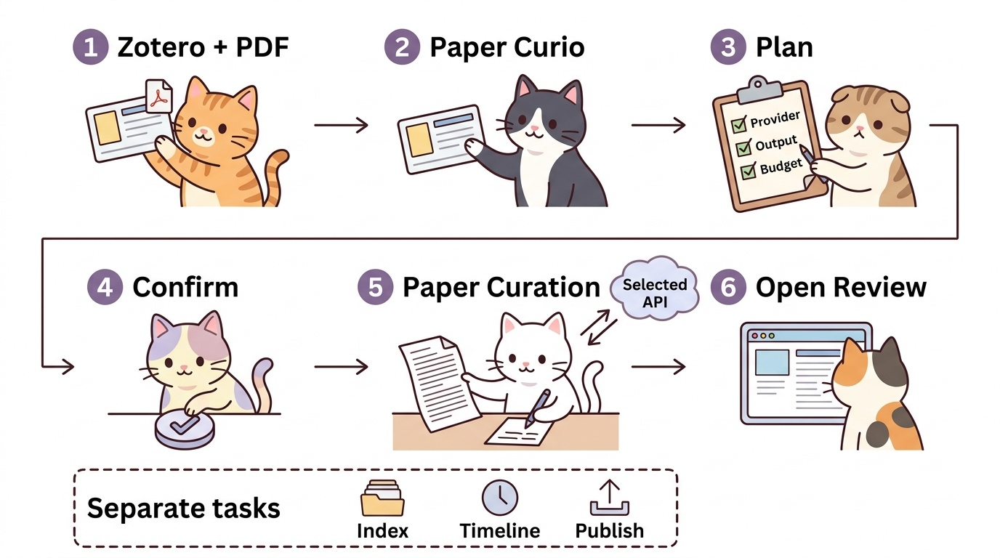

# Paper Curation · Paper Curio 사용 매뉴얼

논문 한 편을 읽는 사람부터 개인 논문 라이브러리를 운영하는 사람까지, 필요한 작업만 선택하는 한국어 매뉴얼입니다.

| 매뉴얼 | 대상 | 도착점 |
|---|---|---|
| **[초보자용 간단버전](beginner.md)** | 처음 설치하거나 Zotero에서 논문 한 편을 리뷰하려는 사용자 | 두 프로그램 연결 → 실행 계획 확인 → 리뷰 생성 → HTML 열기 |
| **[파워유저용 심화버전](advanced.md)** | CLI 자동화, 여러 논문 관리, 검색·서지 DB·배포를 운영하는 사용자 | 기능별 요청 JSON, 인증·비용 통제, 검색, 전체 처리, 장애 대응 |

## 두 프로그램의 관계

- **Paper Curation**은 PDF를 처리하고 리뷰·검색 색인·웹 산출물 등을 만드는 Python 실행기입니다. 명령줄만으로도 사용할 수 있습니다.
- **Paper Curio**는 Zotero 플러그인입니다. 논문을 선택하고 작업을 요청하는 화면을 제공하며, 연동 기능은 Paper Curation을 호출합니다.
- **기존 리뷰 읽기**와 **새로운 AI 결과 생성**은 다릅니다. 이미 만들어진 HTML을 여는 데는 생성용 API 키가 필요 없습니다.
- **GJC/Claude 구독 인증**은 Paper Curation의 API 자격증명이 아닙니다. 구독으로 코딩 도구를 사용하더라도, 파이프라인이 실행하는 클라우드 API 작업은 별도 과금될 수 있습니다.



그림 읽는 순서: **논문과 PDF → Paper Curio → 계획 확인 → 승인 → Paper Curation → 리뷰 열기**. 아래 점선 상자는 자동 후속 단계가 아닙니다.

## 바로 찾아가기

| 하고 싶은 일 | 읽을 곳 |
|---|---|
| 터미널을 잘 모르지만 Zotero에서 시작하기 | [간단버전](beginner.md) |
| API 키 저장, 비용 상한, 구독과 API 구분 | [심화버전](advanced.md) |
| 검색·연결 생성·서지 DB를 따로 실행하기 | [심화버전](advanced.md) |
| 설치 환경의 세부 요구사항 | [설치 가이드](../setup-guide.md) |
| 전체 파이프라인 운영 및 복구 | [운영 매뉴얼](../operations.md) |
| 데이터 흐름과 웹 배포 구조 | [아키텍처](../architecture.md) |
| 기관 귀속 분석 방식 | [기관 분석 설명](../attribution.md) |

## 범위와 그림

- 작성 기준: **2026-09-13의 로컬 구현**. 기능 목록은 [`pipeline/features.json`](../../pipeline/features.json), 플러그인 배포본은 [Paper Curio 릴리스](https://github.com/jehyunlee/paper-curio/releases/latest)를 기준으로 확인하세요. 설치 버전에 따라 메뉴가 다를 수 있습니다.
- 그림은 **실제 UI 캡처가 아닌 개념도**입니다. 작은 글자 오독을 줄이기 위해 그림에는 영어, 본문에는 한국어 설명을 사용했습니다. 심화버전의 구조도는 공유 기능 실행 경로를 설명하며, 기존 AI Chat과 전체 `run_full.py` 경로의 차이는 본문에서 별도로 다룹니다.
- `quickstart.png`, `architecture.png`는 기존 `lib.paperbanana.generate_diagram()`을 통해 **PaperBanana**로 생성했습니다. 생성 당시 설정은 텍스트 `gemini-3.1-pro-preview`, 이미지 `gemini-3.1-flash-image-preview`, 16:9, critic 최대 2회입니다.
- 재생성용 소스: [`generate_figures.py`](generate_figures.py). 저장소 루트에서 Python 3.12로 실행합니다. **유료 이미지 생성 요청**이며, 기존 파일은 기본적으로 보존됩니다.

```bash
python docs/manual/generate_figures.py --figure quickstart
# 기존 그림을 의도적으로 다시 생성할 때만 --force를 추가합니다.
```

[Paper Curation 저장소](https://github.com/jehyunlee/paper-curation) · [Paper Curio 저장소](https://github.com/jehyunlee/paper-curio)
