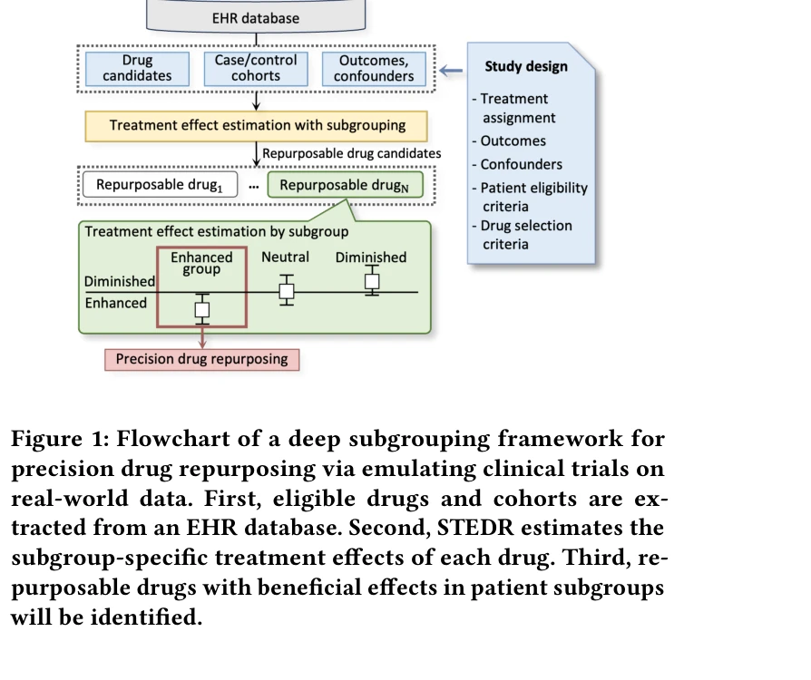
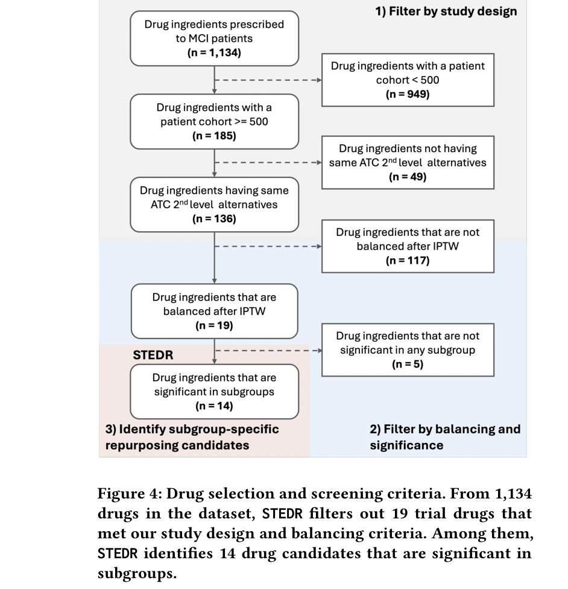
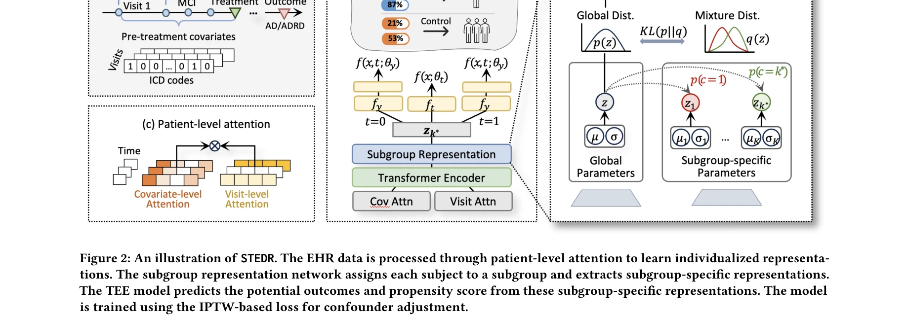

# A deep subgrouping framework for precision drug repurposing via emulating clinical trials on real-world patient data

> **저자**: Seungyeon Lee, Ruoqi Liu, Feixiong Cheng, Ping Zhang | **날짜**: 2024 | **URL**: [https://arxiv.org/abs/2412.20373](https://arxiv.org/abs/2412.20373)

---

## Essence

*Figure 1: Flowchart of a deep subgrouping framework for*

STEDR은 환자 하위군의 이질적 치료 반응을 고려하여 실제 환자 데이터에서 임상시험을 모의실험하고 정밀 약물 재창출(precision drug repurposing)을 수행하는 딥러닝 프레임워크이다.

## Motivation

- **Known**: 기존 약물 재창출 연구는 전체 인구를 동질적으로 취급하며, 신경망 기반 치료 효과 추정(TEE, Treatment Effect Estimation) 방법들이 제안되어 있다.
- **Gap**: 기존 방법들은 환자 하위군 간의 이질적 치료 반응을 무시하며, 시간 변동적이고 고차원의 실제 의료 데이터(RWD)에 직접 적용되지 않고, 임상적으로 관련된 변수로 하위군을 특성화하지 못한다.
- **Why**: 알츠하이머병(AD)처럼 승인된 약물이 적고 환자 간 치료 반응이 다양한 질환에서 정밀 의약학 기반의 약물 재창출은 임상 효과를 높이고 더 많은 재창출 후보를 발굴할 수 있다.
- **Approach**: STEDR은 이중 수준 주의 메커니즘(covariate-level, visit-level attention)으로 시간 데이터를 인코딩하고, VAE(Variational Auto-Encoder) 기반 하위군 네트워크로 환자를 이질적 분포를 가진 하위군으로 분류하여 하위군 특화 치료 효과를 추정한다.

## Achievement

*Figure 4: Drug selection and screening criteria. From 1,134*

- **첫 통합 프레임워크**: 하위군 분석과 치료 효과 추정을 결합한 약물 재창출의 첫 사례
- **대규모 임상시험 모의실험**: 800만+ 환자 MarketScan MDCR 데이터베이스에서 1,134개 약물 중 100회씩 임상시험을 모의실험하여 14개 AD 재창출 후보 약물 발굴
- **임상적 해석성**: 병력(comorbidity), 인구통계학적 특성 등 AD 관련 위험 요인으로 정의된 임상적으로 관련성 높은 환자 하위군 특성화
- **우수한 성능**: 기존 방법론 대비 재창출 후보 약물 식별에서 우수성 입증

## How

*Figure 2: An illustration of STEDR. The EHR data is processed through patient-level attention to learn individualized re*

- 이중 수준 주의 메커니즘: 공변량 수준 주의로 각 진단 코드의 영향도 학습, 방문 수준 주의로 시간 역학 관계 포착
- 환자 인코더: 종단 EHR 데이터를 개인화된 환자 표현으로 변환
- 하위군 표현 네트워크: VAE를 통해 각 환자를 특정 하위군에 할당하고 하위군 특화 표현 추출
- 치료 효과 추정: 하위군별 표현에서 경향 점수(propensity score)와 잠재 결과(potential outcomes) 예측
- 약물 선별 및 필터링: 1,134개 약물 중 포함 기준을 충족한 약물만 선정
- 임상시험 모의실험(trial emulation): 각 약물별 100회 반복 시뮬레이션으로 하위군별 처리 효과 추정

## Originality

- 하위군 기반 정밀 약물 재창출이라는 새로운 문제 정의
- VAE 기반 동적 하위군 식별 아키텍처로 기존 단일 공유 잠재공간의 한계 극복
- 이중 수준 주의로 시간 변동적 고차원 데이터의 복합적 특성 처리
- 실제 대규모 EHR 데이터에서 임상적으로 해석 가능한 하위군 도출

## Limitation & Further Study

- 선택 편향(selection bias) 완전 제거 불가 - 관찰 데이터의 근본적 한계
- 하위군 수의 사전 결정 필요 - 최적 하위군 개수 자동 결정 메커니즘 부재
- 알츠하이머병 중심 평가 - 다른 질환군에 일반화 가능성 검증 필요
- 약물 안전성 정보 미포함 - 식별된 후보의 재창출 가능성 검증에 약리학적 검토 필수
- 후속연구: (1) 동적 하위군 수 결정 알고리즘 개발, (2) 다중 질환군 전이 학습 연구, (3) 실제 임상 검증 수행

## Evaluation

- Novelty: 4/5
- Technical Soundness: 3/5
- Significance: 4/5
- Clarity: 4/5
- Overall: 4/5

**총평**: STEDR은 약물 재창출 분야에 정밀 의약학 관점의 하위군 분석을 처음 통합하여 새로운 문제 정의를 제시하며, 이중 수준 주의와 VAE 기반 하위군 네트워크로 기술적 혁신을 이루었다. 800만+ 환자 대규모 데이터에서 14개 AD 약물 후보를 발굴하고 임상적 해석성을 확보한 점에서 강한 실무 가치를 보유하나, 관찰 데이터의 편향 문제와 다질환군 일반화 검증이 후속 과제이다.

## Related Papers

- 🔄 다른 접근: [[papers/713_Scicueval_A_comprehensive_dataset_for_evaluating_scientific/review]] — 환자 하위군 기반 정밀 약물 재창출과 과학적 맥락 이해 평가는 모두 의료/과학 분야에서 AI의 실제 성능을 체계적으로 평가하는 서로 다른 접근법입니다
- 🏛 기반 연구: [[papers/016_A_practical_evaluation_of_AutoML_tools_for_binary_multiclass/review]] — AutoML 도구의 실제 데이터셋 체계적 벤치마킹은 정밀 약물 재창출을 위한 딥러닝 프레임워크 평가의 방법론적 기반을 제공합니다
- 🧪 응용 사례: [[papers/225_Clinicalgpt-r1_Pushing_reasoning_capability_of_generalist_di/review]] — 다양한 의료 데이터로 파인튜닝된 ClinicalGPT-R1은 STEDR의 정밀 약물 재창출 프레임워크가 실제 임상에 적용된 사례입니다
- 🧪 응용 사례: [[papers/016_A_practical_evaluation_of_AutoML_tools_for_binary_multiclass/review]] — AutoML 도구의 체계적 벤치마킹 방법론은 정밀 약물 재창출을 위한 딥러닝 프레임워크의 성능 평가에 직접 적용될 수 있습니다
- 🏛 기반 연구: [[papers/856_Unimatch_Universal_matching_from_atom_to_task_for_few-shot_d/review]] — 정밀 약물 재활용을 위한 깊은 서브그룹핑 프레임워크가 원자에서 과제까지의 계층적 매칭의 이론적 기반을 제공한다.
