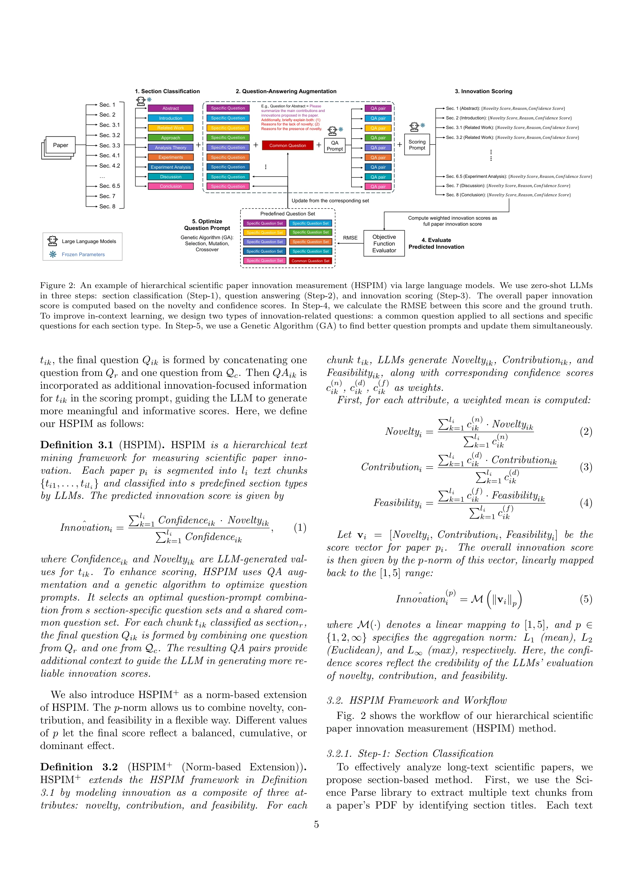
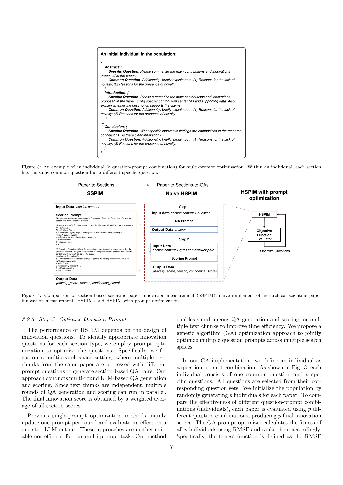
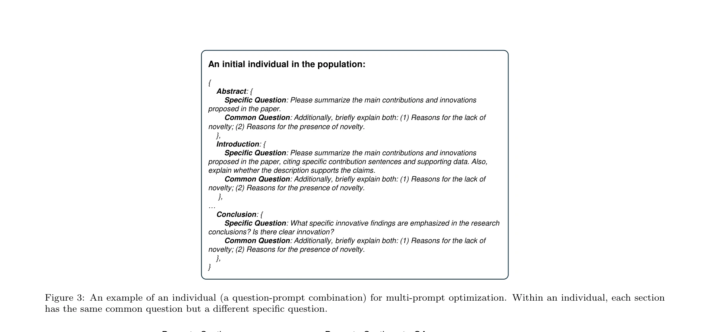

# A hierarchical framework for measuring scientific paper innovation via large language models

> **저자**: Hongming Tan, Shaoxiong Zhan, Fengwei Jia, Hai-Tao Zheng, Wai Kin (Victor) Chan | **날짜**: 02/2026 | **DOI**: [10.1016/j.ins.2025.122787](https://doi.org/10.1016/j.ins.2025.122787)

---

## Essence

*Figure 2: An example of hierarchical scientific paper innovation measurement (HSPIM) via large language models. We use z*

대규모언어모델(LLM)을 활용하여 과학논문의 혁신성을 계층적으로 측정하는 HSPIM 프레임워크를 제안한다. 논문을 섹션으로 분해하고 질의응답(QA) 기반 가중치 점수화로 혁신성을 정량화한다.

## Motivation

- **Known**: 과학논문 평가에서 혁신성 측정이 중요하지만, 기존 내용 기반 방법들은 전체 맥락을 간과하고 특정 섹션만 분석하는 한계가 있다. 혁신성과 새로움(novelty)을 구분하는 개념적 정의가 부족하다.
- **Gap**: 기존 방법은 장문 텍스트 처리의 어려움, 새로움만 측정하고 실용적 가치는 누락, 특정 분야/시기 논문으로만 학습되어 일반화 부족이라는 문제가 있다. 훈련 없이 다양한 논문에 적용 가능한 혁신성 측정 방법이 필요하다.
- **Why**: 자동화된 혁신성 측정은 급증하는 논문 평가 수요를 충족하고, 블라인드 피어리뷰를 지원하며, 미발표 논문 평가에 활용될 수 있어 학술 커뮤니티에 필수적이다.
- **Approach**: LLM 기반 제로샷 프롬프팅으로 논문을 IMRaD 형식의 섹션으로 분류하고, 각 섹션에 공통 및 섹션별 특화 질문을 생성하여 혁신성 점수화를 수행한다. 유전 알고리즘으로 질문-프롬프트 조합을 최적화하여 성능을 향상시킨다.

## Achievement

*Figure 4: Comparison of section-based scientific paper innovation measurement (SSPIM), naive implement of hierarchical s*

- **HSPIM 프레임워크**: 논문-섹션-QA 계층 구조로 장문 텍스트를 효과적으로 처리하고, 신뢰도 가중치 기반 집계로 섹션 수준 혁신성을 논문 수준으로 통합
- **혁신성 개념 정의**: 경제학과 사회과학 이론을 바탕으로 혁신성을 새로움(novelty)과 실용적 가치(contribution, feasibility)의 결합으로 명확히 정의
- **훈련 불필요한 일반화**: 제로샷 LLM 프롬프팅으로 어떤 분야/시기의 논문에도 적용 가능하며, 특정 데이터셋에 과적합되지 않음
- **유전 알고리즘 최적화**: 다중 프롬프트 조합 최적화에 유전 알고리즘을 처음 적용하여 질문 프롬프트의 효과성을 체계적으로 개선
- **HSPIM+ 확장**: 새로움, 기여도, 실현가능성을 각각 점수화하여 혁신성의 세밀한 분석 가능

## How

*Figure 3: An example of an individual (a question-prompt combination) for multi-prompt optimization. Within an individua*

- 논문을 섹션 제목 기준으로 텍스트 청크로 분할하고 LLM으로 IMRaD 섹션 유형 분류
- 각 섹션에 대해 공통 질문 1개 + 섹션별 특화 질문 1개의 2층 질문 구조 설계
- 제로샷 LLM 프롬프팅으로 각 청크에서 {novelty_score, reason, confidence_score} JSON 생성
- 생성된 QA 쌍을 추가 컨텍스트로 활용하여 LLM 점수화 정확도 향상
- 신뢰도 점수를 가중치로 가중 평균하여 논문 수준 혁신성 점수 계산
- 유전 알고리즘으로 질문-프롬프트 조합 최적화 (population initialization → selection → crossover → mutation)
- PeerRead(3개) 및 NLPeer(1개) 데이터셋의 피어리뷰 점수를 지표로 성능 평가 (RMSE, MAE)

## Originality

- **제로샷 LLM 기반 측정**: 훈련 데이터 없이 LLM의 내재적 지식으로 혁신성 평가 (기존 미세조정 방식과 차별화)
- **계층적 분해 구조**: 문서→섹션→QA 다층 구조로 장문 처리와 세밀한 분석 동시 달성
- **혁신성 정의의 명확화**: 새로움과 실용적 가치를 명시적으로 구분하고 신뢰도를 가중치로 활용하는 새로운 개념 정의
- **2층 질문 구조**: 유전학의 구조유전자/조절유전자 개념에서 영감받아 공통 질문과 특화 질문을 설계
- **다중 프롬프트 유전 알고리즘 최적화**: 복수의 질문 세트를 동시 최적화하는 첫 시도

## Limitation & Further Study

- **LLM 의존성**: 특정 LLM 모델(예: GPT-4)에 기반하여 다른 모델의 성능 일관성 미검증
- **섹션 분류 오류**: IMRaD 형식이 아닌 비표준 논문 구조에서 분류 정확도 저하 가능성
- **평가 지표의 한계**: 피어리뷰 점수를 혁신성의 지표로 사용하나, 피어리뷰 자체의 편향성 미해결
- **다언어 지원 부족**: 영어 논문 중심으로 타 언어 논문으로 확장 필요
- **정성적 해석 검증**: 생성된 reason의 정성적 타당성 평가가 부족 (텍스트 유사도만 측정)
- **후속 연구**: 다양한 LLM 모델 비교, 비표준 논문 구조 처리, 도메인별 특화 모델 개발, 사용자 피드백 기반 반복 개선

## Evaluation

- Novelty: 4/5
- Technical Soundness: 4/5
- Significance: 4/5
- Clarity: 4/5
- Overall: 4/5

**총평**: 본 논문은 LLM 기반의 첫 훈련 불필요 과학논문 혁신성 측정 프레임워크를 제시하며, 계층적 분해, 명확한 개념 정의, 유전 알고리즘 최적화를 통해 일반화 가능성과 해석가능성을 크게 향상시켰다. 실증 검증과 기술적 창의성이 높으나, LLM 의존성과 평가 지표의 한계 개선이 필요하다.

## Related Papers

- 🔄 다른 접근: [[papers/434_Interesting_Scientific_Idea_Generation_using_Knowledge_Graph/review]] — 둘 다 LLM을 활용한 과학 논문 평가를 다루지만 하나는 혁신성 측정, 다른 하나는 연구 아이디어 생성에 중점을 둠
- 🔗 후속 연구: [[papers/178_Can_ai_examine_novelty_of_patents_Novelty_evaluation_based_o/review]] — 특허의 신규성 평가를 과학 논문의 혁신성 측정으로 확장하여 더 포괄적인 지적 창작물 평가 방법을 제시함
- 🏛 기반 연구: [[papers/320_Evaluating_Large_Language_Models_in_Scientific_Discovery/review]] — 코드 평가를 위한 LLM 활용 연구가 과학 논문의 혁신성을 측정하는 계층적 프레임워크 개발의 방법론적 기초를 제공함
- 🧪 응용 사례: [[papers/777_Structuring_scientific_innovation_A_framework_for_modeling_a/review]] — 과학 논문 혁신도 측정을 위한 계층적 프레임워크가 파괴적 혁신 지수 평가의 실제적 도구로 활용될 수 있다.
- 🔄 다른 접근: [[papers/779_Supporting_assessment_of_novelty_of_design_problems_using_co/review]] — 과학 논문의 혁신성 측정이라는 유사한 목표이지만 SAPPhIRE 모델과 계층적 프레임워크라는 다른 접근법을 사용한다.
- 🔄 다른 접근: [[papers/313_Enabling_ai_scientists_to_recognize_innovation_A_domain-agno/review]] — 과학 논문 혁신 측정을 위한 계층적 프레임워크로 본 논문의 혁신성 평가와 다른 접근법을 제시한다.
