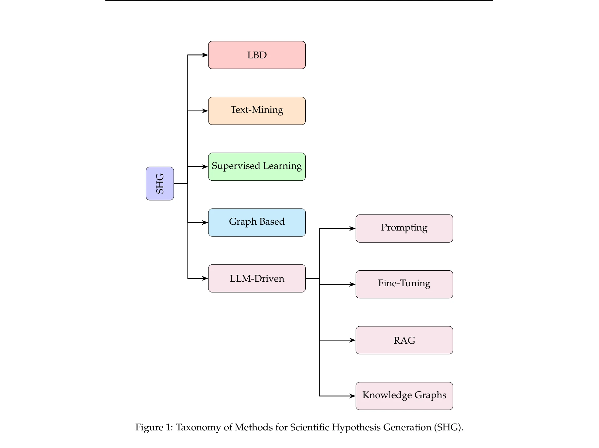

# A Survey on Hypothesis Generation for Scientific Discovery in the Era of Large Language Models

> **저자**: Atilla Kaan Alkan, Shashwat Sourav, Maja Jablonska, Simone Astarita, Rishabh Chakrabarty, Nikhil Garuda, Pranav Khetarpal, Maciej Pióro, Dimitrios Tanoglidis, Kartheik G. Iyer, Mugdha S. Polimera, Michael J. Smith, Tirthankar Ghosal, Marc Huertas-Company, Sandor Kruk, Kevin Schawinski, Ioana Ciucă | **날짜**: 2025-04-07 | **DOI**: [10.48550/arXiv.2504.05496](https://doi.org/10.48550/arXiv.2504.05496)

---

## Essence

*Figure 1: Taxonomy of Methods for Scientific Hypothesis Generation (SHG).*

본 논문은 과학적 발견 과정에서 가설 생성을 자동화하기 위한 대규모 언어모델(LLM: Large Language Models)의 활용에 관한 종합적 설문 연구이며, 기존 방법론부터 최신 프레임워크까지 체계적으로 분류하고 평가전략을 제시한다.

## Motivation

- **Known**: 가설 생성은 과학적 발견의 기초이며, 전통적으로 인간의 직관과 경험에 의존해왔다. 최근 LLM의 발전으로 가설 생성 자동화 가능성이 제기되고 있다.
- **Gap**: 정보 과부하와 학문 분화로 인해 전통적 접근법의 한계가 드러나고 있으며, LLM 기반 가설 생성의 평가 방법, 신규성 보증, 인간-AI 협력 방식 등이 체계적으로 정리되지 않았다.
- **Why**: 과학문헌의 급속한 증가로 인해 연구자들이 학제 간 지식을 통합하기 어려워지고 있으므로, LLM을 통해 혁신적인 가설을 발굴하고 새로운 과학적 발견을 가속화할 수 있다.
- **Approach**: arXiv API를 통해 2005-2025년 기간의 관련 논문을 체계적으로 검색하고, 인간중심 방식부터 LBD(Literature-Based Discovery), 텍스트마이닝, 그래프기반 모델, LLM 기반 방법까지 진화 과정을 분석하며 분류 체계를 구축한다.

## Achievement

*Figure 1: Taxonomy of Methods for Scientific Hypothesis Generation (SHG).*

- **종합적 분류 체계 제시**: 인간중심, LBD, 텍스트마이닝, 감독학습, 그래프기반, LLM 기반 방법으로 계층화된 가설 생성 방법론의 분류체계 개발
- **LLM 기반 방법론 분석**: 프롬프팅(Prompting), 파인튜닝(Fine-Tuning), RAG(Retrieval-Augmented Generation), 지식그래프 통합 등 다양한 LLM 활용 기법의 체계적 분류
- **가설 품질 개선 기법 정리**: 신규성 촉진(Novelty Boosting), 구조화된 추론(Structured Reasoning) 등 생성 가설의 질을 높이기 위한 기법들의 문헌 정리
- **평가 전략 개요 제공**: 생성 가설의 신규성, 관련성, 실현 가능성, 중요성, 명확성을 평가하기 위한 다양한 지표와 방법론 제시
- **미래 방향 제시**: 멀티모달 통합, 인간-AI 협력, 해석 가능성 등 향후 연구 과제 도출

## How

*Figure 1: Taxonomy of Methods for Scientific Hypothesis Generation (SHG).*

- arXiv API를 통한 체계적 문헌 검색: 핵심개념(가설생성, 과학적발견), 전통기법(LBD, 문헌마이닝), 최신기법(NLP, LLM) 검색어 활용
- 포함 기준(Inclusion Criteria) 수립: 자동화된 가설생성 방법 제안, NLP/지식그래프/LLM을 통한 과학발견, 이론적 통찰 제공 논문 선정
- 수동 검토 및 분류: 제목/초록 기반 1차 필터링 후, 방법론 패러다임별(LBD, NLP, LLM), 과학 영역별(생의학, 천체물리, 화학), 가설 표현 방식별 분류
- 계층적 분류 체계 구축: Figure 1의 분류도를 통해 인간중심→LBD→텍스트마이닝→감독학습→그래프기반→LLM으로의 진화 과정 시각화
- 각 방법론의 사례 분석: ARROWSMITH, MOLIERE, KnIT, DiseaseConnect, BrainSCANr 등 구체적 시스템들의 기법과 성과 상세 검토

## Originality

- **종합적 범위**: 70년 대 인간중심 방식부터 2025년 최신 LLM 기법까지 20년 이상의 연구 진화를 단일 분류체계로 통합한 최초의 설문
- **이론-실제 연계**: 과학철학(Popper의 반증주의)과 실무적 시스템(ARROWSMITH 등)을 연결하여 가설생성의 개념적 기초 제시
- **LLM 특화 분석**: 프롬프팅, RAG, 지식그래프 통합 등 LLM 특화 기법들을 처음으로 가설생성 맥락에서 체계적으로 정리
- **평가 기준 정립**: 신규성, 관련성, 실현가능성, 중요성, 명확성 등 다원적 평가 차원 제시로 LLM 생성 가설의 객관적 평가 방안 제공
- **학제간 관점**: 천문학, 생의학, 화학 등 다양한 과학 영역에서의 사례를 통해 도메인별 특성을 반영한 분석

## Limitation & Further Study

- **평가 방법론 미성숙**: LLM 생성 가설의 실제 '신규성'을 검증하는 객관적 지표 부재 - 기존 지식과의 중복도 측정 기준 불명확", '**편향성 문제 미해결**: 학습데이터의 편향이 생성 가설에 미치는 영향에 대한 구체적 분석 및 대응책 부족
- **인간-AI 협력 모델 부족**: 논문에서 제시된 인간-AI 협력의 구체적 워크플로우와 상호작용 설계 사례 제한적
- **멀티모달 통합 미시도**: 텍스트 기반 LLM 중심 분석으로, 이미지, 그래프, 실험데이터 등 멀티모달 정보 활용 방안 부재
- **실증적 검증 부족**: 설문 논문으로서 각 방법론의 실제 성능 비교, 성공사례의 양적 평가, 실패 사례의 원인 분석이 제한적
- **후속 연구 방향**: (1) LLM 생성 가설의 실제 과학적 타당성 실험적 검증 체계 개발, (2) 학문 분야별 맞춤형 평가 기준 수립, (3) 대규모 비교 연구(벤치마크) 수행, (4) 인간 전문가의 반복적 피드백을 학습하는 적응형 시스템 개발

## Evaluation

- Novelty: 4/5
- Technical Soundness: 3/5
- Significance: 4/5
- Clarity: 4/5
- Overall: 4/5

**총평**: 본 논문은 급속히 발전하는 LLM 기반 가설생성 분야에서 처음으로 70년 역사를 포괄하는 통합 분류체계를 제시하여 연구자들의 이정표 역할을 할 수 있으며, 신규성-평가-인간협력 등 핵심 과제를 명확히 하여 향후 연구방향을 제시하는 높은 가치의 설문 연구이다.

## Related Papers

- 🧪 응용 사례: [[papers/666_Research_hypothesis_generation_over_scientific_knowledge_gra/review]] — 과학 지식 그래프를 활용한 연구 가설 생성의 구체적인 구현 방법을 보여준다.
- 🔗 후속 연구: [[papers/149_Bayes-Entropy_Collaborative_Driven_Agents_for_Research_Hypot/review]] — 베이즈-엔트로피 협력 기반 에이전트를 통해 연구 가설 생성을 확장한다.
- 🔗 후속 연구: [[papers/363_From_Reasoning_to_Learning_A_Survey_on_Hypothesis_Discovery/review]] — 과학적 발견에서 가설 생성에 대한 종합적 설문을 LLM 관점에서 확장한다.
- 🏛 기반 연구: [[papers/418_Hypothesis_Generation_for_Materials_Discovery_and_Design_Usi/review]] — 과학적 발견을 위한 가설 생성의 이론적 기반과 방법론을 제공한다
- 🏛 기반 연구: [[papers/419_Hypothesis_Generation_with_Large_Language_Models/review]] — 과학적 발견에서 가설 생성에 대한 포괄적 조사가 LLM 기반 가설 생성 알고리즘 개발의 이론적 토대를 마련합니다.
