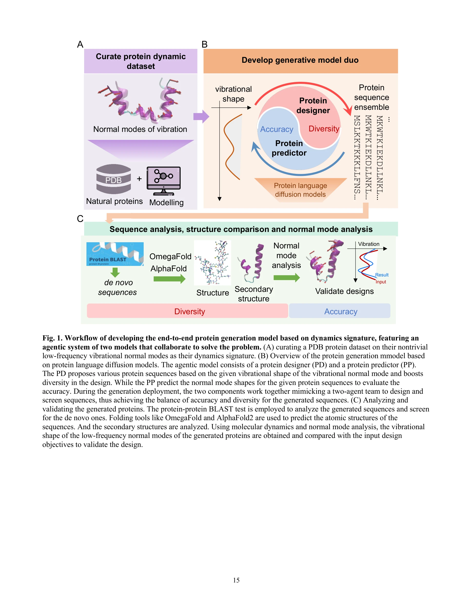
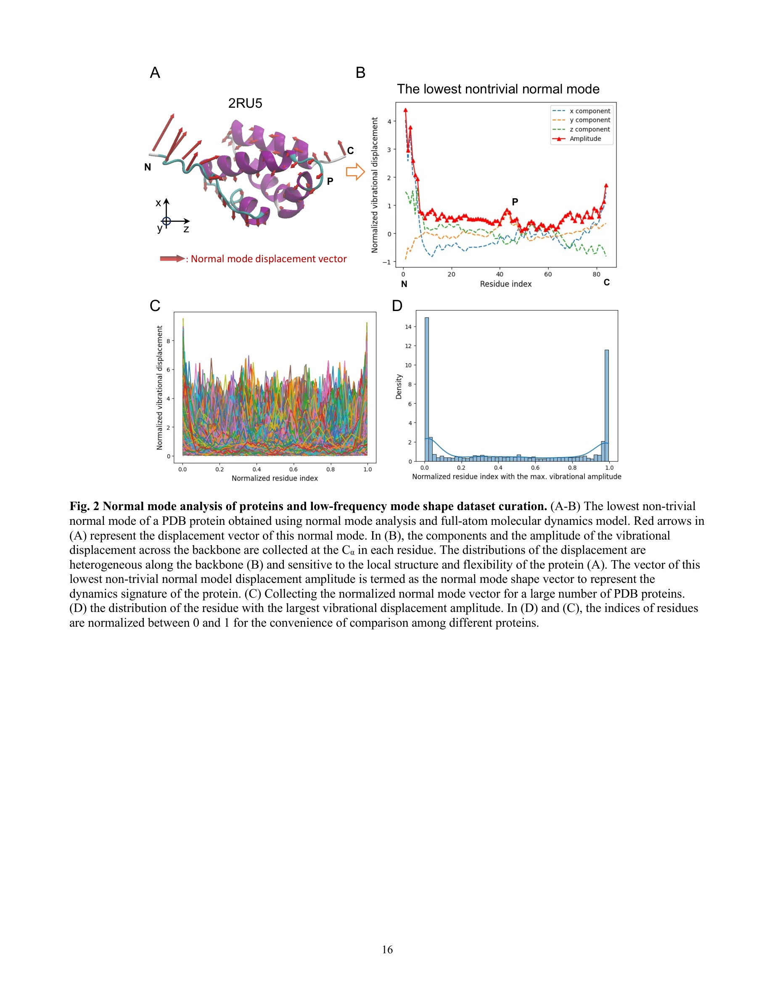
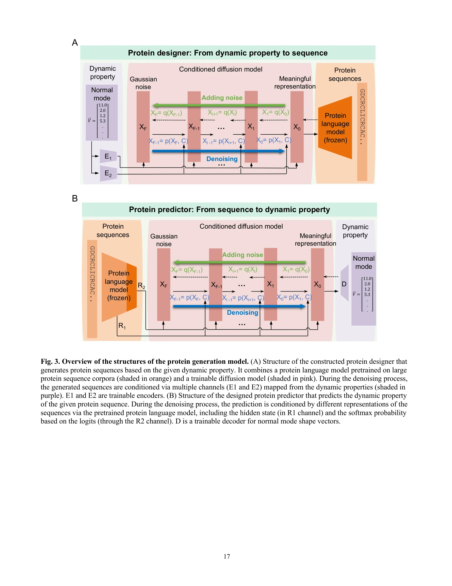

# Agentic End-to-End De Novo Protein Design for Tailored Dynamics Using a Language Diffusion Model

> **저자**: Bo Ni, Markus J. Buehler | **날짜**: 2025 | **DOI**: [10.48550/arXiv.2502.10173](https://doi.org/10.48550/arXiv.2502.10173)

---

## Essence

단백질의 동역학적 특성을 직접 제어할 수 있는 생성형 AI 프레임워크 VibeGen을 제시하며, 이는 정규 모드(normal mode) 진동을 기반으로 새로운 단백질 서열을 설계할 수 있다.

## Motivation

- **Known**: 단백질은 정적 구조가 아닌 동적 분자 기계(molecular machine)이며, 촉매작용, 신호전달, 구조 적응 등의 생물학적 기능이 분자의 운동과 밀접하게 연결되어 있다. AlphaFold2와 RoseTTAFold 등의 도구는 3D 구조 예측에 성공했으나 정적 형태에만 집중한다.

- **Gap**: 원하는 동역학적 특성을 가진 단백질을 설계하는 것은 여전히 어려운 과제이다. 현존의 단백질 설계 방법들은 주로 구조의 기하학적 특성에 중점을 두며, 동역학을 직접 제어할 수 있는 메커니즘이 부족하다.

- **Why**: 저주파 진동(low-frequency vibrations)은 촉매 반응의 에너지 장벽을 낮추고, 대규모 구조 변화를 촉진하며, 리간드 결합을 용이하게 한다. 질병(암 p53 돌연변이, 낭성섬유증 등)은 종종 이러한 동역학의 장애로 발생한다.

- **Approach**: 이중 모델 에이전트 아키텍처(dual-model agentic architecture)를 개발하여, 단백질 디자이너(PD)는 진동 모드에 기반해 서열을 생성하고, 단백질 예측기(PP)는 설계된 서열의 동역학적 정확성을 평가한다.

## Achievement

*워크플로우: (A) PDB 단백질로부터 NMA 및 MD를 통한 동역학 시그니처 수집, (B) 단백질 디자이너와 예측기의 협력 작동, (C) 설계된 단백질의 검증 및 분석*

1. **동역학 기반 역설계 성공**: 지정된 정규 모드 진폭을 정확하게 재현하는 단백질 서열을 설계했으며, 전원자(full-atom) 분자 동역학 시뮬레이션으로 검증됨.

2. **De novo 단백질 생성**: 설계된 서열은 자연 단백질과 유사성이 거의 없는 완전히 새로운 것으로, 진화적 제약을 벗어난 단백질 공간을 확장함.

3. **다양성과 정확성의 균형**: 이중 에이전트 협력 프레임워크가 단일 모델보다 우수한 성능을 보이며, 설계 다양성, 정확성, 신규성의 시너지 달성.

## How

*정규 모드 분석: (A) 최저 비자명 정규 모드의 변위장, (B) 백본을 따라 Cα 원자의 변위 성분 분포*

*단백질 생성 모델 구조: 단백질 디자이너(PD)와 단백질 예측기(PP)의 이중 모델 아키텍처*

- **데이터셋 구성**: 대규모 PDB 단백질에 대해 CHARMM 포스필드를 이용한 전원자 MD 이완 후 Hessian 행렬의 고유값 문제를 풀어 NMA 수행. 첫 6개의 자명한 강체 운동 모드를 제외하고 7번째 모드부터 시작하는 저주파 비자명 모드(non-trivial modes) 분석.

- **정규 모드 표현**: 백본의 이질적 변위장 분포를 Cα 원자의 변위 성분으로 샘플링하여 단백질 동역학의 핵심 시그니처로 활용.

- **언어 확산 모델(pLDM)**: 단백질 디자이너와 예측기 모두 단백질 언어 확산 모델 기반으로 구성하여 서열-동역학 양방향 관계 학습.

- **에이전트 협력**: 배포 시점에 PD와 PP가 협력적으로 작동하며, PD는 주어진 정규 모드 형태에 기반해 서열 생성, PP는 실시간으로 성능 예측.

## Originality

- **처음으로 동역학 조건부 생성 설계**: 기존 단백질 설계 방법들이 정적 구조에만 집중하는 반면, 이 연구는 저주파 정규 모드를 직접 설계 조건으로 사용하는 최초의 체계적 시도.

- **이중 에이전트 협력 메커니즘**: 생성기와 검증기의 상호작용으로 다양성과 정확성을 동시에 확보하는 혁신적 접근법.

- **전원자 MD 기반 검증**: NMA와 MD 시뮬레이션을 통한 직접적이고 엄밀한 동역학적 정확성 검증으로 신뢰성 확보.

- **서열-구조-동역학-기능의 통합 링크**: 기존에는 분리되어 연구되던 이 네 요소들 간의 직접적인 양방향 연결 고리를 최초로 확립.

## Limitation & Further Study

- **단일 모드 제한**: 현재는 가장 낮은 주파수의 첫 번째 비자명 모드만 대상으로 하며, 여러 모드의 동시 제어에 대한 확장성 미검증.

- **동역학적 기능성 검증 부족**: 설계된 단백질이 실제로 촉매 기능, 리간드 결합, 신호전달 등의 생물학적 기능을 수행하는지에 대한 실험적 검증 미실시.

- **계산 복잡도 분석 미흡**: 다양한 크기의 단백질에 대한 계산 비용, 확장성, 수렴 속도에 관한 상세 분석 부재.

- **후속 연구**: (1) 다중 정규 모드 동시 제어 framework 개발, (2) 실험실 검증 및 생물학적 기능성 평가, (3) 다중 모달 설계 목표(예: 구조 + 동역학 + 결합 특이성) 통합, (4) LLM 기반 멀티에이전트 시스템과의 통합 확대.

## Evaluation

- **Novelty**: 4.5/5 — 동역학 조건부 생성 설계와 이중 에이전트 협력 메커니즘이 새로우며, de novo 단백질 생성도 의미 있음. 다만 기술적 기초는 기존 diffusion model 활용.

- **Technical Soundness**: 4/5 — NMA와 MD 기반 검증이 엄밀하고, 이중 모델 설계가 논리적. 다만 단일 모드 제한, 통계적 신뢰도 분석 부재, 계산 복잡도 미분석이 약점.

- **Significance**: 4.5/5 — 단백질 공학의 중요한 미해결 문제(동역학 기반 설계)에 첫 해결책 제시. 유연한 효소, 동적 스캐폴드, 바이오재료 설계에 광범위한 적용 가능성.

- **Clarity**: 4/5 — 전체 워크플로우와 동기가 명확하나, 모델 아키텍처 세부사항(학습 손실함수, 하이퍼파라미터, 학습 곡선 등)이 제시된 텍스트에서 충분하지 않음.

- **Overall**: 4.2/5

**총평**: 이 연구는 단백질 설계에 동역학적 고려를 체계적으로 통합한 혁신적 시도로, 이중 에이전트 협력 프레임워크를 통해 de novo 단백질을 생성하는 데 성공했다. 전원자 MD 기반 검증으로 신뢰성을 확보했으나, 실험적 검증, 다중 모드 확장, 생물학적 기능성 입증이 후속 과제이다.

## Related Papers

- 🏛 기반 연구: [[papers/646_QH9_A_Quantum_Hamiltonian_Prediction_Benchmark_for_QM9_Molec/review]] — QH9의 정밀한 양자 해밀턴 데이터는 단백질 동역학 모델링의 물리적 기초를 제공합니다.
- 🔄 다른 접근: [[papers/638_ProtAgents_protein_discovery_via_large_language_model_multi-/review]] — 동일한 단백질 발견 문제를 다중 에이전트 접근법으로 해결하여 상호 보완적인 방법론을 제시합니다.
- 🔗 후속 연구: [[papers/403_Highly_accurate_protein_structure_prediction_with_AlphaFold/review]] — AlphaFold의 구조 예측을 넘어 동역학적 특성까지 제어 가능한 단백질 설계로 확장합니다.
- 🔄 다른 접근: [[papers/256_De_novo_design_of_protein_structure_and_function_with_RFdiff/review]] — 목표 동역학을 위한 단백질 설계에서 진동 조건 기반과 에이전트 기반이라는 다른 접근 방식을 사용한다
- 🏛 기반 연구: [[papers/646_QH9_A_Quantum_Hamiltonian_Prediction_Benchmark_for_QM9_Molec/review]] — 정밀한 양자 해밀턴 데이터가 단백질 동역학 제어 시스템의 물리적 정확성을 보장하는 기초 데이터를 제공합니다.
- 🔄 다른 접근: [[papers/638_ProtAgents_protein_discovery_via_large_language_model_multi-/review]] — 단백질 설계에서 다중 에이전트 vs 엔드투엔드 단일 시스템의 다른 접근법을 비교할 수 있다
