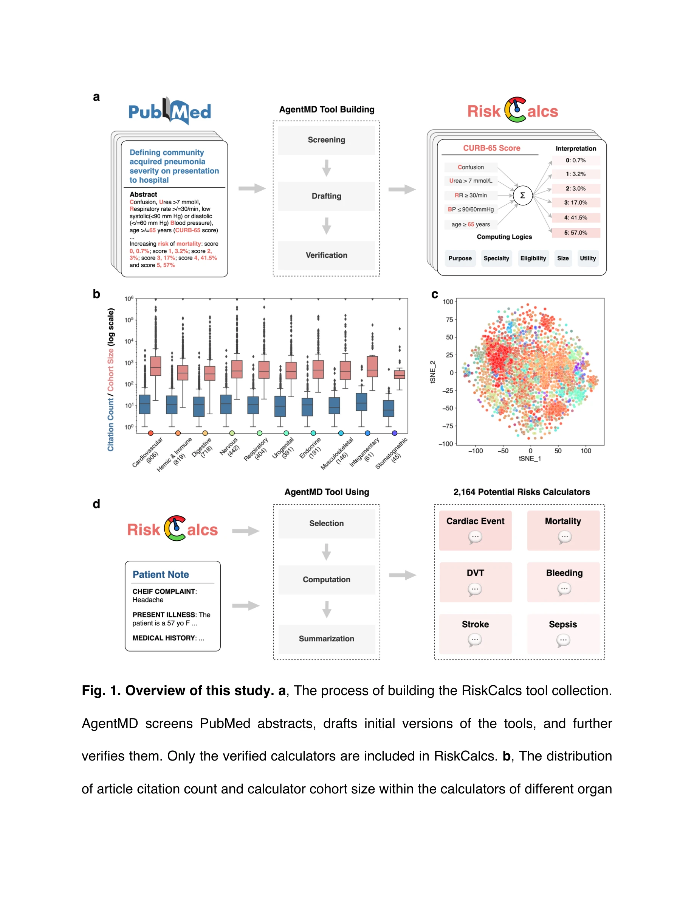
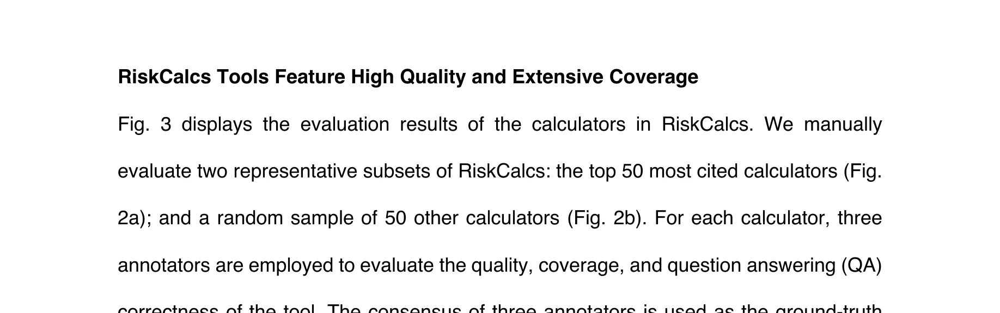
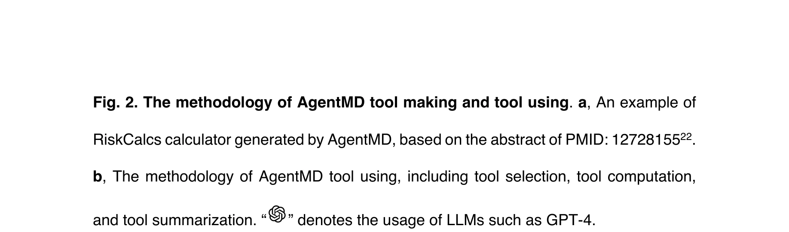

# AgentMD: Empowering Language Agents for Risk Prediction with Large-Scale Clinical Tool Learning

> **저자**: Qiao Jin, Zhizheng Wang, Yifan Yang, Qingqing Zhu, Donald Wright | **날짜**: 2024 | **DOI**: [10.48550/arXiv.2402.13225](https://doi.org/10.48550/arXiv.2402.13225)

---

## Essence

*그림 1. 연구 개요: (a) RiskCalcs 도구 모음 구축 프로세스, (b) 장기 시스템별 계산기 분포, (c) 도구의 의미적 표현 t-SNE 시각화, (d) 환자 노트에 RiskCalcs 적용 프로세스*

본 논문은 대규모 언어모델(LLM)을 활용하여 PubMed 문헌으로부터 2,164개의 임상 계산기(RiskCalcs)를 자동으로 큐레이션하고, 이를 환자 기록에 적용하는 의료 언어 에이전트 AgentMD를 제시한다. 기존 수동 큐레이션의 확장성 문제를 극복하면서 80% 이상의 정확도를 달성하고, 기존 GPT-4 체인-오브-소트(Chain-of-Thought) 방식(40.9%)을 크게 능가한다(87.7%).

## Motivation

- **Known**: 임상 계산기는 의료 현장에서 예후 판정과 위험 평가에 필수적인 도구이며, 증거 기반의 임상 의사결정을 지원한다.

- **Gap**: 기존 임상 계산기는 ① 낮은 가용성과 확산 부족 ② 전자의료기록(EHR)과의 통합 미흡으로 인한 수동 데이터 입력 부담 ③ 단편적 사용으로 인한 시너지 부족 ④ 주관적 해석으로 인한 일관성 부족 등으로 실제 임상 이용이 제한된다.

- **Why**: PubMed에 등재된 수천 개의 임상 계산기 문헌이 존재하지만, 이를 체계적으로 큐레이션하고 실제 환자 사례에 적용할 수 있는 자동화된 방법이 없다.

- **Approach**: LLM의 자율 에이전트 능력을 활용하여 ① 문헌 스크리닝과 도구 자동 생성 및 검증 파이프라인 구축 ② 대규모 임상 도구 라이브러리 구성 ③ 환자 노트에서 관련 계산기 자동 선택 및 적용 프레임워크 개발

## Achievement

*그림 3. RiskCalcs 도구의 품질 및 커버리지 분석: (a) 상위 50개 인용 계산기, (b) 무작위 샘플 50개 계산기의 평가 결과*

1. **대규모 자동 큐레이션**: PubMed 339,952개 논문 중 2,164개의 검증된 임상 계산기를 자동으로 추출하여 RiskCalcs 라이브러리 구축. 이 중 96%가 기존 온라인 구현 도구에 없는 신규 자동화 도구.

2. **높은 품질 달성**: 수동 평가 결과 추상(87.0%), 계산 로직(87.6%), 결과 해석(89.0%) 정확도 달성. 상위 25개 인용 계산기의 68% 구현률 vs. 무작위 샘플 4% 구현률로 실질적 커버리지 확대.

3. **우수한 임상 적용 성능**: 신규 벤치마크 RiskQA에서 87.7% 정확도로 기존 GPT-4 체인-오브-소트(40.9%)를 2배 이상 상회. MIMIC-III 중환자 데이터에 적용하여 인구 수준 및 개인 위험 수준의 특성 분석 가능성 입증.

## How

*그림 2. AgentMD의 도구 제작 및 사용 방법론: (a) 생성된 RiskCalcs 계산기 예시, (b) 도구 선택, 계산, 요약 단계 포함 상세 방법*

### 도구 제작 (Tool Maker)
- **스크리닝 단계**: Boolean 쿼리("patient AND (risk OR mortality) AND (score OR point OR rule OR calculator)")로 2000-2023년 PubMed 검색 → 339,952개 논문 추출
- **초안 작성**: GPT-3.5-Turbo로 33,033개 후보 논문 필터링 → GPT-4로 각 계산기의 제목, 목적, eligibility, 주제, 파이썬 계산 함수, 결과 해석, 임상 유용성 등 구조화된 문서 생성
- **검증**: GPT-4를 통한 추가 검증으로 환각(hallucination) 및 오류 제거
- **분류**: MeSH 기준 10개 장기 시스템(심혈관, 소화기, 호흡기 등)으로 자동 분류

### 도구 사용 (Tool User)
- **선택 단계**: MedCPT 임베딩 모델로 환자 노트와 유사도 계산 → 상위 10개 계산기 검색 후 LLM이 eligibility 판단으로 적격 도구 선택
- **계산 단계**: 선택된 도구에 대해 LLM이 파이썬 코드 생성 → 코드 인터프리터 실행으로 위험도 계산. 필요 파라미터 누락 시 최선/최악 시나리오 기반 범위 추정
- **요약 단계**: 실행 결과 또는 오류에 따라 재시도 또는 전체 상호작용 이력을 텍스트로 요약

### 기술 특징
- **LLM-agnostic 구조**: 특정 LLM에 종속되지 않으며 GPT-3.5, GPT-4 등 다양한 모델 활용 가능
- **자동 오류 처리**: 코드 인터프리터의 피드백 기반 적응형 재시도 메커니즘
- **의미적 군집화**: t-SNE 시각화로 같은 장기계통의 계산기들이 유사한 의미 표현 공간에 위치함을 확인

## Originality

- **최초 시도**: 대규모 임상 도구의 자동 생성, 평가, 적용을 통합한 첫 번째 연구. 기존 연구는 소규모 특정 도구 또는 소프트웨어 엔지니어링 측면만 다룸.

- **혁신적 이중 역할 구조**: 단일 에이전트가 도구 제작자(tool maker)와 사용자(tool user) 역할을 동시에 수행하는 설계로 자동화와 응용을 통합.

- **신규 벤치마크**: 임상 도구 선택 및 적용 능력 평가를 위한 RiskQA 벤치마크 최초 개발. 기존 평가 방식과 달리 실제 임상 맥락에서의 도구 선택 정확도 측정.

- **대규모 자동 큐레이션 파이프라인**: 2,164개 도구라는 전례 없는 규모의 임상 계산기 자동 추출 및 검증. 기존 온라인 구현(MDCalc 등)의 한계를 보완하는 규모와 커버리지.

## Limitation & Further Study

- **검증 범위 제한**: 100개 계산기만 수동 평가(상위 50 + 무작위 50)로 전체 2,164개 도구의 품질을 완전히 보증하기 어려움. 특히 인용도 낮은 계산기의 신뢰도 검증 필요.

- **환각(Hallucination) 위험**: GPT-4의 검증 단계에도 불구하고 복잡한 계산 로직이나 희귀 질환 계산기에서 오류 가능성 존재. 특히 파이썬 함수 정확성 보증 메커니즘 미흡.

- **임상 실제성 평가 부족**: MIMIC-III 중환자실 데이터 적용 사례는 기술 입증 수준이며, 실제 임상 워크플로우에서의 효과성(workflow integration, 사용 편의성) 검증 없음.

- **데이터 누락 처리의 한계**: 필수 파라미터 누락 시 최선/최악 시나리오 기반 범위 추정은 실제 임상 상황에서 신뢰도 저하 가능성.

- **LLM 의존성**: 기본 알고리즘의 성능이 LLM 버전(GPT-3.5 vs. GPT-4)에 크게 의존하여 모델 변경 시 재구축 필요.

### 향후 연구 방향
- 더 큰 규모의 수동 평가 및 임상의 인증을 통한 RiskCalcs 품질 확보
- 실제 임상 환경에서의 통합 시스템 구축 및 워크플로우 효율성 측정
- 다국어 계산기 확장 및 비영어권 의료체계 대응
- 계산기 업데이트 및 새로운 문헌 수집 자동화 메커니즘 개발
- 직관적 사용자 인터페이스(UI) 개발로 임상의 실제 채택 촉진

## Evaluation

- Novelty: 4.5/5
- Technical Soundness: 4/5
- Significance: 4.5/5
- Clarity: 4/5
- Overall: 4/5

**총평**: 본 논문은 대규모 언어모델을 활용한 임상 도구 자동 큐레이션의 선도적 시도로, 기술적 혁신성과 임상적 잠재력이 높다. 다만 품질 검증 범위 확대, 실제 임상 통합 효과 검증, LLM 의존성 완화 등이 실용화를 위한 과제이다.

## Related Papers

- 🏛 기반 연구: [[papers/529_MedAgents_Large_Language_Models_as_Collaborators_for_Zero-sh/review]] — MedAgents의 제로샷 의료 협력 방법론이 AgentMD의 임상 계산기 자동 큐레이션과 환자 기록 적용에 기반을 제공함
- 🔗 후속 연구: [[papers/507_Llmeval-med_A_real-world_clinical_benchmark_for_medical_llms/review]] — LLMEval-Med의 실제 임상 벤치마크가 AgentMD의 80% 정확도 성능을 더욱 체계적으로 평가함
- 🏛 기반 연구: [[papers/645_Pubmedqa_A_dataset_for_biomedical_research_question_answerin/review]] — PubMedQA의 생의학 연구 질문 답변 데이터셋이 AgentMD의 PubMed 문헌 기반 큐레이션 방법론의 기초가 됨
