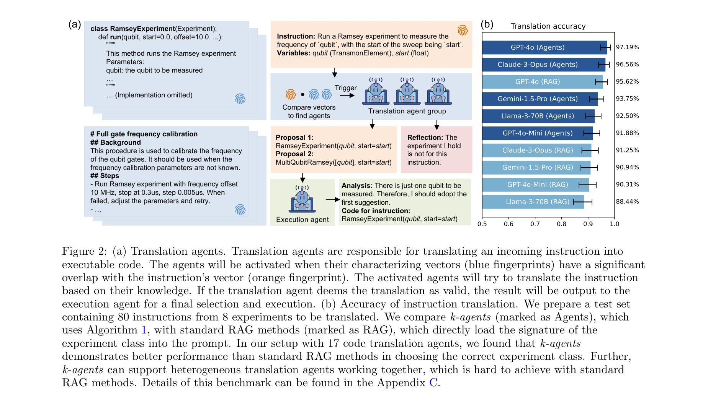

# Agents for self-driving laboratories applied to quantum computing

> **저자**: Shuxiang Cao, Zijian Zhang, Mohammed Alghadeer, Simone D Fasciati, Michèle Piscitelli, Mustafa Bakr, Peter Leek, Alán Aspuru‐Guzik | **날짜**: 2024 | **DOI**: N/A

---

## Essence

*k-agents 프레임워크 개요: 자연언어로 된 절차를 실행 에이전트(execution agent)가 에이전트 기반 상태 머신으로 분해하여 실행*

본 연구는 대규모 멀티모달 실험실 지식과 복잡한 워크플로우를 자동화하기 위해 LLM 기반 에이전트 시스템인 k-agents를 개발했다. 초전도 양자 프로세서의 캘리브레이션과 얽힌 양자상태 생성을 통해 인간 수준의 자동화 성능을 입증했다.

## Motivation

- **Known**: 실험실 자동화는 반복적 작업을 줄여 과학 발견을 가속화할 수 있으며, LLM과 멀티에이전트 시스템의 발전으로 실험 자동화 가능성이 높아지고 있음

- **Gap**: 기존 LLM 기반 자동화 시스템은 다음과 같은 문제점 존재:
  - 독점 실험실 지식(proprietary code/documents)이 LLM 훈련 데이터에 포함되지 않음
  - 동적으로 변화하는 실험실 지식을 fine-tuning으로 반영하기 어려움
  - 표준 RAG(Retrieval-Augmented Generation) 방법은 이질적 멀티모달 지식 처리에 부적합
  - 기존 시스템은 스칼러빌리티 부족 및 긴 문맥 처리에서 성능 저하

- **Why**: 초전도 양자 컴퓨팅은 수백 개의 큐빗 캘리브레이션 필요로 자동화가 시급하며, 복잡한 멀티스텝 실험 절차 자동화 필요

- **Approach**: 
  - 지식 에이전트(knowledge agents)로 실험실 지식 관리
  - 실행 에이전트(execution agent)로 멀티스텝 절차를 에이전트 기반 상태 머신으로 분해
  - 검사 에이전트(inspection agents)로 실험 결과 분석
  - 폐쇄루프 피드백 제어(closed-loop feedback control) 구현

## Achievement

*번역 에이전트 그룹: 특성 벡터(characterizing vectors) 유사성을 통해 활성화되는 에이전트들이 명령어를 실행 가능한 코드로 번역*

1. **k-agents 프레임워크 개발**: 표준 RAG 방법 대비 명령어 번역 정확도 향상 (80개 테스트 명령어, 17개 코드 번역 에이전트로 평가), 이질적 번역 에이전트 협력 지원

2. **양자 프로세서 자동화 성공**: 
   - 단일 큐빗 파라미터 캘리브레이션 자동 실행
   - 2-큐빗 게이트 파라미터 탐색 수행
   - GHZ 상태(3-큐빗 얽힘 상태) 자동 생성 및 특성화
   - 인간 과학자 수준의 성능으로 수 시간 자율 실험 계획 및 실행

3. **확장 가능한 시스템 아키텍처**: 장시간 실험 수행 가능 (제한된 문맥 길이 극복), 시각적 검사 에이전트 추가 가능

## How

*(a) k-agents 프레임워크 구조: 자연언어 절차 → 실행 에이전트 → 상태 머신 분해 → 번역/검사 에이전트 협력*

**시스템 구조**:

1. **실행 에이전트 (Execution Agent)**
   - 자연언어 절차를 에이전트 기반 상태 머신으로 분해
   - 각 실험 단계마다 독립적인 명령어 생성
   - 검사 에이전트 결과 기반으로 상태 전이 결정
   - 폐쇄루프 피드백을 통한 조건부 재시도 로직 구현

2. **번역 에이전트 (Translation Agents)**
   - 명령어를 실행 가능한 코드 또는 하위 절차로 변환
   - 특성 벡터(characterizing vector)를 통한 선택적 활성화
   - 벡터 유사성으로 관련 에이전트만 호출 (스칼러빌리티 개선)
   - 실행 에이전트가 다중 번역안 중 최적 선택

3. **검사 에이전트 (Inspection Agents)**
   - 실험 결과를 텍스트 리포트로 변환
   - 파이썬 데코레이터(decorator) 방식으로 실험 함수에 부착
   - 그래프/시각적 데이터 분석 수행

4. **에이전트 기반 상태 머신**
   - 전통적 상태 머신과 달리 에이전트가 상태 전이 결정
   - 실험 이력 최소화로 문맥 길이 제약 극복
   - 각 단계 독립 처리로 장시간 실험 가능

**프롬팅 전략**:
- 에이전트별 독립된 문맥(distinct context)으로 프롬팅
- 구체적 prompt 구성 세부사항은 Appendix B 참조

## Originality

- **멀티모달 이질적 지식 관리**: 표준 RAG 방법 대신 선택적 에이전트 활성화로 이질적 실험실 지식 통합 (특성 벡터 기반 매칭)

- **에이전트 기반 상태 머신**: rigid deterministic rules 대신 에이전트가 동적으로 상태 전이 결정 → 장시간 실험 자동화 가능

- **스칼러블 지식 에이전트 시스템**: Fine-tuning 없이 새로운 지식 에이전트 추가 가능, 에이전트 수 증가 시에도 효율적 확장

- **양자 컴퓨팅 응용**: 자동화의 높은 요구도가 있는 초전도 양자 프로세서 캘리브레이션에 실제 적용하여 검증

- **Knowledge transfer 강조**: 에이전트의 지식 수용 및 전달 능력을 직접 측정하여 시스템 신뢰성 개선

## Limitation & Further Study

**한계**:
- 공개 LLM의 문맥 길이 제약으로 인한 단계별 절차 분해 필요성 (문맥 길이 증가에 따른 성능 저하)
- 80개 명령어 테스트셋은 상대적으로 소규모로, 대규모 실험실 자동화 검증 필요
- 실험 실패 시 자동 재설계 로직의 제한 (현재는 파라미터 조정 후 재시도)
- 프로프라이터리 실험실 지식 접근의 어려움 (데이터 보안 이슈)

**후속 연구**:
- 더 큰 규모의 양자 프로세서 (수백 큐빗) 자동화 확대 적용
- 다른 과학 분야(화학, 재료과학)로의 프레임워크 일반화
- 에이전트 간 협력 메커니즘 고도화 (현재는 계층적 조정)
- 비정상 상황 탐지 및 자동 대응 능력 강화
- 시각적/수치적 데이터 해석 능력 개선

## Evaluation

- **Novelty**: 4.5/5
  - 에이전트 기반 상태 머신 개념은 신선하고, 멀티모달 이질적 지식 관리를 위한 선택적 활성화 전략 창의적
  - 다만 LLM 기반 실험 자동화 자체는 기존 연구 존재

- **Technical Soundness**: 4/5
  - 아키텍처 설계 논리적이고, 양자 실험 결과로 검증됨
  - 특성 벡터 기반 에이전트 선택은 구체적 설명 부족, 벡터 생성 방식 및 유사도 임계값 설정 기준 불명확

- **Significance**: 4.5/5
  - 양자 컴퓨팅 분야에서 실제적 가치 높음 (큐빗 스케일 증가에 따른 캘리브레이션 병목)
  - 프레임워크의 일반화 가능성 시사하나, 다른 분야 검증 부족
  - 자율 실험실(self-driving lab) 연구의 중요한 진전

- **Clarity**: 4/5
  - 전체 구조 및 주요 개념 명확하게 설명
  - 일부 기술 세부사항(특히 벡터 유사도 계산, 프롬핑 템플릿)은 부록 참조로 인해 본문에서 불충분

- **Overall**: 4.2/5

**총평**: 본 논문은 LLM 기반 에이전트를 실제 양자 실험실 자동화에 성공적으로 적용한 의미 있는 연구로, 에이전트 기반 상태 머신과 선택적 활성화 에이전트 시스템은 기술적 기여도가 높다. 다만 평가 규모 확대 및 타 분야 일반화 검증이 필요하다.

## Related Papers

- 🔄 다른 접근: [[papers/111_AtomAgents_Alloy_design_and_discovery_through_physics-aware/review]] — 동일한 다중 에이전트 자동화 접근법을 다른 물리 시스템(양자 vs 합금)에 적용하여 방법론의 일반성을 보입니다.
- 🏛 기반 연구: [[papers/139_Autonomous_microscopy_experiments_through_large_language_mod/review]] — 현미경 실험 자동화의 기초적 연구로서 양자 컴퓨팅 실험 자동화의 방법론적 토대를 제공합니다.
- 🔗 후속 연구: [[papers/432_Intelligent_experiments_through_real-time_ai_Fast_data_proce/review]] — 실시간 AI 기반 실험 제어를 양자 시스템으로 확장하여 더 복잡한 자동화를 구현합니다.
- 🔄 다른 접근: [[papers/111_AtomAgents_Alloy_design_and_discovery_through_physics-aware/review]] — 물리 기반 다중 에이전트 시스템을 다른 도메인(합금 vs 양자)에 적용하여 방법론의 범용성을 확인합니다.
- 🔗 후속 연구: [[papers/139_Autonomous_microscopy_experiments_through_large_language_mod/review]] — 기본적인 현미경 실험 자동화를 양자 컴퓨팅이라는 더 복잡한 실험 환경으로 발전시킵니다.
- 🔄 다른 접근: [[papers/432_Intelligent_experiments_through_real-time_ai_Fast_data_proce/review]] — 실시간 AI 기반 실험 제어라는 동일한 개념을 다른 물리 시스템(핵물리 vs 양자)에 적용합니다.
- 🔄 다른 접근: [[papers/133_Automating_quantum_computing_laboratory_experiments_with_an/review]] — 양자 컴퓨팅 실험실 자동화에서 에이전트 기반 접근법과 LLM 기반 접근법을 비교할 수 있습니다.
- 🏛 기반 연구: [[papers/816_Toward_a_Fully_Autonomous_AI-Native_Particle_Accelerator/review]] — 양자 컴퓨팅에 적용된 자율 실험실용 에이전트 연구는 AI 기반 입자 가속기 자율 운영의 기술적 선례를 제공한다.
- 🧪 응용 사례: [[papers/1125_Accelerating_cell_culture_media_development_using_Bayesian_o/review]] — 자율주행 실험실의 AI 에이전트는 세포 배양 배지 개발의 베이지안 최적화 과정을 완전 자동화된 실험 시스템으로 구현할 수 있다.
