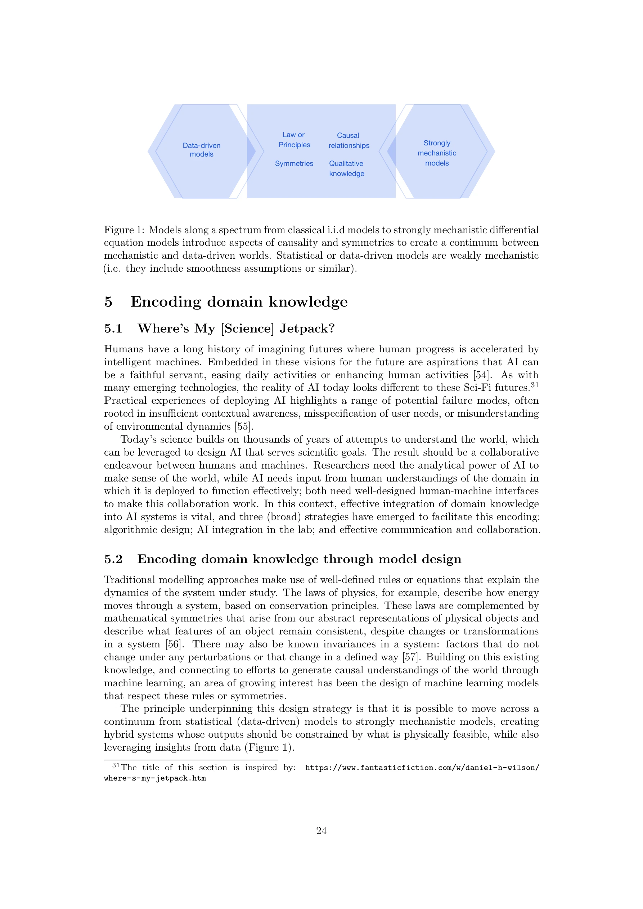
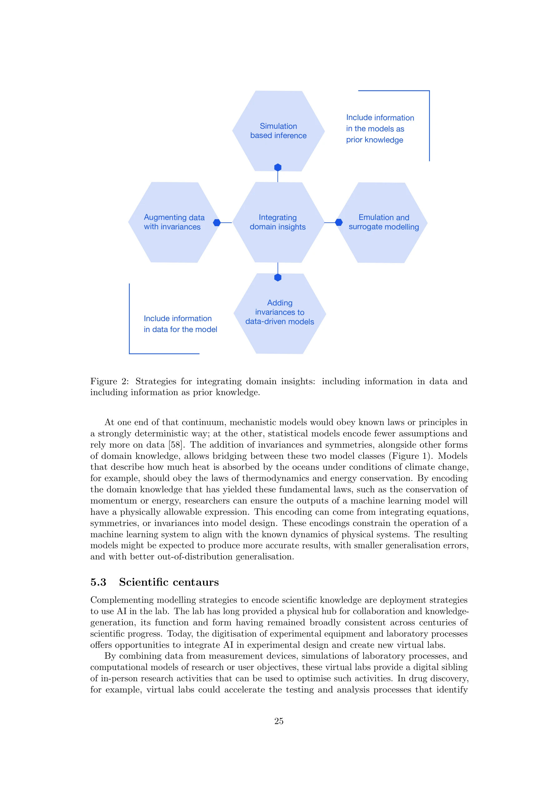

# AI for Science: An Emerging Agenda

> **저자**: Philipp Berens, Kyle Cranmer, Neil D. Lawrence, Ulrike von Luxburg, Jessica Montgomery | **날짜**: 2023-03-07 | **DOI**: [10.48550/arXiv.2303.04217](https://doi.org/10.48550/arXiv.2303.04217)

---

## Essence

*Figure 1: Models along a spectrum from classical i.i.d models to strongly mechanistic differential*

본 보고서는 Dagstuhl Seminar 22382의 결과물로서, 데이터 기반 모델링과 기계론적 모델링을 통합하여 복잡한 과학 문제 해결을 위한 AI 활용 방안을 제시한다. AI for Science를 학제간 협력의 중심점으로 정의하고, 기술 개발부터 커뮤니티 구축까지의 로드맵을 제안한다.

## Motivation

- **Known**: AI와 Machine Learning (머신러닝)은 이미 기후과학, 천체물리학, 신경과학 등 다양한 분야에서 성공적으로 적용되고 있다. 데이터의 급격한 증가와 고도화된 수집 도구는 과학 연구에 새로운 기회를 제공하고 있다.
- **Gap**: 현재의 AI 모델들은 데이터 기반 학습과 메커니즘 기반 지식을 충분히 통합하지 못하고 있으며, 도메인 전문가와 머신러닝 연구자 간의 협력 체계가 부재하다. AI for Science가 독립적 분야로 확립될 필요성과 이를 위한 구체적인 협력 전략이 미흡하다.
- **Why**: 21세기의 복잡한 과학 문제(기후변화, 질병 진단, 자원 관리 등)를 해결하기 위해서는 학제간 AI 접근이 필수적이다. 체계적인 협력 없이는 AI의 변혁적 잠재력을 완전히 발현할 수 없다.
- **Approach**: Dagstuhl Seminar에서 다양한 분야의 전문가들이 모여 AI for Science의 기술적, 조직적, 인적 과제를 논의했다. 데이터 기반과 메커니즘 기반 모델링의 스펙트럼을 분석하고, 이들의 통합 방안을 모색했다.

## Achievement

*Figure 2: Strategies for integrating domain insights: including information in data and*

- **다학제 성공 사례의 체계적 정리**: 지구과학, 농업과학, 천체물리학, 발달생물학, 신경과학 등 6개 이상의 분야에서 AI 적용의 성공 사례를 문서화하고 일반화 가능한 인사이트 도출
- **AI for Science 로드맵 제시**: 기술 발전, 사용자 친화적 툴킷 개발, 인력 양성, 커뮤니티 구축의 4대 추진 전략 제안
- **모델링 스펙트럼 프레임워크**: 고전적 i.i.d 모델에서 강한 메커니즘 모델까지의 연속체를 제시하여 다양한 과학 문제에 적합한 접근법 선택 가능성 제공
- **도메인 통합 전략**: 데이터에 도메인 지식을 포함시키는 여러 전략(구조화된 입력, 물리 기반 손실함수, 귀납 편향 등)을 분류 및 분석

## How

- 현재 과학 분야에서의 AI 적용 사례를 신경과학, 기후과학, 천체물리학 등에서 수집하고 분석
- 데이터 기반 머신러닝과 물리 기반 모델링의 장단점을 비교 검토
- 도메인 전문가, 머신러닝 연구자, 소프트웨어 엔지니어, 시민 과학자 간의 협력 필요성을 강조
- 기술, 도구, 인력, 커뮤니티 수준에서의 체계적 개선안 제시
- 학제간 협력을 위한 구체적 실행 전략(기술 개발, 사용자 친화적 인터페이스, 소프트웨어 공학 베스트 프랙티스) 개발

## Originality

- AI for Science를 단순한 기술 적용이 아닌 '만남의 장(rendezvous point)'으로 개념화하여 학제간 협력의 가치를 강조", '데이터 기반 vs 메커니즘 기반 모델링의 이분법을 넘어 스펙트럼 기반의 통합 틀 제시
- 기술 혁신뿐 아니라 커뮤니티 구축, 인력 양성, 소프트웨어 엔지니어링을 함께 강조하는 포괄적 로드맵
- 도메인 지식을 AI 모델에 통합하는 다양한 전략들을 체계적으로 분류 및 분석

## Limitation & Further Study

- 정성적 로드맵 제시에 그쳐 구체적인 구현 방안이나 성공 메트릭이 미흡함
- 각 과학 분야별로 AI 적용의 구체적인 장애물과 해결책이 충분히 심화 분석되지 않음
- AI for Science 커뮤니티 구축을 위한 자금 조달, 제도적 지원, 인센티브 구조에 대한 구체적 제안 부재
- 윤리, 공정성(fairness), 설명가능성(interpretability) 등 AI의 책임 있는 사용에 대한 논의 부족
- 후속 연구로서 각 로드맵 항목별 상세한 실행 계획 수립, 성공 사례의 정량적 평가, 장기 영향 평가 필요

## Evaluation

- Novelty: 3/5
- Technical Soundness: 3/5
- Significance: 4/5
- Clarity: 4/5
- Overall: 4/5

**총평**: 본 보고서는 AI for Science라는 신흥 분야를 정의하고 학제간 협력의 중요성을 설득력 있게 제시한 전략적 문서이다. 다양한 성공 사례와 명확한 로드맵을 통해 정책입안자와 연구자들에게 실질적 지침을 제공하나, 구체적 구현 방안과 평가 체계의 강화가 필요하다.

## Related Papers

- 🧪 응용 사례: [[papers/795_The_AI_Scientist_Towards_Fully_Automated_Open-Ended_Scientif/review]] — AI for Science 로드맵을 실제 자동화된 과학 발견 시스템으로 구현한 사례
- 🔗 후속 연구: [[papers/834_Towards_Scientific_Discovery_with_Generative_AI_Progress_Opp/review]] — 과학 발견에서 생성형 AI 활용의 진전과 기회를 구체적으로 분석
- 🏛 기반 연구: [[papers/575_Nobel_Turing_Challenge_creating_the_engine_for_scientific_di/review]] — 과학적 발견 엔진 구축의 이론적 토대를 제공하는 노벨 튜링 챌린지
- 🔄 다른 접근: [[papers/857_Unlocking_the_Potential_of_AI_Researchers_in_Scientific_Disc/review]] — AI for Science의 새로운 아젠다가 AI 연구자 활용에 대한 다른 관점을 제시한다.
