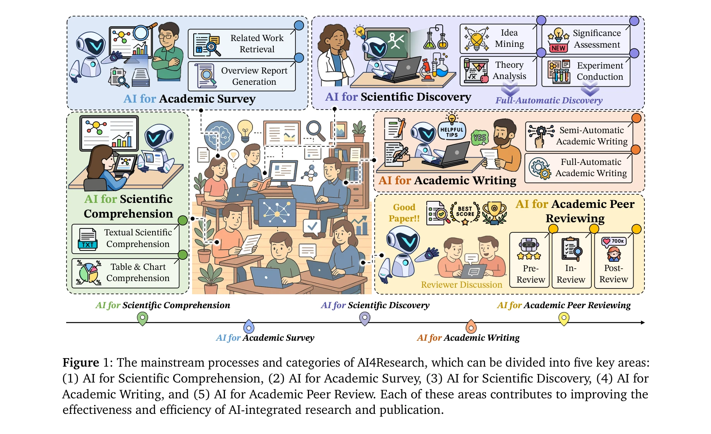
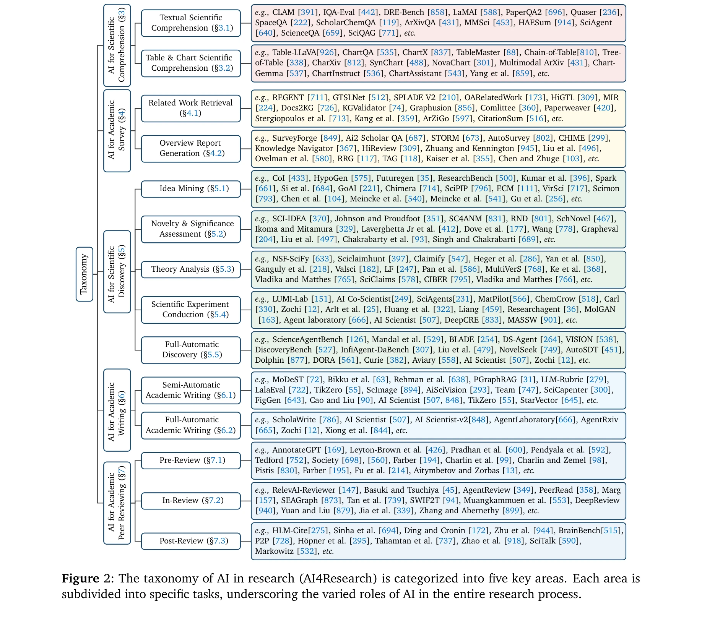
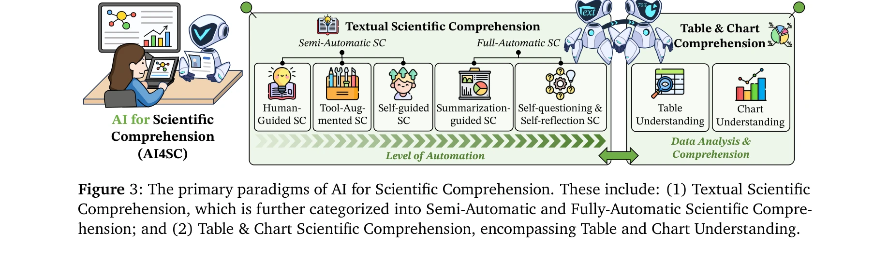

# AI4Research: A Survey of Artificial Intelligence for Scientific Research

> **저자**: Qiguang Chen, Mingda Yang, Libo Qin, Jinhao Liu, Zheng Yan, Jiannan Guan, Dengyun Peng, Yiyan Ji, Hanjing Li, Mengkang Hu, Yimeng Zhang, Yihao Liang, Yuhang Zhou, Jiaqi Wang, Zhi Chen, Wanxiang Che | **날짜**: 2025-07-02 | **DOI**: [10.48550/arXiv.2507.01903](https://doi.org/10.48550/arXiv.2507.01903)

---

## Essence

*그림 1: AI4Research의 주요 프로세스와 범주 - 5가지 핵심 영역: (1) 과학 이해도 (Scientific Comprehension), (2) 학술 조사 (Academic Survey), (3) 과학적 발견 (Scientific Discovery), (4) 학술 저술 (Academic Writing), (5) 학술 동료평가 (Academic Peer Review)*

본 논문은 대규모 언어모델(LLM) 발전에 따라 과학 연구 전 과정을 자동화하는 AI 기술의 현황을 포괄적으로 조사한 첫 번째 통합 서베이 논문이다. 과학 이해, 문헌 조사, 가설 생성, 논문 작성, 동료평가 등 5가지 주요 영역으로 AI4Research를 체계적으로 분류하고 자원을 통합한다.

## Motivation

- **Known**: OpenAI-o1, DeepSeek-R1 등 최신 LLM이 논리적 추론, 실험 코딩 등 복잡한 작업에서 우수한 성능을 보임. AI Scientist, Carl, AgentArxiv 등 개별 자동화 연구 시스템이 등장.

- **Gap**: AI를 활용한 연구 자동화(AI4Research)에 대한 포괄적 서베이 부재로 이 분야의 발전이 저해되고 있음.

- **Why**: 과학 연구의 각 단계(이해→조사→발견→저술→평가)를 종합적으로 다루는 통일된 관점의 부재로 인해 체계적 이해와 리소스 접근이 어려움.

- **Approach**: 5가지 AI4Research 영역을 체계적으로 분류하고, 연구 격차와 미래 방향을 식별하며, 다학제적 응용, 데이터 코퍼스, 도구 등의 리소스를 통합 제공.

## Achievement

*그림 2: AI4Research의 5가지 핵심 영역과 각각의 세부 구성 요소*

1. **체계적 분류 체계**: AI4Research를 5가지 주류 작업으로 분류하는 처음의 포괄적 분류 체계 제시
   - 과학 이해도 (Textual/Table·Chart comprehension)
   - 학술 조사 (Related work retrieval, Overview report generation)
   - 과학적 발견 (Idea mining, Novelty assessment, Theory analysis, Experiment conduction)
   - 학술 저술 (Semi/Full-automatic writing)
   - 학술 동료평가 (Pre/In/Post-review stages)

2. **미래 방향 제시**: 자동화 실험의 엄밀성(rigor)과 확장성(scalability), 사회적 영향에 초점을 맞춘 7가지 주요 연구 격차 도출

3. **종합적 리소스**: 8개 과학 분야(물리, 생물, 화학, 로봇, 소프트웨어공학, 사회학, 심리학 등)의 다학제적 응용 사례, 벤치마크 데이터셋, 오픈소스 도구 통합 컴파일

## How

*그림 3: AI를 이용한 과학 이해도의 주요 패러다임 - 텍스트 이해와 시각화 자료(표, 차트) 이해*

**과학 이해도 (Scientific Comprehension)**
- 반자동 과학 이해: 명시적 마크업/주석을 통한 정보 추출
- 전자동 과학 이해: LLM 기반 엔드투엔드 이해
- 표·차트 이해: 구조화된 데이터와 시각화의 의미 파악

**학술 조사 (Academic Survey)**
- 관련 연구 검색: 관련 논문의 효율적 검색 및 순위 매김
- 개요 보고서 생성: 연구 로드맵 매핑, 섹션/문서 수준의 자동 생성

**과학적 발견 (Scientific Discovery)**
- 아이디어 마이닝: 내부 지식/외부 신호/팀 토론으로부터 가설 생성
- 참신성/중요도 평가: 아이디어의 학술적 가치 판단
- 이론 분석: 과학 주장 형식화, 증거 수집, 검증 분석, 정리 증명
- 실험 수행: 실험 설계→사전 예측→관리→실행→분석의 완전 자동화
- 전자동 발견: 인간 개입 없이 완전 자동화된 연구 사이클

**학술 저술 (Academic Writing)**
- 반자동: 원고 준비(abstract generation), 작성 지원(idea-to-text), 완성 후 지원(polishing)
- 전자동: LLM 기반 논문 전체 생성

**학술 동료평가 (Academic Peer Review)**
- Pre-review: Desk review(자동 거절), Reviewer matching
- In-review: Peer review 자동화, Meta-review 생성
- Post-review: 영향력 분석, 홍보 강화

## Originality

- **최초의 통합 서베이**: AI4Research에 대한 첫 번째 포괄적 서베이로, 산발적이던 연구를 5가지 핵심 영역으로 체계화

- **AI4Science와의 명확한 구분**: AI4Science(과학 자체의 발전을 위한 AI)와 AI4Research(연구 수행 과정의 자동화)를 명확히 구분하여 개념 정립

- **다학제적 응용 통합**: 자연과학, 응용과학, 사회과학 등 8개 분야의 구체적 응용 사례 제시

- **실용적 리소스 통합**: 벤치마크 데이터셋, 평가 지표, 오픈소스 도구 등 250+ 항목의 리소스를 동반하는 Living Survey 제공

- **미래 지향적 문제 제시**: 학제 간 AI 모델, 윤리·안전성, 협업 연구, 설명가능성, 실시간 최적화, 멀티모달·다언어 통합 등 7가지 미래 연구 방향 식별

## Limitation & Further Study

**한계점**
- 아직 초기 단계의 기술이 많아 성숙도 평가의 어려움
- 자동화 실험의 엄밀성(실험 설계, 통계적 유의성) 검증 부족
- 다양한 학문 분야의 구체적 구현에 대한 심층 분석 제한
- 인간 연구자와의 협업 수준에 대한 실증적 평가 미흡

**후속 연구 방향**
- 학제 간 지식을 통합하는 멀티도메인 AI 모델 개발
- AI 시스템의 편향(bias)과 윤리 문제에 대한 체계적 연구
- 자동화된 과학 실험의 신뢰성 검증 및 리프로덕션 크라이시스 해결
- 인간-AI 협업 연구팀의 효율성 측정 프레임워크
- 실시간 피드백을 통한 동적 실험 최적화 시스템
- 이미지·테이블·코드 등 멀티모달 데이터 통합 처리
- 비영어권 과학 문헌의 다언어 처리 확대

## Evaluation

- **Novelty (독창성)**: 4.5/5
  - AI4Research에 대한 최초의 체계적 분류 제시, 하지만 개별 기술은 기존 연구의 통합

- **Technical Soundness (기술 타당성)**: 4/5
  - 분류 체계는 논리적이나 자동화 실험의 엄밀성 검증이 부분적으로 미흡

- **Significance (중요도)**: 4.5/5
  - 학술 공동체의 중요한 갭을 메우며 AI 활용 연구의 가속화를 가능하게 함

- **Clarity (명확성)**: 4.5/5
  - 5가지 영역의 분류와 Figure를 통한 시각화가 우수하나 섹션 간 상호 연계성 설명이 다소 부족

- **Overall (종합)**: 4.3/5

**총평**: 본 논문은 급속도로 발전하는 AI 기반 연구 자동화 분야에 대한 첫 번째 포괄적 로드맵을 제시하는 중요한 기여로, 체계적 분류, 미래 방향 제시, 실용적 리소스 통합을 통해 학술 공동체에 즉시적 가치를 제공한다. 다만 아직 초기 단계의 기술이 많고 자동화 실험의 신뢰성 검증이 심화되어야 할 과제이다.

## Related Papers

- 🏛 기반 연구: [[papers/718_Scientific_discovery_in_the_age_of_artificial_intelligence/review]] — AI 시대 과학 발견의 전반적 맥락을 제공하여 AI4Research의 이론적 토대를 구성한다
- 🔄 다른 접근: [[papers/840_Transforming_Science_with_Large_Language_Models_A_Survey_on/review]] — 과학 연구에서 대규모 언어모델의 역할을 다른 관점에서 체계화하고 분류한다
- 🧪 응용 사례: [[papers/086_AI-Researcher_Autonomous_Scientific_Innovation/review]] — 자율적 과학 혁신 연구의 구체적 사례로서 AI4Research 프레임워크의 실제 적용을 보여준다
- 🔗 후속 연구: [[papers/824_Towards_AI_for_science_developing_a_conceptual_basis_for_tra/review]] — 과학 연구를 위한 AI 조사가 도서관의 AI4S 서비스 모델 개발을 확장한다.
- 🧪 응용 사례: [[papers/137_Autonomous_Agents_for_Scientific_Discovery_Orchestrating_Sci/review]] — 과학 발견 자동화의 구체적 구현체로서 AI4Research 프레임워크의 실제 적용 사례를 보여준다
- 🔄 다른 접근: [[papers/377_Generative_AI_and_the_Foundation_Model_Era_A_Comprehensive_R/review]] — AI 기술의 과학 연구 적용을 생성형 AI 관점과 연구 과정 자동화 관점에서 다르게 체계화한다
- 🏛 기반 연구: [[papers/475_Large_language_models_meet_nlp_A_survey/review]] — NLP 분야에서 LLM의 포괄적 적용이 AI4Research의 자연언어처리 기술 기반을 제공한다
- 🏛 기반 연구: [[papers/834_Towards_Scientific_Discovery_with_Generative_AI_Progress_Opp/review]] — 과학 연구를 위한 AI 시스템의 전반적 프레임워크와 방법론적 기반을 제공한다
