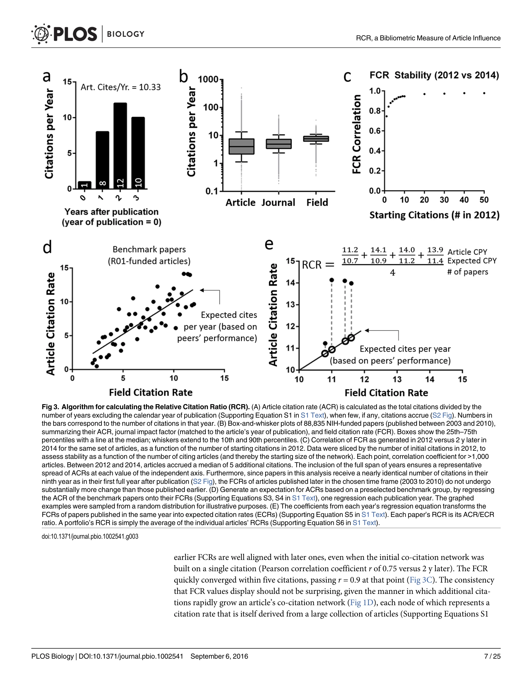
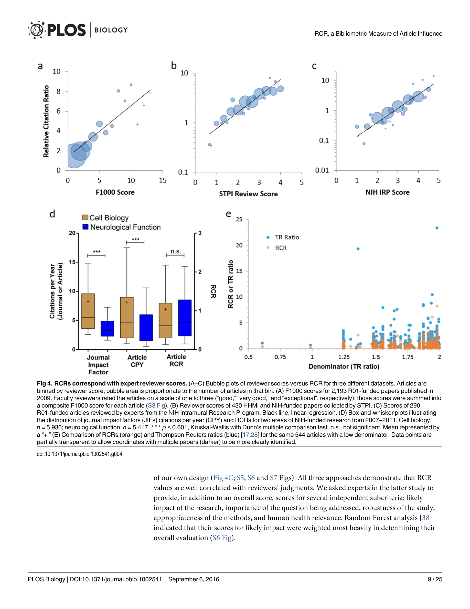

# Relative Citation Ratio: A New Metric That Uses Citation Rates to Measure Influence at the Article Level

> **저자**: B. Ian Hutchins, Xin Yuan, James M. Anderson, George M. Santangelo | **날짜**: 2016 | **DOI**: [10.1371/journal.pbio.1002541](https://doi.org/10.1371/journal.pbio.1002541)

---

## Essence

*Fig 3. Algorithm for calculating the Relative Citation Ratio (RCR). (A) Article citation rate (ACR) is calculated as the*

논문은 공동인용 네트워크(co-citation network)를 활용하여 학문 분야를 정규화한 상대인용비율(RCR: Relative Citation Ratio)이라는 새로운 논문 영향력 측정 지표를 제안한다. 기존의 저널임팩트팩터(JIF)와 h-지수의 한계를 극복하기 위해 개별 논문 수준에서 인용 영향력을 측정할 수 있는 방법론을 제시한다.

## Motivation

- **Known**: 학술지 출판 및 인용 계량학(bibliometrics)은 연구 영향력 평가에 광범위하게 사용되고 있으나, 저널임팩트팩터와 h-지수 등 기존 지표들의 심각한 한계가 인정되고 있다. 이들 지표는 분야 간 편향, 게재 위치에 따른 왜곡, 협력 과학의 저평가 등의 문제를 가지고 있다.
- **Gap**: 기존 인용 정규화 방법들(journal-level normalization, citation percentiles, source normalization 등)은 이론적 이해는 높이지만 광범위한 채택이 이루어지지 않고 있다. 실무적으로 투명하고 자유롭게 접근 가능하며, 동료 비교 그룹을 기준으로 해석 가능한 통합적 벤치마킹 기능을 갖춘 지표가 부재하다.
- **Why**: 연구비 지원 기관과 채용 위원회는 수천 개의 경쟁 지원자 중에서 과학적 성공 가능성을 판단해야 하며, 신뢰성 있는 데이터 기반의 정규화된 지표는 암묵적 편향 완화와 다학제 연구 평가에 필수적이다.
- **Approach**: 각 논문의 공동인용 네트워크(함께 인용되는 논문들)를 활용하여 해당 분야의 기대 인용율(ECR: Expected Citation Rate)을 산출하고, 실제 인용율(ACR: Article Citation Rate)을 이로 정규화하는 방식으로 RCR을 계산한다. 특정 동료 비교 그룹에 대한 벤치마킹 기능을 포함한다.

## Achievement

*Fig 4. RCRs correspond with expert reviewer scores. (A–C) Bubble plots of reviewer scores versus RCR for three different*

- **공동인용 네트워크 기반 분야 정규화**: 논문이 함께 인용되는 다른 논문들의 네트워크를 분석하여 학문 분야를 정확하게 식별하고, 해당 분야의 인용 행동을 반영한 정규화를 수행
- **개별 논문 수준의 측정**: 저널단위가 아닌 논문 수준에서 영향력을 평가함으로써 같은 저널 내 논문들 간의 큰 인용 차이를 포착
- **동료 비교 그룹 벤치마킹**: 교육 중심 기관, 개발도상국 등 동일한 맥락의 연구기관/국가 간 공정한 비교를 가능하게 하는 통합적 벤치마킹 기능 구현
- **전문가 의견과의 상관성 검증**: 88,835개 논문(2003-2010년 발표) 분석을 통해 RCR 값이 생의학 분야 주제 전문가 평가와 강한 상관관계를 보임을 입증
- **공개적 웹 도구 제공**: PubMed 논문의 RCR을 계산하고 관련 지표에 접근할 수 있는 무료 iCite 웹 도구(https://icite.od.nih.gov) 개발 및 공개

## How

*Fig 3. Algorithm for calculating the Relative Citation Ratio (RCR). (A) Article citation rate (ACR) is calculated as the*

- 각 논문의 참고문헌 목록에서 공동인용 관계를 분석하여 해당 논문이 속한 주제 영역을 정의하는 공동인용 네트워크 구축
- 같은 네트워크에 속한 논문들의 인용 분포를 분석하여 기대 인용율(ECR) 산출
- 발표 이후 경과 시간을 고려한 시간 정규화(예: citations per year) 적용
- 실제 인용율(ACR)을 기대 인용율(ECR)로 나누어 RCR 계산 (RCR = ACR / ECR)
- 선택 가능한 동료 비교 그룹(peer comparison group)을 설정하여 상대적 성과 평가
- 전문가 평가(NIH 동료 심사 점수) 데이터와의 상관성 분석을 통한 타당성 검증
- 정량적 방법론(회귀분석, 분위수 회귀)을 활용한 통계적 검증

## Originality

- 공동인용 네트워크를 인용 정규화의 기준으로 사용하는 혁신적 접근: 기존의 저널 카테고리나 주제 분류 시스템이 아닌, 실제 인용 행동 데이터를 기반으로 한 동적 분야 정의
- Relative Citation Rate'라는 동명의 기존 방법과 구별되는 새로운 방법론: 공동인용 네트워크의 위상적(topological) 특성을 활용한 독창적 계산 방식", '벤치마킹 기능의 혁신: 동료 비교 그룹의 성과에 대한 상대적 위치를 제시함으로써 맥락적 해석을 가능하게 한 첫 인용 기반 지표
- 텍스트 유사성이 아닌 인용 네트워크 구조를 기반으로 한 주제 정의: TF-IDF 등 전통적 텍스트 마이닝보다 정확한 학문적 근접성 파악

## Limitation & Further Study

- **PubMed 기반 데이터의 제한**: 생의학 분야에 최적화되어 있으며, 다른 학문분야(인문학, 사회과학 등)로의 적용 시 인용 행동의 차이로 인한 문제 가능성
- **초기 논문의 편향**: 출판 초기 인용이 많은 논문은 높은 RCR을 보이는 경향이 있어, 최근 발표 논문의 평가에 부정적 편향 존재 가능
- **공동인용 네트워크의 불완성**: 매우 새로운 논문이나 매우 전문화된 논문의 경우 공동인용 네트워크가 충분하지 않을 수 있음
- **자기인용(self-citation)의 처리**: 논문에서 언급되지 않았으며, 저자들의 자기인용이 RCR에 미치는 영향 분석 필요
- **후속 연구 방향**: (1) 다른 학문분야(물리학, 화학, 사회과학 등)에서의 RCR 타당성 검증, (2) 공동인용 네트워크 크기와 RCR 안정성 간의 관계 분석, (3) 자기인용 및 특정 인용 편향에 대한 민감도 분석, (4) 시간의 흐름에 따른 RCR의 변동성 연구

## Evaluation

- Novelty: 4/5
- Technical Soundness: 3/5
- Significance: 4/5
- Clarity: 4/5
- Overall: 4/5

**총평**: 본 논문은 공동인용 네트워크라는 혁신적 개념을 활용하여 분야 정규화와 벤치마킹을 동시에 해결하는 새로운 인용 지표를 제시함으로써, 오랫동안 문제시되어온 저널임팩트팩터의 오용을 실질적으로 극복할 수 있는 대안을 제공한다. 전문가 의견과의 강한 상관성 검증과 공개 웹 도구 제공을 통해 학술계의 광범위한 채택 가능성을 높였다.

## Related Papers

- ⚖️ 반론/비판: [[papers/1122_The_disruption_index_suffers_from_citation_inflation_Re-anal/review]] — 인용 기반 지표들이 공통적으로 겪는 인용 인플레이션 문제를 보여주며 RCR 지표의 한계를 지적한다.
- 🏛 기반 연구: [[papers/1049_Universality_of_citation_distributions_Toward_an_objective_m/review]] — 인용 분포의 보편성에 대한 이해가 상대인용비율 지표 개발의 이론적 기반을 제공한다.
- 🔗 후속 연구: [[papers/943_Citation_Analysis_as_a_Tool_in_Journal_Evaluation/review]] — 상대 인용 비율이라는 새로운 지표 개발을 통해 전통적인 인용 분석의 한계를 극복하는 발전된 평가 도구를 제시한다.
- 🔄 다른 접근: [[papers/1047_Theory_and_Practice_of_the_g-index/review]] — g-index의 절대적 인용 집계 방식 대신 상대적 인용 비율을 통한 학문분야 간 공정한 비교 방법을 제안한다.
- 🏛 기반 연구: [[papers/1049_Universality_of_citation_distributions_Toward_an_objective_m/review]] — 학문분야 간 객관적 비교를 위한 상대적 인용 비율 계산의 이론적 기반을 제공한다.
- 🔄 다른 접근: [[papers/1003_Quantifying_Long-term_Scientific_Impact/review]] — RCR 지표를 통해 논문의 장기적 영향력을 분야별로 정규화하여 측정하는 다른 접근법을 제공한다.
- 🔗 후속 연구: [[papers/1007_Redefining_Academic_Performance_The_Development_of_the_NK_Co/review]] — 상대 인용 비율과 NK 지수를 결합하면 더 정확하고 공정한 학술 성과 평가 시스템을 구축할 수 있다.
