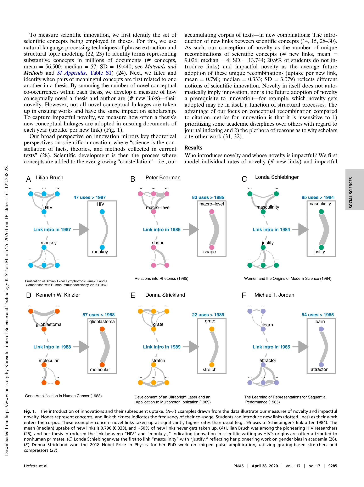
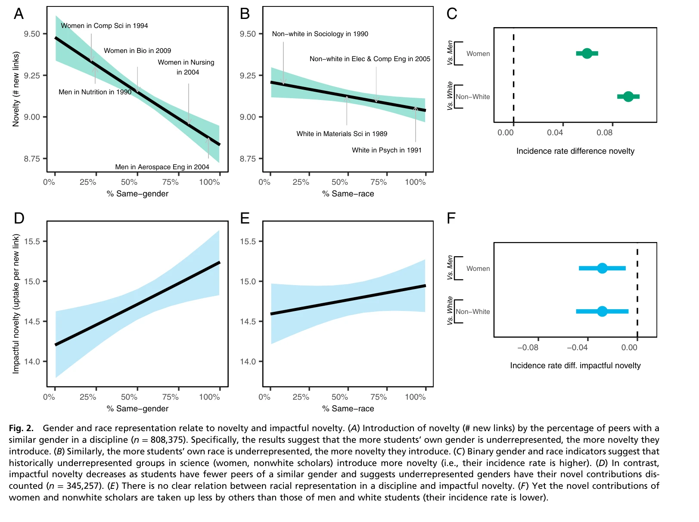

# The Diversity-Innovation Paradox in Science

> **저자**: Bas Hofstra, Vivek V. Kulkarni, Sebastian Munoz-Najar Galvez, Bryan He, Dan Jurafsky, Daniel A. McFarland | **날짜**: 2020 | **DOI**: [10.1073/pnas.1915378117](https://doi.org/10.1073/pnas.1915378117)

---

## Essence

*Fig. 1.*

과학계에서 소수집단이 다수집단보다 더 높은 혁신율을 보이지만, 그들의 혁신적 기여가 과소평가되고 학업 경력 성공으로 이어지지 않는 다양성-혁신 역설을 규명한다.

## Motivation

- **Known**: 다양성이 혁신을 유도하고 혁신이 학업 경력 성공을 가져온다는 것이 알려져 있다. 그러나 저대표 집단의 학자들이 학계에서 지속적으로 저대표되는 현상이 존재한다.
- **Gap**: 다양성-혁신 관계와 혁신-경력 성공 관계가 동시에 성립한다면, 소수집단 학자들의 경력이 왜 지속적으로 불평등한지에 대한 설명이 부족하다.
- **Why**: 학계의 구조적 불평등을 이해하고, 소수집단의 혁신이 왜 보상받지 못하는지 규명함으로써 학계의 포용성 증진을 위한 근거를 제공한다.
- **Approach**: 약 120만 명의 미국 박사학위 취득자(1977-2015)의 학위논문과 경력 데이터를 연결하여, 자연어처리(NLP)와 기계학습을 이용해 과학적 혁신을 측정하고 인구통계학적 집단별 혁신율과 그 채택률을 분석한다.

## Achievement

*Fig. 2.*

- **혁신의 정량적 측정**: 개념 쌍의 새로운 조합(# new links)과 그 채택률(uptake per new link)을 통해 과학적 혁신과 임팩트를 객관적으로 측정
- **소수집단의 높은 혁신율**: 과소대표 성별(p<0.001) 및 인종(p<0.05)의 학생들이 통념적 개념 연결을 더 많이 도입
- **혁신의 과소평가**: 소수집단의 혁신적 기여가 다른 학자들에게 더 낮은 채택률을 보이며, 동일한 임팩트의 기여도 소수집단이 학업 성공으로 이어질 가능성이 낮음
- **구조적 불평등의 증거**: 학계가 다양성의 역할을 과소평가함으로써 소수집단의 저대표 현상을 지속적으로 재생산

## How

*Fig. 1.*

- ProQuest 학위논문 데이터베이스(약 120만 건)에서 학위논문의 제목, 초록, 메타데이터 추출
- 미국 인구조사(2000, 2010)와 사회보장청 데이터(1900-2016)를 연결하여 성별과 인종 추론
- 자연어처리 기법(구문 추출, 구조적 토픽 모델링)으로 각 논문에서 과학적 개념 식별
- 개념 쌍의 동시 출현을 추적하여 새로운 개념 연결(novel conceptual co-occurrence) 감지
- Web of Science 데이터베이스와 연결하여 학자들의 향후 출판 및 학문 경력 추적
- institution, academic discipline, graduation year를 통제하여 회귀분석(regression analysis) 수행

## Originality

- 근-완전 모집단(near-complete population) 데이터로 120만 명의 박사학위 취득자 추적 - 표본 편향 최소화
- 개념적 재조합(conceptual recombination)을 혁신의 정의로 사용하여 인용지표(citation metrics)의 학문분야별 편향 극복
- 거시적(macroscopic) 과학 생태계 관점에서 개인 수준의 혁신과 사회 구조적 불평등의 연관성을 동시에 분석
- 30년 데이터, 모든 학문분야, 모든 박사학위 수여기관을 포괄하는 장기간 종단(longitudinal) 분석
- 성별과 인종 추론에 이름 신호(name signals) 활용 - 기존 설문조사 방식보다 대규모 적용 가능

## Limitation & Further Study

- 이름 기반 성별/인종 추론의 오분류 가능성 - 특히 교차성(intersectionality)과 시간변화 반영 부족
- 박사학위 취득자 중심 분석으로 학부 및 대학원 수료 후 진로 미포함
- 혁신의 채택이 순수 학문적 메커니즘만 반영하지 않을 수 있음 - 네트워크 효과, 기관 권력 등 미측정 요인 존재
- 미국 박사학위 취득자 중심으로 국제 학자 미포함 - 결과의 일반화 제한
- **후속연구**: 저채택의 명시적 메커니즘(peer review bias, citation patterns) 규명; 시간경과에 따른 혁신 가치 재평가 추적; 학문분야별 상세 분석

## Evaluation

- Novelty: 4/5
- Technical Soundness: 3/5
- Significance: 4/5
- Clarity: 4/5
- Overall: 4/5

**총평**: 이 연구는 대규모 종단 데이터와 자연어처리 기술을 결합하여 학계의 구조적 불평등을 과학적으로 규명했으며, 다양성-혁신 역설이라는 중요한 사회과학 문제에 새로운 통찰을 제공한다. 방법론의 견고성과 정책적 함의로 인해 높은 가치를 지닌 연구이다.

## Related Papers

- 🔗 후속 연구: [[papers/1035_The_Innovation_Recognition_Paradox_How_Science_Undervalues_t/review]] — 소수집단의 혁신이 과소평가되는 현상이 특히 여성의 학제간 혁신에서 더욱 두드러지게 나타나는 구체적 메커니즘을 보여준다.
- 🏛 기반 연구: [[papers/936_Atypical_Combinations_and_Scientific_Impact/review]] — 비전형적 조합이 과학적 영향을 높이지만 소수집단의 기여가 과소평가되는 역설을 설명하는 이론적 기반을 제공한다.
- 🧪 응용 사례: [[papers/981_Making_gender_diversity_work_for_scientific_discovery_and_in/review]] — 성별 다양성을 과학적 발견과 혁신에 효과적으로 활용하기 위한 구체적 방안을 다양성-혁신 역설의 관점에서 재검토할 수 있다.
- 🏛 기반 연구: [[papers/1066_Accelerating_science_with_human-aware_artificial_intelligenc/review]] — 과학에서 다양성-혁신 역설을 이해하는데 인간의 전문성을 고려한 AI 모델이 제공하는 통찰의 기반이 된다.
- ⚖️ 반론/비판: [[papers/965_Gender-diverse_teams_produce_more_novel_and_higher-impact_sc/review]] — 성별 다양성의 긍정적 효과가 다양성-혁신 역설과 어떻게 조화될 수 있는지 논의 필요
- 🏛 기반 연구: [[papers/966_Global_citation_inequality_is_on_the_rise/review]] — 과학에서 다양성과 혁신의 역설적 관계가 인용 불평등 심화와 어떻게 연결되는지 이론적 기반을 제공한다.
- 🏛 기반 연구: [[papers/1035_The_Innovation_Recognition_Paradox_How_Science_Undervalues_t/review]] — 다양성-혁신 역설의 구체적 사례로 여성의 학제간 혁신 과소평가 현상을 더 깊이 이해할 수 있는 이론적 틀을 제공한다.
- ⚖️ 반론/비판: [[papers/976_Intersectional_inequalities_in_science/review]] — 다양성과 혁신의 역설적 관계를 제시하여 교차적 다양성의 긍정적 효과에 대한 반대 시각을 제공한다
- ⚖️ 반론/비판: [[papers/1034_The_Increasing_Dominance_of_Teams_in_Production_of_Knowledge/review]] — 팀 기반 연구의 증가가 항상 긍정적이지 않을 수 있음을 다양성-혁신 패러독스를 통해 비판적으로 검토한다.
- 🔄 다른 접근: [[papers/981_Making_gender_diversity_work_for_scientific_discovery_and_in/review]] — 다양성의 혁신 효과와 다양성-혁신 역설이라는 상반된 관점을 조화시키는 이론적 틀 필요
- 🧪 응용 사례: [[papers/946_Collective_Credit_Allocation_in_Science/review]] — 집단적 신용 배분을 팀 다양성이 혁신에 미치는 역설적 영향 분석에 적용한다.
