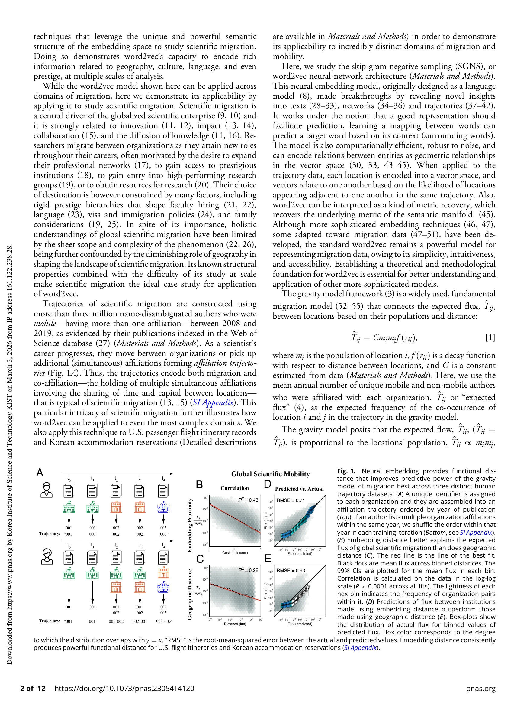

# Unsupervised embedding of trajectories captures the latent structure of scientific migration

> **저자**: Dakota Murray, Jisung Yoon, Sadamori Kojaku, Rodrigo Costas, Woo-Sung Jung, Staša Milojević, Yong-Yeol Ahn | **날짜**: 2023-12-26 | **DOI**: [10.1073/pnas.2305414120](https://doi.org/10.1073/pnas.2305414120)

---

## Essence

*Fig. 1.*

Word2vec 신경망 임베딩 모델을 이용하여 이동 궤적(migration trajectories)으로부터 지역 간의 잠재적 구조를 비지도학습으로 추출하고, 중력 모델(gravity model of mobility)과의 수학적 동치성을 증명한다. 과학자 300만 명의 이동 데이터에 적용하여 문화, 언어, 위신 등 다층적 요인을 포함한 과학 마이그레이션의 복잡한 구조를 효과적으로 인코딩할 수 있음을 보여준다.

## Motivation

- **Known**: 지리적 거리가 역사적으로 인간 이동을 제약해왔으나, 글로벌화로 언어와 문화 같은 다른 요인의 중요성이 증가하고 있다. 과학 마이그레이션은 혁신과 지식 확산을 주도하는 핵심 현상이지만, 그 복잡성으로 인해 전체적 이해가 제한되어 있다.
- **Gap**: 기존 기능거리(functional distance) 측정은 저해상도(국가 수준)이고 마이그레이션의 단일 측면만 포함하며, 단순 네트워크 방식은 복잡한 다면적 관계를 충분히 표현하지 못한다. 지리, 문화, 언어, 경제 기회 등 여러 요인을 동시에 반영하는 고차원 표현이 부재하다.
- **Why**: 마이그레이션의 복잡한 구조를 효과적으로 모델링하면 전염병, 경제, 혁신 등 주요 사회 현상을 이해할 수 있고, 분배 가능한 "디지털 더블"로서 재사용성과 활용성을 높일 수 있다. 과학 마이그레이션 특히 다층적 제약과 기회가 얽혀있어 모델 검증의 이상적 케이스다.
- **Approach**: Word2vec (Skip-Gram Negative Sampling) 모델을 궤적 데이터에 적용하되, 위치를 단어, 궤적을 문장으로 취급한다. 중력 모델의 수학적 동치성을 이론적으로 증명하고, Web of Science 데이터베이스에서 추출한 과학자 300만 명의 제휴 궤적(affiliation trajectories)으로 실증적 검증을 수행한다.

## Achievement

*Fig. 1.*

1. **중력 모델과의 수학적 동치성 증명**: Word2vec의 Skip-Gram Negative Sampling이 중력 모델 프레임워크와 수학적으로 동치임을 이론적으로 입증하여, 신경망 임베딩의 이론적 토대 확립
2. **고차원 벡터공간 표현**: 지역 간 기능거리를 정확하고 조밀하며 연속적인 벡터공간 표현으로 변환하여, 다층적 분석을 가능하게 하는 "디지털 더블" 구현
3. **다층적 요인 인코딩**: 문화, 언어, 위신 관계 등 과학 마이그레이션을 주도하는 다양한 요인을 여러 세분화 수준(granularity)에서 효과적으로 인코딩
4. **도메인 외 일반화 가능성**: 항공편 이동 기록과 숙박 예약 데이터 등 완전히 다른 도메인에 적용 가능함을 실증하여 방법론의 보편적 적용 가능성 입증

## How

*Fig. 1.*

- Web of Science 데이터베이스에서 2008-2019년 사이 3백만 명의 이름-명확화된 저자 중 이동성 있는 저자(1개 이상 제휴) 추출
- 저자의 시간 경과에 따른 제휴 변화를 궤적으로 구성(공동제휴 포함)
- Word2vec Skip-Gram Negative Sampling 모델을 궤적 데이터에 적용하여 각 위치를 벡터 임베딩
- 임베딩 벡터 간 코사인 거리를 계산하여 기능거리 도출
- 예측된 이동 플럭스와 실제 관측 플럭스를 비교하여 모델 검증
- 임베딩 공간의 의미 구조를 활용한 분석 기법(예: 유사도 계산, 관계성 추출) 적용
- 미국 항공편과 한국 숙박 데이터 등 이질적 도메인으로 교차 검증

## Originality

- **이론적 혁신**: 신경망 임베딩(Word2vec)과 전통적 이동 모델(중력 모델)의 수학적 동치성을 처음으로 엄밀히 증명하여, 깊은 학습 기반 방법론의 이론적 정당성 제시
- **방법론적 창신**: 자연언어처리 기법을 사회 과학의 마이그레이션 데이터에 창의적으로 적용하고, 단어-문맥 관계를 위치-궤적 관계로의 유추적 매핑 제시
- **데이터 규모**: 300만 명 규모의 과학자 궤적 데이터는 과학 마이그레이션 연구에서 전례 없는 스케일
- **다층적 분석**: 국가, 도시, 기관 등 여러 공간 수준에서 동시에 마이그레이션 구조를 분석 가능한 통합 프레임워크 제공

## Limitation & Further Study

- **데이터 편향**: Web of Science 기반 과학자 데이터는 영어권과 선진국 중심의 출판 데이터에 의존하여, 비영어권 및 저개발국 과학자 표현 부족
- **제휴 궤적의 복합성**: 공동 제휴(co-affiliation)와 순차적 이동(sequential migration)을 구분하지 못하여 인과관계 해석의 어려움
- **시간적 정보 손실**: 임베딩 과정에서 이동의 시간적 순서가 부분적으로만 반영되어, 시계열 역학 분석 제한
- **후속 연구**: (1) 시간 정보를 명시적으로 포함하는 동적 임베딩 모델 개발, (2) 다국어 출판 데이터 통합 및 비서구 과학 생태계 포함, (3) 개인 수준의 내재적 동기(개인적 네트워크, 가족) 데이터 통합, (4) 인과 추론 방법론 적용으로 마이그레이션 결정 요인 식별

## Evaluation

- Novelty: 4/5
- Technical Soundness: 4/5
- Significance: 4/5
- Clarity: 4/5
- Overall: 4/5

**총평**: 이 논문은 신경망 임베딩과 전통 이동 모델의 수학적 동치성을 증명하고, 대규모 과학 마이그레이션 데이터에 적용하여 방법론적 정당성과 실용적 유용성을 모두 입증한다. 이론적 깊이와 실증적 규모, 도메인 외 적용 가능성을 종합하면, 마이그레이션 연구의 패러다임 전환을 제시하는 매우 가치 있는 기여다.

## Related Papers

- 🧪 응용 사례: [[papers/967_Global_patterns_of_migration_of_scholars_with_economic_devel/review]] — 연구자 이동 궤적의 임베딩 모델을 경제 발전과 연계된 글로벌 학자 이동 패턴 분석에 직접 적용할 수 있다.
- 🏛 기반 연구: [[papers/960_Evolution_of_the_social_network_of_scientific_collaborations/review]] — 과학 협력 네트워크의 진화에 대한 기본 이해가 연구자 이동의 잠재 구조를 파악하는 이론적 기반을 제공한다.
- 🔗 후속 연구: [[papers/1051_Unsupervised_Word_Embeddings_Capture_Latent_Knowledge_from_M/review]] — 과학 궤적의 비지도 임베딩을 통해 재료과학 문헌에서 포착된 잠재 지식을 동적 패턴으로 확장 분석한다.
- 🔗 후속 연구: [[papers/982_Mapping_Knowledge_Topic_Analysis_of_Science_Locates_Research/review]] — 연구자 궤적의 비지도 임베딩과 학문 지형에서의 인식론적 위치 규명이 상호 보완적인 접근법이다.
- 🔄 다른 접근: [[papers/998_Predicting_Scientific_Breakthroughs_Based_on_Structural_Dyna/review]] — 궤적 임베딩을 통한 무감독 학습으로 과학적 돌파구 예측의 다른 접근법을 제시한다
- 🏛 기반 연구: [[papers/1004_Quantifying_spatialtemporal_citation_diffusion_of_individual/review]] — 논문의 궤적을 벡터공간에서 임베딩하여 잠재적 지식구조를 포착하는 방법론적 기반을 제공한다.
- 🏛 기반 연구: [[papers/971_Hot_streaks_in_artistic_cultural_and_scientific_careers/review]] — 궤적의 비지도 임베딩을 통한 잠재 구조 포착 방법론이 핫스트릭의 패턴 인식과 예측에 기술적 기반을 제공한다.
- 🔗 후속 연구: [[papers/1064_Data-driven_predictions_in_the_science_of_science/review]] — 궤적 임베딩을 통한 잠재 구조 포착이 과학적 발견의 예측가능성을 높이는 새로운 방법론적 접근을 제공한다.
