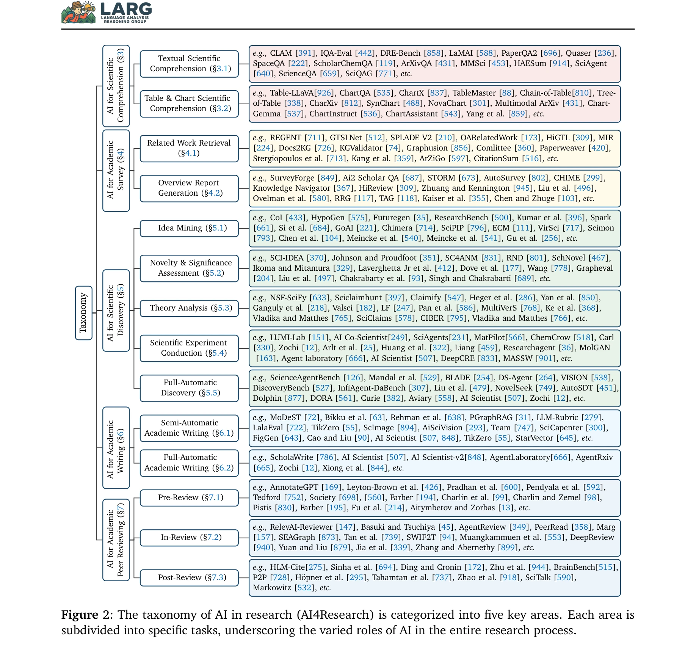
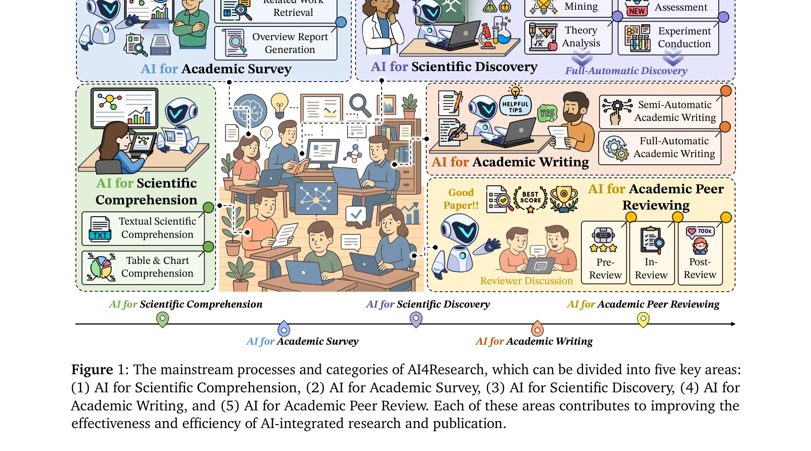

# The fifth era of science: Artificial scientific intelligence

> **저자**: N. Miolane | **날짜**: 2025 | **DOI**: [10.1371/journal.pbio.3003230](https://doi.org/10.1371/journal.pbio.3003230)

---

## Essence

*Figure 2: The taxonomy of AI in research (AI4Research) is categorized into five key areas. Each area is*

대규모 언어모델(LLM)의 발전에 힘입어 AI4Research(과학 연구를 위한 AI) 분야의 전체 생태계를 체계적으로 정리한 종합 서베이논문. 과학적 이해, 학술 조사, 과학 발견, 논문 작성, 동료 검토의 5개 주요 작업을 분류하고 다학제적 응용과 자원을 제시한다.

## Motivation

- **Known**: AI와 LLM이 수학적 추론, 프로그래밍, 학제간 지식 영역에서 성능 향상을 보였으며, AI Scientist 등의 자동화된 연구 시스템이 아이디어 채굴, 실험 수행, 논문 작성 단계를 자동화하고 있다.
- **Gap**: AI4Research의 범위와 태스크를 체계적으로 분류하고 통일된 관점을 제시하는 종합적인 서베이가 부재하여, 이 분야의 이해와 발전이 저해되고 있다.
- **Why**: AI 기술이 과학 연구 전 과정의 자동화를 가능하게 하고 있으며, 이를 체계화함으로써 과학적 발견의 속도를 높이고 연구 프로세스를 혁신할 수 있기 때문이다.
- **Approach**: 5개 핵심 작업(과학 이해, 학술 조사, 발견, 쓰기, 동료 검토)에 대한 계층적 분류 체계를 수립하고, 자연과학, 응용과학, 사회과학 분야별 응용 사례와 자원을 체계적으로 수집·정리하였다.

## Achievement

*Figure 2: The taxonomy of AI in research (AI4Research) is categorized into five key areas. Each area is*

- **체계적 분류 체계**: AI4Research의 5개 주요 작업(Scientific Comprehension, Academic Survey, Scientific Discovery, Academic Writing, Academic Peer Review)에 대한 계층적 분류 및 컴포넌트별 정의 제공
- **광범위한 응용 영역 매핑**: 물리학, 생물의학, 화학/재료과학, 로봇/제어, 소프트웨어공학, 사회과학 등 다양한 학문분야에 대한 AI 응용 사례 체계화
- **자원 집약**: 데이터셋, 벤치마크, 모델, 도구 등 2000개 이상의 관련 자원을 분류별로 정리하여 공개
- **미래 방향 제시**: 학제간 모델, 윤리·안전성, 협력 연구, 해석가능성, 동적 실험 최적화, 멀티모달/다국어 통합 등 7개 주요 미래 과제 식별

## How

*Figure 1: The mainstream processes and categories of AI4Research, which can be divided into five key areas:*

- 5개 핵심 작업별로 기존 연구들을 semi-automatic과 full-automatic 방식으로 구분하여 체계화
- 각 작업 내 세부 서브태스크를 계층적으로 분류(예: Scientific Discovery → Idea Mining, Theory Analysis, Experiment Conduction, Full-Automatic Discovery)
- 학제간 응용 사례를 Natural Science, Applied Science/Engineering, Social Science 3개 범주로 분류
- 1,000개 이상의 논문과 리소스를 수집하여 공개 깃허브 저장소(Awesome-AI4Research)와 전용 웹사이트 구축
- 각 섹션에서 현재 상태(state-of-the-art), 주요 과제, 향후 발전 방향을 병렬적으로 논의

## Originality

- 첫 종합적 AI4Research 서베이: 기존의 AI4Science나 Scientific Discovery 중심 연구와 달리 연구 전 과정(이해→조사→발견→쓰기→검토)을 통합적으로 다룸
- AI Scientist 등 자동화 시스템의 개념을 체계화하고 실제 구현 수준을 구체적으로 평가
- 5개 핵심 작업의 명확한 정의와 차별화: AI4Science와 AI4Research의 개념적 경계 명확화
- 멀티모달·다국어·협력 연구 등 신흥 연구 방향 제시로 향후 10년 연구 로드맵 제공

## Limitation & Further Study

- 동료 검토 자동화의 신뢰성 문제: AI 기반 desk-review와 peer-review의 신뢰도 평가 기준 부재
- 실험 자동화의 현실성 한계: 물리/화학 실험의 완전 자동화는 기술적·비용적 제약이 있으나 이에 대한 심층 분석 부족
- 윤리·안전성 논의의 추상성: AI로 생성된 논문의 위조, 저자권 문제, 학술 부정 방지 메커니즘 구체화 필요
- 학제간 모델의 일반화 가능성 미검증: 자연과학과 사회과학 간 AI 응용 방식의 본질적 차이에 대한 심화 분석 필요
- **후속 연구 방향**: (1) 각 작업 단계의 rigorous evaluation framework 개발, (2) 자동화된 실험의 재현성 검증, (3) 다학제 AI 모델 벤치마크 구축, (4) AI4Research의 사회적 영향(학술 생태계 변화, 연구자 역할 재정의) 실증적 분석

## Evaluation

- Novelty: 4/5
- Technical Soundness: 3/5
- Significance: 4/5
- Clarity: 4/5
- Overall: 4/5

**총평**: AI 기술이 과학 연구의 전 주기에 걸쳐 응용되는 새로운 시대에 대한 가장 포괄적이고 체계적인 현황 진단 및 향후 방향 제시. 2,000개 이상의 자원과 구체적 분류 체계를 제공함으로써 이 분야의 연구자들에게 실질적 가치를 제공하지만, 윤리·안전·신뢰성 문제의 심화 분석이 필요하다.

## Related Papers

- 🔗 후속 연구: [[papers/840_Transforming_Science_with_Large_Language_Models_A_Survey_on/review]] — 대규모 언어모델이 과학을 변혁시키는 방법을 인공 과학 지능의 관점에서 확장한다.
- 🧪 응용 사례: [[papers/023_A_smack_of_all_neighbouring_languages_How_multilingual_is_sc/review]] — 과학의 다섯 번째 시대에서 다국어 학술 커뮤니케이션의 역할을 구체적으로 보여준다.
- 🏛 기반 연구: [[papers/026_A_survey_of_large_language_models/review]] — 인공 과학 지능의 이론적 토대로서 대규모 언어모델의 발전 과정을 제공한다.
- 🔄 다른 접근: [[papers/075_AI_for_Science_2025/review]] — 과학의 다섯 번째 시대로서 인공 과학 지능에 대한 다른 관점을 제공한다.
