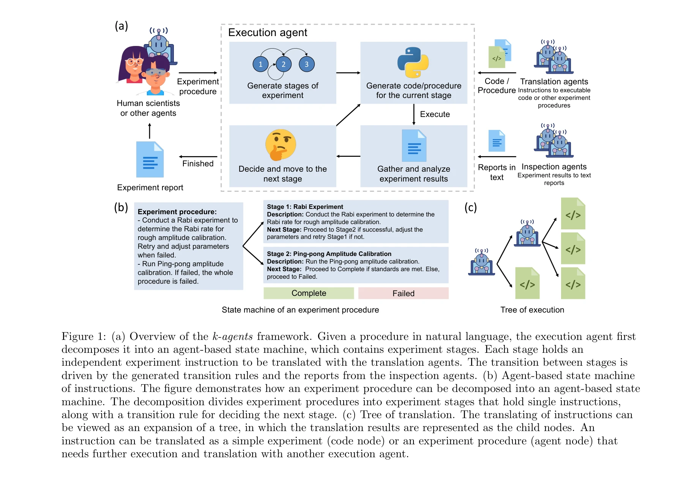

# Automating quantum computing laboratory experiments with an agent-based AI framework

> **저자**: Shuxiang Cao, Zijian Zhang, Mohammed Alghadeer, S. Fasciati, M. Piscitelli | **날짜**: 2024 | **DOI**: [10.1016/j.patter.2025.101372](https://doi.org/10.1016/j.patter.2025.101372)

---

## Essence

*그림 1: k-agents 프레임워크의 개요. 자연언어로 된 절차가 주어지면, 실행 에이전트가 이를 에이전트 기반 상태 머신으로 분해한다.*

본 논문은 대규모 언어모델(LLM) 기반 다중 에이전트 시스템인 **k-agents 프레임워크**를 제안하여, 양자 컴퓨팅 실험실의 자동화를 실현한다. 특히 다단계 실험 절차를 상태 머신으로 분해하고 폐루프 피드백 제어를 통해 초전도 양자 프로세서의 캘리브레이션과 얽힌 양자상태 생성을 자동으로 수행한다.

## Motivation

- **Known**: 
  - 자동화 실험실은 반복적 노동 감소로 고처리량 과학 발견을 가능하게 함
  - LLM과 다중 에이전트 시스템이 복잡한 목표 달성에 효과적
  - 일부 선행 연구에서 LLM 기반 에이전트를 화학 실험 자동화에 적용

- **Gap**: 
  - 기존 자동화는 손으로 작성한 코드에 의존하여 복잡한 실험실 지식을 반영하기 어려움
  - 실험실 지식은 비정형적, 다중모달(코드+문서+이미지), 자주 변경되므로 미세조정(fine-tuning)이 비현실적
  - 선행 연구들은 확장 가능한 메모리 시스템 부족으로 대화 기록에만 의존하여 장시간 다단계 작업 불가능
  - 다중 에이전트 시스템의 이질적 지식 통합 미해결

- **Why**: 
  - 초전도 양자 프로세서의 규모 확대(수백 개 큐빗)로 큐빗 캘리브레이션 병목화
  - 기존 코드 기반 자동화는 증가하는 기술 복잡도를 따라가기 어려움

- **Approach**: 
  - 지식 에이전트(knowledge agents)를 통해 실험실 지식을 관리
  - 실행 에이전트(execution agent)가 다단계 절차를 에이전트 기반 상태 머신으로 분해
  - 검사 에이전트(inspection agents)가 결과 분석 및 상태 전이 결정

## Achievement

*그림 2: (a) 번역 에이전트의 작동. 명령 벡터와 에이전트 특성 벡터의 유사도로 활성화 에이전트 선택. (b) 표준 RAG 대비 k-agents의 우수한 번역 정확도.*

1. **실험 자동화 성공**: 초전도 양자 프로세서에서 단일/다중 큐빗 게이트 캘리브레이션을 자동으로 수행하며, 인간 과학자 수준의 얽힌 양자상태(GHZ state) 생성 및 특성화 달성

2. **프레임워크 우수성**: 17개 코드 번역 에이전트 구성에서 표준 RAG 방법 대비 명령 번역 정확도 향상 및 이질적 에이전트 협력 지원

3. **확장성 개선**: 상태 머신 기반 접근으로 LLM 입력 길이 증가 문제를 해결하여 장시간 실험 자동화 가능

## How

*그림 1(b,c): 에이전트 기반 상태 머신 구조와 번역 트리 확장 과정.*

### 핵심 구조

- **지식 에이전트(Knowledge Agents)**
  - 자연언어 입력으로 실험실 지식(코드, 문서, 절차) 수용
  - 벡터 유사도(characterizing vectors)로 관련 에이전트 선택적 활성화
  - 각 에이전트는 특정 실험(예: Ramsey 실험)의 전문가 역할

- **실행 에이전트(Execution Agent)**
  - 자연언어 절차를 독립적 실험 단계(stages)로 분해
  - 각 단계마다 번역 에이전트 호출하여 실행 가능 코드 생성
  - 검사 에이전트 결과를 활용한 폐루프 피드백으로 다음 상태 결정
  - 상태 전이 규칙이 에이전트에 의해 동적으로 생성 (경직된 규칙 아님)

- **검사 에이전트(Inspection Agents)**
  - 실험 결과(수치, 이미지)를 텍스트 리포트로 변환
  - 시각 검사(visual inspection)를 위해 이미지 처리 지원

### 기술적 특징

- **벡터 기반 에이전트 선택**: 명령과 에이전트 특성 벡터의 코사인 유사도로 활성화 판단 → RAG 대비 더 정교한 에이전트 협력
- **상태 머신 기반 장시간 작업**: 각 단계별로만 LLM 컨텍스트 로드 → 수시간 실험 자동화 가능
- **다중모달 지식 처리**: 코드, 마크다운 문서, 실험 이미지 모두 통합 가능
- **동적 상태 전이**: 고정 규칙 대신 에이전트가 결과 분석으로 다음 단계 결정

## Originality

- **검색 증강 생성(RAG)의 창의적 확장**: 단순 문서 로딩 대신 벡터 유사도 기반 선택적 에이전트 활성화로 이질적 도구 통합 문제 해결

- **에이전트 기반 상태 머신의 혁신**: 경직된 전이 규칙 대신 LLM이 실험 결과 분석으로 동적 결정 → 예상 밖의 상황 대응 가능

- **양자 컴퓨팅 분야 최초 적용**: 초전도 큐빗 캘리브레이션과 얽힌 상태 생성을 LLM 에이전트로 완전 자동화한 첫 사례

- **확장 가능한 지식 관리**: 미세조정 없이 자연언어 기반으로 새로운 실험실 지식 추가 가능 → 빠르게 변하는 실험실 환경에 적합

## Limitation & Further Study

- **LLM 한계 상속**: 현재 LLM의 맥락 창 제한과 긴 입력에서의 성능 저하가 여전히 개별 단계 번역에 영향 가능

- **지식 표현의 표준화 부재**: 실험실 지식을 벡터로 변환하는 과정에서 정보 손실 가능성; 표준화된 지식 표현 형식 필요

- **인간-루프 피드백 최소화 미흡**: 실제 구현에서 예외 상황 처리나 매개변수 조정 시 여전히 인간 개입 필요 가능성

- **다른 분야 적용성 검증 부족**: 양자 컴퓨팅 데이터만으로 평가; 화학, 재료과학 등 타 분야 적용 성능 미실증

- **후속 연구 방향**:
  - 더 큰 규모 양자 시스템(수백+ 큐빗)에서의 확장성 검증
  - 완전 자율 실험으로의 진화 (인간 피드백 제거)
  - 다중 실험실 간 지식 공유 메커니즘 개발
  - 각 에이전트 의사결정의 설명 가능성(explainability) 향상

## Evaluation

- **Novelty**: 4.5/5 — 에이전트 기반 상태 머신과 벡터 기반 에이전트 선택 메커니즘은 혁신적이며, 양자 분야 적용은 매우 새로움. 다만 개별 기술 요소(RAG, 다중 에이전트)는 기존 아이디어 조합.

- **Technical Soundness**: 4/5 — 전반적으로 설계와 구현이 견고하며, 실제 양자 하드웨어 실험으로 검증됨. 다만 벡터 유사도 기반 선택의 정확도 기준과 상태 전이 규칙 자동 생성 알고리즘의 일반성이 더 자세히 분석 필요.

- **Significance**: 4.5/5 — 양자 컴퓨팅 자동화의 병목(큐빗 캘리브레이션)을 해결하는 실질적 기여. 프레임워크 일반성으로 타 실험실 자동화 분야에도 영향 가능. 다만 현재는 제한된 실험실(Oxford) 데이터로 평가.

- **Clarity**: 4/5 — Figure 1-2의 구조 설명은 명확하고, 전체 흐름이 이해하기 좋음. 다만 부록 없이는 알고리즘 세부사항과 프롬프트 구성이 불명확하며, 실제 코드 예제 부족.

- **Overall**: 4/5

**총평**: 본 논문은 LLM 기반 다중 에이전트 시스템을 양자 실험실 자동화에 창의적으로 적용하여, 인간 수준의 실험 수행 능력을 입증했다는 점에서 높은 가치를 지닌다. 특히 에이전트 기반 상태 머신과 벡터 기반 에이전트 선택은 복잡한 실험실 자동화의 확장성 문제를 해결하는 우수한 접근이다. 다만 타 분야 일반화 검증과 알고리즘의 이론적 근거가 강화된다면 더욱 영향력 있는 작업이 될 것이다.

## Related Papers

- 🔄 다른 접근: [[papers/072_Agents_for_self-driving_laboratories_applied_to_quantum_comp/review]] — 양자 컴퓨팅 실험실 자동화에서 에이전트 기반 접근법과 LLM 기반 접근법을 비교할 수 있습니다.
- 🔗 후속 연구: [[papers/297_EAA_Automating_materials_characterization_with_vision_langua/review]] — 실험실 자동화에서 비전 언어 모델을 활용한 미시경 실험으로 k-agents 프레임워크를 확장할 수 있습니다.
- 🏛 기반 연구: [[papers/614_Perspective_on_utilizing_foundation_models_for_laboratory_au/review]] — 재료 과학 실험실 자동화를 위한 기초 모델 활용 방안이 양자 컴퓨팅 자동화의 이론적 기반을 제공합니다.
- 🏛 기반 연구: [[papers/744_Self-Driving_Laboratories_for_Chemistry_and_Materials_Scienc/review]] — 양자 컴퓨팅 실험실 자동화는 자율 실험실 기술의 특수한 분야별 구현 사례를 제공합니다
- 🏛 기반 연구: [[papers/043_Accelerating_Drug_Discovery_Through_Agentic_AI_A_Multi-Agent/review]] — 양자 컴퓨팅 실험실 자동화 방법이 Artificial의 복잡한 기기 통합과 AI 모델 조정 기술의 기반이 됨
- 🧪 응용 사례: [[papers/082_Ai-assisted_design_of_experiments_at_the_frontiers_of_comput/review]] — 양자 컴퓨팅 실험 자동화에 미분 가능 프로그래밍을 적용한 실제 사례
- 🔗 후속 연구: [[papers/141_Autonomous_robotic_system_with_optical_coherence_tomography/review]] — 의료용 자율 로봇을 양자 컴퓨팅 실험 자동화로 확장하여 더 넓은 과학 실험 영역을 포괄한다.
- 🏛 기반 연구: [[papers/381_Genesis_Towards_the_Automation_of_Systems_Biology_Research/review]] — 양자 컴퓨팅 실험 자동화 방법론이 Genesis의 고속 병렬 실험 사이클 구현을 위한 핵심적인 기술적 토대를 제공한다.
- 🏛 기반 연구: [[papers/118_Autobio_A_simulation_and_benchmark_for_robotic_automation_in/review]] — AutoBio의 로봇 자동화 평가는 양자컴퓨팅 실험실 자동화 연구에서 검증된 과학 워크플로우 자동화 원리를 생물학 실험 환경에 적용한 것입니다.
- 🔄 다른 접근: [[papers/816_Toward_a_Fully_Autonomous_AI-Native_Particle_Accelerator/review]] — 양자 컴퓨팅 실험실 자동화와 입자 가속기 AI 통합은 모두 복잡한 물리학 실험 장비의 자동화를 추구하지만 서로 다른 물리학 영역에 적용된다.
- 🔗 후속 연구: [[papers/864_VASPilot_MCP-Facilitated_Multi-Agent_Intelligence_for_Autono/review]] — 양자 컴퓨팅 실험 자동화에서 물리 계산 자동화로 확장된 응용 분야를 다룬다.
- 🧪 응용 사례: [[papers/532_MerLean_An_Agentic_Framework_for_Autoformalization_in_Quantu/review]] — MerLean의 자동형식화 기술이 양자컴퓨팅 실험 자동화에 이론적 기반 제공
- 🧪 응용 사례: [[papers/533_Meta-designing_quantum_experiments_with_language_models/review]] — 언어 모델 기반 양자 실험 설계가 실제 양자컴퓨팅 연구소 자동화에 적용
