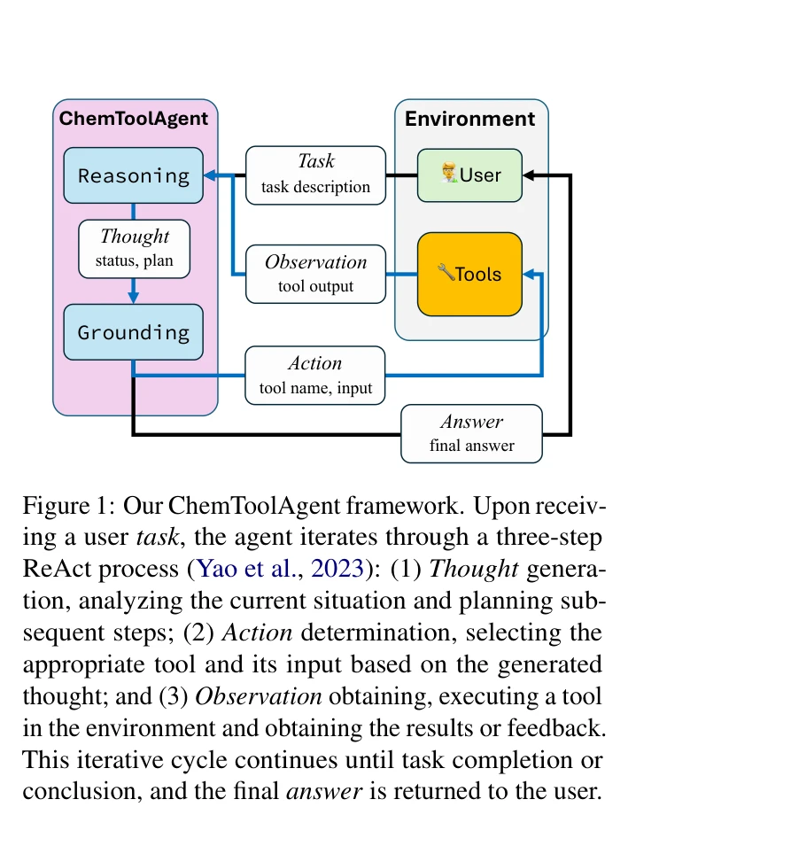
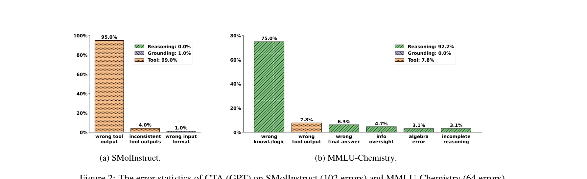

# ChemToolAgent: The Impact of Tools on Language Agents for Chemistry Problem Solving

> **저자**: Botao Yu, Frazier N. Baker, Ziru Chen, Garrett Herb, Boyu Gou | **날짜**: 2024 | **DOI**: N/A

---

## Essence

*ChemToolAgent 프레임워크: ReAct 패러다임을 따르는 세 단계 반복 과정 (Thought, Action, Observation)*

대규모 언어 모델(LLM)에 화학 전문 도구를 통합한 에이전트가 모든 화학 문제 해결에서 일관되게 성능 향상을 가져오지는 않으며, 특화된 분자/반응 작업과 일반 화학 시험 문제에서 도구 활용의 효과가 크게 다르다는 것을 규명한다.

## Motivation

- **Known**: ChemCrow, Coscientist 등 도구 통합 화학 에이전트가 제안되었으나, 이들의 평가는 매우 제한적 범위(ChemCrow는 14개 작업, Coscientist는 6개 작업)에만 수행됨

- **Gap**: 도구 통합이 다양한 화학 작업에서 실제로 얼마나 도움이 되는지, 어떤 상황에서 효과적인지에 대한 포괄적 이해 부족

- **Why**: 도구 증강이 항상 LLM 성능을 향상시킨다는 일반적 가정을 검증하고, 화학 문제 해결의 복잡성을 체계적으로 분석할 필요

- **Approach**: 29개 도구를 통합한 개선된 ChemToolAgent(CTA)를 개발하고, 특화된 화학 작업(SMolInstruct, 700개)과 일반 화학 문제(MMLU-Chemistry, SciBench-Chemistry, GPQA-Chemistry, 총 386개)에서 광범위한 실험 수행

## Achievement

*CTA(GPT) 오류 통계: SMolInstruct에서 102개, MMLU-Chemistry에서 64개의 오류를 추론 오류(Reasoning Error), 접지 오류(Grounding Error), 도구 오류(Tool Error)로 분류*

1. **특화된 화학 작업에서 도구의 가치 입증**: CTA는 기본 LLM 대비 SMolInstruct 작업에서 현저한 성능 향상 달성 (예: Name Conversion to SMILES에서 GPT-4o 0% → CTA-GPT 70%, Forward Synthesis에서 12% → 78%)

2. **일반 화학 문제에서 도구 통합의 한계 발견**: MMLU-Chemistry, SciBench-Chemistry, GPQA-Chemistry에서 CTA가 기본 LLM(GPT-4o: 80.5%, Claude: 76.7%)을 대부분 하회 (MMLU-C에서 CTA-GPT 71.0%, GPQA-C에서 33.8%)하는 반직관적 결과 도출

3. **체계적 오류 분석**: 일반 화학 문제 실패의 주요 원인이 도구 오류가 아닌 추론 오류(잘못된 화학 지식/논리, 정보 누락, 불완전한 추론 등)임을 화학 전문가와의 협력을 통해 규명

## How

- **도구 세트 개발**: 29개 도구를 일반 도구(Python REPL, 웹 검색), 분자 도구(기능기 식별, 분자 성질 예측), 반응 도구(순방향/역방향 합성)로 분류 구성

- **ReAct 패러다임 적용**: Thought(현황 분석 및 계획) → Action(도구 선택 및 입력) → Observation(도구 실행 및 결과 획득)의 반복 사이클로 추론(Reasoning)과 접지(Grounding) 두 인지 능력 구현

- **포괄적 평가 설계**: 특화된 작업(분자/반응 중심, 700개 샘플)과 일반 문제(시험형, 386개 샘플)의 이질적 작업 범주 분리로 도구 효과의 맥락 의존성 분석

- **정성적 오류 분석**: 화학 전문가가 모든 실패 케이스(SMolInstruct 102개, MMLU-Chemistry 64개)를 세 가지 오류 유형으로 수동 분류하여 근본 원인 규명

## Originality

- **포괄적 평가 프레임워크 제시**: 단일 도메인 내 이질적 작업 범주(특화 vs. 일반) 비교를 통해 도구 증강의 상황 의존적 효과를 체계적으로 검증한 첫 시도

- **반직관적 발견의 심화 분석**: 도구 증강이 항상 성능을 향상시킨다는 기존 가정에 대한 근거 기반 반박 및 인지 부하 증가 가설 제시

- **실용적 도구 세트 확장**: ChemCrow의 18개 도구를 29개로 확장하며, PubChemSearchQA, 신경망 기반 분자 성질 예측기 등 새로운 도구 16개 추가 및 기존 도구 6개 개선

- **다층적 오류 분류 체계**: 추론/접지/도구 오류뿐만 아니라 세부적인 추론 오류(잘못된 지식, 정보 누락, 불완전한 추론 등) 분류로 LLM 에이전트의 약점 심화 진단

## Limitation & Further Study

- **제한사항**:
  - 평가가 두 개의 기반 LLM(GPT-4o, Claude-3.5-Sonnet)에만 제한되어 오픈소스 LLM의 도구 활용 능력 미검증
  - 오류 분석이 SMolInstruct와 MMLU-Chemistry의 두 데이터셋만을 대표로 사용하여 SciBench, GPQA의 오류 패턴 미상세 분석
  - 도구 호출의 인지 부하 가설이 정성적 분석에 기반하며, 정량적 메커니즘 검증 부재
  - 특화된 작업(SMolInstruct)의 표본 크기가 총 700개로, 일반 문제(386개)보다 크지만 각 세부 작업의 통계적 유의성 검증 미흡

- **향후 연구 방향**:
  - 도구 선택의 인지 부하를 최소화하는 에이전트 아키텍처 설계 (예: 동적 도구 필터링, 계층적 도구 조직)
  - 추론 능력과 정보 검증 능력 강화를 위한 LLM 미세조정 방법론 개발
  - 오픈소스 LLM(Llama, Mistral 등)의 도구 활용 능력 평가 및 크기별 성능 비교
  - 도구 호출이 실제로 인지 부하를 증가시키는지 측정하기 위한 정량적 지표 개발 (예: 중간 단계 오류율, 도구 호출 깊이 vs. 성능)

## Evaluation

- **Novelty**: 4/5 — 도구 증강의 상황 의존적 효과를 체계적으로 검증한 포괄적 평가가 신선하나, 도구 개선 자체의 기술 혁신성은 제한적

- **Technical Soundness**: 4/5 — ReAct 기반 구현과 오류 분류 방법론이 견고하나, 인지 부하 메커니즘에 대한 정량적 증명 부재

- **Significance**: 4/5 — 도구 증강의 맹점을 지적하여 LLM 에이전트 설계에 실질적 통찰을 제공하나, 해결책 제시는 미흡

- **Clarity**: 4/5 — 실험 설계와 오류 분류가 명확하나, MMLU/SciBench/GPQA 세 데이터셋의 성능 차이 원인에 대한 상세한 분석 부재

- **Overall**: 4/5

**총평**: 본 논문은 화학 도메인에서 LLM 에이전트의 도구 통합 효과를 가장 포괄적으로 평가한 연구로, "도구가 항상 도움이 된다"는 기존 가정을 근거 기반으로 반박하면서 특화 작업 vs. 일반 문제의 이질성을 명확히 한다. 다만 문제의 원인 규명에 그치고 해결 방안 제시가 제한적이라는 점과, 인지 부하 가설의 정량화 부재가 아쉽다. 화학 문제 해결을 위한 LLM 에이전트 설계에 중요한 설계 원칙(task-specific tools for specialized tasks, improved reasoning for general questions)을 제시한 실용적 가치가 높다.

## Related Papers

- 🔄 다른 접근: [[papers/209_ChemAgent_Self-updating_Library_in_Large_Language_Models_Imp/review]] — 자가 업데이트 화학 라이브러리와 도구 통합 화학 에이전트의 다른 접근법
- 🏛 기반 연구: [[papers/115_Augmenting_large_language_models_with_chemistry_tools/review]] — 화학 도구로 LLM 확장하기가 화학 문제 해결 도구의 기반 제공
- 🔗 후속 연구: [[papers/814_Tooling_or_Not_Tooling_The_Impact_of_Tools_on_Language_Agent/review]] — 언어 에이전트의 도구 사용 영향에서 화학 특화 도구로의 확장
- 🧪 응용 사례: [[papers/176_CACTUS_Chemistry_Agent_Connecting_Tool_Usage_to_Science/review]] — 과학과 도구 사용 연결 화학 에이전트를 화학 문제 해결에 적용
- 🏛 기반 연구: [[papers/305_Efficient_Evolutionary_Search_Over_Chemical_Space_with_Large/review]] — LLM 기반 분자 최적화 연구가 화학 도구를 활용하는 언어 에이전트의 분자 설계 능력에 중요한 방법론적 기반을 제공한다
