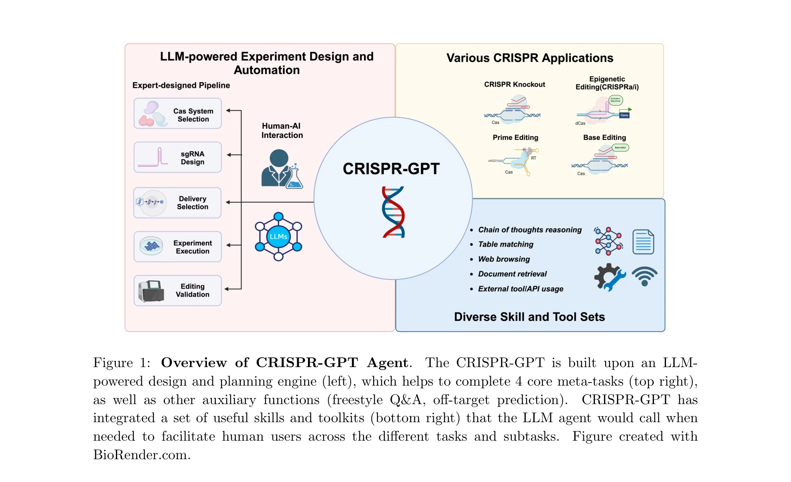
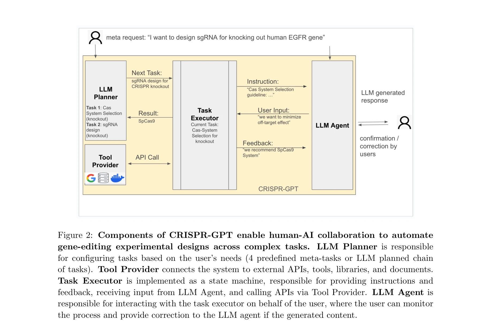

# CRISPR-GPT for agentic automation of gene-editing experiments

> **저자**: Yuanhao Qu, Kaixuan Huang, Ming Yin, Kanghong Zhan, Dyllan Liu | **날짜**: 2024 | **DOI**: [10.1038/s41551-025-01463-z](https://doi.org/10.1038/s41551-025-01463-z)

---

## Essence

*Overview of CRISPR-GPT Agent. LLM 기반 설계 및 계획 엔진(좌측)이 4가지 핵심 메타-작업(우상단)과 보조 기능들을 수행하며, 여러 유용한 도구 및 툴킷(우하단)을 통합*

CRISPR-GPT는 대규모 언어 모델(LLM)에 유전체 공학 도메인 지식과 외부 도구를 통합하여, 비전문가 연구자도 CRISPR 유전자 편집 실험을 자동으로 설계할 수 있는 에이전트 시스템이다. 이 시스템은 CRISPR 시스템 선택부터 가이드 RNA 설계, 세포 전달 방법 추천, 프로토콜 작성, 검증 실험 설계까지 전체 파이프라인을 자동화한다.

## Motivation

- **Known**: 대규모 언어 모델(GPT-4 등)은 일반적인 작업에서 뛰어난 성능을 보이며, ChemCrow와 Coscientist 같은 도구-증강형 LLM은 화학 문제 해결에 성공함

- **Gap**: 범용 LLM들은 (1) 생물학적 설계에 필요한 최신 도메인 지식 부족, (2) 높은 신뢰도로 부정확한 답변(hallucination) 생성, (3) 세부 실험 조건 정보 누락, (4) 관련 없는 정보로 인한 혼동 야기

- **Why**: CRISPR 기반 유전자 편집은 암, 신경퇴행성 질환 등 다양한 질병 치료 가능성을 제시하지만, 설계 난이도가 높아 전문가 인력 부족이 기술 접근성을 제한함

- **Approach**: 도메인 전문가 지식, 최신 문헌, 계산 도구(guideRNA 설계 도구 등)를 LLM 에이전트에 통합하고, 상태 머신 기반의 작업 분해 및 도구 제공 시스템을 구축

## Achievement

*CRISPR-GPT의 컴포넌트: LLM Planner, Tool Provider, Task Executor, LLM Agent가 협력하여 복합 작업을 자동화*

1. **자동화된 4가지 핵심 메타-작업**: CRISPR 시스템 선택, gRNA(가이드 RNA) 설계, 전달 방법 추천, 오프타겟 효과 예측을 포함한 완전한 실험 파이프라인 자동화

2. **도메인 특화 설계**: Broad Institute의 gold-standard guideRNA 라이브러리 및 CRISPRPick 툴킷 통합으로 효율성과 특이성 최적화

3. **22개 상태 머신 기반 작업 분해**: 복잡한 태스크를 관리 가능한 부분목표(sub-goals)로 자동 분해하여 사용자와의 반복적 상호작용 가능

4. **검증 및 안전장치**: 프라이머 설계, 오프타겟 예측, 인간 적용 제한, 유전 정보 개인정보 보호, 의도하지 않은 결과에 대한 경고 등 윤리적·규제적 고려사항 통합

5. **실제 사용 사례 검증**: 비전문가 연구자도 처음부터 유전자 편집 실험을 효과적으로 설계할 수 있음을 입증

## How

**시스템 아키텍처 및 알고리즘**:

- **LLM Planner**: 사용자 요청을 분석하여 4가지 사전 정의된 메타-작업 또는 맞춤형 작업 체인 구성

- **Task Executor (상태 머신)**: 22개의 작업을 상태 머신으로 구현하여 명확한 상태 전이 논리와 부분목표 지정. 현재 작업에 대한 충분한 지시사항 제공 및 다중 라운드 텍스트 상호작용으로 의사결정 안내

- **Tool Provider**: 외부 API, 도구, 라이브러리, 문서를 Task Executor와 연결. API 인터페이스를 직접 노출하는 대신 사용자 및 LLM 친화적인 텍스트 지침으로 감싸서 활용

- **LLM Agent**: 사용자 인터페이스 역할을 담당하며, 입력을 받고 출력을 전달. 사용자가 생성 내용을 모니터링하고 필요시 LLM 에이전트에 수정 지시 가능

- **Chain-of-Thought 추론**: 논리적 단계별 추론으로 비전문가도 이해할 수 있는 설명 제공

- **오프타겟 효과 예측**: 사전 설계된 gRNA에 대한 심층 분석 모드 제공

## Originality

- **도메인-LLM 통합의 새로운 패러다임**: 범용 LLM의 일반적 추론 능력과 생물학 도메인 지식의 체계적 결합으로, 단순 프롬프트 엔지니어링을 넘어선 구조화된 접근법 시연

- **상태 머신 기반 작업 분해**: 비정형 대화형 LLM을 구조화된 상태 머신으로 변환하여 복잡한 다단계 실험 설계의 견고한 서브-골 관리 달성

- **실험 검증 통합**: 단순 설계 추천을 넘어 프라이머 설계, 오프타겟 검사, 검증 프로토콜까지 완전한 실험 파이프라인 자동화

- **윤리적 가드레일 내장**: 인간 대상 실험 제한, 개인정보 보호, 의도하지 않은 결과 경고 등을 시스템 수준에서 구현하여 책임감 있는 AI 사용 모범

- **실제 CRISPR 도구 활용**: Broad Institute 라이브러리, CRISPRPick 등 검증된 산업 표준 도구 직접 통합으로 실용성 확보

## Limitation & Further Study

- **도메인 범위 제한**: 현재 CRISPR-Cas9, CRISPRa/i, prime editing, base editing에 초점이 맞춰져 있으며, 신흥 유전체 편집 기술(예: 수정된 Cas 변체, RNA 편집 등)으로 확장 필요

- **실험 결과 피드백 루프 부재**: 설계 단계에 머물러 있으며, 실제 실험 결과를 바탕으로 한 반복 개선 메커니즘 개발 필요

- **개인별 모세포 차이 미반영**: 서로 다른 세포 유형, 조직, 생물 종의 CRISPR 효율성 차이에 대한 광범위한 데이터 통합 필요

- **LLM hallucination 완전 제거 미흡**: 도구 통합에도 불구하고 사용자 입력 해석 단계에서의 오류 가능성 남존

- **규제 프레임워크 동적 업데이트 부족**: 빠르게 변화하는 유전자 편집 규제 환경(국가별, 용도별 차이)에 대한 실시간 업데이트 메커니즘 필요

- **비용-효율성 분석 미흡**: 추천된 실험 설계의 시약, 장비 비용 추정 및 최적화 기능 개발 필요

## Evaluation

- **Novelty**: 4/5
  - LLM과 도메인 지식의 체계적 통합 및 상태 머신 기반 구조화는 참신하나, 도구 증강 LLM의 개념 자체는 기존 연구(ChemCrow, Coscientist)에서 확립됨

- **Technical Soundness**: 4/5
  - 아키텍처가 명확하고 상태 머신 설계가 견고하나, 논문의 제시된 부분에서는 정량적 평가 지표와 비교 분석이 부족함. 실제 오프타겟 예측 정확도, gRNA 설계 성공률 등의 벤치마크 데이터 필요

- **Significance**: 5/5
  - 유전자 편집 기술의 접근성을 대폭 낮춰 비전문가도 정교한 실험 설계 가능하게 함. 생명공학 연구 속도 가속과 개인맞춤형 치료 개발 가능성 제시로 매우 높은 과학적·임상적 의의

- **Clarity**: 4/5
  - 전체 구조와 동기가 명확하고 Figure 1-2가 시스템 이해에 도움이 됨. 다만 상태 머신의 구체적 전이 로직, 실제 사용자 상호작용 사례, 오류 처리 메커니즘에 대한 상세 설명 부족

- **Overall**: 4/5

**총평**: CRISPR-GPT는 LLM의 추론 능력을 도메인 지식과 체계적으로 결합하여 유전자 편집 실험 설계를 자동화한 혁신적 시스템으로, 생명공학 연구의 민주화와 가속화에 상당한 기여 가능성을 보여준다. 다만 실험 검증 단계의 완전한 자동화, 다양한 세포·조직 타입에 대한 데이터 확충, 정량적 성능 평가 지표 제시로 기술적 견고성과 임상 적용 가능성을 더욱 강화할 필요가 있다.

## Related Papers

- 🔄 다른 접근: [[papers/138_Autonomous_chemical_research_with_large_language_models/review]] — 화학 연구 자동화와 유전자 편집 자동화는 모두 실험실 워크플로우를 LLM으로 자동화하는 접근방식을 공유한다.
- 🔗 후속 연구: [[papers/774_STELLA_Towards_a_Biomedical_World_Model_with_Self-Evolving_M/review]] — STELLA의 자기진화형 바이오의학 에이전트는 CRISPR-GPT의 정적 도구 집합 한계를 극복하는 발전된 형태다.
- 🏛 기반 연구: [[papers/115_Augmenting_large_language_models_with_chemistry_tools/review]] — 화학 도구로 강화된 LLM 연구는 CRISPR-GPT가 유전체 공학 도메인 지식을 통합하는 방법론적 기반을 제공한다.
- 🔗 후속 연구: [[papers/211_ChemGymRL_A_Customizable_Interactive_Framework_for_Reinforce/review]] — 강화학습 화학 환경을 유전자 편집 자동화로 확장한 생명과학 응용
- 🔗 후속 연구: [[papers/615_PerTurboAgent_A_Self-Planning_Agent_for_Boosting_Sequential/review]] — 유전자 편집 실험 자동화를 위한 CRISPR-GPT 기술을 유전자 섭동 실험 설계에 확장 적용할 수 있다.
- 🔗 후속 연구: [[papers/774_STELLA_Towards_a_Biomedical_World_Model_with_Self-Evolving_M/review]] — STELLA의 자기진화형 바이오의학 에이전트는 CRISPR-GPT의 정적 도구 집합 한계를 극복하는 발전된 형태다.
- 🔄 다른 접근: [[papers/532_MerLean_An_Agentic_Framework_for_Autoformalization_in_Quantu/review]] — 둘 다 자동화된 과학 연구를 다루지만 MerLean은 형식화에, CRISPR-GPT는 실험에 특화
