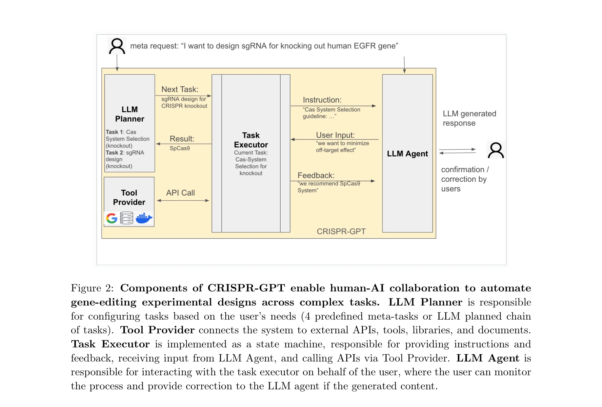
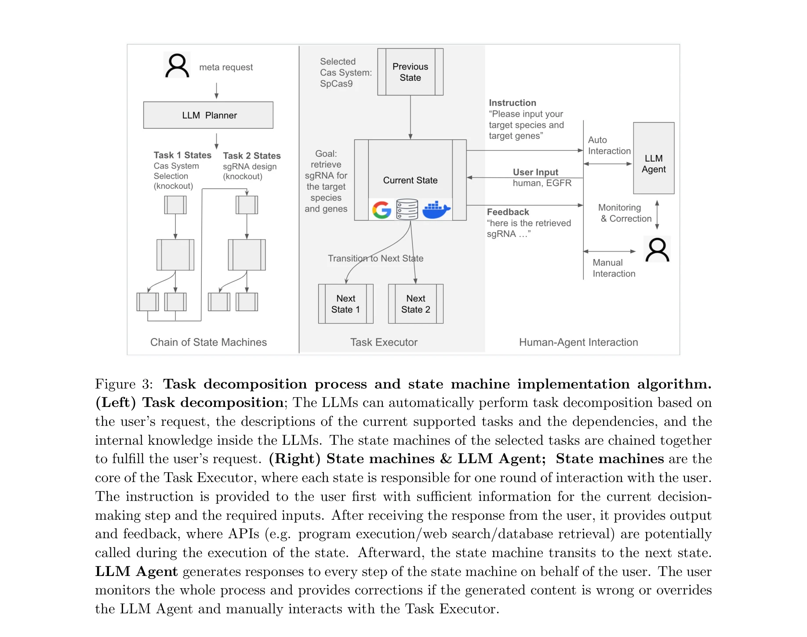

# Crispr-gpt: An llm agent for automated design of geneediting experiments

> **저자**: Yuanhao Qu, Kaixuan Huang, Ming Yin, Kanghong Zhan, Dyllan Liu, Di Yin, Henry C. Cousins, William A. Johnson, Xiaotong Wang, Mihir Shah, Russ B. Altman, Denny Zhou, Mengdi Wang, Le Cong | **날짜**: 2024 | **DOI**: [s41551-025-01463-z](https://www.nature.com/articles/s41551-025-01463-z)

---

## Essence

*CRISPR-GPT 에이전트 개요: LLM 기반 설계 및 계획 엔진(좌측), 4가지 핵심 메타-태스크(우측 상단), 보조 기능 및 통합 도구킷(우측 하단)*

본 논문은 대규모 언어 모델(LLM)을 도메인 특화 지식과 외부 도구로 증강한 CRISPR-GPT 에이전트를 제시하여, 유전자 편집 실험의 설계 과정을 자동화한다. 일반 LLM의 할루시네이션(hallucination) 문제를 극복하고 생물학 초보자도 체계적으로 CRISPR 기반 유전자 편집 실험을 설계할 수 있도록 지원한다.

## Motivation

- **Known**: 
  - CRISPR 기술은 유전자 편집의 혁신적 도구이며 유전질환 치료부터 암, 신경퇴행질환 등 다양한 질병 치료에 응용 가능
  - LLM은 뛰어난 언어 능력과 광범위한 세계 지식을 보유하고 있으며, 외부 도구 통합으로 문제 해결 능력 향상 가능 (ChemCrow, Coscientist 사례)

- **Gap**: 
  - 일반 목적의 LLM(ChatGPT-3/4)은 생물학적 설계 문제에 대해 높은 신뢰도로 부정확한 응답 생성(guide RNA 설계 시 게놈의 실제 영역과 무관한 서열 제시)
  - gRNA 효율성, off-target 효과 예측, 구체적 프로토콜 등 실험에 필수적인 상세 정보 부재
  - CRISPR 시스템 선택, gRNA 설계, 전달 방법, off-target 예측, 프로토콜 작성, 검증 방법 등 복합적 의사결정이 필요한데, 초보자가 접근하기 어려움

- **Why**: 
  - 유전자 편집 기술의 접근성 확대 및 과학적 발전 가속화 필요
  - 도메인 특화 지식 + LLM의 추론 능력 + 전문 도구 통합으로 신뢰성 높은 자동화 설계 시스템 구축 가능

- **Approach**: 
  - 도메인 전문가 지식과 최신 문헌 기반 LLM 에이전트 개발
  - 상태 머신(state machine)을 통한 체계적 태스크 분해
  - 외부 API/도구(guideRNA 설계 도구, CRISPRPick, BLAST 등) 통합
  - 윤리 및 안전 가드레일 설정

## Achievement

*CRISPR-GPT의 구성 요소: LLM Planner, Tool Provider, Task Executor, LLM Agent가 인간-AI 협업을 통해 복합 태스크 자동화*

1. **자동화된 종합 설계 파이프라인**: 4가지 핵심 메타-태스크(CRISPR 시스템 선택, gRNA 설계, 전달 방법 추천, 검증 프로토콜)와 22개의 세부 태스크를 상태 머신으로 구현하여, 초보자도 체계적으로 실험 설계 가능

2. **도메인 특화 정확성 향상**: Broad Institute의 표준 guideRNA 라이브러리, CRISPRPick 도구킷, NCBI BLAST 등 전문 자원 통합으로 할루시네이션 문제 해결 및 신뢰성 있는 설계 결과 제공

3. **인간-AI 협업 프레임워크**: 사용자가 실시간으로 LLM 에이전트의 생성 결과를 모니터링하고 수정 가능한 대화형 인터페이스 제공

4. **확장 가능한 아키텍처**: Freestyle Q&A 모드, Off-target 예측 전용 모드 등 추가 기능 지원 및 맞춤형 태스크 체인 생성 가능

5. **윤리적 안전장치**: 인간 대상 사용 제한, 유전정보 프라이버시 보호, 의도하지 않은 결과 알림 등 포함

## How

*태스크 분해 프로세스 및 상태 머신 구현 알고리즘*

- **LLM Planner**: 사용자의 요청을 분석하여 4가지 사전 정의된 메타-태스크 선택 또는 맞춤형 태스크 체인 생성

- **Task Executor (상태 머신 기반)**:
  - 22개 태스크를 상태 머신으로 구현
  - 각 상태(state)는 특정 부분 목표(sub-goal)를 담당
  - 잘 정의된 전환 로직으로 진행 상황에 따라 다음 상태로 자동 전이
  - 사용자와 다중 라운드 텍스트 상호작용을 통해 의사결정 안내

- **Tool Provider**:
  - 외부 API/도구를 상태 내부에 래핑(wrapping)
  - LLM 친화적 텍스트 인터페이스로 변환하여 노출
  - 적절한 도구 선택 및 호출 시점 판단

- **LLM Agent**:
  - Task Executor와 상호작용하여 사용자를 대신해 입출력 관리
  - Chain-of-thought 추론 모델 기반 의사결정

- **외부 자원 통합**:
  - Broad Institute guideRNA 표준 라이브러리
  - CRISPRPick 도구킷 (gRNA 효율성 및 특이성 최적화)
  - NCBI BLAST (off-target 효과 예측)
  - 최신 문헌 및 전문가 지식 베이스

## Originality

- **도메인 특화 LLM 에이전트의 구체적 실구현**: 일반 LLM의 생물학 설계 한계를 명확히 지적하고, 전문 지식과 도구 통합으로 극복한 첫 번째 유전자 편집 특화 에이전트

- **상태 머신 기반 태스크 분해**: 사전에 22개 태스크를 수작업으로 설계하여 명시적 제어 흐름 구현, 일반적 LLM 에이전트의 오류 가능성 감소

- **실제 연구 환경 반영**: Broad Institute 표준 라이브러리, CRISPRPick 등 업계 표준 도구 직접 통합

- **윤리 및 안전 고려**: 인간 대상 사용 제한, 프라이버시 보호 등 책임감 있는 AI 개발 원칙 적용

- **인간-AI 협업 설계**: 사용자가 실시간 모니터링 및 수정 가능한 대화형 인터페이스로 투명성 및 제어 가능성 보장

## Limitation & Further Study

- **학습 데이터 현재성(Recency)**: LLM의 학습 종료 시점 이후 발표된 최신 CRISPR 연구 및 기술을 반영하지 못할 수 있음 → 정기적 지식 베이스 업데이트 필요

- **초기 평가의 제한성**: 논문의 "실제 사용 사례(real-world use case)" 검증 규모 및 범위가 명시되지 않음 → 더 광범위한 사용자 연구 및 임상 적용 전 평가 필요

- **도메인 외 태스크 확장성 미흡**: 현재는 CRISPR 특화로 설계되어, 다른 유전자 편집 기술(ZFN, TALEN 등)이나 합성생물학 분야 확장성 제한

- **Off-target 예측 정확성**: NCBI BLAST 기반 예측의 정확성 한계 → 더 정교한 머신러닝 기반 off-target 예측 모델 통합 필요

- **프로토콜 최적화의 한계**: 생성된 프로토콜이 특정 세포 타입, 조직, 생물체별 미묘한 차이 반영 부족 → 데이터 기반 프로토콜 최적화 및 적응형 학습 메커니즘 개발 필요

- **후속 연구 방향**:
  - 다양한 생물학적 맥락에서의 성능 평가
  - 사용자 피드백 기반 지속적 개선
  - 규제 및 윤리 지침의 진화에 따른 가드레일 업데이트
  - 다중 모달 데이터(이미지, 실험 이력) 통합
  - 자동 실험 플랫폼과의 통합

## Evaluation

- Novelty: 4.5/5
- Technical Soundness: 4/5
- Significance: 4.5/5
- Clarity: 4/5
- Overall: 4.3/5

**총평**: 본 논문은 일반 LLM의 생물학 설계 실패 사례를 체계적으로 분석하고, 도메인 특화 지식 및 외부 도구 통합을 통해 CRISPR 유전자 편집 실험 설계를 자동화하는 실질적이고 혁신적인 접근을 제시했다. 상태 머신 기반 구조로 강건성을 확보하고 윤리 가드레일을 포함한 책임감 있는 개발이 돋보이나, 평가 규모 확대 및 다양한 생물학적 맥락에서의 성능 검증이 추가로 필요하다.