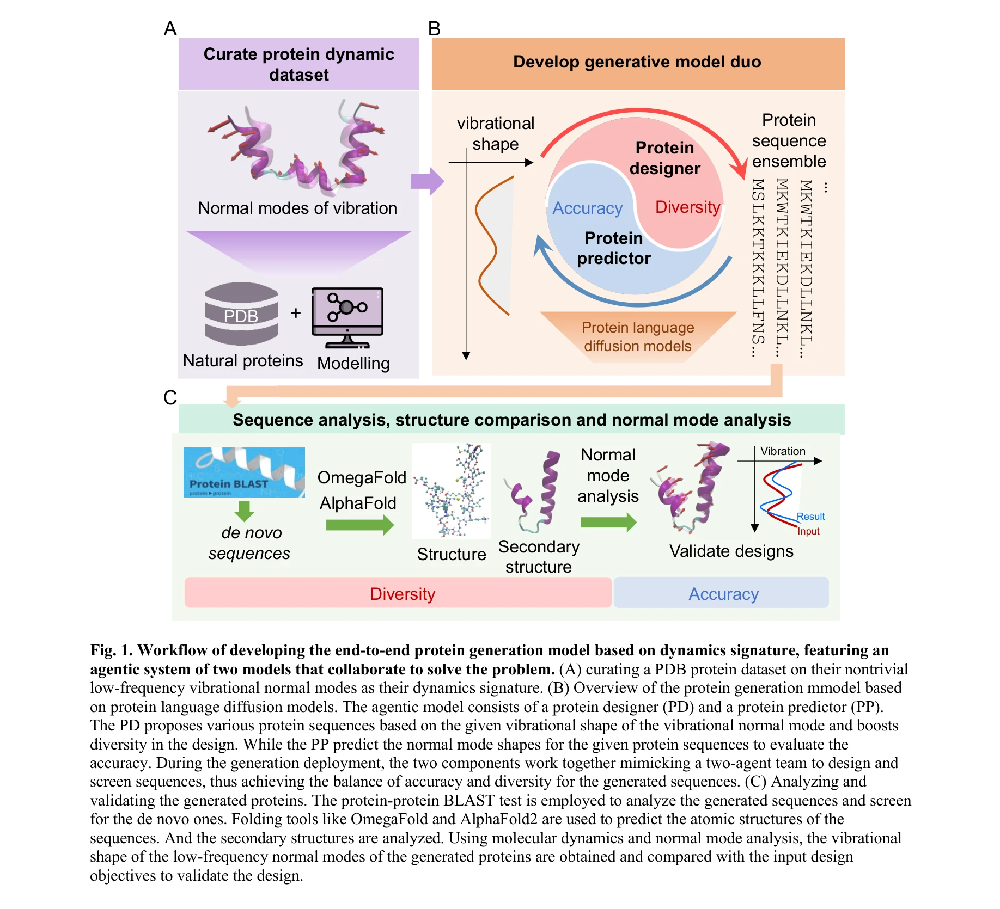
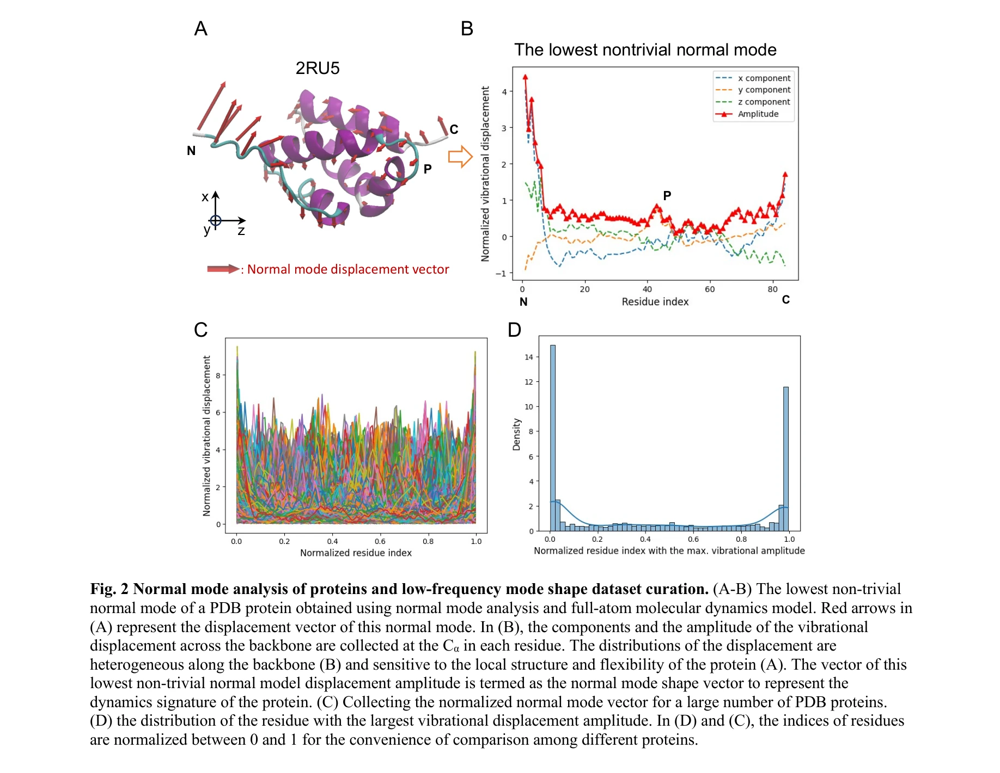
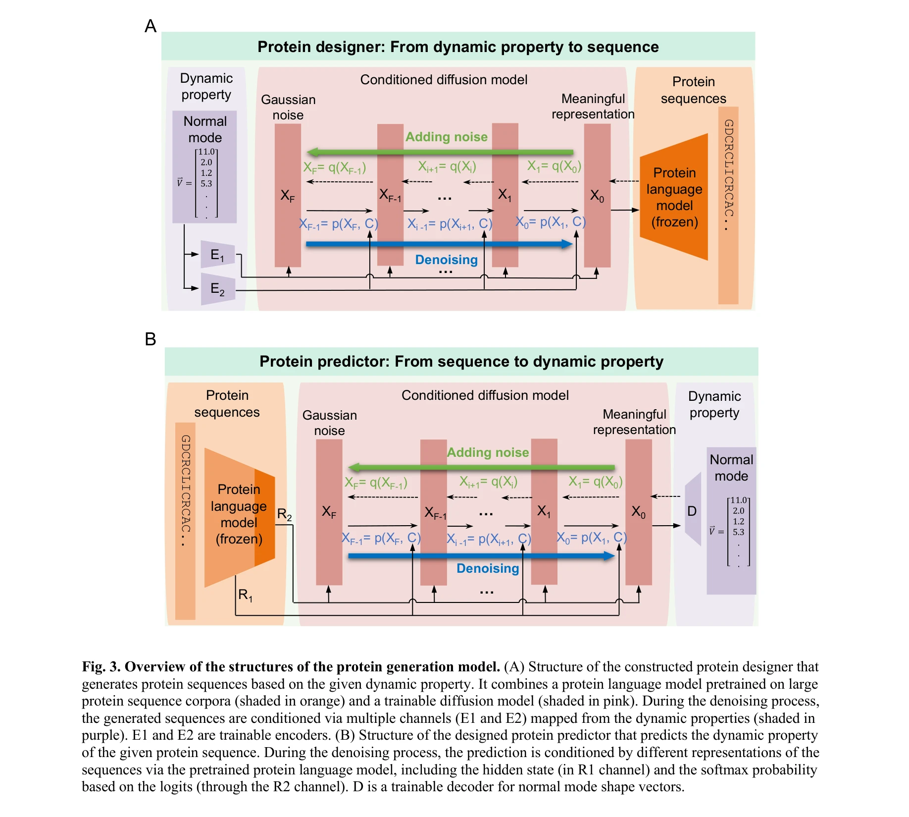

# Agentic End-to-End De Novo Protein Design for Tailored Dynamics Using a Language Diffusion Model

> **저자**: Bo Ni, Markus J. Buehler | **날짜**: 2023 | **DOI**: 미제공 (MIT LAMM 논문)

---

## Essence

 *VibeGen의 워크플로우: (A) 정상 모드 데이터베이스 구축, (B) 이중 에이전트 아키텍처를 통한 설계, (C) 분자동역학 시뮬레이션으로 검증*

단백질의 생물학적 기능은 구조뿐만 아니라 동적 움직임에 의존하므로, 본 논문은 정상 모드 진동(normal mode vibration)을 조건으로 하는 **VibeGen** 프레임워크를 제시하여 목표 동역학 특성을 갖는 신규 단백질 설계를 가능하게 함.

## Motivation

- **Known**: 
  - 단백질의 생물학적 기능(촉매작용, 신호전달, 기계적응)은 저주파 진동 운동과 밀접한 관련
  - AlphaFold2, RFdiffusion 등 AI 기반 단백질 설계 도구들이 정적 구조 예측에 초점
  
- **Gap**: 
  - 현재 설계 방법들은 단백질의 동역학적 특성을 직접 조건으로 하지 않음
  - 수열-구조-동역학 간의 퇴화된(degenerate) 관계로 인해 동역학 기반 설계의 어려움
  
- **Why**: 
  - 효소의 촉매활성, 알로스테리 기전, 기계 전달은 모두 저주파 집단 운동(collective motion)에 의존
  - p53 암 변이, CFTR 돌연변이 등에서 동역학 이상과 질병이 직접 연결
  
- **Approach**: 
  - 언어 확산 모델(protein language diffusion model, pLDM) 기반 이중 에이전트 아키텍처
  - 단백질 설계자(designer)와 예측자(predictor)의 협력을 통해 정확성, 다양성, 신규성 동시 확보

## Achievement

 *저주파 정상 모드 분석: (A) 단백질 모노머의 변위장(displacement field), (B) 백본을 따른 Cα 원자의 진동 변위 성분*

1. **동역학 조건부 설계**: 지정된 정상 모드 진폭(normal mode amplitude)을 정확하게 재현하는 신규 단백질 수열 생성
   - 전원자 분자동역학 시뮬레이션으로 설계 정확성 직접 검증
   - 자연 단백질과 유의미한 유사성 없는 완전 신규(de novo) 수열 도출

2. **이중 에이전트 협력 메커니즘**: 
   - PD(Protein Designer)는 정상 모드 형태를 입력받아 수열 생성
   - PP(Protein Predictor)는 생성된 수열의 동역학 정확성을 실시간 평가
   - 두 에이전트의 상호작용으로 단일 모델 대비 우수한 성능 달성

3. **복잡한 수열-동역학 관계 학습**: 
   - PDB 단백질 대규모 데이터베이스로부터 저주파 정상 모드 기반 동역학 시그니처 추출
   - 양방향(forward/inverse) 수열-정상 모드 관계 학습

## How

 *단백질 생성 모델의 구조: 이중 에이전트 아키텍처의 상세 설계*

- **데이터 구축**:
  - PDB 단백질들에 대해 CHARMM68 력장으로 구조 완화(relaxation)
  - 헤시안 행렬의 고유값 문제 풀이를 통한 정상 모드 분석(NMA)
  - 첫 6개 모드(강체 운동)를 제외한 7번째 이상의 비자명 모드(non-trivial modes) 수집
  - 백본을 따른 Cα 원자의 변위 성분으로 저주파 모드 형태를 벡터화

- **모델 아키텍처**:
  - 언어 확산 모델 기반 엔드-투-엔드 설계 (역설계 문제 직접 해결)
  - 정상 모드 형태를 토큰 임베딩으로 조건화(conditioning)
  - 단백질 설계자: 조건부 생성 (정상 모드 → 수열)
  - 단백질 예측자: 정방향 예측 (수열 → 정상 모드)

- **검증 방법**:
  - 생성 수열의 신규성(novelty) 평가: BLAST 검색으로 자연 단백질과의 유사성 평가
  - 구조 예측 및 이완(relaxation) 후 안정성 분석
  - 생성 단백질에 대한 NMA 수행으로 설계된 정상 모드와 재현도 정량화

## Originality

- **혁신점**:
  - 단백질 설계에 동역학을 명시적 조건으로 통합한 최초의 엔드-투-엔드 프레임워크
  - 이중 에이전트 협력 메커니즘으로 역설계(inverse design) 정확성과 다양성의 트레이드오프 해결
  - 언어 확산 모델을 동역학 조건부 단백질 생성에 적용한 사례

- **차별점**:
  - 기존 RFdiffusion, AlphaFold3 등은 정적 기하학 조건화에 초점
  - VibeGen은 저주파 진동 모드라는 물리적 동역학 특성을 직접 설계 목표로 설정
  - 신규 단백질의 동역학 정확성을 분자동역학 시뮬레이션으로 직접 검증

## Limitation & Further Study

- **한계**:
  - 현재는 가장 낮은 주파수의 7번째 정상 모드 하나만 고려 (확장성 존재)
  - 고주파 모드나 다중 모드 조합에 대한 설계 미포함
  - 계산 비용: 전원자 MD와 NMA 검증 필요로 인한 높은 처리량 요구

- **후속 연구**:
  - 다중 저주파 모드를 동시에 조건화한 설계 확장
  - 특정 촉매 기능, 알로스테리 기전 등과 연결된 동역학 조건 설정
  - LLM 기반 멀티에이전트 자동화 프레임워크와의 통합
  - 유연한 효소, 동적 스캐폴드, 생체재료 등 실제 응용 검증

## Evaluation

- Novelty: 4.5/5
- Technical Soundness: 4/5
- Significance: 4.5/5
- Clarity: 4/5
- Overall: 4.25/5

**총평**: 본 논문은 단백질의 동역학적 특성을 명시적 설계 조건으로 통합한 혁신적 접근법을 제시하며, 이중 에이전트 협력을 통해 정확성과 다양성을 동시에 달성한 점이 특징임. 분자동역학 시뮬레이션 검증으로 신뢰성을 확보했으나, 다중 모드 확장성과 계산 비용 측면에서 개선 여지 존재.

## Related Papers

- 🔄 다른 접근: [[papers/065_Agentic_End-to-End_De_Novo_Protein_Design_for_Tailored_Dynam/review]] — 목표 동역학을 위한 단백질 설계에서 진동 조건 기반과 에이전트 기반이라는 다른 접근 방식을 사용한다
- 🏛 기반 연구: [[papers/638_ProtAgents_protein_discovery_via_large_language_model_multi-/review]] — LLM 다중 에이전트를 활용한 단백질 발견이 동적 특성 기반 설계의 기반 기술을 제공한다
- 🔗 후속 연구: [[papers/686_Robust_deep_learning_based_protein_sequence_design_using_Pro/review]] — 강건한 단백질 서열 설계를 목표 동역학을 갖는 구조 설계로 확장할 수 있다
- 🔄 다른 접근: [[papers/112_Atomically_accurate_de_novo_design_of_antibodies_with_RFdiff/review]] — 맞춤형 단백질 설계를 위한 자율적 종단간 접근법이 RFdiffusion 기반 항체 설계와 다른 방법론을 제시한다.
