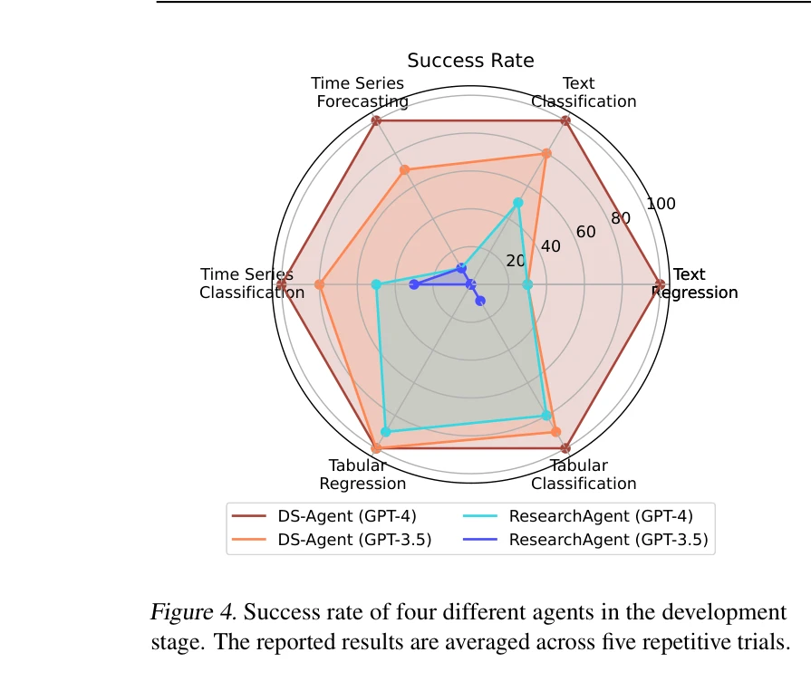

# DS-Agent: Automated Data Science by Empowering Large Language Models with Case-Based Reasoning

> **저자**: Siyuan Guo, Cheng Deng, Ying Wen, Hechang Chen, Yi Chang, Jun Wang | **날짜**: 2024 | **DOI**: N/A

---

## Essence

*DS-Agent의 개요: (a) CBR 기반 LLM의 구조, (b) 반복 단계에 따른 성능 개선*

대규모 언어모델(LLM)의 사례 기반 추론(Case-Based Reasoning, CBR)을 결합하여 자동화된 데이터 과학 작업을 수행하는 DS-Agent 프레임워크를 제시한다. 개발 단계에서는 Kaggle의 전문가 지식을 활용한 반복적 개선을, 배포 단계에서는 저자원 환경에서의 효율적 코드 생성을 달성한다.

## Motivation

- **Known**: LLM 기반 에이전트는 자연언어 처리 등 다양한 분야에서 성공을 거두었으나, 데이터 과학 자동화 작업에서는 여전히 저조한 완료율을 보임 (AutoGPT, LangChain, ResearchAgent 등)

- **Gap**: 기존 LLM 에이전트들은 합리적인 실험 계획 수립 능력 부족과 환각(hallucination) 문제로 인해 데이터 과학 시나리오에서 높은 작업 완료율을 달성하지 못함

- **Why**: 파인튜닝을 통한 해결은 자동화 데이터 과학 작업의 피드백 수집(코드 실행 필요)에 소요되는 막대한 시간과 계산 비용 때문에 비실용적임

- **Approach**: Kaggle의 방대한 기술 보고서와 코드 저장소를 활용하여 CBR 프레임워크와 LLM을 통합하고, 인간의 전문 지식을 체계적으로 활용 및 반복 개선하는 파이프라인 구성

## Achievement

*개발 단계에서의 성공률 및 배포 단계에서의 원패스율*

1. **개발 단계 성능**: GPT-4 기반 DS-Agent는 12개 개발 작업에서 100% 성공률 달성; 반복 단계 증가에 따른 지속적 성능 개선 입증

2. **배포 단계 성능**: 
   - GPT-3.5 및 GPT-4의 원패스율(one pass rate)이 각각 85%, 99%로 기준(baseline) 56%, 60% 대비 현저한 개선
   - Mixtral-8x7b-Instruct 같은 오픈소스 LLM의 성능을 6%에서 31%로 5배 이상 향상

3. **효율성**: 표준 시나리오에서 GPT-3.5/GPT-4당 실행 비용 $0.06/$1.60; 저자원 시나리오에서 $0.0045/$0.135로 감소

## How

*CBR 기반 LLM의 구조: RAG와의 비교*

### 개발 단계: 자동 반복 파이프라인

- **인간 지식 사례 수집 (Human Insight Case Collection)**: 
  - Kaggle 완료된 경쟁에서 우승팀의 기술 보고서 및 상위 랭크 코드 수집
  - 텍스트, 시계열, 테이블형 데이터 3가지 모달리티 포함
  - 기술 보고서 정제 및 GPT-3.5를 통한 코드 요약으로 통찰력 추출

- **Step 1 - Retrieve (검색)**: 
  - 사전학습된 임베딩 모델을 사용하여 작업 설명과 사례 간 코사인 유사도 계산
  - 상위-k개 가장 유사한 사례 검색

- **Step 2 - ReviseRank (순위 재조정)**:
  - 검색된 사례의 순위를 실행 피드백에 기반하여 동적으로 조정
  - 파인튜닝 대신 LLM의 피드백 해석 능력을 활용하여 검색기 재조정 (계산 효율성 향상)

- **Step 3-6 - Reuse, Execute, Evaluate, Retain (재사용, 실행, 평가, 보유)**:
  - 재조정된 사례를 바탕으로 실험 계획 생성 및 파이썬 코드 작성
  - 코드 실행 후 검증 세트에서 성능 평가
  - 성공한 솔루션을 사례 은행에 저장하여 향후 재사용

- **반복 메커니즘**: 피드백 기반 반복을 통해 일관된 성능 개선 달성

### 배포 단계: 저자원 배포

- **단순화된 CBR**: 반복적 피드백 없이 과거 성공 솔루션 직접 적용
- **지식 이전**: 개발 단계에서 축적된 성공 사례를 새로운 작업에 직접 적응
- **최소 수정 필요**: 유사 솔루션 컨텍스트로 인해 LLM의 기초 역량 요구 최소화

### 수학적 프레임워크

$$p_{CBR}(y^t|\tau) = \sum_{l^{t-1}} p_E(l^{t-1}|\tau) \sum_{c^t} p_R(c^t|\tau, l^{t-1})p_{LLM}(y^t|c^t, \tau, l^{t-1})$$

- CBR 기반 LLM은 이전 단계의 피드백(l^{t-1})과 검색된 사례(c^t)로 해결책 분포를 수렴
- RAG와 달리 반복 루프와 평가 피드백을 통합하여 동적 개선 가능

## Originality

- **CBR 패러다임과 LLM 통합**: 고전적 AI 방법론(CBR)과 현대적 LLM을 결합한 새로운 접근 방식으로, RAG 기반 방식의 일회성 검색 한계를 극복

- **데이터 과학 자동화에 특화된 설계**: 두 단계(개발/배포) 분리를 통해 학습과 실운영의 서로 다른 요구사항 동시 충족

- **파인튜닝 회피**: 계산 비용이 많이 드는 파인튜닝 대신 사례 보유 메커니즘으로 유연한 학습 달성

- **Kaggle 데이터 활용**: 전문가 지식의 체계적 수집 및 구조화로 LLM의 선행 지식 부족 보완

## Limitation & Further Study

- **작업 범위 제한**: 평가가 30개 데이터 과학 작업으로 제한되어 있으며, 더 다양한 도메인 및 데이터 모달리티에 대한 확장성 검증 필요

- **Kaggle 의존성**: 사례 수집이 Kaggle에 국한되어 있으며, 다른 데이터 과학 리소스나 내부 조직 지식 통합 메커니즘 부재

- **검색 메커니즘의 단순성**: 코사인 유사도 기반 검색은 복잡한 작업 간 의미적 유사성을 충분히 포착하지 못할 가능성 존재

- **LLM 의존성**: 성능이 기저 LLM의 능력에 크게 좌우되며, 더 약한 LLM에서의 성능 개선 여지 있음

- **향후 연구 방향**:
  - 계층적 검색이나 하이브리드 유사도 메트릭 도입으로 검색 정확도 개선
  - 다양한 데이터 과학 프로젝트 저장소(GitHub 등) 통합
  - 도메인별 특화 사례 은행 구축
  - 배포 단계에서의 동적 반복 메커니즘 추가 탐색

## Evaluation

- **Novelty (독창성)**: 4.5/5
  - CBR과 LLM 통합은 신선하나, 개별 요소는 기존 개념의 조합 성격
  - 데이터 과학 자동화 문제 해결에 특화된 설계는 높은 창의성 반영

- **Technical Soundness (기술적 건전성)**: 4/5
  - 수학적 프레임워크와 구현이 명확하나, 검색 및 순위 재조정 메커니즘이 상대적으로 단순
  - CBR과 LLM 통합의 이론적 정당성은 충분하나, 파인튜닝 회피가 항상 최적은 아닐 수 있음

- **Significance (중요도)**: 4/5
  - 데이터 과학 자동화는 실용적 가치 높음
  - 성능 개선이 실질적이나, 평가 범위가 제한적
  - 오픈소스 LLM 개선(6% → 31%)은 접근성 측면에서 중요

- **Clarity (명확성)**: 4.5/5
  - 전반적으로 잘 설명되었으나, 배포 단계 메커니즘이 개발 단계 대비 상대적으로 덜 상세
  - 도표와 예시가 개념 이해에 도움

- **Overall (종합)**: 4.2/5

**총평**: DS-Agent는 LLM과 CBR의 효과적 결합을 통해 데이터 과학 자동화의 실질적 성능 개선을 달성한 의미 있는 연구이다. 특히 저자원 환경에서의 배포 가능성과 오픈소스 LLM 성능 향상은 실용적 가치가 높으나, 제한된 평가 범위와 단순한 검색 메커니즘이 향후 개선 대상이다.

## Related Papers

- 🔄 다른 접근: [[papers/463_Large_language_model_agent_for_hyper-parameter_optimization/review]] — DS-Agent의 사례 기반 추론을 통한 데이터 과학 자동화와 하이퍼파라미터 최적화에 특화된 LLM 에이전트는 같은 문제를 다른 범위에서 해결하는 접근이다.
- 🔗 후속 연구: [[papers/594_OSDA_Agent_Leveraging_Large_Language_Models_for_De_Novo_Desi/review]] — 개선된 DS-Agent가 기존 Kaggle 기반 자동 데이터 과학 프레임워크를 더 강화된 사례 기반 추론과 배포 최적화로 발전시킨 확장 버전이다.
- 🏛 기반 연구: [[papers/253_Data_Interpreter_An_LLM_Agent_For_Data_Science/review]] — Data Interpreter의 데이터 과학 작업 해석 능력이 DS-Agent의 자동화된 데이터 분석 및 코드 생성 기능의 기본적인 기술적 토대이다.
- 🔄 다른 접근: [[papers/463_Large_language_model_agent_for_hyper-parameter_optimization/review]] — 하이퍼파라미터 최적화에 특화된 LLM 에이전트와 DS-Agent의 포괄적 데이터 과학 자동화는 같은 영역을 다른 범위에서 다루는 접근이다.
- 🏛 기반 연구: [[papers/146_Autosdt_Scaling_data-driven_discovery_tasks_toward_open_co-s/review]] — AutoSDT가 제공하는 데이터 발견 태스크가 DS-Agent 같은 데이터 사이언스 에이전트 학습의 기반이 됨
- 🔗 후속 연구: [[papers/259_DeepAnalyze_Agentic_Large_Language_Models_for_Autonomous_Dat/review]] — DS-Agent의 기본 데이터 사이언스 자동화를 분석가 수준의 심층 연구로 발전시킴
- 🧪 응용 사례: [[papers/542_Mlagentbench_Evaluating_language_agents_on_machine_learning/review]] — 데이터 사이언스 자동화 에이전트 DS-Agent의 성능을 ML 실험 관점에서 평가
