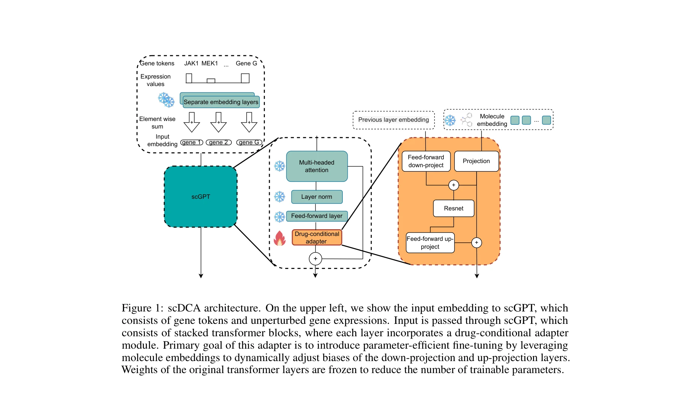
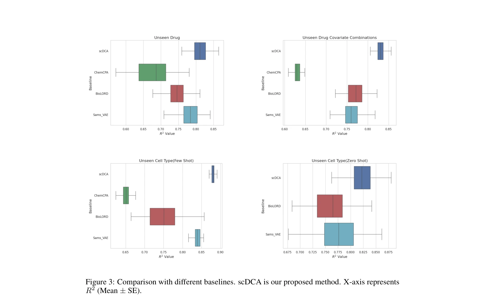

# Efficient fine-tuning of single-cell foundation models enables zero-shot molecular perturbation prediction

> **저자**: Sepideh Maleki, Jan-Christian Huetter, Kangway V. Chuang, David Richmond, Gabriele Scalia, Tommaso Biancalani (Genentech) | **날짜**: 2024 | **DOI**: N/A

---

## Essence

*scDCA 아키텍처: scGPT의 각 transformer 블록에 drug-conditional adapter를 통합하여 분자 임베딩으로 동적으로 down-projection과 up-projection 계층의 편향을 조정*

단일세포 기초 모델(foundation model)을 약물 조건부 어댑터(drug-conditional adapter)로 효율적으로 미세조정하여, 미래 약물에 대한 세포 반응 예측 및 미보유 세포주(unseen cell line)에 대한 제로샷 일반화를 가능하게 한다.

## Motivation

- **Known**: 고처리량 단일세포 RNA 시퀀싱(scRNA-seq)은 세포 이질성 이해를 깊화했고, 분자 섭동(perturbation)에 대한 세포 반응 예측은 약물 발견과 개인화 의학 가속화에 매우 중요함. 최근 단일세포 기초 모델들(scBERT, scGPT 등)이 수천만 개 세포에서 사전학습되어 좋은 생물학적 표현을 학습함.

- **Gap**: 기존 분자 섭동 예측 방법들(ChemCPA, Biolord, GEARS)은 ①새로운 약물에 대한 일반화 불가능, ②데이터 부족(수백 개 분자, 소수 세포주), ③미보유 세포주에 대한 예측 불가능 문제를 해결하지 못함. 단일세포 기초 모델을 직접 응용할 수 없는 이유는 화학 구조라는 다른 모달리티(modality)를 처리해야 하기 때문.

- **Why**: 약물과 같은 화학 섭동의 광대한 공간(~10⁶⁰개 약물유사 화합물)을 다루기 위해서는 기초 모델의 풍부한 생물학적 표현을 활용하되, 사전학습 중 보지 못한 분자 모달리티를 통합하는 효율적인 방법 필요.

- **Approach**: 기초 모델의 각 트랜스포머 블록에 약물 조건부 어댑터를 삽입하여, 분자 임베딩으로 어댑터 파라미터를 동적으로 제어. 전체 모델 파라미터의 1% 미만만 학습하여 과적합 방지 및 기초 모델의 지식 보존.

## Achievement

*다양한 베이스라인(ChemCPA, Biolord, SAMS-VAE)과의 성능 비교에서 scDCA는 모든 설정에서 최고 성능*

1. **미보유 약물 및 세포주 예측 성능 향상**: 기존 방법 대비 특히 미보유 세포주에 대한 few-shot 및 zero-shot 일반화에서 현저한 성능 개선 달성. ChemCPA, Biolord, SAMS-VAE 등 기존 최고 성능 방법들을 모든 평가 설정에서 초월.

2. **매개변수 효율성과 생물학적 지식 보존의 이중성 달성**: 전체 기초 모델 파라미터 중 1% 미만만 학습 가능하게 하여 제한된 데이터셋에서의 과적합 방지. 동시에 사전학습된 transformer 가중치를 동결함으로써 수천만 세포에서 학습한 풍부한 생물학적 표현 유지.

## How

*Drug-conditional adapter 모듈의 상세 구조*

- **기본 프레임워크**: scGPT(또는 다른 트랜스포머 기반 단일세포 기초 모델)의 각 계층에 drug-conditional adapter 모듈 삽입. 어댑터는 다운-프로젝션(down-projection)과 업-프로젝션(up-projection) 계층의 편향(bias)을 분자 임베딩에 의존적으로 조정.

- **분자 조건화 메커니즘**: 약물의 화학 구조를 임베딩 공간으로 인코딩. 이 분자 임베딩이 adapter의 파라미터를 동적으로 제어하여, 약물-특이적 신호를 기초 모델에 주입하되 원본 가중치는 동결.

- **입력 표현**: 미처리(control/unperturbed) 유전자 발현 벡터(x)와 유전자 토큰을 scGPT의 입력 임베딩으로 구성. 각 adapter에서 약물 임베딩이 추가로 입력되어 처리됨.

- **few-shot 및 zero-shot 일반화**: 제한된 약물-세포주 쌍 데이터만으로 adapter 파라미터 학습. 기초 모델의 일반적 생물학적 표현과 약물-특이적 어댑터의 조합으로 미보유 세포주에서도 예측 가능.

## Originality

- **다중 모달리티 통합의 혁신**: 단일세포 기초 모델(세포 데이터만 학습)에 화학 구조라는 완전히 다른 모달리티를 효율적으로 연결하는 약물 조건부 어댑터 개념 도입. 기존 adapter 기법(주로 동일 모달리티 내 task adaptation)을 모달리티 간 학습으로 확장.

- **평가 체계의 확장**: 선행 연구들이 "새로운 약물" 또는 "새로운 약물-세포주 조합" 예측에만 초점을 맞춘 반면, 이 논문은 **미보유 세포주에 대한 예측**이라는 더 도전적이고 현실적인 시나리오 도입. 이는 진정한 zero-shot 일반화 능력 평가.

- **파라미터 효율성과 데이터 효율성의 시너지**: <1% 파라미터 학습이 제한된 perturbation 데이터셋에서의 과적합을 방지하면서 동시에 기초 모델의 풍부한 표현 활용. 이는 약물 발견 실무에서의 실질적 제약(비용, 시간, 샘플 수)을 직접 해결.

## Limitation & Further Study

- **분자 임베딩의 선택**: 약물 화학 구조를 어떻게 임베딩하는지(SMILES, 분자 핑거프린트, 그래프 신경망 등)에 대한 상세한 설명과 비교 분석이 본문에 제시되지 않음. 임베딩 방식의 성능 민감도 분석 필요.

- **메커니즘 해석성 부족**: Adapter가 실제로 어떤 생물학적 메커니즘을 학습하는지(약물 타겟, 신호 경로 등)에 대한 깊은 분석 부재. 예측 결과의 생물학적 타당성 검증 강화 필요.

- **세포주 범위의 제한성**: 평가에 사용된 세포주의 다양성(장기 유형, 질병 상태 등) 및 크기에 대한 명확한 정보 부족. 더 다양한 생물학적 맥락에서의 일반화 가능성 검증 필요.

- **약물-세포 상호작용의 복잡성**: 약물 응답이 단순 조건부 변환이 아닌 복잡한 비선형 동역학을 따를 수 있다는 점. 시계열 모델링이나 고차 상호작용 모델링 탐색 필요.

- **임상 타당성 검증**: 예측된 유전자 발현이 실제 약물의 임상 효과(독성, 효능)와의 상관관계 검증 필요.

## Evaluation

- Novelty: 4.5/5
- Technical Soundness: 4/5
- Significance: 4.5/5
- Clarity: 4/5
- Overall: 4.25/5

**총평**: 이 논문은 단일세포 기초 모델을 약물 발견에 적용하기 위한 실질적이고 우아한 해결책을 제시하며, 특히 미보유 세포주에 대한 zero-shot 예측 능력과 파라미터 효율성 측면에서 현저한 기여를 한다. 다만 분자 임베딩 전략, 예측 메커니즘 해석, 그리고 임상 타당성 검증 강화가 향후 연구의 중요한 과제이다.

## Related Papers

- 🧪 응용 사례: [[papers/163_Biodsa-1k_Benchmarking_data_science_agents_for_biomedical_re/review]] — 단일세포 기초 모델의 약물 반응 예측을 생의학 연구 가설 검증에 적용할 수 있다
- 🔗 후속 연구: [[papers/292_Drugpilot_Llm-based_parameterized_reasoning_agent_for_drug_d/review]] — LLM 기반 신약 개발 에이전트와 단일세포 모델을 결합하여 더 정확한 약물 효과 예측을 할 수 있다
- 🏛 기반 연구: [[papers/696_Scaling_Large_Language_Models_for_Next-Generation_Single-Cel/review]] — 대규모 언어모델과 단일세포 분석의 통합적 접근법에 대한 기반을 제공한다
- 🧪 응용 사례: [[papers/431_Integrated_analysis_of_multimodal_single-cell_data/review]] — 다중모달 단일세포 데이터 분석에 약물 조건부 어댑터를 적용할 수 있다
- 🧪 응용 사례: [[papers/700_scBaseCount_an_AI_agent-curated_uniformly_processed_and_auto/review]] — 표준화된 단일세포 데이터를 파운데이션 모델의 효율적 파인튜닝에 활용할 수 있다
- 🧪 응용 사례: [[papers/287_Dont_Stop_Pretraining_Adapt_Language_Models_to_Domains_and_T/review]] — 언어모델 도메인 적응 방법을 단일세포 파운데이션 모델 미세조정에 적용한다.
- 🔄 다른 접근: [[papers/699_SCANPY_large-scale_single-cell_gene_expression_data_analysis/review]] — 단일세포 분석을 Python 기반 스케일링 vs LLM 기반 파운데이션 모델로 접근한다.
- 🧪 응용 사례: [[papers/163_Biodsa-1k_Benchmarking_data_science_agents_for_biomedical_re/review]] — 단일세포 모델의 약물 반응 예측 능력을 생의학 가설 검증 벤치마크에서 평가할 수 있다
- 🔗 후속 연구: [[papers/292_Drugpilot_Llm-based_parameterized_reasoning_agent_for_drug_d/review]] — 단일세포 모델의 약물 반응 예측을 LLM 기반 신약 개발 에이전트와 통합한 확장 연구다
