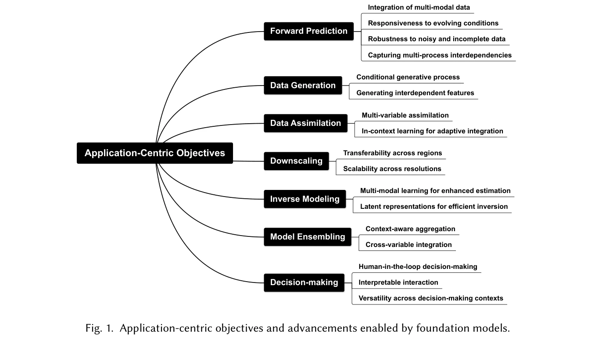
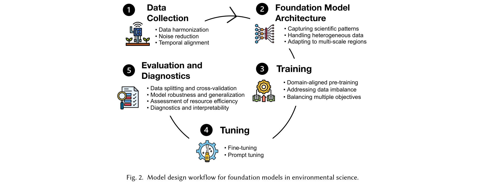

# Foundation Models for Environmental Science: A Survey of Emerging Frontiers

> **저자**: Runlong Yu, Shengyu Chen, Yiqun Xie, Huaxiu Yao, Jared Willard, Xiaowei Jia | **날짜**: 2025-04-05 | **DOI**: [미제공](https://doi.org/)

---

## Essence

본 논문은 환경과학 분야에서 파운데이션 모델(Foundation Models)의 응용을 포괄적으로 검토한 최신 서베이이며, 대규모 사전학습을 통해 복잡한 환경생태계 모델링의 새로운 패러다임을 제시한다.

## Motivation

- **Known**: 전통적인 물리 기반 모델(process-based models)은 높은 해석성을 제공하지만 복잡한 매개변수 보정이 필요하고, 기존 데이터 기반 머신러닝 모델은 특정 작업에만 최적화되어 있다.

- **Gap**: 환경시스템의 상호연결된 복잡한 프로세스를 포괄적으로 모델링하면서도 제한된 관측 데이터 환경에서 효과적으로 적응할 수 있는 통합적 접근법이 부재하다.

- **Why**: 환경생태계는 본질적으로 복잡하며 상호연결된 과정들로 이루어져 있는데, 물리 모델과 데이터 기반 방법의 단점을 모두 보완할 필요가 있다.

- **Approach**: 자연언어처리와 컴퓨터비전에서 혁명을 일으킨 파운데이션 모델을 환경과학에 적용함으로써 대규모 다양한 데이터로부터 보편적 특성 표현을 학습하고, 이를 다양한 환경 응용 문제로 효율적으로 전이학습할 수 있는 솔루션을 제시한다.

## Achievement

*그림 1: 파운데이션 모델이 가능하게 하는 응용 중심의 목표 및 발전*

1. **포괄적 분류 체계 제시**: 환경과학 분야의 파운데이션 모델 응용을 7가지 주요 사용 사례로 정리
   - 순시간예측(forward prediction)
   - 데이터 생성(data generation)
   - 데이터 동화(data assimilation)
   - 공간해상도 개선(downscaling)
   - 역모델링(inverse modeling)
   - 모델 앙상블(model ensembling)
   - 의사결정 지원(decision-making)

2. **개발 프로세스 상세화**: 데이터 수집에서 평가까지 파운데이션 모델 개발의 전체 사이클 문서화
   - 아키텍처 설계
   - 학습 전략
   - 파인튜닝 방법
   - 평가 메트릭

3. **패러다임 진화 맥락화**: 과정 기반 모델 → 데이터 기반 모델 → 하이브리드 물리-ML 모델 → 파운데이션 모델로의 진화 과정을 이론적으로 정립

## How

*그림 2: 환경과학을 위한 파운데이션 모델 설계 워크플로우*

### 주요 방법론

- **다중 데이터 소스 통합**: 위성 원격감지, 현장 측정, 시뮬레이션 데이터를 단일 모델에서 처리하여 데이터 이질성 문제 해결

- **전이학습 활용**: 데이터가 풍부한 환경에서 학습한 파운데이션 모델을 데이터 희소 환경으로 효과적으로 전이하여 데이터 부족 문제 극복

- **지식 안내 머신러닝(KGML) 통합**: 물리 법칙과 도메인 지식을 머신러닝 워크플로우에 내장하여 해석성과 과학적 타당성 확보
  - 물리정보신경망(Physics-Informed Neural Networks, PINNs) 활용
  - 보존 법칙 제약조건 추가

- **유연한 입출력 구조**: 대형언어모델(LLM)과 같은 파운데이션 모델의 프롬프트 엔지니어링을 통해 다양한 환경 변수 동시 예측 가능

- **마이크로바이오타 기반 모델 구성**: 재사용 가능한 컴포넌트로 모듈화하여 다양한 환경 문제에 조합적 적용 가능

## Originality

- 환경과학 분야 파운데이션 모델 응용에 대한 **최초의 포괄적 서베이**: 기존 파운데이션 모델 서베이는 NLP/CV 중심이었으나, 본 논문은 환경 데이터의 특수성(시공간 동적성, 다중 스케일, 이질적 소스)을 명시적으로 다룸

- **학제 간 연결 강조**: 머신러닝 연구자와 환경과학자 간의 협력 메커니즘을 설계

- **모델 개발 사이클의 구체화**: 데이터 수집부터 평가까지 실제 파운데이션 모델 구축 프로세스를 상세 문서화

- **하이브리드 패러다임의 현실적 통합**: 물리 모델과 데이터 기반 모델의 장점을 결합한 실현 가능한 방법론 제시

## Limitation & Further Study

- **현재 제한사항**:
  - 논문에서 다루는 15,000자 범위에서 구체적인 사례 연구(case studies)의 부족이 예상됨
  - 실제 환경 프로젝트에서의 구현 난제(예: 계산 비용, 데이터 프라이버시, 현장 적용성)에 대한 심층 논의 미흡
  - 파운데이션 모델의 신뢰성 평가 및 불확실성 정량화 방법론의 상세함 부족

- **후속 연구 방향**:
  - 환경 특화 파운데이션 모델 아키텍처 개발(예: 시공간 트랜스포머)
  - 소규모 환경 데이터로 효율적인 파인튜닝을 위한 저자원(few-shot) 학습 기법 심화
  - 장기간 시계열 예측에서의 누적 오차 관리 방법론
  - 모델 해석성 향상을 위한 설명 가능 AI(XAI) 기법 적용

## Evaluation

- Novelty: 4.5/5
- Technical Soundness: 4/5
- Significance: 4.5/5
- Clarity: 4/5
- Overall: 4.25/5

**총평**: 본 논문은 빠르게 발전하는 파운데이션 모델 기술과 환경과학의 시급한 과제를 연결하는 의미 있는 시도로, 학제 간 협력의 중요성을 강조하며 향후 연구 방향을 제시하는 가치 있는 서베이이나, 더욱 깊이 있는 기술 사례와 실제 구현 경험에 대한 보완이 필요하다.

## Related Papers

- 🔄 다른 접근: [[papers/015_A_Perspective_on_Foundation_Models_in_Chemistry/review]] — 환경과학과 화학 분야에서 파운데이션 모델의 적용이라는 다른 도메인별 접근 방식을 사용한다
- 🏛 기반 연구: [[papers/829_Towards_Foundation_Models_for_Scientific_Machine_Learning_Ch/review]] — 과학 기계학습을 위한 파운데이션 모델의 일반적 도전과제와 기회를 환경과학에 적용할 수 있다
- 🔗 후속 연구: [[papers/377_Generative_AI_and_the_Foundation_Model_Era_A_Comprehensive_R/review]] — 생성형 AI와 파운데이션 모델의 포괄적 분석을 환경과학 특화 응용으로 확장할 수 있다
- 🔗 후속 연구: [[papers/403_Highly_accurate_protein_structure_prediction_with_AlphaFold/review]] — 단백질 구조 예측의 성공이 환경 과학 분야 파운데이션 모델 개발에 중요한 방법론적 영감을 제공한다
- 🧪 응용 사례: [[papers/377_Generative_AI_and_the_Foundation_Model_Era_A_Comprehensive_R/review]] — 파운데이션 모델의 포괄적 분석을 환경과학 등 특정 과학 분야 적용 사례로 구체화할 수 있다
- 🔗 후속 연구: [[papers/1086_Foundational_models_for_scientific_discovery/review]] — 환경과학 분야 파운데이션 모델로 과학적 발견 모델을 확장한다.
- 🔄 다른 접근: [[papers/299_Earthse_A_benchmark_evaluating_earth_scientific_exploration/review]] — 환경과학 파운데이션 모델과 지구과학 탐사 벤치마크의 다른 접근법
- 🏛 기반 연구: [[papers/831_Towards_llm_agents_for_earth_observation/review]] — 환경과학을 위한 파운데이션 모델 조사가 지구 관측 LLM 에이전트 개발의 이론적 배경을 제공한다.
