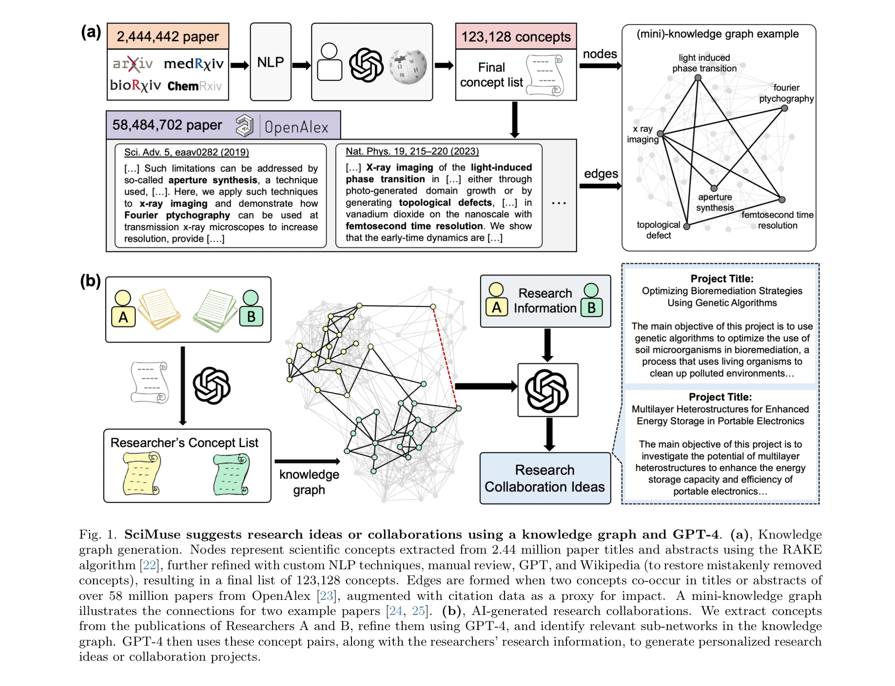
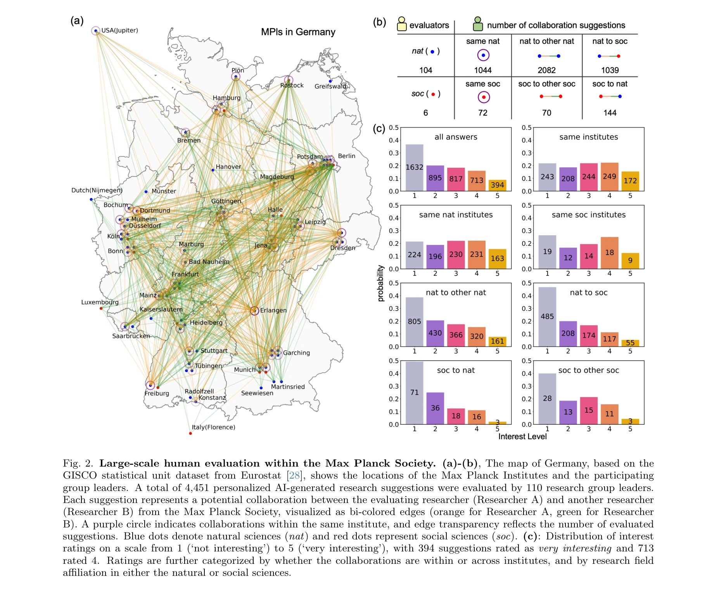
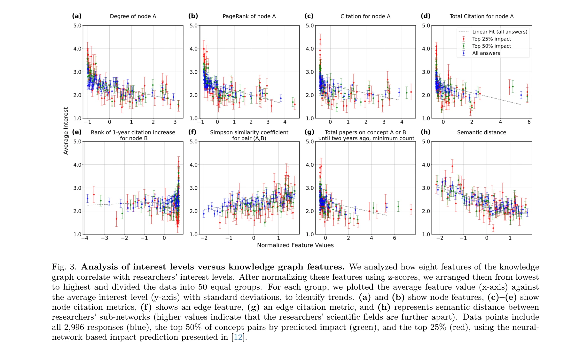

# Generation and human-expert evaluation of interesting research ideas using knowledge graphs and large language models

> **저자**: Xuemei Gu, Mario Krenn | **날짜**: 2024 | **DOI**: [arXiv:2405.17044](https://arxiv.org/abs/2405.17044)

---

## Essence

*SciMuse 시스템: 지식 그래프와 GPT-4를 이용한 연구 아이디어 생성 메커니즘. (a) 5,800만 개 논문에서 123,128개 개념을 추출하여 구성한 지식 그래프, (b) 개인화된 연구 협력 제안 생성 과정*

본 논문은 5,800만 개의 과학논문과 대규모언어모델(LLM)을 활용하여 개인화된 연구 아이디어를 생성하는 SciMuse 시스템을 제시하고, 110명 이상의 연구그룹 리더가 4,400개 이상의 아이디어를 평가한 대규모 인간 평가 연구이다. 이를 통해 AI 생성 연구 아이디어의 매력도를 예측할 수 있는 두 가지 방법(지도학습 신경망, 제로샷 LLM 랭킹)을 개발했다.

## Motivation

- **Known**: 과학문헌의 급속한 증가로 연구자가 새로운 아이디어를 발굴하기 어려워지고 있으며, 특히 학제간 협력을 모색하는 경우 더욱 심각함. 최근 LLM이 발전하면서 수백만 개 논문으로부터 구체적인 연구 아이디어 생성이 가능해짐.

- **Gap**: 기존 AI 생성 아이디어 평가는 6-10명의 박사과정 학생에 불과했으며, 실제 연구 프로젝트를 정의하고 평가하는 경험 많은 연구자(그룹 리더)의 관점이 부재함.

- **Why**: 경험 많은 연구자의 평가는 연구 아이디어의 실제 가치, 매력도를 결정하는 요소를 파악하는 데 필수적이며, 이를 통해 AI 아이디어 생성 시스템의 개선 방향을 찾을 수 있음.

- **Approach**: 지식 그래프 구축 → 개인화된 연구 제안 생성 → 110명 연구그룹 리더의 대규모 평가 → 관심도 예측 모델 개발

## Achievement

*Max Planck Society 내 110명 연구그룹 리더의 대규모 평가 결과. (a)-(b) 54개 Max Planck 연구소 위치 및 평가자 분포 (자연과학 104명, 사회과학 6명), (c) 1-5점 척도의 관심도 평가 분포*

1. **대규모 인간 평가 데이터 구축**: 110명의 경험 많은 연구그룹 리더(평균 59.7편 논문 발표, 3,759.7회 인용)로부터 4,451건의 평가 수집. 전체의 25% (1,107개)가 4-5점의 높은 관심도를 보임.

2. **지식 그래프 특성과 관심도의 관계 규명**: 첫 번째 개념의 차수(degree)와 PageRank가 관심도와 강한 음의 상관관계를 보임. 즉, 더 널리 알려진 개념일수록 덜 흥미로운 아이디어로 평가됨. 같은 분야 연구자 간 제안이 다른 분야보다 더 긍정적으로 평가됨.

3. **효율적인 예측 모델 개발**: 신경망 기반(지식 그래프 특성만 사용)과 제로샷 LLM 랭킹 모두 인간 평가 데이터 없이도 높은 예측 정확도 달성.

## How

*지식 그래프 특성과 연구 관심도의 상관관계 분석. 8가지 특성(노드 특성 a-b, 노드 인용 지표 c-e, 엣지 특성 f, 엣지 인용 지표 g, 의미 거리 h)에 대해 정규화 후 50개 그룹으로 분할하여 평균값 계산*

**지식 그래프 구축 (Knowledge Graph Generation)**
- RAKE 알고리즘으로 244만 개 논문 제목/초록에서 후보 개념 추출
- GPT, Wikipedia, 인간 검수를 통해 123,128개 개념 정제
- 5,800만 개 논문의 공동 출현 정보로 엣지 생성 (인용 정보 포함)
- 1665년부터 2023년 4월까지 과학 진화 과정 포착

**개인화된 제안 생성 (Personalized Research Suggestions)**
- 각 연구자의 최근 2년 논문 분석으로 개념 추출 및 개인화 부분그래프(subgraph) 구축
- GPT-4에 (1) 무작위 개념 쌍, (2) 최고 예측 영향도 개념 쌍, (3) 개념 쌍 미포함 중 하나로 제공
- 자체 반영 기법(self-reflection): GPT-4가 3개 아이디어 생성 → 2회 반복 정제 → 최적 선택

**예측 모델 (Interest Prediction)**
- **방법 1**: 지식 그래프 특성만으로 훈련한 신경망 (생성 텍스트 미사용)
- **방법 2**: 제로샷 GPT 랭킹 (인간 평가 데이터 미사용)

## Originality

- **첫 대규모 인간 전문가 평가**: 기존 6-10명 박사과정 학생 대비 110명의 경험 많은 연구그룹 리더로 평가 규모 대폭 확대 (약 10-15배)

- **새로운 지식 그래프 활용**: 기존 지식 그래프 기반 영향도 예측[12]을 3배 더 큰 규모(5,800만 논문)로 확장하고, 개인화된 아이디어 생성에 통합

- **이중 예측 방법론**: 지도학습(신경망) 대 비지도학습(제로샷 LLM)의 서로 다른 두 접근법이 모두 유효함을 입증. 인간 평가 데이터 부재 시 후자의 실용성 입증

- **흥미로운 역설적 발견**: 높은 연결도의 잘 알려진 개념이 오히려 덜 흥미로운 아이디어 생성(혁신성 시사)

- **학제간 협력 연구의 정량적 분석**: 학제간 거리와 관심도의 구체적 관계 규명

## Limitation & Further Study

- **평가자 편향**: Max Planck Society 소속 110명으로 제한. 다양한 국가, 기관, 문화적 배경의 연구자 포함 필요.

- **자연과학 편중**: 104명 vs 사회과학 6명으로 극도의 불균형. 사회과학, 인문학의 더 깊은 분석 부재.

- **개념 추출의 한계**: RAKE 기반 자동 추출로 인한 오류. 더 정교한 NLP 기술(예: 최신 LLM 기반 개념 추출) 고려 필요.

- **시간적 한계**: 데이터 수집 시점(2023년 2월)이 고정되어 과학의 최신 동향 미반영. 동적 업데이트 메커니즘 필요.

- **인과관계 부재**: 관심도와 지식 그래프 특성의 상관관계 제시이나 인과 관계는 규명 불가. 예: 낮은 차수의 개념이 흥미로운 이유가 신성(novelty)인지 다른 요인인지 불명확.

- **실제 연구 전환율 미측정**: 평가된 아이디어 중 몇 개가 실제 연구로 전환되었는지 추적 부재. 평가 점수와 실제 행동의 괴리 가능성.

- **후속 연구 방향**:
  - 다국가, 다기관 평가자 확대
  - 시간 경과에 따른 아이디어 진화 추적
  - 생성 텍스트 품질의 정성적 분석
  - 아이디어 → 실제 연구 프로젝트 전환 메커니즘 규명
  - 실시간 지식 그래프 업데이트 시스템 개발

## Evaluation

- **Novelty (독창성)**: 4.5/5
  - 대규모 인간 전문가 평가 및 이중 예측 방법론은 새로움
  - 다만 개별 기술(지식 그래프[12], LLM 프롬프트)은 기존 조합

- **Technical Soundness (기술적 타당성)**: 4/5
  - 방법론 논리적 타당성 우수
  - 통계 분석(50개 그룹 분할, z-score 정규화) 신뢰성 있음
  - 다만 신경망 아키텍처, 초매개변수 설정 미상세 기술

- **Significance (중요성)**: 4.5/5
  - 과학 커뮤니티의 실질적 문제(아이디어 발굴) 해결
  - 110명 연구자 평가로 높은 신뢰성 보유
  - 재현 가능성, 확장성 우수
  - 다만 Max Planck 제한으로 일반화 한계

- **Clarity (명확성)**: 4/5
  - 전체 파이프라인 명확히 설명
  - Figure 품질 우수 (특히 Fig. 1-3)
  - 보충 정보에 대한 참조 빈번하지만 원문에 충분한 내용 포함

- **Overall (종합)**: 4.25/5

**총평**: 본 논문은 AI 기반 연구 아이디어 생성의 현실성을 입증한 주요 연구로, 대규모 인간 전문가 평가를 통한 엄밀한 검증과 실용적 예측 모델을 제시한 점이 강점이다. 다만 평가자 다양성 부족과 인과관계 규명의 한계로 인해 완전한 일반화에는 제약이 있으나, 향후 AI-과학자 협력 연구의 모범 사례를 제공한다.

## Related Papers

- ⚖️ 반론/비판: [[papers/409_How_ai_ideas_affect_the_creativity_diversity_and_evolution_o/review]] — SciMuse가 개인화된 연구 아이디어 생성의 매력도에 초점을 맞춘 반면, AI 아이디어 노출 연구는 창의성보다 다양성 감소 위험을 경고하는 상반된 관점을 제시함
- 🏛 기반 연구: [[papers/419_Hypothesis_Generation_with_Large_Language_Models/review]] — LLM을 활용한 가설 생성에 대한 체계적 연구가 SciMuse의 연구 아이디어 생성 메커니즘의 이론적 기반과 방법론적 근거를 제공함
- 🔗 후속 연구: [[papers/725_Sciidea_Context-aware_scientific_ideation_using_token_and_se/review]] — SCI-IDEA의 맥락 인식 과학 아이디어 생성이 SciMuse의 개인화 접근법을 토큰 기반 세분화와 맥락 이해로 더욱 정교하게 발전시킨 연구임
- 🏛 기반 연구: [[papers/187_Can_LLMs_Generate_Novel_Research_Ideas_A_Large-Scale_Human_S/review]] — 흥미로운 연구 아이디어의 생성과 인간 전문가 평가 방법론으로 본 논문의 대규모 인간 연구 설계 기반을 제공한다.
- ⚖️ 반론/비판: [[papers/409_How_ai_ideas_affect_the_creativity_diversity_and_evolution_o/review]] — SciMuse의 AI 생성 아이디어 매력도 예측과 달리 이 연구는 AI 노출이 개별 창의성 향상 없이 집단 다양성만 증가시킨다는 우려를 제기함
