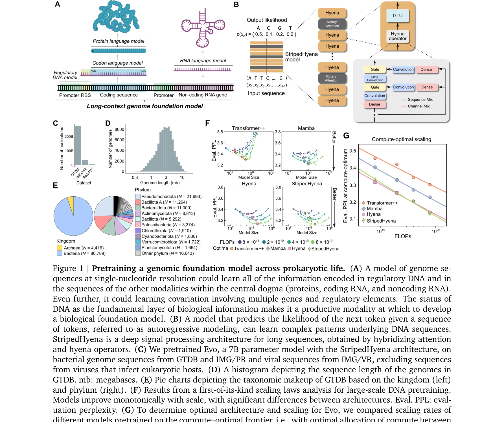
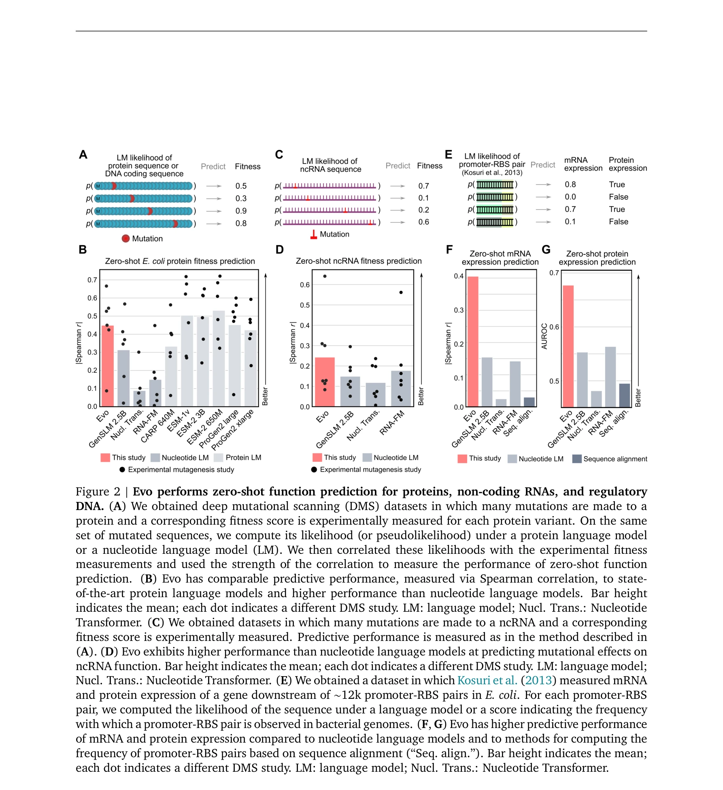
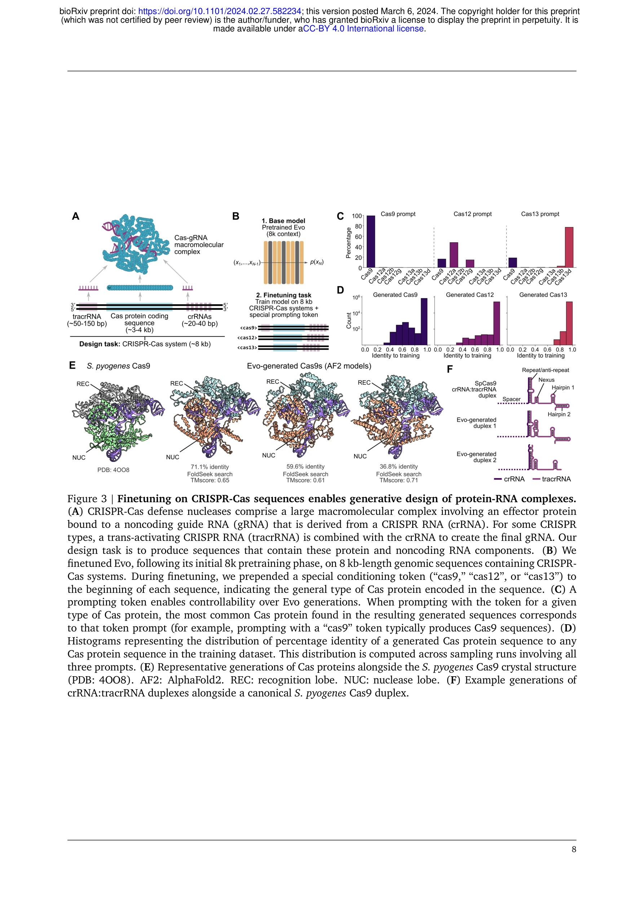

# Genome modeling and design across all domains of life with Evo 2

> **저자**: G. Brixi, Matthew G. Durrant, Jerome Ku, Michael Poli, Greg Brockman | **날짜**: 2025 | **DOI**: [10.1101/2025.02.18.638918](https://doi.org/10.1101/2025.02.18.638918)

---

## Essence

*그림 1: 원핵생물 생명에 걸친 게놈 파운데이션 모델 사전학습. (A) 단일 뉴클레오타이드 해상도의 게놈 수열 모델은 규제 DNA 및 중심 원리의 다른 양식(단백질, 코딩 RNA, 논코딩 RNA) 내의 모든 정보를 학습할 수 있음. (B) StripedHyena는 장문 수열용 심층 신호 처리 아키텍처. (C) 박테리아 및 바이러스 게놈으로 사전학습된 70억 파라미터 Evo 모델.*

Evo는 131 킬로베이스(kb) 문맥 길이를 가진 70억 파라미터 게놈 파운데이션 모델로, 단일 뉴클레오타이드 해상도에서 분자 규모부터 전체 게놈 규모까지 DNA 수열의 예측 및 생성을 가능하게 한다. StripedHyena 아키텍처를 기반으로 하여 기존 방법보다 수백 배 긴 650 kb 길이의 코딩 수열을 생성할 수 있다.

## Motivation

- **Known**: 최근 머신러닝과 대규모 게놈 데이터셋의 결합으로 생물학적 파운데이션 모델 개발의 가능성이 제시됨. 기존 연구들(AlphaFold, ESM 등)은 단백질, RNA, 규제 DNA 등 특정 양식(modality)에 특화된 모델들만 개발.

- **Gap**: 현재의 생물 수열 모델들은 (1) 양식 간 통합 학습 부재, (2) 짧은 문맥 길이 제한, (3) 단일 분자/단순 복합체 설계만 가능, (4) Transformer의 이차 계산 복잡도로 인한 확장성 문제.

- **Why**: 유전자 발현 조절, CRISPR 면역, 유전자 이동 등 복잡한 생물 과정은 여러 양식에 걸친 상호작용을 필요로 함. 이를 위해서는 대규모 게놈 영역을 처리하고 진화적 효과(예: 단일 뉴클레오타이드 변이)를 포착할 수 있는 통합 모델이 필수.

- **Approach**: 심층 신호 처리(deep signal processing) 기반 StripedHyena 하이브리드 아키텍처를 사용하여 (1) Hyena 층과 주의(attention) 층의 결합, (2) 바이트 레벨 단일 뉴클레오타이드 토큰화, (3) 2.7백만 개 원핵생물 및 박테리오파지 게놈 학습.

## Achievement

*그림 2: Evo의 영-샷(zero-shot) 함수 예측 성능. 단백질, 논코딩 RNA, 규제 수열에 대한 예측.*

*그림 3: CRISPR-Cas 수열에 대한 미세조정으로 단백질-RNA 복합체의 생성적 설계 가능.*

1. **영-샷 함수 예측**: 
   - 단백질 돌연변이 적응력(fitness) 예측에서 최고 수준의 단백질 언어모델(ESM-2)과 경쟁 또는 우수
   - 논코딩 RNA 적응력 예측에서 전문 RNA 언어모델 초과 성능
   - 규제 수열만으로 프로모터-리보솜 결합부위(RBS) 쌍의 활성 유전자 발현 조합 예측 가능

2. **다중 요소 생성 설계** (최초):
   - 합성 CRISPR-Cas 분자 복합체 생성
   - 전이성 요소(transposable element) 시스템 전체 생성
   - 원래 게놈에 없는 새로운 IS200/IS605 서열 구조 설계 가능

3. **게놈 규모 학습**:
   - 전체 게놈 정보로부터 유전자 필수성(gene essentiality)을 감독 없이 뉴클레오타이드 해상도로 예측
   - 최대 650 kb 길이의 코딩 부분이 풍부한 수열 생성 (기존 방법의 수백 배 향상)

## How

- **아키텍처**: StripedHyena는 29개의 하이에나(Hyena) 층과 3개의 다중-헤드 주의(multi-head attention) 층의 하이브리드 구조
  - Hyena 층: 단기 및 장기 합성곱(convolution) 필터의 조합으로 DNA의 노이즈 패턴 필터링 및 뉴클레오타이드를 모티프로 집계
  - 주의 층: 문맥으로부터 정보 회상 보강

- **학습 데이터(OpenGenome)**:
  - 80,000개 이상의 박테리아 및 고세균 게놈
  - 수백만 개의 예측된 원핵생물 박테리오파지 및 플라스미드 수열
  - 총 3천억 뉴클레오타이드 토큰 (300B)
  - 안전성 고려: 진핵생물 감염 바이러스 제외

- **학습 전략**:
  - 2단계 사전학습: 1단계는 8k 토큰 문맥 길이, 2단계는 131k 토큰 문맥 길이
  - 다음-토큰 예측(next-token prediction) 목표함수 사용
  - 하류 과제별로 기본 모델 선택 후 미세조정

- **스케일링 법칙 분석** (DNA 수열 모델 최초):
  - 300개 이상 모델을 4가지 아키텍처(Transformer++, Mamba, Hyena, StripedHyena)로 비교
  - Transformer++는 바이트 해상도에서 모든 계산 예산에서 유의미하게 낮은 성능
  - StripedHyena와 Hyena가 최고 스케일링 성능 보임
  - Evo 7B에 대해 계산-최적 토큰 수를 2,500억으로 추정

## Originality

- **최초의 통합 게놈 파운데이션 모델**: DNA-RNA-단백질 중심 원리의 모든 양식을 단일 모델로 학습하며, 기존의 양식별 전문 모델과 달리 상호 진화 연결고리 포착 가능

- **장문 수열 처리**: 131 kb 문맥 길이와 단일 뉴클레오타이드 해상도를 동시에 달성한 최초의 모델로, Transformer의 이차 계산 복잡도 한계를 극복

- **다중 스케일 생성 설계**: 
  - 개별 단백질/RNA 설계에서 벗어나 CRISPR-Cas 복합체, 전이성 요소 등 다중-요소 생물 시스템 생성 가능
  - 650 kb 길이의 유전체 규모 수열 생성 (기존 방법 대비 수백 배)

- **DNA 수열 모델링을 위한 첫 스케일링 법칙 분석**: 게놈 데이터에 최적화된 아키텍처 선택의 과학적 근거 제시

## Limitation & Further Study

- **데이터 편향**: 원핵생물 및 박테리오파지만 학습하여 진핵생물, 특히 포유동물 게놈에 대한 성능 미상. 향후 다양한 생명 영역으로 확장 필요.

- **생물적 타당성 검증 부족**: 생성된 장문 수열과 설계된 생물 시스템의 생화학적 기능 검증이 제한적. 실험적 검증 필요.

- **계산 효율성 vs 정확도**: 스케일링 분석에서 계산-최적 범위 밖에서의 학습 영향 완전히 규명되지 않음.

- **양식 간 상호작용 메커니즘**: 모델이 DNA-RNA-단백질 간 상호작용을 어떻게 학습하는지 해석 가능성 부족. 향후 어텐션 맵 분석 등으로 생물학적 메커니즘 규명 필요.

- **후속 연구 방향**:
  - Evo를 진핵생물 게놈으로 확장
  - 미세조정된 모델의 실험적 검증(합성 CRISPR 시스템, 전이성 요소 기능 확인)
  - 질병 연관 유전자 발견 및 약물 표적 설계 응용
  - 모델 해석 가능성 향상으로 생물학적 통찰력 도출

## Evaluation

- Novelty: 5/5
- Technical Soundness: 4.5/5
- Significance: 5/5
- Clarity: 4/5
- Overall: 4.6/5

**총평**: Evo는 깊은 신호 처리 기반 아키텍처를 활용하여 DNA 수열 모델링의 확장성 문제를 혁신적으로 해결하고, 최초로 다중-양식·다중-스케일의 통합 게놈 파운데이션 모델을 제시함으로써 합성생물학과 게놈 공학 분야에 패러다임 전환을 기대하게 한다. 다만 생성 수열의 생물학적 타당성 검증과 진핵생물으로의 확장이 향후 실용화의 핵심 과제이다.

## Related Papers

- 🔄 다른 접근: [[papers/749_Sequence_modeling_and_design_from_molecular_to_genome_scale/review]] — 동일한 Evo 모델이지만 다른 해상도와 응용 관점에서 접근함
- 🔗 후속 연구: [[papers/271_Developing_ChemDFM_as_a_large_language_foundation_model_for/review]] — 화학 분야 LLM과 유전체 모델링을 결합한 더 큰 생명과학 프레임워크 구축 가능
- 🔄 다른 접근: [[papers/749_Sequence_modeling_and_design_from_molecular_to_genome_scale/review]] — 동일한 Evo 모델의 다른 버전으로 성능 개선사항 비교 분석 가능
- 🔗 후속 연구: [[papers/094_AlphaGenome_advancing_regulatory_variant_effect_prediction_w/review]] — AlphaGenome의 다중 모달리티 예측이 전체 생명체의 게놈 모델링으로 확장됩니다.
- 🔗 후속 연구: [[papers/302_Effective_gene_expression_prediction_from_sequence_by_integr/review]] — DNA 서열로부터 유전자 발현 예측 기술이 모든 생명체 도메인에 걸친 게놈 모델링 및 설계로 확장되었다
