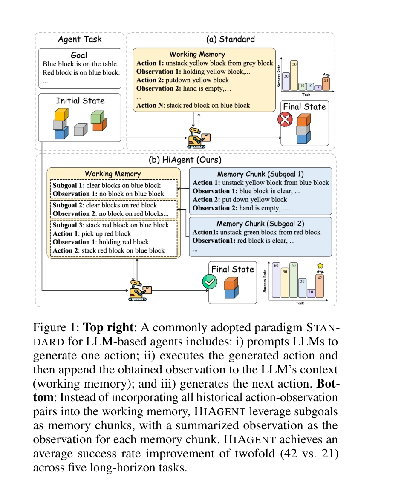
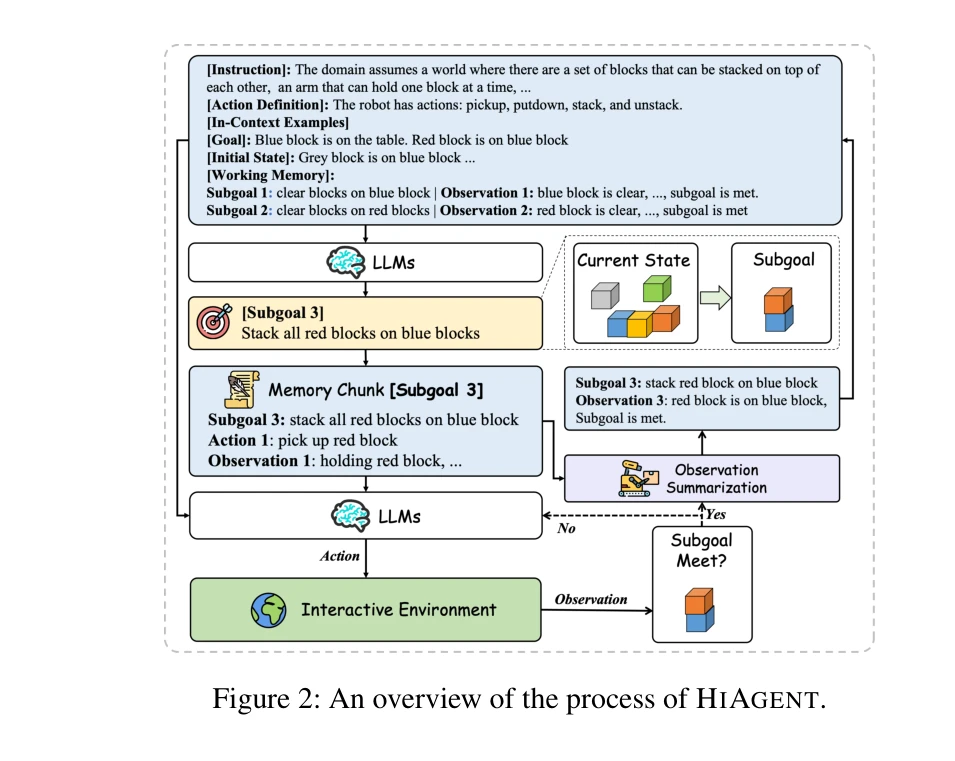
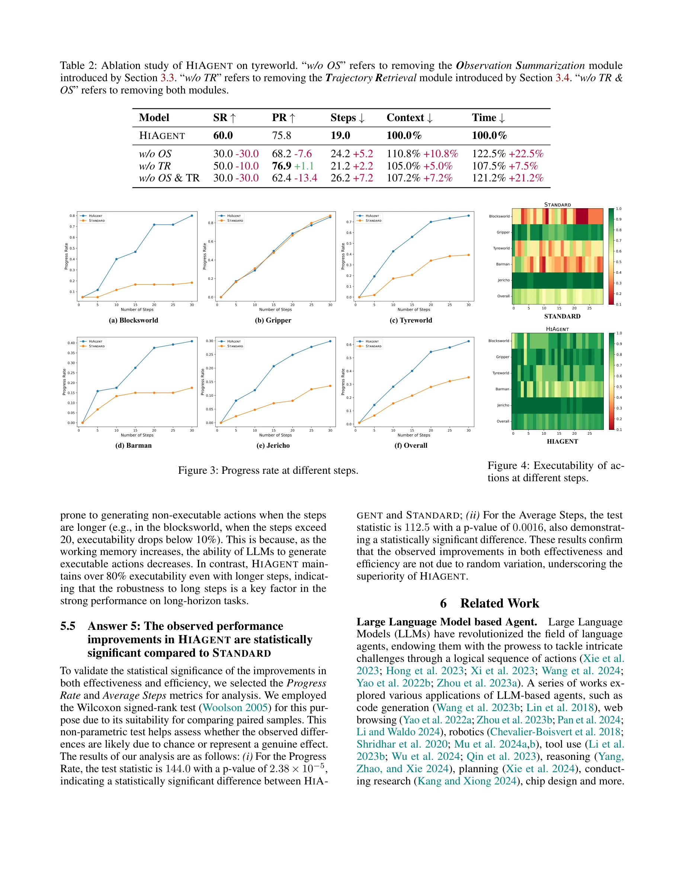

# Hiagent: Hierarchical working memory management for solving long-horizon agent tasks with large language model

> **저자**: Mengkang Hu, Tianxing Chen, Qiguang Chen, Yi Mu, Wenqi Shao, Ping Luo | **날짜**: 2024 | **DOI**: [미공개](https://arxiv.org/abs/2408.09559)

---

## Essence

*표준 방식(STANDARD)과 HIAGENT의 비교: HIAGENT는 부분목표(subgoal)를 메모리 청크로 사용하여 작업 메모리를 계층적으로 관리하며, 다섯 개의 장기 수평 과제에서 성공률을 2배 증가시킴*

장기 수평 과제(long-horizon task)를 수행하는 대규모 언어 모델(LLM) 기반 에이전트의 작업 메모리(working memory)를 부분목표 기반의 계층적 구조로 관리하여, 컨텍스트 길이를 줄이면서 성공률을 획기적으로 향상시키는 방법론을 제시한다.

## Motivation

- **Known**: 기존 LLM 기반 에이전트는 작업 메모리를 모든 과거 행동-관찰 쌍(action-observation pairs)의 직접 입력으로 관리하며, 크로스 시행(cross-trial) 메모리 최적화에 관한 연구는 활발함
- **Gap**: 작업 메모리(in-trial memory) 자체의 효율적 활용에 대한 연구는 미흡하며, 장기 과제에서 누적된 입력은 중복성으로 인해 LLM의 성능을 저하시킴
- **Why**: 장기 과제는 많은 수의 행동이 필요하므로 작업 메모리가 급증하고, 긴 컨텍스트는 LLM이 일관된 전략을 유지하고 정확한 예측을 하기 어렵게 함
- **Approach**: 인지과학의 청킹(chunking) 개념과 인간의 문제해결 전략에서 영감을 얻어, 부분목표를 메모리 청크 단위로 활용한 계층적 작업 메모리 관리 프레임워크 HIAGENT 제안

## Achievement

*HIAGENT의 처리 과정 개요: 부분목표 생성 → 행동 생성 → 관찰 요약 → 메모리에 부분목표-요약관찰 쌍 저장*

1. **성능 향상**: 다섯 개 장기 과제에서 성공률이 표준 방식 대비 2배 증가(42% vs 21%), 진행률 기준으로 23.94% 초과 달성
2. **효율성 개선**: 평균 스텝 수 3.8배 감소, 컨텍스트 길이 35.02% 감소, 실행 시간 19.42% 단축
3. **견고성**: 다양한 스텝 수에서 일관된 성능 향상을 보여 강건성과 일반화 가능성 입증

## How

*다양한 스텝에서의 진행률 비교: HIAGENT가 모든 단계에서 표준 방식을 지속적으로 초과 달성*

### 부분목표 기반 계층적 작업 메모리 (3.2절)
- LLM이 구체적 행동 생성 전에 먼저 부분목표 생성
- 현재 부분목표에 대해서는 모든 행동-관찰 쌍 보유 (즉각적 의사결정용)
- 완료된 부분목표는 요약된 관찰만 작업 메모리에 유지
- 작업 메모리: m_t = (g_0, s_0, ..., g_{n-1}, s_{n-1}, g_n, a^n_0, o^n_1, ...)

### 관찰 요약 (3.3절)
- 관찰 요약 함수: s_i = S(g_i, o_0, a_0, ..., o_t)
- LLM 또는 텍스트 요약 모델로 구현 가능
- 부분목표 달성 여부 판정 포함 (중요 의사결정 지표)
- 구조화된 프롬프트로 간결하고 정보 풍부한 요약 생성

### 궤적 검색 모듈 (3.4절)
- LLM이 필요시 과거 부분목표의 상세 행동-관찰 쌍 검색 가능
- 과거 시행 실패 원인 분석 또는 성공 경험 재활용에 활용
- 행동 생성과 유사하게 검색 함수 호출 메커니즘 구현

## Originality

- **계층적 작업 메모리 관리**: 인지과학의 청킹 이론을 LLM 에이전트에 처음 체계적으로 적용하여 장기 과제 성능 개선
- **선제적 메모리 압축**: 부분목표 완료 시점에 능동적으로 요약 수행하는 메커니즘은 기존의 수동적 메모리 관리와 차별화
- **적응적 메모리 검색**: 필요시에만 상세 정보 복구하는 선택적 검색 모듈로 유연성과 효율성 동시 달성
- **이론적 근거**: 인지과학의 원칙(working memory 한계 극복, chunking 효과)에 기반한 설계로 방법론의 타당성 강화

## Limitation & Further Study

- **부분목표 자동 생성 한계**: 현재 방식은 LLM이 부분목표를 명시적으로 생성하도록 유도하나, 모든 과제 도메인에서 효과적인지 미검증
- **요약 정보 손실**: 부분목표별 요약 시 상세 정보가 손실될 수 있으며, 이후 의사결정에 영향을 미칠 가능성
- **검색 모듈 트리거 기준 모호**: LLM이 언제 검색을 호출할지 결정하는 메커니즘이 명확하지 않아 휴리스틱에 의존
- **평가 데이터셋 제한**: AgentBoard의 5개 과제만 평가하여 다양한 도메인(로봇, 소프트웨어 개발 등)에서의 일반화 검증 필요
- **후속 연구 방향**:
  - 부분목표 생성 품질 자동 평가 메커니즘 개발
  - 도메인별 최적의 요약 전략 연구
  - 동적 검색 트리거 학습 방식 탐구
  - 더 다양한 장기 과제 벤치마크에서 평가

## Evaluation

- Novelty: 4/5
- Technical Soundness: 4/5
- Significance: 5/5
- Clarity: 4/5
- Overall: 4.3/5

**총평**: HIAGENT는 인지과학의 청킹 원리를 LLM 에이전트에 효과적으로 적용하여 장기 과제에서 획기적인 성능 개선을 달성한 실용적이고 창의적인 연구이며, 특히 컨텍스트 길이 감소와 실행 시간 단축 측면에서 실무적 가치가 높다.

## Related Papers

- 🔗 후속 연구: [[papers/039_A-MEM_Agentic_Memory_for_LLM_Agents/review]] — 에이전트 메모리 관리가 계층적 작업 메모리로 구체화되고 발전됨
- 🏛 기반 연구: [[papers/355_From_Human_Memory_to_AI_Memory_A_Survey_on_Memory_Mechanisms/review]] — 인간 메모리에서 AI 메모리로의 전환 연구가 작업 메모리 설계의 기초가 됨
- 🔄 다른 접근: [[papers/412_HuggingGPT_Solving_AI_Tasks_with_ChatGPT_and_its_Friends_in/review]] — 장기 작업 수행을 위한 계층적 작업 메모리 관리에서 청킹 원리와 부분목표 활용이라는 동일한 접근법을 사용한다.
- 🧪 응용 사례: [[papers/355_From_Human_Memory_to_AI_Memory_A_Survey_on_Memory_Mechanisms/review]] — 인간-AI 메모리 비교 연구를 계층적 작업 메모리 관리로 구현한 응용
- 🔗 후속 연구: [[papers/039_A-MEM_Agentic_Memory_for_LLM_Agents/review]] — A-MEM의 문맥적 메모리 연결 시스템은 HiAgent의 계층적 작업 메모리 관리를 확장하여 더 동적이고 진화하는 메모리 구조를 제공합니다.
- 🔄 다른 접근: [[papers/180_Can_foundation_models_actively_gather_information_in_interac/review]] — 계층적 메모리 관리와 달리 능동적 환경 탐색을 통한 문제 해결 접근
