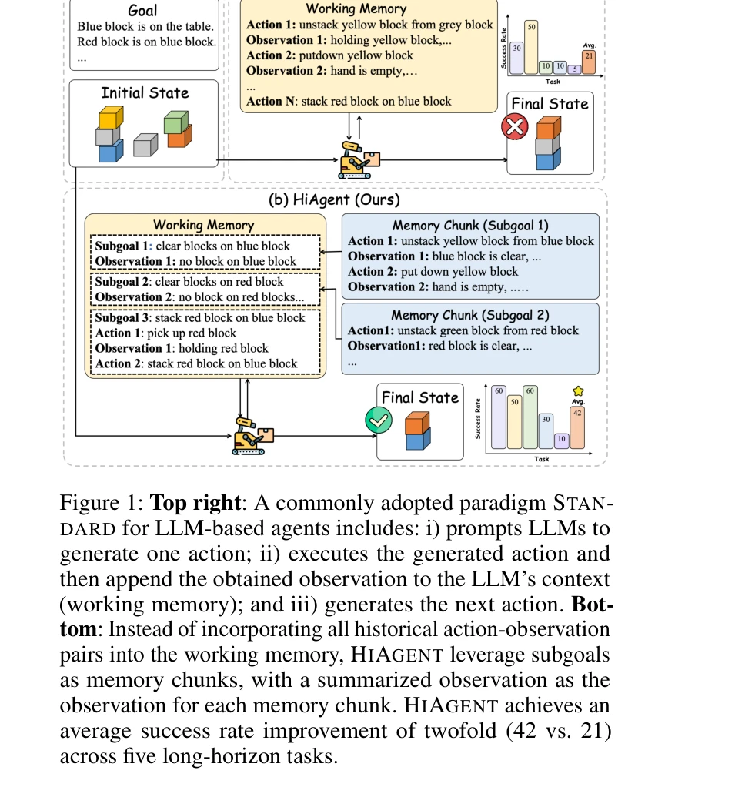
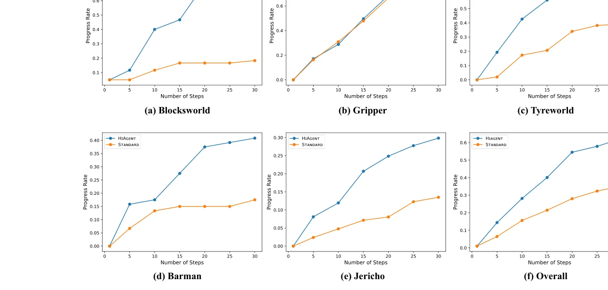

# HiAgent: Hierarchical Working Memory Management for Solving Long-Horizon Agent Tasks with Large Language Model

> **저자**: Mengkang Hu, Tianxing Chen, Qiguang Chen, Yao Mu, Wenqi Shao, Ping Luo | **날짜**: 2024 | **DOI**: [arXiv:2408.09559](https://arxiv.org/abs/2408.09559)

---

## Essence

 *STANDARD 패러다임과 HiAgent의 작업 메모리 관리 비교*

대규모 언어 모델(LLM) 기반 에이전트의 장기 작업 수행을 위해, 인지과학의 청킹(chunking) 원리에 영감을 받아 **부분목표(subgoal)를 메모리 청크로 활용한 계층적 작업 메모리 관리 프레임워크**를 제시한다. 기존 방식의 모든 행동-관찰 쌍을 컨텍스트에 포함하는 방식을 개선하여 작업 메모리 중복성을 제거한다.

## Motivation

- **Known**: LLM 기반 에이전트는 환경 관찰을 처리하여 실행 가능한 행동을 생성하는 대화형 시스템이며, 메모리 메커니즘이 성능에 중요한 영향을 미친다. 기존 연구는 다중 시도(cross-trial) 메모리 최적화에 집중했다.

- **Gap**: 작업 메모리(in-trial memory, working memory) 효율성 개선에 대한 연구가 미흡하다. 기존 STANDARD 방식은 모든 행동-관찰 쌍을 직접 LLM 입력에 포함하므로, 장기 작업에서 과도한 중복성과 컨텍스트 증가로 LLM의 일관된 전략 유지와 정확한 예측을 방해한다.

- **Why**: 인지과학 관점에서 인간은 복잡한 문제를 부분문제로 분해하고 각 부분문제를 메모리 "청크"로 처리하여 인지 부하를 감소시킨다(Miller, 1956). 이러한 인간의 문제 해결 전략을 LLM 기반 에이전트에 적용할 필요가 있다.

- **Approach**: 부분목표를 작업 메모리의 청크 단위로 활용하되, 현재 부분목표의 행동-관찰 쌍만 유지하고 완료된 부분목표는 요약된 관찰로 압축하는 계층적 관리 방식을 제안한다. 추가로 필요시 과거 부분목표의 상세 궤적을 검색할 수 있는 궤적 검색(trajectory retrieval) 모듈을 도입한다.

## Achievement

 *HiAgent의 계층적 작업 메모리 관리 프로세스*

1. **성공률 및 효율성 개선**: 
   - 성공률이 STANDARD 방식 대비 **2배 향상** (42% vs 21%)
   - 평균 진행률(progress rate)에서 **23.94% 우월**
   - 평균 단계 수를 **3.8배 감소**, 컨텍스트 길이 **35.02% 단축**, 실행 시간 **19.42% 감축**

2. **강건성 및 일반화**: 다양한 단계에서 일관된 성능 향상 입증 및 높은 행동 실행 가능성(executability) 달성으로 방법론의 견고성 확보

## How

 *서로 다른 단계에서의 진행률 비교*

- **부분목표 기반 계층적 관리**: 
  - (1) LLM이 먼저 부분목표 생성 → (2) 부분목표 달성을 위한 행동 생성 → (3) 부분목표 완료 시 행동-관찰 쌍을 요약 → (4) 완료된 부분목표의 세부 정보를 제거하고 요약된 관찰만 컨텍스트에 유지

- **관찰 요약(Observation Summarization)**:
  - 형식: s_i = S(g_i, o_0, a_0, ..., o_t)
  - LLM 또는 텍스트 요약 모델로 구현
  - 부분목표 달성 여부 판정 포함

- **궤적 검색 모듈(Trajectory Retrieval)**:
  - LLM이 필요시 과거 부분목표의 상세 행동-관찰 쌍을 명시적으로 검색
  - 실패 원인 분석 또는 과거 성공 사례 참고 시 활용

- **작업 메모리 표현**:
  - 계층적: m_t = (g_0, s_0, ..., g_{n-1}, s_{n-1}, g_n, a_n0, o_n1, ...)
  - 검색 시: m'_t = (g_0, s_0, ..., g_q, a_q0, o_q0, ..., g_n, a_n0, o_n0, ...)

## Originality

- **인지과학 기반 설계**: 청킹(chunking) 원리를 처음으로 LLM 에이전트의 작업 메모리 관리에 체계적으로 적용

- **계층적 메모리 구조**: 부분목표를 명시적 메모리 청크로 사용하여 현재-과거 정보의 구분된 관리 실현

- **선택적 검색 메커니즘**: 요약과 상세 정보 검색을 조화시킨 유연한 메모리 활용 방식 제시

- **이론 기반 검증**: 중복 컨텍스트가 성능을 해친다는 가설을 부분목표 생성 없는 비교 실험으로 실증 (성공률 20% 향상)

## Limitation & Further Study

- **부분목표 자동 생성의 한계**: 논문에서 LLM이 언제 새로운 부분목표를 생성할지 판단하는 메커니즘이 충분히 상세히 설명되지 않음. 부분목표 품질과 세분화 정도에 대한 분석 부족

- **제한된 평가 범위**: AgentBoard의 5개 작업만으로 평가. 더 다양한 도메인(로봇, 소프트웨어 개발, 웹 에이전트)에서의 일반화 성능 필요

- **요약 손실 분석 미흡**: 관찰 요약 과정에서 어떤 정보가 손실되고, 이것이 성능에 미치는 영향에 대한 심층 분석 부재

- **계산 비용**: 부분목표 생성, 요약, 검색 등 추가 LLM 호출로 인한 세밀한 비용-효율성 분석 필요

- **후속 연구 방향**:
  - 부분목표 자동 판정 알고리즘 고도화
  - 다양한 요약 전략(추상적 vs 세부적) 비교
  - 다중 도메인 확대 평가 및 도메인별 최적화
  - 인간 평가를 통한 부분목표 품질 검증

## Evaluation

- **Novelty**: 4/5 - 인지과학 원리의 체계적 적용은 참신하나, 부분목표 개념 자체는 기존 계획 수립 연구에서 존재

- **Technical Soundness**: 4/5 - 방법론 구조는 타당하나 부분목표 생성 판정, 요약 모듈 설계의 세부 기술 명시 부족

- **Significance**: 4.5/5 - LLM 기반 에이전트의 실질적 성능 개선 (2배 성공률)을 달성했으며 장기 작업 문제에 직접 적용 가능

- **Clarity**: 4/5 - 전체 구조는 명확하고 그림이 잘 설명되어 있으나, 요약 프롬프트와 부분목표 판정 로직의 상세 기술이 불충분

- **Overall**: 4/5

**총평**: 인간의 인지 메커니즘에 영감을 받아 계층적 작업 메모리 관리로 LLM 에이전트의 장기 작업 성능을 실질적으로 향상시킨 실용적이고 효과적인 연구이다. 다만 부분목표 자동 생성과 요약 전략의 상세 기술화 및 더 광범위한 평가 확대가 필요하다.

## Related Papers

- 🔄 다른 접근: [[papers/400_Hiagent_Hierarchical_working_memory_management_for_solving_l/review]] — 장기 작업 수행을 위한 계층적 작업 메모리 관리에서 청킹 원리와 부분목표 활용이라는 동일한 접근법을 사용한다.
- 🏛 기반 연구: [[papers/355_From_Human_Memory_to_AI_Memory_A_Survey_on_Memory_Mechanisms/review]] — 인간 메모리에서 AI 메모리로의 메커니즘 연구가 계층적 작업 메모리 관리의 인지과학적 기반을 제공한다.
- 🧪 응용 사례: [[papers/854_Understanding_the_planning_of_LLM_agents_A_survey/review]] — LLM 에이전트의 계획 수립에서 계층적 메모리 관리가 장기 작업 수행에 필수적인 구성 요소이다.
- 🏛 기반 연구: [[papers/854_Understanding_the_planning_of_LLM_agents_A_survey/review]] — 계층적 작업 메모리 관리가 LLM 에이전트의 장기 계획 수립에서 핵심적인 기반 기술을 제공한다.
- 🔄 다른 접근: [[papers/355_From_Human_Memory_to_AI_Memory_A_Survey_on_Memory_Mechanisms/review]] — 메모리 메커니즘 서베이 vs 계층적 메모리 관리로 서로 다른 메모리 연구 접근
- 🏛 기반 연구: [[papers/413_Human-ai_teaming_using_large_language_models_Boosting_brain-/review]] — HiAgent의 계층적 작업 메모리 관리가 ChatBCI의 복잡한 뇌 신호 분석 과정에서 정보 처리 효율성을 높임
