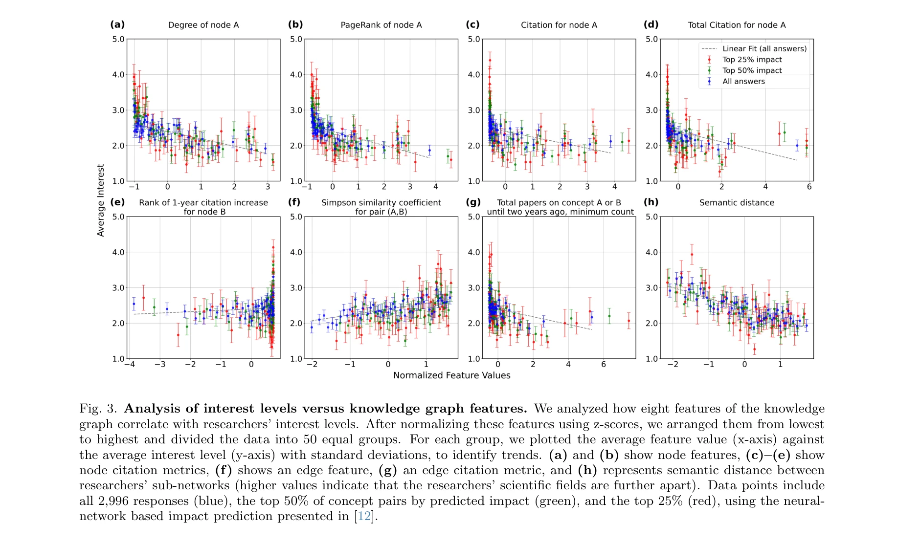

# Interesting Scientific Idea Generation using Knowledge Graphs and LLMs: Evaluations with 100 Research Group Leaders

> **저자**: Xuemei Gu, Mario Krenn | **날짜**: 2025-01-07 | **DOI**: [10.48550/arXiv.2405.17044](https://doi.org/10.48550/arXiv.2405.17044)

---

## Essence

 *SciMuse 시스템이 지식 그래프와 GPT-4를 활용한 연구 아이디어 생성 프로세스*

본 논문은 5,800만 개의 과학 논문으로부터 구축한 지식 그래프(Knowledge Graph)와 대규모언어모델(LLM)을 결합하여 개인화된 연구 아이디어를 생성하고, 100명 이상의 연구그룹리더들의 평가를 통해 AI가 생성한 연구 아이디어의 흥미도를 예측하는 SciMuse 시스템을 제시한다.

## Motivation

- **Known**: 급속히 증가하는 과학문헌으로 인해 연구자들이 새롭고 영향력 있는 아이디어 발굴이 어려워지고 있으며, 최근 LLM의 발전으로 대규모 과학 데이터로부터 연구 아이디어 생성이 가능해졌다.

- **Gap**: 기존 AI 기반 아이디어 생성 시스템의 평가는 NLP 박사학생 6명, 사회과학 박사학생 3명, 컴퓨터과학/생의학 박사학생 10명 등 소규모 평가에 국한되었으며, 실제 연구비 신청과 그룹 연구 방향을 결정하는 경험 있는 연구자들의 평가가 부재했다.

- **Why**: 연구 아이디어의 실제 가치를 평가하기 위해서는 수십 년의 연구 경험을 보유한 연구그룹리더들의 광범위한 평가가 필수적이며, 이는 AI 생성 아이디어의 품질 향상 방향을 제시할 수 있다.

- **Approach**: (1) 58백만 개 논문의 지식 그래프 구축, (2) 110명의 연구그룹리더를 대상으로 4,451개 개인화 아이디어 평가, (3) 지식 그래프 특성과 흥미도 간의 상관관계 분석, (4) 지도학습 신경망과 영점-샷(zero-shot) LLM 기반 흥미도 예측 모델 개발.

## Achievement

 *막스플랑크 연구소의 110명 연구그룹리더들의 광범위한 평가 데이터*

1. **대규모 인적 평가 데이터 확보**: 54개 막스플랑크 연구소의 110명 연구그룹리더(평균 60편 발표, 3,760회 인용)로부터 4,451개 평가 응답 수집 - 기존 평가 규모의 10배 이상.

2. **흥미 있는 아이디어 생성 비율**: 전체 아이디어의 약 25%가 4-5점(흥미 있음) 평가를 받았으며, 394개는 매우 흥미로운(5점) 것으로 평가됨.

3. **높은 예측 정확도**: 지식 그래프 특성만 사용한 지도학습 신경망과 텍스트 없이 수행한 GPT 영점-샷 예측 모두 유의미한 예측 성능을 달성하여, 인적 평가 데이터 접근 불가 상황에서도 유용함을 입증.

 *지식 그래프 특성과 연구자 흥미도 간의 상관관계 분석*

## How

- **지식 그래프 구축**: RAKE 알고리즘으로 244만 개 논문의 제목/초록에서 후보 개념 추출 → GPT, 위키피디아, 인간 주석을 통한 정제 → 총 123,128개 개념 확정 → 5,800만 개 논문에서 개념 간 동시 출현 정보를 통해 엣지(edge) 생성.

- **개인화 제안 생성**: 각 연구자의 최근 2년 논문에서 개념 추출 및 정제 → 지식 그래프 부분 그래프(subgraph) 구축 → GPT-4에 최대 7개 논문 제목과 개념 쌍 제공 → 자기반영(self-reflection) 기법으로 3개 아이디어 생성 후 2회 반복 개선.

- **개념 쌍 선택 방식**: (1) 무작위 선택, (2) 예측 영향도 기반 상위 개념 쌍, (3) 개념 쌍 없이 논문 제목만 사용(검증용).

- **흥미도 예측**: (1) 지식 그래프 특성을 입력으로 하는 지도학습 신경망, (2) 인간 평가 데이터 없이 수행하는 GPT 영점-샷 순위 지정.

## Originality

- **지식 그래프 기반 제약**: 직접 LLM 프롬프트만 사용하는 대신, 5,800만 개 논문으로부터 구축한 대규모 지식 그래프를 매개로 하여 생성 과정의 통제 가능성을 높임.

- **학제 간 대규모 평가**: 자연과학(104명) 및 사회과학(6명)의 110명 경험 있는 연구그룹리더를 포함한 학제적 평가 - 기존 연구의 10배 규모이며 실제 연구 의사결정권자의 관점 반영.

- **이중 예측 방법론**: 지식 그래프 특성 기반 지도학습과 텍스트 없는 LLM 영점-샷 예측을 병행하여 상황별 적용 가능성 제시.

- **상관관계 분석의 역설적 발견**: 고도의 연결성(높은 차수, PageRank)과 높은 인용도를 가진 개념일수록 흥미도가 낮다는 발견 - 기존 직관(잘 알려진 주제 조합)과 상반된 결과로 혁신적 아이디어 특성 규명.

## Limitation & Further Study

- **제한된 평가자 다양성**: 104명 중 104명이 자연과학 분야로 편중되어 있으며, 사회과학/인문학 평가자는 6명에 불과하여 학제 간 일반화 가능성이 제한적.

- **평가 기준의 암묵성**: 연구자들의 '흥미도' 판단 기준이 명시적으로 정의되지 않아, 개별 차이와 맥락 의존성이 존재할 수 있음.

- **실제 구현 검증 부재**: AI 제안이 실제 연구 프로젝트로 진행되었는지에 대한 추적 및 검증이 없어, 흥미도 평가와 실제 연구 성과 간의 관계 불명확.

- **시간 경과에 따른 새로움**: 2023년 2월 데이터 기준으로 구축되어 최신 연구 동향 반영 부족.

- **후속 연구 방향**: (1) 개념 쌍 선택 전략의 고도화 (현재 무작위/영향도 예측 간 유의미한 차이 부재), (2) 사회과학/인문학 평가자 확대를 통한 학제적 일반화, (3) 시간 동적 지식 그래프(temporal knowledge graph)로 확장, (4) 인간 평가자의 판단 근거에 대한 정성적 분석.

## Evaluation

- **Novelty** (창의성): 4.5/5
  - 대규모 경험 연구자 평가는 새로운 접근이나, 지식 그래프 + LLM 조합은 기존 아이디어

- **Technical Soundness** (기술적 건전성): 4/5
  - 방법론은 타당하나, 영향도 예측이 흥미도 향상에 기여하지 않는 점은 설명 부족

- **Significance** (중요성): 4.5/5
  - 과학 연구 지원의 중요한 도구 제시이나, 자연과학 편중으로 인한 일반화 제한

- **Clarity** (명확성): 4/5
  - 전반적으로 잘 설명되었으나, 개념 추출 및 정제 과정의 세부 기준 불명확

- **Overall** (종합평가): 4.2/5

**총평**: 본 논문은 대규모 인적 평가를 통해 AI 생성 연구 아이디어의 실제 가치를 체계적으로 평가한 점에서 높은 기여도를 갖지만, 학제 간 평가의 불균형과 예측 모델의 실제 개선 효과 미흡이 한계이다. 그럼에도 과학 지식 그래프 기반 아이디어 생성과 예측의 가능성을 실증적으로 입증했다는 점에서 의미 있는 연구이다.

## Related Papers

- 🔄 다른 접근: [[papers/132_Automating_psychological_hypothesis_generation_with_AI_when/review]] — 둘 다 지식 그래프와 LLM을 결합한 연구 아이디어 생성을 다루지만 하나는 일반 과학, 다른 하나는 심리학에 특화됨
- 🏛 기반 연구: [[papers/668_ResearchAgent_Iterative_Research_Idea_Generation_over_Scient/review]] — 과학 지식 그래프를 활용한 연구 아이디어 생성의 기초적 접근이 개인화된 아이디어 생성 시스템의 이론적 토대를 제공함
- 🔗 후속 연구: [[papers/729_Scipip_An_llm-based_scientific_paper_idea_proposer/review]] — 일반적인 연구 아이디어 생성을 대규모 지식 그래프와 실제 연구자 평가를 통한 더 체계적이고 검증된 접근법으로 확장함
- 🏛 기반 연구: [[papers/150_Benchmark_for_evaluation_and_analysis_of_citation_recommenda/review]] — 지식 그래프를 활용한 과학적 아이디어 생성으로 인용 추천 시스템의 이론적 배경을 제공한다.
- 🔗 후속 연구: [[papers/540_Mir_Methodology_inspiration_retrieval_for_scientific_researc/review]] — 방법론적 영감 검색을 지식 그래프 기반 과학 아이디어 생성으로 확장
- 🔗 후속 연구: [[papers/580_Oag-bench_A_human-curated_benchmark_for_academic_graph_minin/review]] — 지식 그래프 기반의 흥미로운 과학적 아이디어 생성을 학술 그래프 마이닝으로 확장할 수 있다
- 🔄 다른 접근: [[papers/666_Research_hypothesis_generation_over_scientific_knowledge_gra/review]] — 과학적 가설 생성에서 지식 그래프와 지식 그래프 기반 접근법을 비교할 수 있습니다.
- 🔗 후속 연구: [[papers/216_Chimera_A_knowledge_base_of_idea_recombination_in_scientific/review]] — 지식 그래프를 활용한 과학적 아이디어 생성이 Chimera의 아이디어 재조합 지식베이스를 실제 창의적 연구 제안으로 활용하는 구체적 방법론을 제시함
- 🔄 다른 접근: [[papers/132_Automating_psychological_hypothesis_generation_with_AI_when/review]] — 둘 다 지식 그래프와 LLM을 결합한 연구 아이디어 생성을 다루지만, 하나는 심리학, 다른 하나는 일반 과학 분야에 특화됨
- 🔄 다른 접근: [[papers/010_A_hierarchical_framework_for_measuring_scientific_paper_inno/review]] — 둘 다 LLM을 활용한 과학 논문 평가를 다루지만 하나는 혁신성 측정, 다른 하나는 연구 아이디어 생성에 중점을 둠
- 🏛 기반 연구: [[papers/020_A_Review_of_Relational_Machine_Learning_for_Knowledge_Graphs/review]] — 지식 그래프의 관계형 기계학습에 대한 체계적 검토가 과학 아이디어 생성을 위한 지식 그래프 활용의 이론적 토대를 제공함
