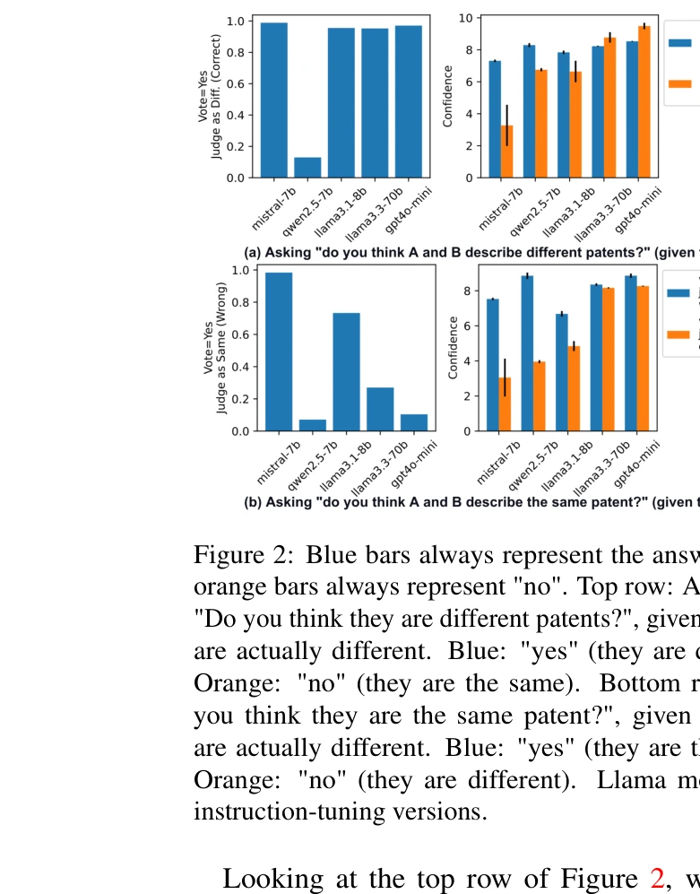
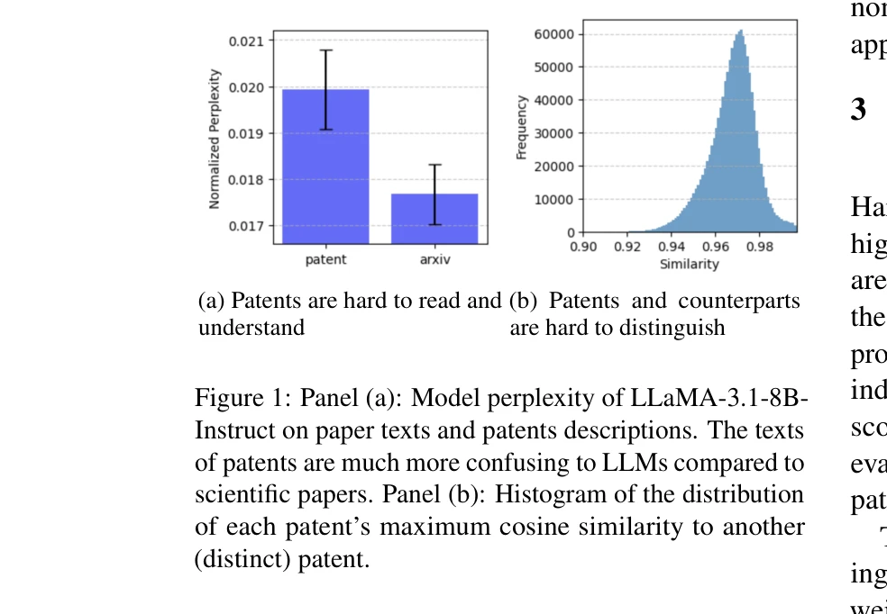
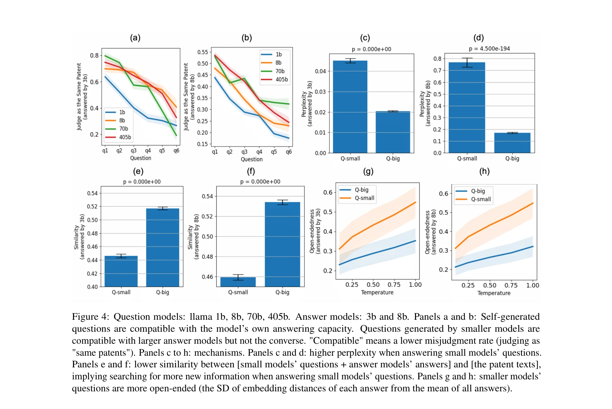

# Introspective growth: Automatically advancing llm expertise in technology judgment

> **저자**: Yongtao Liu, Marti Checa, Rama Vasudevan | **날짜**: 2025 | **DOI**: [제공되지 않음](https://doi.org/)

---

## Essence

 *특허 쌍 구분 작업에서 LLM의 정확도 비교: "다른 특허인가?"와 "같은 특허인가?" 질문에 대한 응답 분포*

본 논문은 대규모 언어모델(LLM)의 기술 판단 능력을 평가하기 위해 USPTO 특허 분류 작업을 활용하여, 모델이 보유한 지식(lay-in knowledge)과 실제 활용하는 지식(working knowledge) 간의 격차를 진단하는 프레임워크를 제안한다.

## Motivation

- **Known**: LLM은 사실 회상(factual recall)에는 뛰어나지만, 복잡한 개념 구분이 필요한 작업에서는 성능 저하를 보임
  
- **Gap**: 모델이 보유한 지식과 실제 문제 해결에 활용하는 지식 사이의 괴리가 존재하며, 이것이 오류의 주요 원인인지 또는 지식 부족이 원인인지 규명되지 않음

- **Why**: 기존 연구는 수학 문제나 사실 회상 같은 좁은 범위의 프로브에 의존했으므로, 실제 개념 이해(conceptual understanding)를 종합적으로 평가할 필요가 있음

- **Approach**: 의미상 유사하지만 기술적으로 구분되는 특허 쌍을 제시하여 차별화(differentiation) 능력을 테스트하고, 자가 생성 질답과 외부 정보 제공을 통해 미사용 지식 대 누락 지식을 분리 진단

## Achievement

 *Panel (a): ArXiv 논문과 특허 설명서의 모델 혼란도(perplexity) 비교 / Panel (b): 각 특허와 가장 유사한 다른 특허 간 코사인 유사도 분포*

1. **대규모 특허 데이터셋 구축**: 컴퓨터/정보기술 130만+건, 생의학 17만+건의 2015년 이후 특허 중 고난도 구분 쌍(hard-to-distinguish pairs) 확보 - USPTO 심사관의 인적 검증으로 신뢰성 확보

2. **미사용 지식 병목(knowledge deployment bottleneck) 규명**: 모델 오류의 대부분이 참지식(lay-in knowledge) 미활용에서 비롯되며, 실제 지식 부족은 상대적으로 적음을 실증적으로 입증

3. **모델 스케일별 상보적 강점 발견**: 소형 모델은 단순하고 전이 가능한 질문-답변 기저틀을 생성하여 회수(retrieval)를 용이하게 하고, 대형 모델은 더 복잡하지만 일반화 능력이 낮은 질문을 생성 - 계층적 협력 전략의 가능성 제시

## How

 *질문 생성 모델과 답변 모델의 조합에 따른 성능: 자가생성 질답 vs. 외부 정보 기반 질답 비교*

- **차별화 기반 이해도 평가**: 두 특허 텍스트가 같은 발명을 설명하는지 여부를 판단하는 이진 분류 작업 (정답: 항상 "다른 특허")

- **신뢰도 가중 투표(confidence-weighted voting)**: 동일 프롬프트 3회 독립 생성 결과를 신뢰도로 가중평균하여 모델의 실제 확신도 반영 (신뢰도 투표와 다수결 투표 간 상관계수 0.95)

- **삼중 비교 조건**: (1) 기본 성능 vs. (2) 모델 자가생성 질답 후 성능 vs. (3) 외부 과학 정보 제공 후 성능 비교를 통해 지식 접근성 진단

- **특허 선택 방식**: 텍스트 임베딩 유사도가 높지만 서로 다른 특허 ID를 가진 쌍을 선별하여, 표면 휴리스틱으로는 해결 불가능한 높은 난이도 확보

## Originality

- **개념적 틀의 신규성**: 단순 사실 회상과 달리 "차별화" 능력을 이해도의 핵심 요소로 이론화하고 이를 특허 구분 작업으로 운영화(operationalization)

- **진단 프레임워크의 혁신성**: 기존의 단순 정확도 평가를 넘어 "누락 지식(missing knowledge)" vs. "미사용 지식(unused knowledge)"을 체계적으로 분리하는 두 가지 축 진단법 도입

- **도메인 선택의 타당성**: USPTO 심사 과정이라는 제도적 검증을 활용하여 모델이 참으로 구분해야 할 개념 간 차이의 객관성을 담보

- **스케일 간 상보성 발견**: 단순히 모델 크기별 성능 비교를 넘어, 소형-대형 모델 간 질문 생성 및 회수 능력의 구조적 차이를 규명

## Limitation & Further Study

- **데이터셋 편향성**: 컴퓨터/정보기술과 생의학 분야만 대상이므로 다른 기술 도메인(화학, 기계, 전자)으로의 일반화 가능성 미검증

- **특허 고유성**: 특허의 법적-전략적 특성(의도적 난독화)으로 인해 일반적인 기술 텍스트 이해도 평가와의 직접 비교 어려움

- **외부 정보원의 한계**: 외부 제공 정보가 "완전한" 기준 지식이라는 가정 미검증 - 실제로 필수 정보를 모두 포함했는지 확인 필요

- **후속 연구**: (1) 모델의 지식 활용을 돕는 프롬프팅/파인튜닝 기법 개발, (2) 소형-대형 모델 협력의 실제 효율성 측정, (3) 다른 지식집약적 도메인(의료, 법률)으로의 확장

## Evaluation

- Novelty: 4.5/5
- Technical Soundness: 4/5
- Significance: 4.5/5
- Clarity: 4/5
- Overall: 4.25/5

**총평**: 본 논문은 LLM의 실제 능력 평가에 중요한 "미사용 지식" 문제를 체계적으로 규명하고, 특허라는 도메인을 통해 개념 이해의 핵심 요소인 차별화 능력을 창의적으로 테스트한다. 다만, 도메인 특이성과 외부 정보의 완전성 가정으로 인해 일반화에 제약이 있으며, 진단 이후 개선 방안 제시까지는 미흡한 상태이다.

## Related Papers

- 🧪 응용 사례: [[papers/746_Self-Refine_Iterative_Refinement_with_Self-Feedback/review]] — Self-Refine의 반복적 자기 정제 메커니즘이 특허 분류 작업에서 LLM의 기술 판단 능력을 점진적으로 향상시키는 구체적 적용 사례를 보여줌
- 🔗 후속 연구: [[papers/484_Learning_to_generate_research_idea_with_dynamic_control/review]] — 동적 제어를 통한 연구 아이디어 생성 학습이 내성적 성장의 자동화된 전문성 발전을 창의적 아이디어 생성 영역으로 확장한 연구임
- 🏛 기반 연구: [[papers/750_SEVerA_Verified_Synthesis_of_Self-Evolving_Agents/review]] — 자기 진화 에이전트의 검증된 합성 방법론이 LLM의 내성적 전문성 성장 과정의 안전성과 신뢰성을 보장하는 이론적 기반을 제공함
