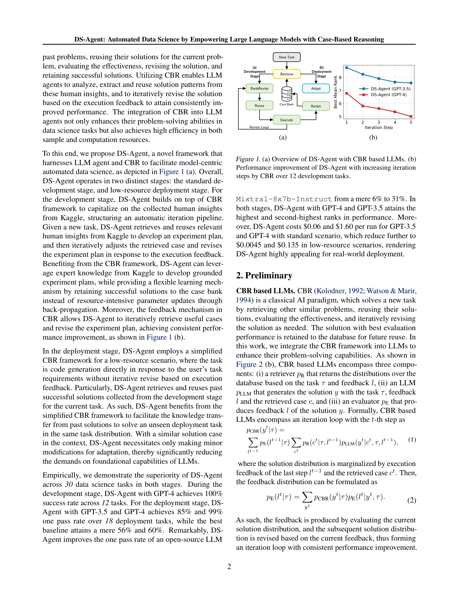

# Large language model agent for hyper-parameter optimization

> **저자**: Siyi Liu, Chen Gao, Yong Li | **날짜**: 2024 | **DOI**: [미제공]

---

## Essence

본 논문은 LLM(Large Language Model) 기반 에이전트에 사례기반추론(CBR, Case-Based Reasoning)을 통합하여 자동 데이터 과학(Automated Data Science) 작업, 특히 하이퍼파라미터 최적화를 수행하는 DS-Agent 프레임워크를 제안한다. 개발 단계에서 Kaggle의 전문가 지식을 활용하여 반복적 개선을 이루고, 배포 단계에서 저자원 환경에서도 효과적으로 작동한다.

## Motivation

- **Known**: LLM 기반 에이전트(AutoGPT, LangChain, ResearchAgent 등)는 다양한 작업에서 성공을 거두었으나, 데이터 과학 시나리오에서는 합리적인 실험 계획 수립과 hallucination 문제로 인해 낮은 완료율을 보인다.

- **Gap**: 기존 LLM 에이전트는 데이터 과학 작업의 특수성을 고려하지 않으며, 해결책인 LLM 미세조정(finetuning)은 (1) 충분한 학습 데이터 수집의 높은 시간 비용, (2) 수십억 개 파라미터의 역전파 계산에 따른 막대한 자원 소모라는 과제를 안고 있다.

- **Why**: Kaggle은 세계 최대 데이터 과학 경쟁 플랫폼으로 숙련된 데이터 과학자들의 기술 보고서와 코드를 축적하고 있으며, 이러한 인간의 전문가 지식을 효과적으로 활용할 수 있는 메커니즘이 필요하다.

- **Approach**: 고전적 AI 문제 해결 패러다임인 CBR을 LLM 에이전트에 통합함으로써 과거 유사 사례를 검색·재사용하고, 실행 피드백에 기반한 반복적 개선을 가능하게 한다. 이는 파라미터 업데이트 없이 성공한 해결책을 사례 뱅크에 보관하여 효율적인 학습을 구현한다.

## Achievement

1. **개발 단계 성능**: GPT-4를 사용한 DS-Agent가 12개 작업에서 100% 성공률 달성; 반복 단계 증가에 따른 지속적 성능 향상 (평균 순위 개선)

2. **배포 단계 성능**: GPT-3.5와 GPT-4에서 각각 85%, 99%의 한 번에 성공(one pass rate) 달성 vs. 최고 기준선 56%, 60%; 오픈소스 LLM Mixtral-8x7b-Instruct의 성능을 6%에서 31%로 5배 이상 개선

3. **비용 효율성**: GPT-4 기준 표준 시나리오에서 실행당 $1.60, 저자원 시나리오에서 $0.135 (약 92% 감소)

4. **일반화**: 텍스트, 시계열, 표형식 데이터 등 다양한 데이터 모달리티에 걸쳐 일관된 개선

## How

*Figure 1: DS-Agent의 개요 (a) 및 반복 단계에 따른 성능 개선 곡선 (b)*

### 개발 단계 (Development Stage)

- **인간 전문가 지식 수집**: Kaggle에서 최근 완료된 경쟁 대회의 기술 보고서와 상위 순위 코드를 크롤링하여 정제·요약하여 사례 뱅크 구성

- **Step 1 - 검색 (Retrieve)**: 사전학습 임베딩 모델을 이용한 코사인 유사도로 작업 설명과 유사한 상위-k개 사례 검색
  - `sim(τ, c) = cos(E(τ), E(c))`

- **Step 2 - 순위 재조정 (ReviseRank)**: 이전 반복의 실행 피드백을 LLM이 분석하여 검색된 사례의 유용성을 평가하고 순위 재조정 (검색 모델 재학습 없이 LLM의 능력 활용으로 비용 절감)

- **Step 3 - 재사용 (Reuse)**: 재순위 지정된 상위 사례들을 컨텍스트로 LLM에 제공

- **Step 4 - 실행 (Execute)**: LLM이 생성한 Python 코드 실행 및 검증 데이터셋에서 성능 평가

- **Step 5 - 유지 (Retain)**: 최고 성능 달성 솔루션을 사례 뱅크에 추가

### 배포 단계 (Deployment Stage)

- **단순화된 CBR**: 개발 단계에서 수집한 성공한 해결책을 직접 재사용하여 코드 생성, 반복적 수정 제거

- **적응 (Adapt)**: 유사 사례를 컨텍스트에 제공함으로써 LLM의 기초 능력 요구 대폭 감소

### 기술적 형식화

CBR 기반 LLM의 반복 루프:
$$p_{CBR}(y_t|\tau) = \sum_{l_{t-1}} p_E(l_{t-1}|\tau) \sum_{c_t} p_R(c_t|\tau, l_{t-1}) p_{LLM}(y_t|c_t, \tau, l_{t-1})$$

RAG와의 차별점: CBR은 피드백 기반 동적 조정과 성공한 솔루션의 유지를 통해 반복적 학습 가능 vs. RAG는 단일 검색만 수행

## Originality

- **CBR-LLM 통합**: 고전 AI 패러다임(CBR)을 현대 LLM 에이전트에 체계적으로 통합한 최초 접근; RAG와 구분되는 피드백 루프 및 솔루션 유지 메커니즘 도입

- **이단 구조**: 개발 단계에서 인간 지식 기반 반복 개선, 배포 단계에서 저자원 직접 적용이라는 실용적 이단 설계

- **자원 효율성**: 파라미터 업데이트 없이 사례 뱅크 확충으로 학습을 구현하여 미세조정(finetuning)의 고비용 문제 회피

- **Kaggle 지식 활용**: 세계 최대 데이터 과학 플랫폼의 실제 경쟁 솔루션을 체계적으로 수집·구조화한 첫 시도

## Limitation & Further Study

- **사례 의존성**: 사례 뱅크의 질과 다양성이 성능에 핵심 영향; Kaggle의 특정 경쟁 도메인 이외 작업에서의 일반화 가능성 미제시

- **검색 메커니즘**: 코사인 유사도 기반 검색은 기본적 방식이며, 더 정교한 의미론적 검색(예: 하이브리드 검색, 그래프 기반 검색) 탐색 필요

- **피드백 품질**: 실행 피드백의 정보성(informativeness)에 대한 상세 분석 부족; 모호하거나 중복되는 피드백의 처리 방안 부재

- **모달리티 제약**: 텍스트, 시계열, 표형식 데이터에 한정; 이미지, 음성 등 다른 모달리티로의 확장 미제시

- **후속 연구**: 
  - 동적 사례 뱅크 관리 및 오래된 사례의 제거/갱신 전략
  - 도메인 전이(transfer) 성능 개선
  - 비용 함수 최적화를 통한 하이퍼파라미터 최적화 가속화
  - 다중 에이전트 협력 구조로의 확장

## Evaluation

- **Novelty (새로움)**: 4.5/5
  - CBR을 LLM 에이전트에 통합한 창의적 접근이나, CBR 자체는 기존 개념
  - Kaggle 지식 활용은 신선하지만, 검색/재사용 메커니즘은 상대적으로 표준적

- **Technical Soundness (기술적 타당성)**: 4/5
  - 두 단계 설계와 피드백 루프는 논리적으로 견고
  - 실행 피드백에 기반한 순위 재조정은 흥미로우나, LLM이 정확한 우선순위 판단을 보장하지 못하는 위험 존재
  - 형식화(Eq. 1-2)는 명확하지만 구체적 구현 상세(LLM 프롬프트, 재순위 알고리즘) 부분적 생략

- **Significance (중요도)**: 4.5/5
  - 자동 데이터 과학은 실무적 가치 높음
  - 저비용 배포 단계는 실제 활용성 우수
  - LLM 에이전트의 일반적 문제(hallucination, 불합리한 계획) 해결에 기여
  - 한계: 매우 특정화된 시나리오(Kaggle 경쟁 데이터)로 범용성 제약

- **Clarity (명확성)**: 4/5
  - 전체 구조와 동기는 명확하게 제시
  - 개발/배포 단계 설명은 명확
  - 개선 예정: 실제 프롬프트 예시, 상세 사례 구성, LLM 내부 순위 재조정 로직 투명성

- **Overall (종합)**: 4.2/5

**총평**: DS-Agent는 CBR-LLM 통합을 통해 자동 데이터 과학의 실질적 문제를 해결하고 우수한 실증 결과를 달성했으나, 사례 의존성, 제한된 일반화 가능성, 기술적 깊이 면에서 보완 여지가 있다. 실무 배포 관점에서는 높은 가치가 있으나, 기술적 혁신성 측면에서는 기존 기법의 조합에 가까운 평가를 받는다.

## Related Papers

- 🔄 다른 접근: [[papers/293_Ds-agent_Automated_data_science_by_empowering_large_language/review]] — 하이퍼파라미터 최적화에 특화된 LLM 에이전트와 DS-Agent의 포괄적 데이터 과학 자동화는 같은 영역을 다른 범위에서 다루는 접근이다.
- 🔗 후속 연구: [[papers/543_Mlcopilot_Unleashing_the_power_of_large_language_models_in_s/review]] — MLCopilot의 기계학습 파이프라인 자동화가 하이퍼파라미터 최적화 전용 에이전트를 더 광범위한 ML 작업으로 확장한 발전된 시스템이다.
- 🔄 다른 접근: [[papers/293_Ds-agent_Automated_data_science_by_empowering_large_language/review]] — DS-Agent의 사례 기반 추론을 통한 데이터 과학 자동화와 하이퍼파라미터 최적화에 특화된 LLM 에이전트는 같은 문제를 다른 범위에서 해결하는 접근이다.
