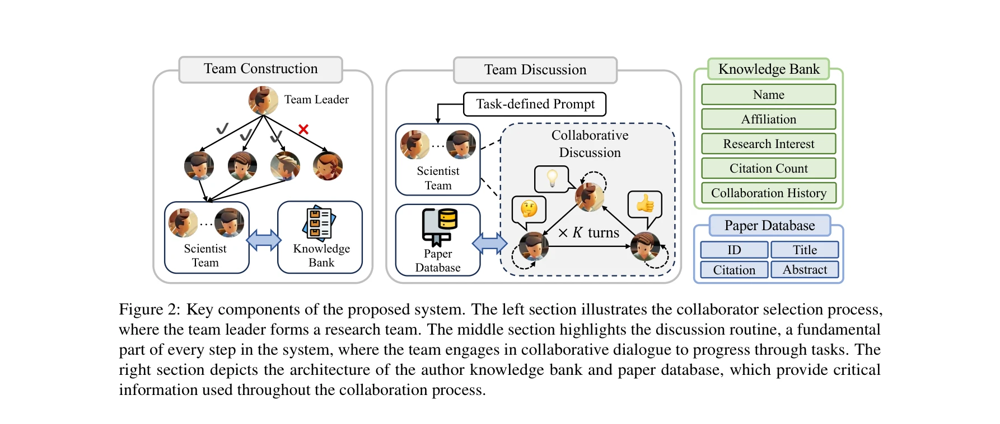
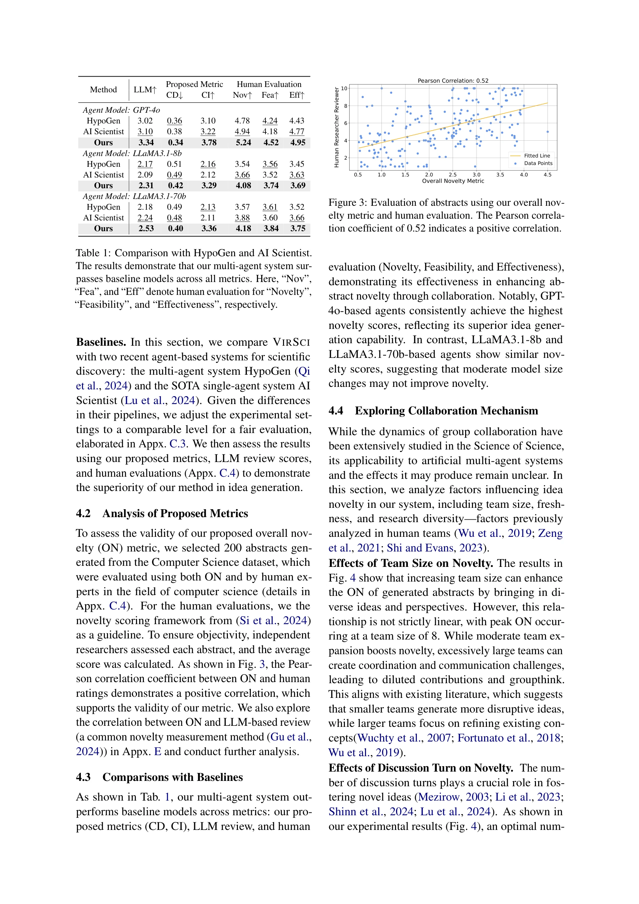

# Many Heads Are Better Than One: Improved Scientific Idea Generation by A LLM-Based Multi-Agent System

> **저자**: Haoyang Su, Renqi Chen, Shixiang Tang, Zhenfei Yin, Xinzhe Zheng | **날짜**: 2024 | **DOI**: [10.18653/v1/2025.acl-long.1368](https://doi.org/10.18653/v1/2025.acl-long.1368)

---

## Essence

*VIRSCI의 5단계 프로세스: 협력자 선택, 주제 토론, 아이디어 생성, 신규성 평가, 초록 생성*

LLM 기반 멀티-에이전트 시스템(VIRSCI)은 실제 과학자의 데이터를 기반으로 협업 팀을 구성하여 혁신적인 과학 아이디어를 생성한다. 이는 단일 에이전트 시스템 대비 현대 연구와의 부합성 13.8%, 잠재적 영향력 44.1% 향상을 달성한다.

## Motivation

- **Known**: 최근 AI Scientist, ResearchTown 등의 LLM 기반 시스템이 가설 생성과 실험 설계를 자동화하고 있으며, 이는 과학 발견을 가속화하는 데 기여하고 있음

- **Gap**: 기존 연구는 단일 에이전트 시스템이거나 과도하게 단순화된 협업 프레임워크를 사용하며, 합성 데이터(수작업으로 작성된 프로필, 인공 협업 네트워크)에 의존하여 실제 과학 팀의 동적 관계를 포착하지 못함

- **Why**: 실제 과학 연구는 다양한 전문가들이 팀을 이루어 복잡한 문제를 해결하는 협업 프로세스인데, 기존 시스템은 이를 반영하지 못해 자율 과학 발견의 발전을 제한함

- **Approach**: 실제 과학자의 배경 정보, 출판 기록, 협력 관계를 기반으로 "과학 연구 생태계(Scientific Research Ecosystem)"를 구축하고, 팀 조직에서 아이디어 생성까지 end-to-end 파이프라인을 제시하며, 팀 내(intra-team)·팀 간(inter-team) 토론 메커니즘을 도입

## Achievement

*협력자 선택 프로세스 및 시스템의 주요 구성 요소*

1. **성능 향상**: 멀티-에이전트 시스템이 단일 에이전트 대비 평균 +13.8%(현대 연구와의 부합성)와 +44.1%(잠재적 영향력)의 성능 개선을 달성함

2. **신규성 평가 메트릭**: 과거 논문과의 비유사성, 연구 트렌드 부합성, 현대 논문에 미치는 영향력 등 3가지 관점에서 생성된 아이디어의 신규성을 평가

3. **과학 원리와의 일치**: 실험 결과 패턴이 과학 논문에서 발표된 기존 과학 원리(예: "신선한 팀이 더 혁신적 연구를 생성")와 일치하여 시스템의 신뢰성 검증

## How

*초록의 신규성 평가를 위한 다차원 평가 프레임워크*

**5단계 파이프라인**:

- **협력자 선택**: 팀 리더가 과거 협력 이력과 학술 사회 네트워크를 기반으로 협력자를 모집(exploit)하면서 동시에 전문성과 연구 관심이 부합하는 새로운 협력자를 탐색(explore)

- **주제 선택**: 팀원들이 공통 관심사에 대해 토론하며, 합의에 도달하지 못하면 토론을 재개하거나 흥미 없는 팀원은 탈퇴 가능

- **아이디어 생성**: 과거 논문 데이터베이스에서 관련 논문을 검색하고, 팀 내·팀 간 반복 토론을 통해 아이디어를 제안 및 개선. **초대 메커니즘(Invitation Mechanism)**으로 외부 에이전트의 조언을 요청

- **신규성 평가**: 생성된 아이디어를 평가하고 투표를 통해 최적 아이디어 선택

- **초록 생성**: 선정된 아이디어를 종합 초록으로 개발

**핵심 메커니즘**:
- 팀 내 토론: 다양한 관점의 균형 유지
- 팀 간 토론: 초대 메커니즘을 통해 외부 전문가의 동적 참여 가능화
- 실제 데이터 활용: 과학자의 진정한 배경 정보와 협력 관계 기반

## Originality

- **첫 번째 실제 데이터 기반 시스템**: 실제 과학자의 정보(배경, 출판 기록, 협력 네트워크)를 역할극에 활용하고 객관적 평가를 수행하는 최초의 과학 협업 벤치마크 시스템 구축

- **팀 간·팀 내 하이브리드 토론 메커니즘**: 기존 멀티-에이전트 프레임워크(HypoGen, ResearchTown)의 정적 팀 구성의 한계를 극복하고, 초대 메커니즘을 통해 팀 외부의 전문가에 동적으로 접근 가능화

- **과학 연구 생태계 구축**: 특정 시점(예: 2024년 1월 1일)의 연구 커뮤니티를 시간적으로 정확하게 모델링(과거 논문·현대 논문 DB 분리)하여 신규성을 엄격하게 평가

- **과학 원리의 계량적 검증**: Science of Science 문헌(Nature, Science 게재)의 이론적 예측과 실험 결과의 일치를 통해 시스템 신뢰성 입증

## Limitation & Further Study

- **계산 비용**: 현재 초록 생성으로 제한(full paper 생성으로 확장 시 계산량 급증)

- **LLM 의존성**: GPT 기반 모델에 강하게 의존하며, 다른 LLM 아키텍처에서의 성능 일관성 미검증

- **평가 방법론**: 신규성 평가가 유사도 지표(cosine similarity 등) 기반으로, 전문가 평가를 통한 추가 검증 필요

- **규모 확장성**: 중형 규모 데이터셋(arXiv 일부 분야)에서만 검증되었으며, 모든 학문 영역에서의 일반화 가능성 미해명

- **후속 연구 방향**:
  - 다른 LLM 모델(Claude, Llama)에서의 성능 비교
  - 전문가 피어 리뷰를 통한 생성 아이디어의 질적 평가
  - 대규모 멀티-학제 연구 프로젝트로의 확장
  - 팀 역학(team dynamics) 관련 미세한 요인 분석

## Evaluation

- Novelty: 4.5/5
- Technical Soundness: 4/5
- Significance: 4.5/5
- Clarity: 4/5
- Overall: 4.3/5

**총평**: 본 논문은 실제 과학자 데이터를 기반으로 한 첫 번째 멀티-에이전트 과학 협업 시스템을 제시하며, 팀 간·팀 내 토론 메커니즘과 시간 기반 생태계 모델링을 통해 기존 연구의 한계를 명확히 극복했다. 다만 계산 효율성, LLM 일반화, 정성적 평가 부분에서 보완이 필요하고, 전체 논문 생성으로의 확장성 검증이 요구된다.

## Related Papers

- 🏛 기반 연구: [[papers/819_Toward_reliable_biomedical_hypothesis_generation_Evaluating/review]] — 가설 생성의 신뢰성 평가가 다중 에이전트 아이디어 생성의 기반을 제공합니다.
- 🔄 다른 접근: [[papers/149_Bayes-Entropy_Collaborative_Driven_Agents_for_Research_Hypot/review]] — 과학 가설 생성을 위한 서로 다른 협업 접근법을 제시합니다.
- 🔗 후속 연구: [[papers/079_Ai_idea_bench_2025_Ai_research_idea_generation_benchmark/review]] — 과학 아이디어 생성이 AI 연구 아이디어 생성 벤치마크로 확장됩니다.
- ⚖️ 반론/비판: [[papers/819_Toward_reliable_biomedical_hypothesis_generation_Evaluating/review]] — 단일 vs 다중 에이전트 가설 생성의 신뢰성에 대한 대조적 관점을 제시합니다.
- 🔄 다른 접근: [[papers/391_Graph_of_ai_ideas_Leveraging_knowledge_graphs_and_llms_for_a/review]] — 지식 그래프 vs 다중 헤드 접근으로 과학 아이디어 생성의 서로 다른 방법론
- 🔗 후속 연구: [[papers/714_Scideator_Human-llm_scientific_idea_generation_grounded_in_r/review]] — 다중 관점을 활용한 과학 아이디어 생성 개선이 인간-LLM 협력 시스템의 발전된 형태를 보여준다.
- 🔄 다른 접근: [[papers/725_Sciidea_Context-aware_scientific_ideation_using_token_and_se/review]] — 과학적 아이디어 생성에서 문맥 인식적 접근법과 다중 관점 접근법의 서로 다른 창의성 향상 전략을 비교할 수 있다.
