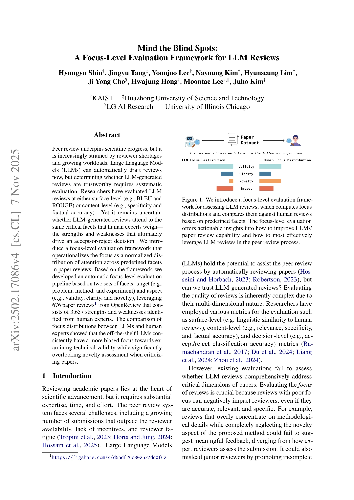
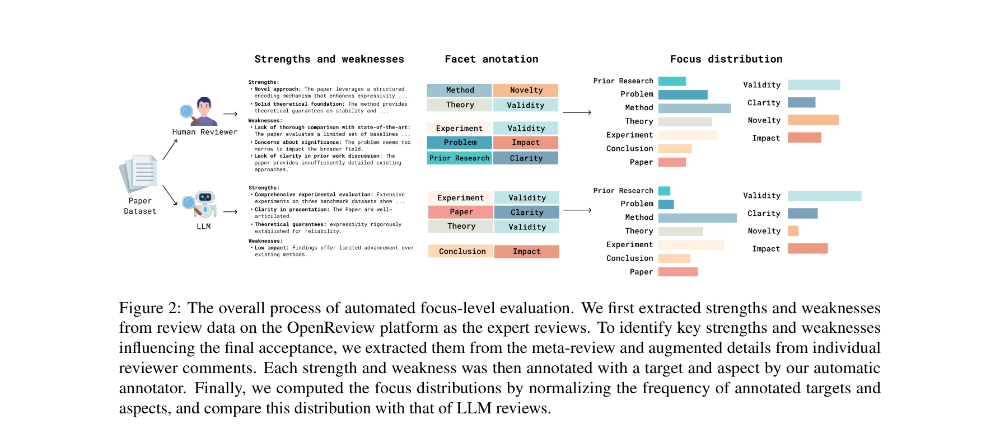
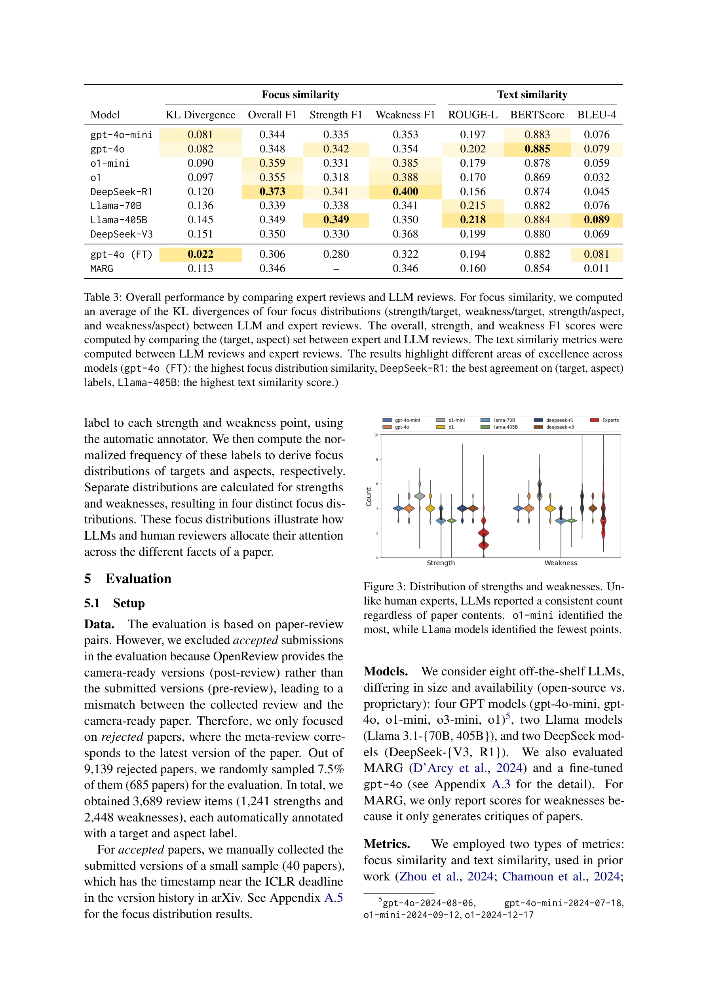

# Mind the blind spots: A focus-level evaluation framework for llm reviews

> **저자**: Hyungyu Shin, Jingyu Tang, Yoonjoo Lee, Nayoung Kim, Hyunseung Lim, Ji Yong Cho, Hwajung Hong, Moontae Lee, Ju-ho Kim | **날짜**: 2025 | **DOI**: N/A

---

## Essence

*그림 1: LLM 리뷰 평가를 위한 포커스 레벨 평가 프레임워크. 사전정의된 facet을 기반으로 포커스 분포를 계산하고 인간 리뷰와 비교*

본 논문은 LLM이 생성한 논문 리뷰가 인간 전문가와 동일한 비판적 측면(강점과 약점)에 주목하는지 평가하기 위한 **포커스 레벨 평가 프레임워크**를 제안한다. LLM 리뷰의 기술적 타당성 편향과 참신성 평가 간과라는 맹점을 정량적으로 드러낸다.

## Motivation

- **Known**: 피어 리뷰 시스템은 검토자 부족과 증가하는 업무량으로 인해 심각한 압박을 받고 있으며, LLM은 자동 리뷰 작성으로 이를 보조할 수 있다.

- **Gap**: 기존 LLM 리뷰 평가는 표면 수준(BLEU, ROUGE) 또는 내용 수준(구체성, 사실성)에 머물러 있으며, LLM이 인간 전문가처럼 **accept/reject 결정을 좌우하는 핵심 측면**에 동등하게 주목하는지 체계적으로 검증하지 못했다.

- **Why**: 포커스가 불균형한 리뷰(예: 방법론 과도 강조 + 참신성 무시)는 정확하고 구체적이어도 의미 있는 피드백 제공 실패 및 후배 검토자의 얕은 평가 관행 강화로 이어진다.

- **Approach**: 인간 전문가 리뷰에서 강점/약점을 추출하고, 사전정의된 target(문제, 방법, 실험 등) 및 aspect(타당성, 명확성, 참신성 등) facet으로 자동 주석화하여 포커스 분포를 계산하고 LLM과 비교한다.

## Achievement

*그림 2: 자동 포커스 레벨 평가 프로세스. 메타리뷰에서 강점/약점 추출 → facet 자동 주석 → 포커스 분포 계산 및 비교*

1. **포커스 프레임워크 개발**: 676개 ICLR 논문 리뷰(2021-2024)로부터 3,657개 인간 전문가 강점/약점을 수집하고, 자동 주석기(Cohen's kappa: target 0.81, aspect 0.79)를 구축하여 완전 자동화된 평가 파이프라인 실현.

2. **LLM 맹점 발견**: 8개 LLM(GPT, Llama, DeepSeek) 및 파인튜닝 모델 평가 결과, 모든 오프더셀프 LLM이 **기술적 타당성 검토에 편향**(overemphasis)되고 **약점 지적 시 참신성 평가를 심각하게 간과**(underemphasis)하는 일관된 패턴 발견.

3. **성능 격차 정량화**: 최고 성능 모델도 target-aspect 매칭 F1 스코어 0.373에 불과하며, 파인튜닝 모델만이 인간 포커스 분포와 가장 가까운 결과 달성(텍스트 유사도에서는 Llama-405B가 최고).

## How

*그림 3-4: 강점/약점 분포 및 target/aspect별 포커스 분포 시각화*

- **Facet 정의**: AI 컨퍼런스 9개 투고 가이드라인 + 리뷰 분석 문헌 검토를 통해 target 7개(Problem, Method, Theory, Experiment, Dataset, Prior Research, Conclusion, Paper) 및 aspect 5개(Validity, Clarity, Novelty, Impact, Completeness) 추출.

- **자동 주석기**: LLM 기반 주석기 개발, 각 강점/약점에 target-aspect 레이블 할당, 인간 주석자와의 일치도(IRR) 검증(kappa > 0.79).

- **메타리뷰 처리**: 개별 리뷰어 의견 수집의 복잡성 해결을 위해 메타리뷰에서 강점/약점 추출 후 비메타 리뷰 코멘트로 보강하는 3단계 프롬프팅 체인 설계.

- **포커스 분포 계산**: 리뷰 포인트의 facet 빈도를 정규화하여 강점(F⁺) 및 약점(F⁻) 분포 벡터 생성, 인간과 LLM 분포 비교 분석.

## Originality

- 기존 평가(표면/내용/결정 수준)를 초월한 **새로운 포커스 레벨 평가 차원** 도입으로 LLM 리뷰의 심층적 맹점 발견.

- 실제 컨퍼런스 리뷰 데이터(OpenReview)와 메타리뷰 기반 강점/약점 추출이라는 **실증적 접근법**으로 평가의 현실성 확보.

- Target-aspect 이원 facet 체계로 **"무엇을(target) 어떤 기준으로(aspect) 평가하는가"** 에 대한 세밀한 분석 가능화.

- 완전 자동화된 평가 파이프라인과 43,042개 LLM 생성 강점/약점 데이터셋 공개로 **재현성 및 확장성** 보장.

## Limitation & Further Study

- **데이터 한계**: ICLR에 제한되어 다른 AI 컨퍼런스(NeurIPS, ICML) 또는 학문 분야 일반화 가능성 미검증.

- **Facet 설계**: 현재 facet 세트가 고정적이며, 새로운 리뷰 관행이나 도메인 특화 평가 기준 반영 기제 부재.

- **인과성 미확인**: 포커스 분포의 편차가 실제 **리뷰 품질 저하 또는 accept/reject 결정 오류**로 직결되는지 실증적 검증 필요.

- **파인튜닝 효율성**: 파인튜닝 데이터 규모, 학습 비용, 최소 요구 샘플 수 등 실무 적용 조건 미분석.

- **후속 연구**: (1) 포커스 편향 교정 프롬프팅 또는 학습 기법 개발, (2) 실제 피어 리뷰 프로세스에서 LLM 리뷰 활용 시 사용자 신뢰 및 효율성 영향 분석, (3) 다양한 학문분야 확대 평가.

## Evaluation

- **Novelty**: 4.5/5
  - 포커스 레벨 평가 프레임워크는 LLM 리뷰 평가의 새로운 차원 제시
  - 다만 기존 NLP 분석 방법론의 점진적 확장에 가까움

- **Technical Soundness**: 4/5
  - 자동 주석기 구축 및 IRR 검증이 체계적
  - 메타리뷰 기반 강점/약점 추출 파이프라인이 타당
  - 통계 검증(예: 카이제곱 검정) 세부사항 제시 미흡

- **Significance**: 4.5/5
  - LLM의 구체적 맹점(참신성 간과, 기술성 과도) 발견은 실무 가치 높음
  - 다만 실제 피어 리뷰 시스템 개선으로의 전환 경로 명확화 필요

- **Clarity**: 4/5
  - 프레임워크 정의 및 파이프라인 시각화가 명확
  - facet 선정 과정 및 최종 facet 목록 제시 부분 더 상세화 가능

- **Overall**: 4.2/5

**총평**: 본 논문은 피어 리뷰라는 사회적 중요성 높은 영역에서 LLM 리뷰의 포커스 분포 분석을 통해 체계적이고 해석 가능한 평가 프레임워크를 제공하며, 실제 데이터셋 공개와 함께 재현 가능성을 확보했다. 다만 다른 학문분야 일반화, 포커스 편향과 실제 리뷰 품질 저하 간의 인과성 입증, 그리고 개선된 LLM 학습 기법 제안으로의 발전이 필요하다.

## Related Papers

- 🔄 다른 접근: [[papers/173_Bridging_social_psychology_and_llm_reasoning_Conflict-aware/review]] — 인지정렬프레임워크의 앵커링 효과 완화와 포커스 레벨 평가는 모두 LLM 리뷰의 편향 문제를 다루는 상호 보완적 접근법입니다
- 🔗 후속 연구: [[papers/128_Automatically_evaluating_the_paper_reviewing_capability_of_l/review]] — 논문 리뷰 능력의 자동 평가는 LLM 리뷰의 맹점을 정량화하는 포커스 레벨 평가의 확장된 응용입니다
- 🏛 기반 연구: [[papers/262_Deepreview_Improving_llm-based_paper_review_with_human-like/review]] — DeepReview의 인간 유사 논문 리뷰 개선 방법은 포커스 레벨 평가 프레임워크의 이론적 기반을 제공합니다
- 🔄 다른 접근: [[papers/128_Automatically_evaluating_the_paper_reviewing_capability_of_l/review]] — 동일한 포커스 레벨 평가 프레임워크를 다른 관점에서 접근함
- 🔄 다른 접근: [[papers/173_Bridging_social_psychology_and_llm_reasoning_Conflict-aware/review]] — 포커스 레벨 평가와 인지정렬프레임워크는 모두 LLM 리뷰 시스템의 편향 문제를 다루는 상호 보완적인 접근법입니다
