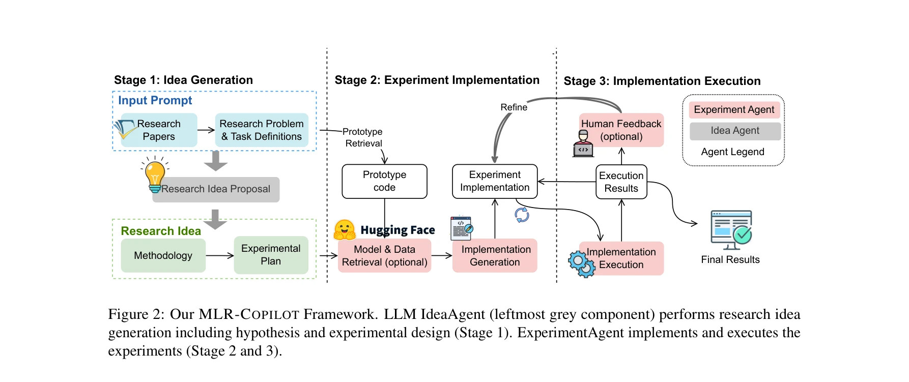
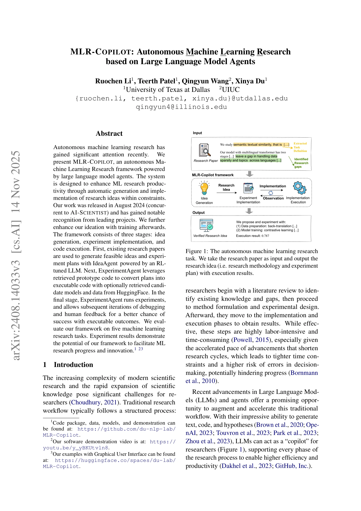

# MLR-COPILOT: Autonomous Machine Learning Research Based on Large Language Models Agents

> **저자**: Ruochen Li, Teerth Patel, Qingyun Wang, Xinya Du | **날짜**: 2024 | **DOI**: [미제공](https://doi.org/)

---

## Essence

*그림 2: 아이디어 생성(Stage 1), 실험 구현(Stage 2), 실행(Stage 3)의 세 단계로 구성된 MLR-COPILOT 프레임워크*

본 논문은 대규모 언어모델(LLM) 에이전트 기반의 자동화된 머신러닝 연구 프레임워크인 MLR-COPILOT을 제시한다. 이 시스템은 연구 논문을 입력받아 자동으로 연구 아이디어를 생성하고, 이를 실제 코드로 구현·실행하여 검증된 연구 결과를 도출한다.

## Motivation

- **Known**: 최근 LLM의 발전으로 과학 연구 자동화에 대한 관심이 증대되고 있으며, 일부 선행 연구들이 아이디어 생성(Yang et al. 2023, Wang et al. 2024) 또는 자동 실험(Huang et al. 2023, Zhang et al. 2023)을 다루고 있다.

- **Gap**: 기존 연구들의 한계점:
  - 아이디어 생성 연구: 머신러닝 연구(MLR)에 특화되지 않았으며, 특정 문제의 기존 작업 제약을 반영하지 못해 너무 광범위한 솔루션 제시
  - 자동 실험 연구: 사전 정의된 작업과 성숙한 코드 템플릿에서 시작하며, 하이퍼파라미터 튜닝 정도의 제한적 탐색만 수행하고, 견고한 피드백 메커니즘 부재

- **Why**: 전통적 머신러닝 연구 프로세스(문헌조사→방법 수립→실험 설계→구현→실행)는 매우 노동집약적이고 시간 소모적이며, 가속화되는 연구 속도로 인한 시간 제약과 의사결정 오류 위험 증가

- **Approach**: 세 단계 통합 프레임워크로 전체 머신러닝 연구 프로세스 자동화:
  1. 강화학습(RL) 튜닝된 IdeaAgent를 통한 연구 아이디어 생성
  2. ExperimentAgent가 프로토타입 코드, 모델, 데이터 검색을 활용하여 실행 가능한 코드 생성
  3. 실험 실행 및 반복적 디버깅/인간 피드백을 통한 개선

## Achievement

*그림 1: 연구 논문을 입력으로 받아 검증된 연구 아이디어와 실행 결과를 출력하는 자동화된 머신러닝 연구 과정*

1. **완전한 자동화 파이프라인 구현**: 기존의 단편적 접근(아이디어 생성만 또는 실험 실행만)을 넘어 문헌 검토부터 최종 결과 도출까지 전 과정을 자동화한 최초의 시스템 (AI-Scientist와 동시 개발)

2. **강화학습 기반 IdeaAgent 개발**: OpenReview에서 수집한 4,271개 최상위 머신러닝 논문(ICLR, NeurIPS)으로 학습된 IdeaAgent는 다양성(novelty), 실행 가능성(feasibility), 효율성(effectiveness) 등 다중 차원의 보상 모델로 최적화되어 질 높은 아이디어 생성

3. **동적 피드백 루프와 인간-in-the-loop 메커니즘**: 실행 결과로부터 반복적 디버깅 및 인간 피드백을 통해 실험 설계를 실시간으로 개선, 견고성과 재현 가능성 보장

4. **5개 실제 머신러닝 연구 과제에서 검증**: SemRel(다중언어 의미 텍스트 관련성), MLAgentBench 데이터셋(피드백 예측, 감정 분석 등) 등에서 실제 동작하는 연구 결과 도출 및 유의미한 개선 달성

## How

*그림 2: 세 단계 프레임워크의 상세 구조와 각 에이전트의 역할*

**Stage 1: 연구 아이디어 생성 (IdeaAgent)**
- 입력 논문 c에서 Semantic Scholar API를 통해 제목, 초록, 서론, 관련 연구를 추출
- 자연어 처리로 연구 과제(t), 연구 갭(g), 핵심 키워드(k) 추출
- 추출된 정보 P로 최근 관련 연구 R 검색
- 프롬프트 P1 = {P, R} → h: 식별된 트렌드와 갭을 기반으로 새로운 방법론(h) 생성
- 프롬프트 P2 = {P1, h} → e: 방법론에 기반한 상세 실험 계획(e) 수립
- 최종 연구 아이디어: RI = {P, R, h, e}

**Stage 2: 실험 구현 (ExperimentAgent)**
- 원본 논문에서 프로토타입 구현 코드(I) 검색 및 추출
- 실험 계획의 요구사항에 맞는 모델 M ∈ {M1, ..., Mp} (HuggingFace 저장소)와 데이터셋 D ∈ {D1, ..., Dq} 선택적 검색
- 선택된 모델과 데이터셋과의 호환성을 위해 코드 수정
- 검색된 컴포넌트 통합: (I, M, D) → S (실험 설정)

**Stage 3: 구현 실행 및 피드백**
- ExperimentAgent가 실험 설정 S 실행
- 계산 자원 할당 및 진행 상황 모니터링
- 실행 결과 분석 및 디버깅 피드백 생성
- 인간 피드백(선택적) 통합으로 방법론 및 설계 개선
- Stage 2와 Stage 1로 반복적 개선

**핵심 기술**
- **RL 기반 미세조정**: Supervised Fine-Tuning(1,000개 논문 기반)으로 초기 학습 후, novelty/feasibility/effectiveness 보상 모델을 활용한 강화학습으로 최적화
- **정보 검색**: Semantic Scholar API 활용 및 HuggingFace 모델/데이터 저장소 연동
- **프롬프트 엔지니어링**: 구조화된 프롬프트를 통해 일관성 있고 작업 지향적 출력 보장

## Originality

- **첫 end-to-end 자동화 시스템**: 기존의 단계별 자동화를 넘어, 문헌→아이디어→구현→실행→결과 전체 파이프라인을 통합한 시스템 구축 (동시 진행된 AI-Scientist와 함께 선도적 작업)

- **MLR 특화 강화학습**: 최상위 머신러닝 컨퍼런스(ICLR, NeurIPS) 논문 데이터로 학습한 domain-specific 모델로, 기존의 일반적 과학 아이디어 생성을 넘어 머신러닝 특화 제약과 트렌드 반영

- **동적 피드백 메커니즘**: 단순 일방향 생성이 아닌 실행 결과의 실시간 피드백을 통한 반복적 개선으로 실제 수렴 가능성 보장

- **다중 검색 통합**: 프로토타입 코드, 모델, 데이터셋 검색을 모두 통합하여 높은 자동화 수준 달성

- **인간-in-the-loop 설계**: 완전 자동화와 인간 전문성의 균형으로 실제 연구 현장 적용성 향상

## Limitation & Further Study

**한계점:**
- **평가 규모**: 5개의 머신러닝 연구 과제만으로 검증되었으며, 더 광범위한 연구 분야(물리, 화학, 생물학 등)에 대한 확장성 미명확
- **LLM 의존성**: 현재 LLM의 성능에 크게 의존하고 있으며, 모델 크기/능력에 따른 성능 변동 미분석
- **계산 비용**: 대규모 LLM 추론, 반복적 실행, 여러 모델/데이터셋 검색의 누적 계산 비용 미평가
- **아이디어 창의성 상한선**: 기존 논문 기반 학습으로 인한 창의성 상한선 존재 가능성
- **복잡한 연구 설계**: 다중 실험 그룹 비교, 정교한 통계 검증, 심층적 이론 해석이 필요한 연구에 대한 능력 제한

**후속 연구 방향:**
- 다양한 과학 분야로 확장 및 domain-agnostic 아이디어 생성 능력 강화
- 더 강력한 LLM 모델 활용 및 모델 성능에 따른 영향 분석
- 계산 효율성 개선 및 비용 최적화 전략 개발
- 인간 연구자와의 협업 효율성 분석 및 인간-AI 상호작용 개선
- 생성된 아이디어의 실제 학술 기여도 및 중복성 평가

## Evaluation

- Novelty: 4.5/5
- Technical Soundness: 4/5
- Significance: 4/5
- Clarity: 4/5
- Overall: 4/5

**총평**: MLR-COPILOT은 머신러닝 연구의 전체 자동화 파이프라인을 구현한 선도적 작업으로, RL 기반 IdeaAgent와 반복적 피드백 메커니즘을 통해 기존 연구의 한계를 실질적으로 극복하였다. 다만 평가 규모의 제한성과 실제 연구 임팩트에 대한 심화된 검증이 필요하다.

## Related Papers

- 🔄 다른 접근: [[papers/357_From_intention_to_implementation_automating_biomedical_resea/review]] — MLR-COPILOT과 BioResearcher 모두 LLM 기반 연구 자동화를 추구하지만 머신러닝 vs 바이오메디컬 분야에 특화된다.
- 🔗 후속 연구: [[papers/794_The_AI_Scientist-v2_Workshop-Level_Automated_Scientific_Disc/review]] — AI Scientist-v2는 MLR-COPILOT의 자동화된 ML 연구를 에이전트 기반 트리 서치와 동료 심사까지 포함한 완전한 과학 발견으로 발전시킨다.
- 🧪 응용 사례: [[papers/671_Researchcodebench_Benchmarking_llms_on_implementing_novel_ma/review]] — 새로운 ML 방법론 구현을 벤치마킹하는 ResearchCodeBench는 MLR-COPILOT의 자동 코드 구현 능력을 평가하는 실용적 도구다.
- 🧪 응용 사례: [[papers/135_Automl_in_the_age_of_large_language_models_Current_challenge/review]] — AutoML과 LLM의 상생적 통합 개념이 자율적인 기계학습 연구 수행을 위한 LLM 기반 코파일럿 시스템 구현에 핵심적으로 활용된다
- 🔄 다른 접근: [[papers/1084_An_Autonomous_Large_Language_Model_Agent_for_Chemical_Litera/review]] — MLR-COPILOT와 MLCopilot은 모두 기계학습 연구 자동화를 다루지만, 화학 문헌 데이터 특화와 범용 ML 작업이라는 서로 다른 도메인에 초점을 맞춥니다.
- 🔄 다른 접근: [[papers/357_From_intention_to_implementation_automating_biomedical_resea/review]] — BioResearcher와 MLR-COPILOT 모두 LLM 기반 연구 자동화를 추구하지만 바이오메디컬 vs 머신러닝 분야에 특화된다.
